# Process Assessment and Improvement

> **Source:** *Guide to the Software Engineering Body of Knowledge (SWEBOK), Version 4 — Chapter 10: Software Engineering Process, Section 10.12*

---

## 1. PDCA Cycle (Shewhart-Deming Cycle)

### Overview

The **PDCA Cycle** (Plan-Do-Check-Act), also known as the Deming Cycle or Shewhart Cycle, is a fundamental framework for continuous process improvement. It provides a structured, iterative approach to identifying problems, implementing solutions, and verifying results.

### Four Phases

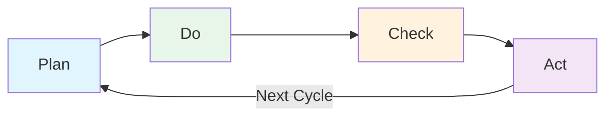

#### Phase Details

| Phase | Purpose | Key Activities | Outputs |
|-------|---------|----------------|---------|
| **Plan** | Identify problem and plan solution | Analyze current state, set objectives, design changes | Improvement plan, success criteria |
| **Do** | Implement the plan on small scale | Execute changes, collect data, document observations | Implementation results, data |
| **Check** | Evaluate results against objectives | Analyze data, compare to baseline, assess effectiveness | Evaluation report, lessons learned |
| **Act** | Standardize or adjust | Adopt successful changes, modify unsuccessful ones, plan next cycle | Updated process, new baseline |

### PDCA in Software Process Improvement

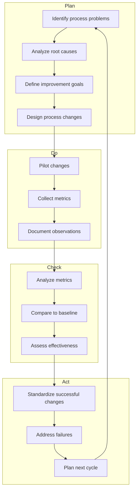

### PDCA Benefits

- **Systematic:** Provides a structured approach to improvement
- **Iterative:** Enables continuous refinement
- **Evidence-Based:** Decisions are data-driven
- **Scalable:** Works for individual processes or organization-wide initiatives
- **Universal:** Applicable to any process or domain

---

## 2. CMM and CMMI

### Capability Maturity Model (CMM)

The **Capability Maturity Model (CMM)** was developed by the Software Engineering Institute (SEI) at Carnegie Mellon University. It provides a framework for assessing and improving software development processes.

### Five Maturity Levels

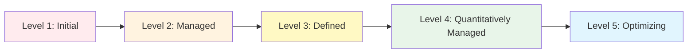

#### Level Characteristics

| Level | Name | Focus | Process Characteristics |
|-------|------|-------|------------------------|
| **1** | Initial | None | Ad hoc, chaotic, heroic efforts |
| **2** | Managed | Project | Basic project management, repeatable processes |
| **3** | Defined | Organization | Standard processes, tailored for projects |
| **4** | Quantitatively Managed | Measured | Quantitative objectives, statistical control |
| **5** | Optimizing | Continuous | Continuous improvement, innovation |

#### Detailed Level Descriptions

**Level 1: Initial**
- Processes are unpredictable, poorly controlled, and reactive
- Success depends on individual competence and heroics
- No stable environment for process improvement
- Common in organizations new to software engineering

**Level 2: Managed**
- Basic project management processes established
- Projects are planned, performed, measured, and controlled
- Process discipline ensures existing practices are retained during stress
- Key Process Areas: Requirements Management, Project Planning, Project Monitoring, Supplier Agreement Management, Measurement and Analysis, Process and Product Quality Assurance, Configuration Management

**Level 3: Defined**
- Processes are well-characterized and understood
- Standards, procedures, tools, and methods are defined
- Organization-wide process improvement is proactive
- Key Process Areas: Requirements Development, Technical Solution, Product Integration, Verification, Validation, Organizational Process Focus, Organizational Process Definition, Organizational Training, Integrated Project Management, Risk Management, Decision Analysis and Resolution

**Level 4: Quantitatively Managed**
- Processes are measured and controlled using statistical techniques
- Quantitative quality and process performance objectives are established
- Variation in process performance is identified and addressed
- Key Process Areas: Organizational Process Performance, Quantitative Project Management

**Level 5: Optimizing**
- Continuous process improvement is enabled by quantitative feedback
- Organization innovates and improves based on business objectives
- Root causes of defects are identified and eliminated
- Key Process Areas: Causal Analysis and Resolution, Organizational Performance Management

### CMMI (Capability Maturity Model Integration)

**CMMI** is the successor to CMM, integrating multiple CMM models into a single framework. CMMI Version 2.0 (2018) is the current standard.

#### CMMI Maturity Levels and Process Areas

| Level | Process Areas |
|-------|---------------|
| **2: Managed** | Requirements Management (REQM), Project Planning (PP), Project Monitoring and Control (PMC), Supplier Agreement Management (SAM), Measurement and Analysis (MA), Process and Product Quality Assurance (PPQA), Configuration Management (CM) |
| **3: Defined** | Requirements Development (RD), Technical Solution (TS), Product Integration (PI), Verification (VER), Validation (VAL), Organizational Process Focus (OPF), Organizational Process Definition (OPD), Organizational Training (OT), Integrated Project Management (IPM), Risk Management (RSKM), Decision Analysis and Resolution (DAR), Peer Reviews |
| **4: Quantitatively Managed** | Organizational Process Performance (OPP), Quantitative Project Management (QPM) |
| **5: Optimizing** | Causal Analysis and Resolution (CAR), Organizational Performance Management (OPM) |

### SCAMPI Appraisal Methods

The **Standard CMMI Appraisal Method for Process Improvement (SCAMPI)** is the official method for appraising CMMI maturity levels:

| Method | Purpose | Characteristics | Output |
|--------|---------|-----------------|--------|
| **SCAMPI A** | Benchmark appraisal | Formal, rigorous, requires evidence | Maturity level rating |
| **SCAMPI B** | Progress assessment | Less rigorous, identifies gaps | Gap analysis report |
| **SCAMPI C** | Quick assessment | Lightweight, self-assessment | Improvement roadmap |

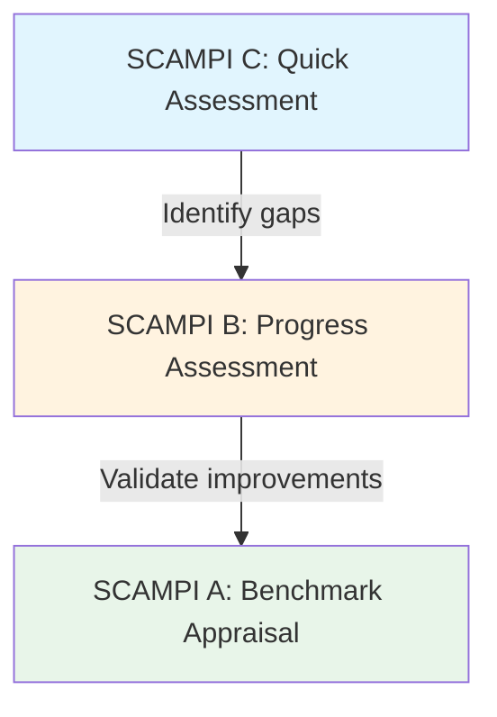

### CMMI vs CMM Comparison

| Aspect | CMM | CMMI |
|--------|-----|------|
| **Scope** | Software only | Software, hardware, services |
| **Structure** | 5 levels, 18 KPAs | 5 levels, 22+ PAs |
| **Integration** | Separate models | Integrated framework |
| **Appraisal** | CBA-IPI | SCAMPI |
| **Current Version** | Superseded | CMMI v2.0 (2018) |
| **Maintainer** | SEI | ISACA/CMMI Institute |

---

## 3. ISO/IEC 33000 (SPICE)

### Overview

**ISO/IEC 33000** (formerly SPICE: Software Process Improvement and Capability dEtermination) is an international standard for process assessment. It provides a framework for assessing process capability and organizational maturity.

### Process Assessment Model

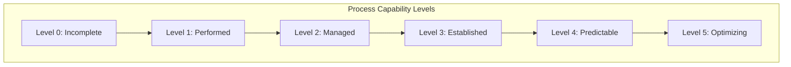

### Capability Levels

| Level | Name | Description | Process Attributes |
|-------|------|-------------|-------------------|
| **0** | Incomplete | Process is not implemented or fails to achieve its purpose | None |
| **1** | Performed | Process is implemented and achieves its purpose | Process Performance |
| **2** | Managed | Process is managed (planned, monitored, adjusted) | Performance Management, Work Product Management |
| **3** | Established | Process is defined and tailored from organizational standard | Process Definition, Process Deployment |
| **4** | Predictable | Process operates within defined limits | Process Measurement, Process Control |
| **5** | Optimizing | Process is continuously improved | Process Innovation, Process Optimization |

### ISO/IEC 33000 Structure

The standard consists of multiple parts:

| Part | Title | Purpose |
|------|-------|---------|
| **33001** | Concepts and terminology | Definitions and fundamental concepts |
| **33002** | Performing an assessment | Requirements for conducting assessments |
| **33003** | Guidance on performing assessments | Detailed assessment guidance |
| **33004** | Guidance on use for process improvement | Improvement guidance |
| **33005** | Guidance on use for process capability determination | Capability determination guidance |
| **33020** | Process assessment model | Assessment model for process capability |
| **33061-33069** | Process reference models | Specific process reference models |

### Process Assessment Process

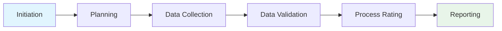

### ISO/IEC 33000 vs CMMI Comparison

| Aspect | ISO/IEC 33000 | CMMI |
|--------|---------------|------|
| **Standard Type** | International standard (ISO) | Industry framework |
| **Scope** | Any process domain | Software, hardware, services |
| **Assessment** | Flexible, configurable | SCAMPI (rigorous) |
| **Output** | Capability level (per process) | Maturity level (organizational) |
| **Improvement** | Built-in guidance | Separate from appraisal |
| **Certification** | ISO certification possible | No formal certification |
| **Cost** | Varies | High (SCAMPI A) |

---

## 4. GQM (Goal-Question-Metric)

### Overview

The **Goal-Question-Metric (GQM)** approach, developed by Victor Basili, is a systematic method for defining and interpreting metrics. It ensures that measurements are aligned with organizational goals and provide actionable insights.

### GQM Structure

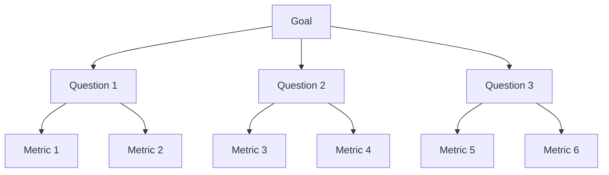

### GQM Levels

| Level | Description | Example |
|-------|-------------|---------|
| **Goal** | Purpose of measurement | Improve software quality |
| **Question** | Questions to achieve the goal | What is the defect rate? How long does testing take? |
| **Metric** | Quantitative measures to answer questions | Defects per KLOC, Test hours per feature |

### GQM Process

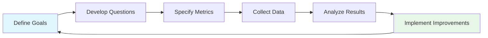

#### Step 1: Define Goals

Goals specify:
- **Purpose:** What you want to achieve
- **Object:** What is being measured (process, product, resource)
- **Quality Focus:** What aspect is of interest (cost, schedule, quality)
- **Viewpoint:** From whose perspective (developer, manager, customer)
- **Context:** In what environment (project, organization)

**Template:**
> Analyze [object] for the purpose of [purpose] with respect to [quality focus] from the viewpoint of [viewpoint] in the context of [context].

**Example:**
> Analyze the software testing process for the purpose of improving from the viewpoint of the testing team in the context of Project Alpha.

#### Step 2: Develop Questions

Questions operationalize the goal:
- **Characterization Questions:** What is the current state?
- **Analysis Questions:** Why is the current state as it is?
- **Improvement Questions:** How can we improve?

**Example Questions:**
- What is the current defect density?
- What types of defects are most common?
- Where in the lifecycle are defects introduced?
- What is the cost of fixing defects at different stages?

#### Step 3: Specify Metrics

Metrics provide quantitative answers:
- **Base Measures:** Raw counts (defects found, hours spent)
- **Derived Measures:** Ratios and calculations (defect density, productivity)
- **Indicators:** Interpretations of derived measures (trends, benchmarks)

**Example Metrics:**
| Question | Metric | Formula |
|----------|--------|---------|
| What is the defect density? | Defects per KLOC | defects / (lines of code / 1000) |
| What types of defects? | Defect classification | count by category |
| Where are defects introduced? | Defect origin | count by lifecycle phase |
| What is the cost? | Defect cost | cost per defect by phase |

### GQM in Practice

#### Example: Measuring Code Quality

**Goal:** Improve code quality in the development process

**Questions:**
1. What is the current code quality level?
2. What factors affect code quality?
3. How can we improve code quality?

**Metrics:**
| Question | Metric | Measurement |
|----------|--------|-------------|
| Current quality | Code coverage | Percentage of code covered by tests |
| Current quality | Defect density | Defects per 1000 lines of code |
| Current quality | Technical debt | Hours of rework needed |
| Factors affecting | Code complexity | Cyclomatic complexity |
| Factors affecting | Code duplication | Percentage of duplicated code |
| Improvement | Review effectiveness | Defects found in reviews vs. testing |
| Improvement | Test effectiveness | Defects found in testing vs. production |

### GQM Benefits

- **Goal-Oriented:** Measurements align with objectives
- **Actionable:** Metrics lead to specific actions
- **Traceable:** Clear connection between goals and metrics
- **Flexible:** Applicable to any process or product
- **Scalable:** Works for teams or organizations

---

## 5. Agile Retrospectives as Assessment

### Overview

**Agile Retrospectives** are regular team meetings to reflect on the process and identify improvements. They embody the PDCA cycle in an Agile context and are a lightweight form of process assessment.

### Retrospective Structure

#### Retrospective Activities

| Phase | Purpose | Techniques |
|-------|---------|------------|
| **Set the Stage** | Create safe environment | Check-in, focus questions |
| **Gather Data** | Collect observations | Timeline, metrics, feelings |
| **Generate Insights** | Analyze patterns | Fishbone diagram, 5 Whys |
| **Decide What to Do** | Choose improvements | Dot voting, planning |
| **Close the Retrospective** | Commit and follow up | Action items, appreciation |

### Common Retrospective Formats

#### Start-Stop-Continue

| Category | Question | Example |
|----------|----------|---------|
| **Start** | What should we begin doing? | Automated regression testing |
| **Stop** | What should we stop doing? | Long status meetings |
| **Continue** | What is working well? | Daily standups |

#### 4Ls Framework

| Category | Question | Example |
|----------|----------|---------|
| **Liked** | What went well? | Good collaboration with UX |
| **Learned** | What did we learn? | Pair programming improves quality |
| **Lacked** | What was missing? | Clear acceptance criteria |
| **Longed For** | What do we wish we had? | Automated deployment |

#### Sailboat Metaphor

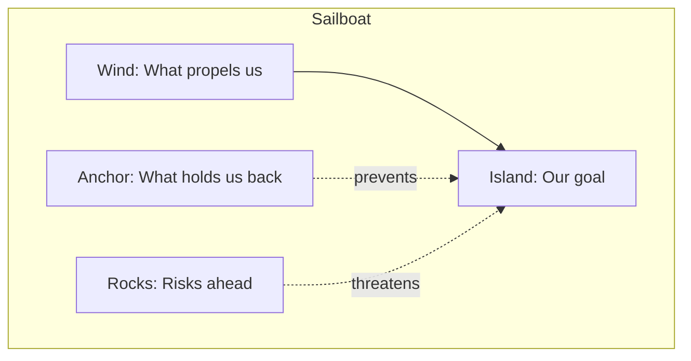

### Retrospective Best Practices

1. **Psychological safety:** Create a blame-free environment
2. **Focus on process:** Not people
3. **Specific actions:** Identify concrete improvements
4. **Follow up:** Track action items in next retrospective
5. **Rotate facilitators:** Build team ownership
6. **Vary formats:** Keep retrospectives fresh

### Retrospective vs Formal Assessment

| Aspect | Agile Retrospective | Formal Assessment (CMMI/ISO) |
|--------|---------------------|------------------------------|
| **Frequency** | Every iteration (1-4 weeks) | Annually or on-demand |
| **Scope** | Team-level process | Organization-wide |
| **Rigor** | Informal, qualitative | Formal, quantitative |
| **Output** | Action items | Maturity/capability ratings |
| **Cost** | Low | High |
| **Audience** | Team | Management, stakeholders |
| **Focus** | Continuous improvement | Benchmarking, compliance |

---

## 6. Process Tailoring

### Definition

**Process tailoring** is the act of customizing a standard process to fit the specific needs of a project or organization. It ensures that processes are appropriate for the context while maintaining organizational consistency.

### Tailoring Principles

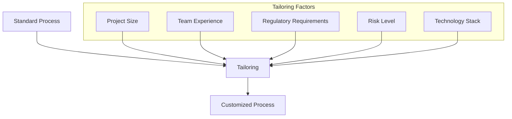

### Tailoring Guidelines

| Factor | Small Project | Medium Project | Large Project |
|--------|---------------|----------------|---------------|
| **Documentation** | Minimal, essential | Moderate, structured | Comprehensive, formal |
| **Reviews** | Informal, peer-based | Structured, team-based | Formal, multi-level |
| **Testing** | Unit tests, basic integration | Systematic, coverage targets | Full lifecycle, independent QA |
| **Planning** | Lightweight, iterative | Detailed, milestone-based | Comprehensive, phased |
| **Risk Management** | Informal, ad hoc | Structured, documented | Formal, systematic |
| **Configuration Management** | Basic version control | Branching strategy, builds | Full CM, baselines, audits |

### Tailoring Process

1. **Select Base Process:** Choose the standard process most applicable
2. **Identify Tailoring Needs:** Assess project-specific requirements
3. **Document Decisions:** Record what was tailored and why
4. **Review and Approve:** Get stakeholder approval for tailoring decisions
5. **Implement and Monitor:** Execute the tailored process and adjust as needed

---

## 7. Process Definition Notations

### BPMN (Business Process Model and Notation)

**BPMN** is the industry standard for modeling business processes. It provides a rich set of symbols for representing process flows.

#### Key BPMN Elements

| Element | Symbol | Purpose |
|---------|--------|---------|
| **Start Event** | Circle | Beginning of process |
| **End Event** | Bold circle | End of process |
| **Task** | Rounded rectangle | Work activity |
| **Gateway** | Diamond | Decision or merge |
| **Sequence Flow** | Arrow | Order of activities |
| **Message Flow** | Dashed arrow | Communication between pools |
| **Pool** | Rectangle | Participant or organization |
| **Lane** | Rectangle within pool | Sub-participant |

### IDEF0 (Integration DEFinition)

**IDEF0** is a function modeling methodology for representing the activities of a system.

#### IDEF0 Structure

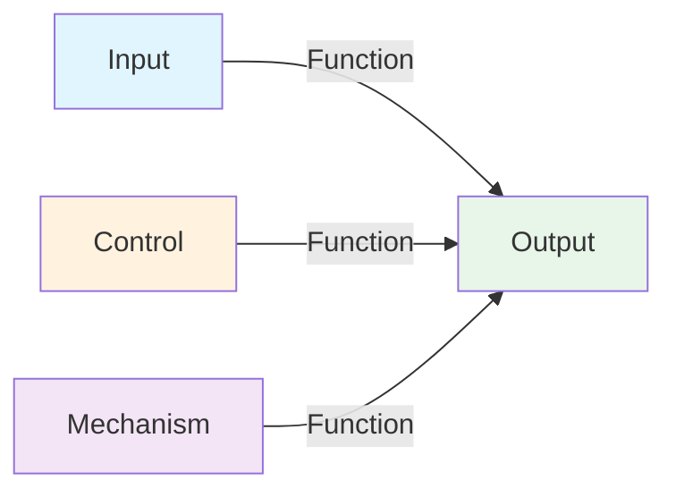

| Component | Description | Example |
|-----------|-------------|---------|
| **Input** | Data or objects transformed | Requirements document |
| **Output** | Data or objects produced | Design specification |
| **Control** | Constraints or rules | Standards, regulations |
| **Mechanism** | Resources used | Tools, personnel |

### Petri Nets

**Petri Nets** are a mathematical modeling language for describing concurrent systems.

#### Petri Net Components

| Component | Symbol | Purpose |
|-----------|--------|---------|
| **Place** | Circle | State or condition |
| **Transition** | Rectangle | Event or action |
| **Token** | Dot | Current state |
| **Arc** | Arrow | Connection between place and transition |

### UML Activity Diagrams

**UML Activity Diagrams** model the flow of activities in a process.

#### Key UML Activity Elements

| Element | Purpose |
|---------|---------|
| **Initial Node** | Start of activity |
| **Activity Final** | End of activity |
| **Action** | Individual step |
| **Decision** | Branch point |
| **Merge** | Combine branches |
| **Fork** | Parallel activities |
| **Join** | Synchronize parallel activities |
| **Swimlane** | Partition by responsibility |

### Notation Comparison

| Notation | Strengths | Weaknesses | Best For |
|----------|-----------|------------|----------|
| **BPMN** | Industry standard, rich semantics, executable | Complex, steep learning curve | Business process automation |
| **IDEF0** | Hierarchical, clear inputs/outputs | Limited flow control | Functional decomposition |
| **Petri Nets** | Formal analysis, concurrency | Mathematical, abstract | Concurrent systems, verification |
| **UML Activity** | Familiar to developers, integrates with UML | Less formal than Petri Nets | Software process modeling |

---

## 8. Relationship to Evaluation Techniques

For comprehensive evaluation techniques beyond process assessment, see:
- [[18_Evaluation_and_Improvement]]: Covers evaluation approaches (feature analysis, surveys, case studies, formal experiments), hypothesis testing, variable control, and common evaluation pitfalls.

Process assessment focuses on evaluating the *process itself*, while evaluation techniques focus on evaluating *products, tools, and methods* within those processes.

---

## 9. Comparison of Assessment Approaches

| Approach | Focus | Scope | Rigor | Output | Cost |
|----------|-------|-------|-------|--------|------|
| **PDCA** | Continuous improvement | Any | Low-Medium | Improved process | Low |
| **CMMI** | Organizational maturity | Organization | High | Maturity level | High |
| **ISO/IEC 33000** | Process capability | Any | Medium-High | Capability level | Medium-High |
| **GQM** | Measurement | Any | Medium | Metrics and insights | Medium |
| **Agile Retrospectives** | Team improvement | Team | Low | Action items | Low |
| **Process Tailoring** | Context fit | Project | Low-Medium | Customized process | Low |

### Selection Criteria

| Criterion | PDCA | CMMI | ISO 33000 | GQM | Retrospectives |
|-----------|------|------|-----------|-----|----------------|
| **Organization Size** | Any | Large | Any | Any | Team |
| **Maturity Level** | Any | 1-5 | Any | Any | Any |
| **Regulatory Needs** | Low | High | Medium | Low | Low |
| **Improvement Focus** | Incremental | Systematic | Systematic | Measurement | Incremental |
| **Implementation Time** | Short | Long | Medium | Medium | Short |

---

## 10. Key Takeaways

1. **PDCA** provides a systematic framework for continuous process improvement
2. **CMMI** defines five maturity levels with specific process areas for each level
3. **ISO/IEC 33000** offers a flexible, international standard for process assessment
4. **GQM** ensures measurements align with organizational goals
5. **Agile Retrospectives** provide lightweight, frequent process assessment
6. **Process tailoring** customizes standard processes to project needs
7. **Process notations** (BPMN, IDEF0, Petri Nets, UML) enable formal process definition
8. **Selection depends on:** Organization size, maturity level, regulatory needs, and improvement focus

---

## 11. References

- Shewhart, W. A. (1939). *Statistical Method from the Viewpoint of Quality Control*. Dover.
- Deming, W. E. (1986). *Out of the Crisis*. MIT Press.
- Paulk, M. C., et al. (1993). *Capability Maturity Model for Software, Version 1.1*. SEI/CMU.
- CMMI Institute. (2018). *CMMI V2.0 Model*. ISACA.
- ISO/IEC 33001:2015. Information technology: Process assessment: Concepts and terminology.
- ISO/IEC 33020:2019. Information technology: Process assessment: Process assessment model.
- Basili, V. R., Caldiera, G., & Rombach, H. D. (1994). The Goal Question Metric Approach. *Encyclopedia of Software Engineering*.
- Derby, E., & Larsen, D. (2006). *Agile Retrospectives: Making Good Teams Great*. Pragmatic Bookshelf.
- SWEBOK Version 4, Chapter 10: Software Engineering Process.
- Object Management Group. (2014). *Business Process Model and Notation (BPMN) Version 2.0.2*.
- IEEE 1320.1-1998. *Standard for Functional Modeling Language: Syntax and Semantics for IDEF0*.

---

## Related Notes

- [[05_Process_Fundamentals]]: Core process concepts and life cycle paradigms
- [[06_Spiral_and_Unified_Process]]: Spiral model, RUP, and prototyping approaches
- [[00_Agile_Methodology]]: Agile approaches and Scrum framework
- [[02_Methodologies_Overview]]: Overview of software methodologies
- [[18_Evaluation_and_Improvement]]: Evaluation techniques and improvement methods
- [[Software Methodology - Overview]]: Overview of software methodologies
