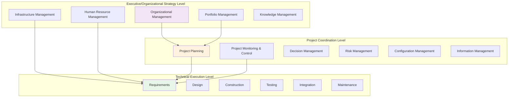
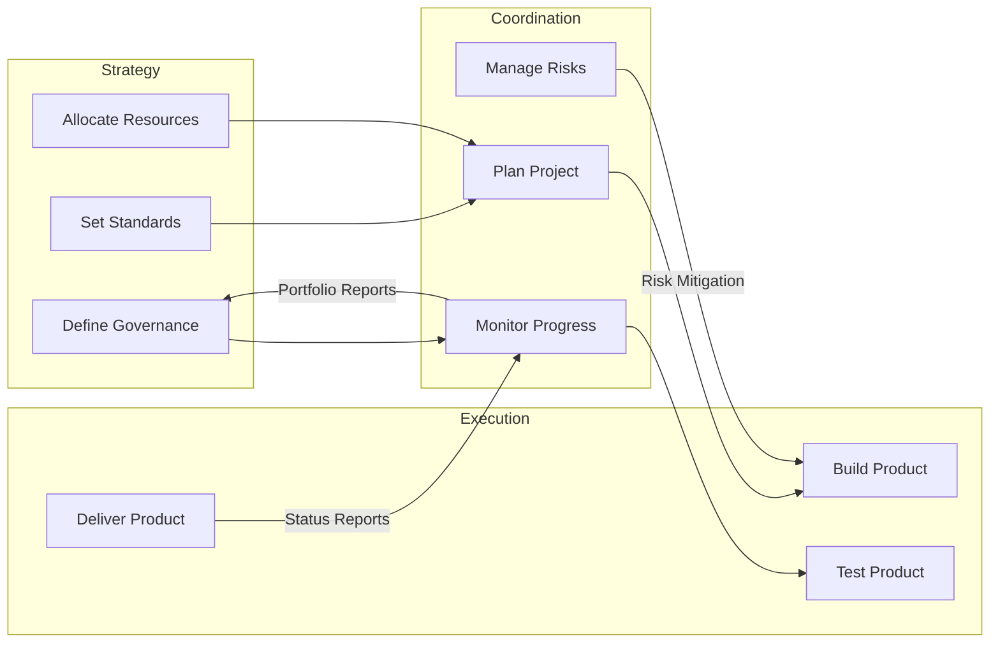
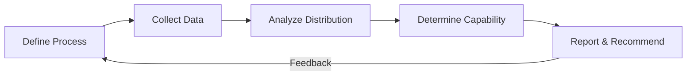
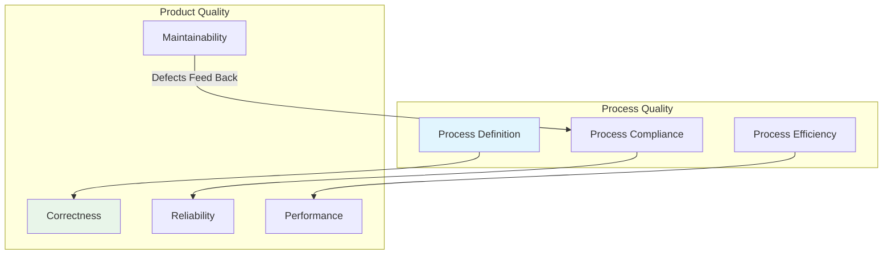
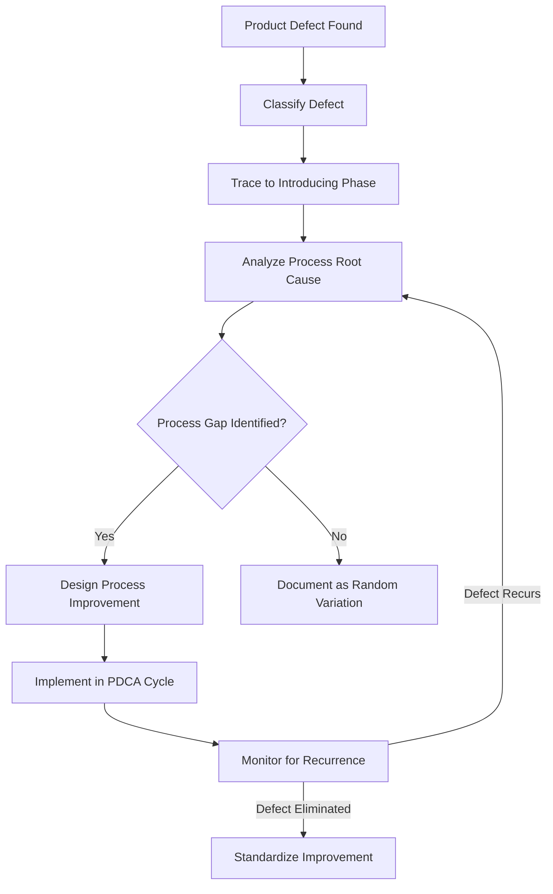
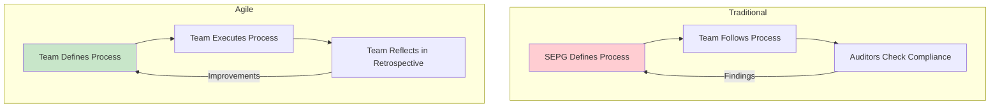
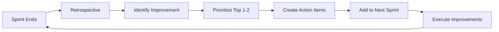
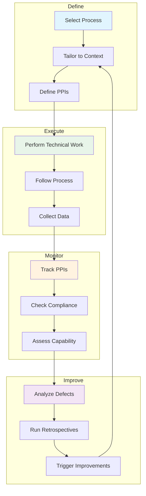

# Process Monitoring, Management Levels, and Adaptation

> **Source:** *Guide to the Software Engineering Body of Knowledge (SWEBOK), Version 4 — Chapter 10: Software Engineering Process, Sections 10.7, 10.8, 10.9, 10.11*

---

## 1. Three Management Levels of Software Process

Software process management operates at three distinct levels, each with its own scope, concerns, and actors. Understanding these levels is essential because process failures often stem from confusion about which level owns which decisions.

### 1.1 Technical Execution Level

The technical execution level is where software products are actually built. Engineers at this level perform the core technical processes that transform requirements into working software.

| Process | Purpose | Key Activities | Typical Outputs |
|---------|---------|----------------|-----------------|
| **Requirements** | Elicit, analyze, and validate stakeholder needs | Interviews, prototyping, use case modeling, requirements reviews | SRS, use cases, acceptance criteria |
| **Design** | Define architecture and detailed design | Architectural decomposition, interface design, design patterns, design reviews | SAD, interface specs, design models |
| **Construction** | Implement the design in code | Coding, unit testing, code reviews, static analysis | Source code, unit tests, build artifacts |
| **Testing** | Verify and validate the product | Test planning, test execution, defect tracking, acceptance testing | Test reports, defect logs, test coverage |
| **Integration** | Combine components into working system | Component integration, system integration, interface testing | Integrated system, integration test results |
| **Maintenance** | Sustain and evolve the product post-delivery | Bug fixes, enhancements, adaptation, migration | Patches, releases, change logs |

**Key characteristics of the technical execution level:**

- Directly produces the software product and its associated artifacts
- Governed by technical standards, coding guidelines, and engineering best practices
- Feedback loops are rapid: code review findings feed into next coding task, test failures trigger immediate fixes
- Success is measured by product quality attributes: correctness, reliability, performance, maintainability
- Engineers at this level need deep technical skills in their specific domain

### 1.2 Project Coordination Level

The project coordination level manages the technical work without performing it directly. Project managers and coordinators ensure that technical processes are planned, resourced, monitored, and controlled.

| Process | Purpose | Key Activities | Typical Outputs |
|---------|---------|----------------|-----------------|
| **Project Planning** | Define scope, schedule, budget, and resources | WBS creation, estimation, resource allocation, milestone definition | Project plan, WBS, schedule, budget |
| **Project Monitoring & Control** | Track progress and manage deviations | Status reporting, earned value analysis, variance analysis, corrective actions | Status reports, change requests, forecasts |
| **Decision Management** | Make and track project decisions | Decision analysis, trade-off studies, decision logs | Decision records, rationale documentation |
| **Risk Management** | Identify, analyze, and mitigate risks | Risk identification, qualitative/quantitative analysis, response planning | Risk register, risk responses, risk audits |
| **Configuration Management** | Control changes to work products | Version control, change control, configuration audits, baselines | CM plan, change logs, baselines |
| **Information Management** | Manage project information and documentation | Document management, knowledge sharing, communication planning | Documentation repository, communication plan |

**Key characteristics of the project coordination level:**

- Sits between technical teams and organizational leadership
- Translates organizational strategy into actionable project plans
- Manages constraints (scope, time, cost, quality) that bound technical work
- Success is measured by project performance: on-time, on-budget, scope delivered
- Requires both technical understanding (to communicate with engineers) and management skills

### 1.3 Executive/Organizational Strategy Level

The executive/organizational strategy level provides the environment, resources, and governance within which projects operate. Senior management sets direction, establishes infrastructure, and ensures the organization has the capability to execute projects.

| Process | Purpose | Key Activities | Typical Outputs |
|---------|---------|----------------|-----------------|
| **Organizational Management** | Align projects with business strategy | Strategic planning, portfolio governance, investment decisions | Strategic plans, governance frameworks |
| **Portfolio Management** | Select and prioritize projects | Portfolio analysis, benefit realization, resource balancing | Portfolio roadmap, prioritized project list |
| **Infrastructure Management** | Provide tools, environments, and standards | Tool selection, environment provisioning, standards definition | Tool chains, development environments, SE standards |
| **Human Resource Management** | Build and sustain workforce capability | Hiring, training, career development, competency assessment | Training plans, competency matrices, staffing plans |
| **Knowledge Management** | Capture and reuse organizational learning | Lessons learned repositories, best practice sharing, communities of practice | Knowledge bases, best practice guides, post-mortem reports |

**Key characteristics of the executive/organizational strategy level:**

- Sets the context within which all projects operate
- Decisions at this level affect multiple projects simultaneously
- Long-term horizon: years rather than sprints or releases
- Success is measured by organizational capability, portfolio value, and strategic alignment
- Responsible for creating a culture of process discipline and continuous improvement

### 1.4 Interactions Between Levels

The three levels form a hierarchy of concerns:

- **Strategy → Coordination:** Organizational standards and resources constrain project planning. Portfolio priorities determine which projects get funded.
- **Coordination → Execution:** Project plans define what technical teams build and when. Monitoring ensures technical work stays on track.
- **Execution → Coordination:** Technical progress, defects, and risks flow upward as status information.
- **Coordination → Strategy:** Project performance data informs portfolio decisions and organizational capability assessments.

---

## 2. Process Monitoring

Process monitoring is the systematic collection and analysis of data about how processes are performing. Without monitoring, organizations cannot determine whether their processes are effective, efficient, or improving.

### 2.1 Process Performance Indicators

Process performance indicators (PPIs) are quantitative measures that characterize how well a process is performing. They must be tied to business or project objectives to be meaningful.

| Category | Indicator | What It Measures | Example Target |
|----------|-----------|------------------|----------------|
| **Effort** | Effort variance | Actual effort vs. planned effort | Within +/- 10% |
| **Schedule** | Schedule performance index (SPI) | Rate of earned value vs. planned value | SPI >= 0.95 |
| **Quality** | Defect density | Defects per KLOC or per function point | < 5 defects/KLOC |
| **Quality** | Defect removal efficiency (DRE) | Defects found before delivery / total defects | >= 95% |
| **Productivity** | Throughput | Work items completed per time period | Trending upward |
| **Predictability** | Estimation accuracy | How close estimates are to actuals | Within +/- 15% |
| **Customer** | Customer satisfaction | Stakeholder satisfaction with process and product | >= 4.0/5.0 |

**Selecting indicators:** Use the GQM (Goal-Question-Metric) approach from [[07_Process_Assessment_and_Improvement]] to ensure indicators align with specific goals. Not every metric is useful for every project.

### 2.2 Process Capability Determination

Process capability describes the range of expected results when a process is followed. It answers the question: "If we follow this process, what outcomes can we reliably produce?"

**Capability vs. Maturity:**

| Dimension | Process Capability | Process Maturity |
|-----------|-------------------|------------------|
| **Scope** | Single process | Organization-wide |
| **Question** | "How well can this process perform?" | "How mature is the organization's process culture?" |
| **Measurement** | Statistical process control, capability indices | CMMI levels, SPICE ratings |
| **Focus** | Predictability of outcomes | Institutionalization of practices |

**Process capability determination steps:**

1. **Define the process** clearly with inputs, activities, outputs, and entry/exit criteria
2. **Collect performance data** over multiple instances of the process
3. **Analyze statistical distribution** of outcomes (mean, variance, control limits)
4. **Determine capability** by comparing process output distribution against specification limits
5. **Report capability** with confidence intervals and recommendations

### 2.3 Process Compliance Checking

Process compliance checking verifies that the defined process is actually being followed. It bridges the gap between "process as defined" and "process as performed."

**Compliance checking methods:**

| Method | Description | Frequency | Effort |
|--------|-------------|-----------|--------|
| **Process audits** | Formal examination of process adherence against defined standards | Quarterly or per release | High |
| **Peer reviews** | Team members review each other's adherence to process | Continuous | Low |
| **Automated checks** | Tools verify process steps (e.g., code review before merge, tests before deploy) | Every commit/build | Very low |
| **Self-assessment** | Teams evaluate their own process adherence | Per iteration/sprint | Low |
| **Walkthroughs** | Step-by-step review of process execution with stakeholders | As needed | Medium |

**Common non-compliance patterns:**

- Skipping reviews under schedule pressure
- Incomplete documentation ("we will document it later")
- Bypassing configuration management for "quick fixes"
- Inadequate testing coverage
- Not recording defects or lessons learned

### 2.4 Process Improvement Triggers

Process improvement should not only follow a scheduled cycle (like PDCA from [[07_Process_Assessment_and_Improvement]]). It should also be triggered by specific signals.

| Trigger Type | Signal | Example |
|--------------|--------|---------|
| **Defect pattern** | Recurring defect types indicate process weakness | Multiple integration defects suggest missing integration testing step |
| **Performance deviation** | Process metrics consistently outside control limits | Effort variance exceeding 20% on multiple projects |
| **Customer complaint** | Stakeholder dissatisfaction traced to process gap | Late deliveries caused by insufficient planning process |
| **Technology change** | New tools or platforms require process adaptation | Moving from waterfall to CI/CD requires new build/deploy process |
| **Regulatory change** | New compliance requirements demand process modification | GDPR requires new data handling processes |
| **Retrospective finding** | Team identifies process improvement in sprint retrospective | "We should automate our regression tests" |

---

## 3. Joint Process and Product Assessment

A critical insight from SWEBOK is that process quality and product quality are deeply intertwined. Assessing one without the other provides an incomplete and potentially misleading picture.

### 3.1 Why Joint Assessment Matters

**The relationship is bidirectional:**

- **Process → Product:** A well-defined, well-executed process tends to produce higher-quality products. Poor requirements processes produce poor requirements, which produce wrong software.
- **Product → Process:** Product defects are symptoms of process weaknesses. Analyzing defect data reveals where processes need improvement.

### 3.2 Process Performance Baselines vs. Product Quality Metrics

| Process Baseline Metrics | Product Quality Metrics | Correlation |
|--------------------------|------------------------|-------------|
| Requirements review coverage | Requirements defect density | Higher review coverage → fewer requirements defects |
| Code review participation rate | Code defect density | More reviews → fewer code defects |
| Test case coverage ratio | Escape rate (defects found in production) | Higher coverage → fewer escapes |
| Estimation accuracy | Schedule variance | Better estimation → more predictable schedules |
| Process compliance rate | Rework percentage | Higher compliance → less rework |
| Average time to resolve defects | Customer satisfaction | Faster resolution → happier customers |

### 3.3 Feedback Loops from Product Defects to Process Improvement

The most valuable process improvements come from analyzing product defects and tracing them back to process root causes.

**Defect causal analysis workflow:**

**Defect-to-process mapping example:**

| Defect Type | Introducing Phase | Likely Process Gap | Process Improvement |
|-------------|-------------------|-------------------|---------------------|
| Missing requirement | Requirements | Incomplete elicitation | Add stakeholder checklist to requirements process |
| Interface mismatch | Design | Insufficient interface review | Mandate interface review in design process |
| Logic error | Construction | No code review | Add mandatory peer code review step |
| Performance issue | Design/Construction | No performance testing early | Add performance benchmarks to CI pipeline |
| Regression defect | Maintenance | Insufficient regression testing | Expand automated regression suite |

---

## 4. Process Adaptation

No single process fits all projects. Process adaptation (also called process tailoring) is the practice of adjusting processes to fit the specific context of a project, team, and product.

### 4.1 Tailoring Processes to Project Context

Process tailoring is not about reducing quality. It is about selecting the right level of process rigor for the situation.

**Tailoring dimensions:**

| Dimension | Light Tailoring | Heavy Tailoring |
|-----------|-----------------|-----------------|
| **Documentation** | Minimal, just enough for the team | Comprehensive, formal baselines |
| **Reviews** | Informal peer reviews | Formal inspections with checklists |
| **Testing** | Exploratory + automated tests | Full test strategy with formal test plans |
| **Planning** | Iterative, adaptive planning | Detailed upfront planning with WBS |
| **Configuration management** | Version control only | Full CM with change control boards |
| **Risk management** | Team-level risk awareness | Formal risk register with mitigation plans |

**Tailoring decision factors:**

| Factor | Less Process | More Process |
|--------|-------------|--------------|
| Team size | Small (< 5) | Large (> 20) |
| Team experience | Experienced, cohesive | New, distributed |
| Project duration | Weeks | Years |
| Requirements stability | Volatile, evolving | Stable, well-understood |
| Safety/regulatory | None | Safety-critical, regulated |
| Customer involvement | High (on-site) | Low (contract-based) |

### 4.2 Scaling Processes for Team Size

Process needs change dramatically with team size. What works for a 3-person startup fails at 50 engineers, and what works at 50 engineers is bureaucratic overhead for 3 people.

| Aspect | Small Team (1-5) | Medium Team (6-20) | Large Team (20+) |
|--------|------------------|--------------------|--------------------|
| **Communication** | Informal, face-to-face | Mix of formal and informal | Structured, documented |
| **Planning** | Shared understanding, whiteboard | Sprint planning, backlog grooming | Multi-level planning (program, release, iteration) |
| **Coordination** | Self-organization | Scrum of Scrums, leads | Formal coordination roles, integration teams |
| **Documentation** | Minimal, code is documentation | Key documents (architecture, API) | Comprehensive documentation set |
| **Process ownership** | Entire team | Team leads + Scrum Master | Process group, SEPG |
| **Tool support** | Lightweight (Git, issue tracker) | Integrated (Jira, CI/CD) | Enterprise (ALM suites, governance tools) |

### 4.3 Adapting Processes for System Type

Different types of software systems demand different process characteristics. A process optimized for a web application may be dangerously inadequate for a medical device.

| System Type | Process Characteristics | Why Different |
|-------------|------------------------|---------------|
| **Safety-critical** (avionics, medical, nuclear) | Heavy documentation, formal verification, traceability, regulatory audits | Failures can cause harm or death; regulatory bodies mandate process evidence |
| **Web/Cloud applications** | Continuous delivery, feature flags, A/B testing, rapid iteration | Fast market feedback, easy rollback, high deployment frequency |
| **Embedded systems** | Hardware/software co-design, real-time testing, resource constraints | Hardware dependencies, limited update capability, long field life |
| **AI/ML systems** | Data pipeline management, model versioning, experiment tracking, bias testing | Non-deterministic behavior, data quality dependency, model drift |
| **Enterprise systems** | Integration testing, change management, stakeholder governance | Complex dependencies, organizational change resistance, legacy integration |
| **Games** | Vertical slices, playtesting, iterative polish, asset pipelines | Creative direction changes, subjective quality, performance optimization |

**Process adaptation for AI/ML systems (example):**

Traditional software processes assume deterministic behavior. AI/ML systems require additional process steps:

1. **Data management process:** Data collection, cleaning, labeling, versioning, bias auditing
2. **Experiment tracking process:** Hyperparameter tuning, model comparison, reproducibility
3. **Model validation process:** Cross-validation, fairness testing, adversarial testing
4. **Monitoring process:** Model drift detection, performance degradation alerts, retraining triggers
5. **Explainability process:** Model interpretability, decision audit trails, regulatory compliance

### 4.4 Process Selection Criteria

When selecting or tailoring a process, evaluate against these criteria:

| Criterion | Description | Evaluation Method |
|-----------|-------------|-------------------|
| **Fit for purpose** | Does the process address the project's specific risks and challenges? | Map process activities to project risk factors |
| **Team capability** | Can the team execute the process effectively? | Assess team skills, experience, and training needs |
| **Cost of process** | Is the process overhead justified by the value it provides? | Compare process effort to expected defect reduction |
| **Stakeholder expectations** | Does the process produce artifacts stakeholders need? | Review stakeholder information needs |
| **Regulatory compliance** | Does the process satisfy regulatory or contractual requirements? | Map process to compliance checklist |
| **Scalability** | Can the process grow with the project? | Test process assumptions at 2x and 5x scale |
| **Tool support** | Are tools available to automate and enforce the process? | Evaluate tool chain availability and integration |

---

## 5. Process in Agile Context

Agile methods have transformed how organizations think about process. Rather than imposing heavy top-down processes, Agile emphasizes lightweight, team-owned, continuously improving processes.

### 5.1 Lightweight Process Documentation

Agile does not mean "no process." It means "just enough process, just enough documentation."

| Traditional Approach | Agile Approach | Rationale |
|---------------------|----------------|-----------|
| Comprehensive process manual | Working agreements on a wiki page | Documentation should serve the team, not auditors |
| Detailed procedures for every step | Principles and guidelines | Over-specified procedures stifle adaptation |
| Process documents maintained by SEPG | Process knowledge maintained by the team | Those who use the process own it |
| Annual process updates | Continuous process refinement | Small frequent adjustments are safer than big-bang changes |
| One process for all projects | Tailored process per team/project | Context matters; one size does not fit all |

**Agile process documentation artifacts:**

- **Team charter:** Working agreements, definition of done, communication norms
- **Working agreements:** How the team collaborates (e.g., "all code reviewed before merge")
- **Definition of Done (DoD):** Checklist of quality criteria for "done"
- **Definition of Ready (DoR):** Checklist for when a backlog item is ready to start
- **Retrospective action items:** Tracked improvements from retrospectives

### 5.2 Team-Owned Processes

In Agile organizations, the team owns its process. This is a fundamental shift from traditional process improvement where an external process group (SEPG) defines and mandates processes.

**Benefits of team-owned processes:**

- Higher buy-in and compliance (people follow rules they helped create)
- Faster adaptation (no approval chain for process changes)
- Better fit (the team knows its own context best)
- Continuous improvement becomes habitual, not scheduled

**Risks of team-owned processes:**

- Inconsistency across teams (mitigated by communities of practice)
- Loss of organizational knowledge (mitigated by knowledge sharing rituals)
- Process debt accumulation (mitigated by periodic process health checks)

### 5.3 Continuous Process Improvement via Retrospectives

Retrospectives are the Agile equivalent of the PDCA cycle from [[07_Process_Assessment_and_Improvement]]. They provide a structured, regular mechanism for process improvement.

**Retrospective formats:**

| Format | Description | Best For |
|--------|-------------|----------|
| **Start-Stop-Continue** | What should we start doing, stop doing, continue doing? | Simple, quick retrospectives |
| **Mad-Sad-Glad** | What made us mad, sad, or glad? | Emotional check-in + improvement |
| **4Ls** | What did we Liked, Learned, Lacked, Longed for? | Deeper reflection |
| **Sailboat** | Wind (accelerators), anchor (blockers), island (goal), rocks (risks) | Visual, creative teams |
| **Timeline** | Walk through the iteration chronologically | Complex iterations with many events |

**Retrospective-to-improvement pipeline:**

**Making retrospectives effective:**

- **Time-box:** 60-90 minutes for a 2-week sprint
- **Safe environment:** No blame; focus on process, not people
- **Actionable outcomes:** Every retrospective produces 1-2 concrete action items
- **Track follow-through:** Review previous action items at the start of each retrospective
- **Rotate facilitation:** Different team members facilitate to bring fresh perspectives

### 5.4 Process Maturity in Agile Organizations

Agile organizations face a paradox: they reject heavy process frameworks (like CMMI) but still need to demonstrate process capability, especially in regulated industries or when working with enterprise customers.

**Agile maturity models:**

| Model | Focus | Levels |
|-------|-------|--------|
| **Agile Fluency** | Team-level Agile practice | Focusing → Delivering → Optimizing → Strengthening |
| **SAFe maturity** | Scaled Agile adoption | Team → Program → Large Solution → Portfolio |
| **Scrum maturity** | Scrum practice fidelity | Initial → Defined → Managed → Optimizing |
| **DevOps maturity** | Delivery pipeline capability | Initial → Managed → Defined → Quantitatively Managed → Optimizing |

**Mapping Agile practices to CMMI process areas:**

| CMMI Process Area | Agile Equivalent | Maturity Signal |
|-------------------|------------------|-----------------|
| Project Planning | Sprint planning, release planning | Reliable velocity, accurate forecasts |
| Project Monitoring & Control | Daily standup, burndown charts, sprint review | Transparent progress, early issue detection |
| Requirements Management | Product backlog, user stories, acceptance criteria | Well-groomed backlog, clear acceptance criteria |
| Process & Product Quality | Definition of Done, code reviews, automated tests | Consistent quality, low escape rate |
| Causal Analysis & Root Cause | Retrospectives | Systematic improvement from defects |
| Organizational Process Definition | Team working agreements, shared practices | Consistent practices across teams |

---

## 6. Process Monitoring and Adaptation: Integrated View

The topics in this note connect to form a complete process management ecosystem:

---

## Summary Table: Key Concepts

| Concept | Core Idea | SWEBOK Reference |
|---------|-----------|------------------|
| Three management levels | Technical execution, project coordination, executive strategy each own different concerns | 10.7-10.8 |
| Process performance indicators | Quantitative measures tied to objectives via GQM | 10.9 |
| Process capability | Range of expected results from following a process | 10.9 |
| Process compliance | Verifying that defined process is actually followed | 10.9 |
| Joint assessment | Process quality and product quality must be assessed together | 10.11 |
| Defect-to-process feedback | Product defects trace back to process root causes | 10.11 |
| Process tailoring | Adjusting process rigor to project context | 10.7 |
| Scaling processes | Process needs change dramatically with team size | 10.7 |
| System-type adaptation | Safety-critical, web, embedded, AI/ML each demand different processes | 10.7 |
| Agile retrospectives | Team-owned continuous improvement replacing formal process assessment | 10.11 |

---

## Key Takeaways

1. **Three levels of process management exist:** Technical execution (engineers build), project coordination (managers plan and control), and executive strategy (leadership sets context). Confusion about level ownership causes process failures.
2. **Process monitoring requires indicators tied to goals:** Use GQM to select meaningful PPIs. Not every metric is useful for every project.
3. **Process capability is about predictability:** A capable process produces results within a known range. This is different from maturity, which is about organizational adoption.
4. **Compliance checking bridges definition and reality:** The best process is useless if not followed. Automate compliance checks where possible.
5. **Joint process/product assessment is essential:** Process metrics and product quality metrics are correlated. Analyzing defects traces back to process gaps.
6. **Process adaptation is not process reduction:** Tailoring means selecting the right level of rigor, not skipping steps. Safety-critical systems need heavy processes; small web teams need lightweight ones.
7. **Agile shifts process ownership to teams:** Retrospectives replace formal audits as the primary improvement mechanism. Lightweight documentation replaces comprehensive manuals.
8. **Process improvement is continuous, not scheduled:** Improvement triggers (defects, performance deviations, retrospectives) drive adaptation in real time, not just during annual assessments.

---

## Related Notes

- [[05_Process_Fundamentals]]: Process definition, four process categories, six generic life cycle stages
- [[07_Process_Assessment_and_Improvement]]: PDCA, CMM/CMMI, ISO/IEC 33000 (SPICE), GQM
- [[06_Spiral_and_Unified_Process]]: Risk-driven and iterative process models
- [[00_Agile_Methodology]]: Agile principles, Scrum, XP, Kanban
- [[01_Lean_Methodology]]: Lean principles and waste elimination
- [[02_Methodologies_Overview]]: Comparative view of methodologies
- [[04_Waterfall_and_V-Model]]: Sequential and V-model process models
- [[Software Methodology - Overview|Software Engineering Process Overview]]: KA 10 overview and coverage map
