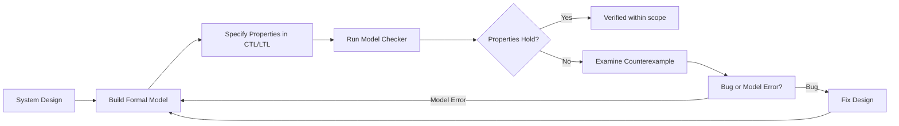
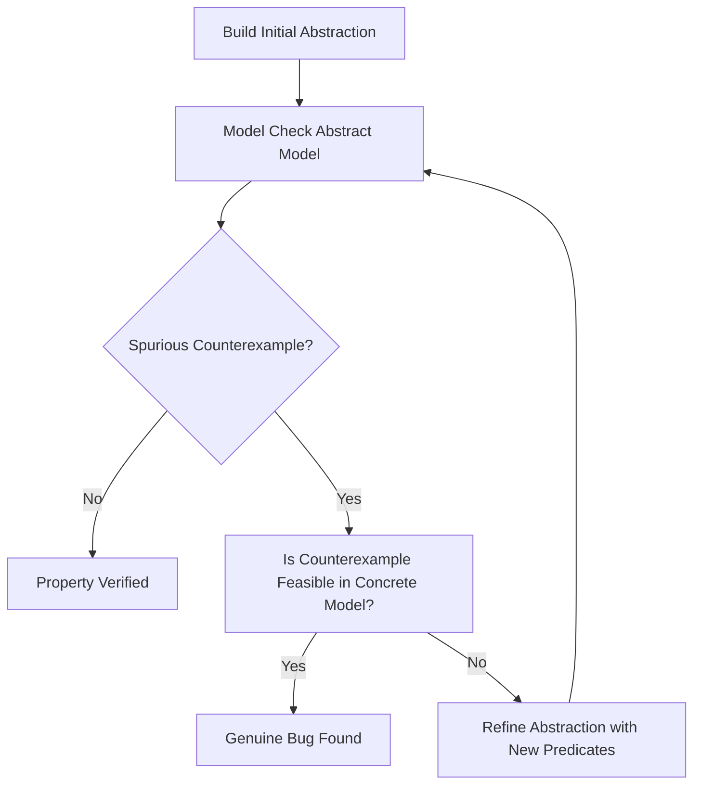

# Formal Methods (SWEBOK KA 11.9)

> Formal methods use mathematical notation and logic to specify, develop, and verify software systems. They provide a rigorous foundation for reasoning about system correctness.

## 1. What Are Formal Methods?

Formal methods are techniques that apply **mathematical specification** and **verification** to software artifacts. Unlike informal or semi-formal notations (UML, natural language), formal methods enable:

- **Unambiguous specification**: every property is precisely stated
- **Mathematical proof**: correctness can be demonstrated, not just tested
- **Early defect detection**: errors found at specification time, before coding

### Spectrum of Formality

| Level | Techniques | Rigor |
|-------|-----------|-------|
| Informal | Natural language, sketches | Low |
| Semi-formal | UML, SysML, flowcharts | Medium |
| Lightweight formal | Alloy, Design by Contract, TLA+ | Medium-High |
| Fully formal | Z, B, Event-B, VDM, theorem proving | High |

### When to Use Formal Methods

| Domain | Rationale |
|--------|-----------|
| Safety-critical systems (avionics, rail, medical) | Certification standards (DO-178C, EN 50128) require or recommend formal verification |
| Security protocols | Subtle flaws invisible to testing |
| Concurrent/distributed algorithms | Race conditions, deadlocks hard to detect empirically |
| Hardware/software interface | Correctness at bit-level matters |
| Compiler/language semantics | Defining what "correct" means |

### Cost-Benefit Considerations

- **Cost**: steep learning curve, specialized tools, longer specification time
- **Benefit**: dramatically reduced defect density in verified components; in safety-critical domains the cost of failure far exceeds the cost of formalization
- **Pragmatic adoption**: start with lightweight formal methods, apply full formalism to the most critical subsystems

---

## 2. Specification Languages

Specification languages provide the notation for describing *what* a system does (not *how*).

### Z Notation

- Based on **set theory** and **first-order predicate logic**
- Uses **schemas** (rectangular boxes) to describe state and operations
- State is modeled as mathematical sets, relations, and functions

```
┌────────────────────┐
│     BankAccount     │
├────────────────────┤
│ balance : ℕ         │
│ owner : NAME        │
├────────────────────┤
│ balance ≥ 0         │  ← invariant
└────────────────────┘
```

Operation schema for deposit:

```
┌────────────────────────────┐
│      Deposit?ΔBankAccount   │
├────────────────────────────┤
│ amount? : ℕ                 │
│ balance' = balance + amount?│
└────────────────────────────┘
```

### VDM (Vienna Development Method)

- Uses **abstract data types** with pre/post conditions
- VDM-SL (Specification Language) and VDM++ (object-oriented extension)
- Supports **data refinement** and **operation decomposition**
- Tool support: VDMTools, Overture

### B Method and Event-B

**B Method**:
- Developed by Jean-Raymond Abrial
- Uses **Abstract Machine Notation (AMN)**
- Supports full development: abstract specification → concrete implementation
- Refinement through **gluing invariants**
- Industrial tool: Atelier B (used in Paris Metro Line 14)

**Event-B**:
- Successor to B, based on the **event-based** paradigm
- Models systems as state machines with **guards** and **actions**
- Rodin platform (open source) provides IDE and proving support
- Used in EU projects: DEPLOY, ADVANCE

### TLA+ (Temporal Logic of Actions)

- Developed by Leslie Lamport
- Combines **set theory** + **temporal logic**
- Specifies systems as actions over state variables
- TLC model checker explores all reachable states
- Used at Amazon Web Services for verifying distributed systems

```tla
---- MODULE SimpleCounter ----
VARIABLE count
Init == count = 0
Increment == count' = count + 1
Next == Increment
Spec == Init [][Next]_count
====
```

### Alloy

- Developed by Daniel Jackson (MIT)
- Based on **relational logic** with **set theory**
- Alloy Analyzer provides **bounded model checking** (exhaustive within a scope)
- Excellent for exploring **structural properties** (graphs, invariants)
- Visual counterexample display aids understanding

```alloy
sig Node { edges: set Node }
fact { all n: Node | n not in n.^edges }  -- no cycles
run {} for 5
```

### Comparison Table

| Language | Basis | Strengths | Tool Support |
|----------|-------|-----------|-------------|
| Z | Set theory, schemas | State modeling, readability | Z/EVES, CZT |
| VDM | Abstract data types | Data refinement, stepwise | Overture, VDMTools |
| B/Event-B | AMN, set theory | Full refinement chain | Atelier B, Rodin |
| TLA+ | Temporal logic, sets | Distributed systems, concurrency | TLC, TLAPS |
| Alloy | Relational logic | Structural analysis, counterexamples | Alloy Analyzer |

---

## 3. Program Refinement

Refinement transforms an abstract specification into a concrete implementation through provably correct steps.

### Stepwise Refinement Principle

```
Specification S₀  →  S₁  →  S₂  →  ...  →  Implementation Sₙ
```

At each step Sᵢ → Sᵢ₊₁:
1. **Data refinement**: replace abstract data types with concrete ones (e.g., set → array)
2. **Operation refinement**: replace abstract operations with concrete algorithms
3. **Gluing invariant**: relates abstract and concrete states

### Refinement in B/Event-B

```
MACHINE Stack
  VARIABLES items
  INVARIANT items ∈ seq(VALUE) ∧ size(items) ≤ MAX
  OPERATIONS
    push(v) = PRE size(items) < MAX THEN items := items ∘ ⟨v⟩ END
END

REFINEMENT StackImpl
  REFINES Stack
  VARIABLES arr, top
  INVARIANT top ∈ 0..MAX ∧ items = arr[1..top]  ← gluing invariant
  OPERATIONS
    push(v) = PRE top < MAX THEN top := top+1; arr[top] := v END
END
```

### Refinement Patterns

| Pattern | Description |
|---------|-------------|
| Strengthen postcondition | Add deterministic choice where spec allowed nondeterminism |
| Weaken precondition | Make operation applicable in more states |
| Data reification | Replace set with array, abstract with concrete index |
| Decomposition | Split one operation into multiple sub-operations |

---

## 4. Model Checking

Model checking is an **automated** technique that exhaustively explores all reachable states of a finite model to verify temporal properties.

### Core Concepts

- **State space**: all possible configurations of the system
- **Temporal logic**: formal language for expressing properties over execution traces
- **Counterexample**: when a property fails, the model checker produces a violating trace

### Temporal Logics

**CTL (Computation Tree Logic)**:
- Path quantifiers: **A** (all paths), **E** (exists a path)
- Temporal operators: **X** (next), **F** (eventually), **G** (globally), **U** (until)
- Example: `AG(request → AF response)` -- "every request is eventually answered on all paths"

**LTL (Linear Temporal Logic)**:
- No path quantifiers (implicitly universal over all paths)
- Operators: **X**, **F**, **G**, **U**
- Example: `G(request → F response)` -- same meaning as CTL example for safety properties

**CTL***: superset combining CTL and LTL expressiveness

### Model Checking Tools

| Tool | Input | Technique | Notable Features |
|------|-------|-----------|-----------------|
| SPIN | Promela models | Explicit-state, on-the-fly | LTL verification, deadlock detection |
| NuSMV | SMV language | Symbolic (BDD-based) | CTL/LTL, bounded model checking |
| UPPAAL | Timed automata | Zone-based abstraction | Real-time systems |
| PRISM | Probabilistic models | Symbolic/statistical | Probabilistic CTL |
| TLC | TLA+ specifications | Explicit-state | Distributed system verification |

### State Space Explosion Problem

The main challenge: state space grows **exponentially** with the number of variables and components.

**Mitigation techniques**:
- **Symbolic model checking**: represent state sets as BDDs (Binary Decision Diagrams)
- **Partial order reduction**: explore only independent interleavings
- **Abstraction**: reduce model detail to shrink state space
- **Bounded model checking**: check only paths up to length k (SAT-based)
- **Compositional verification**: verify components separately, assume/guarantee reasoning

### Model Checking Workflow



---

## 5. Theorem Proving

Theorem proving uses **logical deduction** to verify properties. Unlike model checking, it handles infinite state spaces but requires human guidance.

### Interactive vs Automated

| Type | Automation | Power | Examples |
|------|-----------|-------|---------|
| Interactive (proof assistant) | Human guides, machine checks | Can prove anything expressible | Isabelle, Coq, PVS |
| Automated theorem prover | Fully automatic | Limited to decidable fragments | Z3, Vampire, SPASS |
| SMT solver | Automatic with theories | Combines SAT + theories (arithmetic, arrays) | Z3, CVC5, Yices |

### Major Proof Assistants

**Isabelle/HOL**:
- Higher-order logic, LCF-style (small trusted kernel)
- Isar proof language for readable proofs
- Large library (Archive of Formal Proofs)

**Coq**:
- Calculus of Inductive Constructions (dependent types)
- Extraction to OCaml/Haskell for certified programs
- CompCert verified C compiler

**PVS (Prototype Verification System)**:
- Higher-order logic with dependent types
- Powerful type system, decision procedures
- Used by NASA for safety-critical verification

### Proof Structure in Coq

```coq
Theorem plus_comm : forall n m : nat, n + m = m + n.
Proof.
  intros n m.
  induction n as [| n' IH].
  - simpl. rewrite <- plus_n_O. reflexivity.
  - simpl. rewrite IH. rewrite <- plus_n_Sm. reflexivity.
Qed.
```

### SMT Solvers and Bounded Verification

SMT (Satisfiability Modulo Theories) solvers combine:
- **SAT solving** (Boolean satisfiability)
- **Theory reasoning** (integer arithmetic, bit-vectors, arrays, strings)

Used in:
- **Bounded model checking** (k-induction)
- **Symbolic execution** (path feasibility)
- **Program verification** (Dafny, F* rely on Z3)
- **Test generation** (concolic testing)

---

## 6. Lightweight Formal Methods

Lightweight formal methods provide formal rigor with lower cost than full verification.

### Design by Contract (Hoare Triples)

The Hoare triple `{P} S {Q}` states:
- If precondition **P** holds before executing **S**
- Then postcondition **Q** holds after **S** terminates

```
{x > 0} y := x + 1 {y > 1}
```

**Weakest precondition**: `wp(S, Q)` = the weakest P such that `{P}S{Q}` holds.

See [[09_Design_Contract_and_Modeling]] for full coverage of Design by Contract.

### Alloy Analyzer

- Specify structural constraints in Alloy's relational logic
- Analyzer explores all instances within a given **scope** (bound on set sizes)
- Finds counterexamples to assertions or generates instances satisfying predicates
- Not a proof (bounded), but extremely effective for design exploration

### Lightweight Approaches Summary

| Approach | What It Provides | Limitation |
|----------|-----------------|------------|
| Alloy | Bounded exhaustive exploration | Scope-limited, not a proof |
| Design by Contract | Runtime assertion checking | Not exhaustive |
| TLA+ with TLC | Exhaustive state exploration | Finite-state models only |
| Static analysis (abstract interpretation) | Sound over-approximation | May report false positives |

---

## 7. Formal Methods in Practice

### Industry Adoption

| Domain | Standard | Formal Methods Usage |
|--------|----------|---------------------|
| Avionics | DO-178C (DAL A) | Formal methods as alternative to MC/DC testing |
| Rail signaling | EN 50128 SIL 3-4 | B method for safety-critical software (Alstom, Siemens) |
| Medical devices | IEC 62304 | Model checking for infusion pump software |
| Microprocessors | Intel/AMD | Formal verification of floating-point units, cache coherence |
| Cloud infrastructure | Amazon/AWS | TLA+ for DynamoDB, S3, EBS protocols |
| Cryptography | NIST | Formal proofs of protocol security properties |

### Abstraction and Abstraction Refinement

**Abstraction** reduces a model's complexity by removing irrelevant details:

- **Predicate abstraction**: replace data values with Boolean predicates
- **Data abstraction**: replace concrete types with abstract domains
- **Symmetry reduction**: exploit system symmetries to collapse equivalent states

**CEGAR (Counterexample-Guided Abstraction Refinement)**:



This iterative loop (used in SLAM, BLAST, CPAchecker) makes model checking practical for real software.

---

## 8. Relationship to Other Modeling Approaches

Formal methods complement the modeling techniques in earlier notes:

| Formal Technique | Complements |
|-----------------|-------------|
| Z/VDM schemas | [[02_Structured_Analysis_Modeling\|Structured Analysis]] data dictionaries |
| Event-B events | [[05_Behavioral_Modeling\|Behavioral Modeling]] state machines |
| Alloy models | [[04_Architectural_Design_Modeling\|Architectural Design]] component interfaces |
| TLA+ actions | [[06_Formal_Methods_and_Verification\|Concurrency patterns]] |
| Refinement chains | [[01_Introduction_to_Software_Modeling\|Model abstraction levels]] |

---

## Key Takeaways

1. Formal methods range from lightweight (Alloy, DbC) to full verification (theorem proving)
2. Model checking is **automatic** but limited to finite states; theorem proving handles infinite domains but needs human guidance
3. Specification languages (Z, VDM, B, TLA+, Alloy) each have distinct strengths for different system aspects
4. Refinement provides a **provable chain** from specification to implementation
5. In practice, formal methods are cost-effective for **safety-critical** and **security-critical** subsystems
6. CEGAR bridges the gap between abstraction and precision in model checking
7. Lightweight formal methods (Alloy, TLA+) offer practical formal rigor without full proof burden

---

*Source: SWEBOK v4, Chapter 11 - Software Engineering Models and Methods, Section 11.9*
