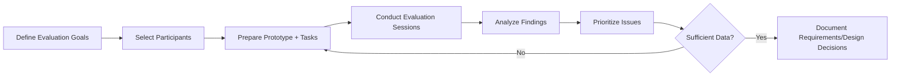
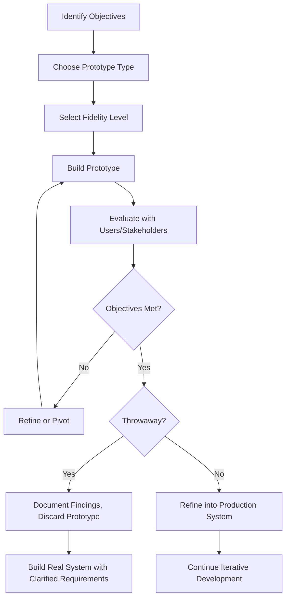

# Prototyping Methods (SWEBOK KA 11.10)

> Prototyping is the rapid construction and evaluation of partial or simulated systems to explore requirements, validate designs, and reduce development risk.

## 1. Prototyping Objectives

Prototyping serves multiple purposes across the software lifecycle:

| Objective | Description | Lifecycle Phase |
|-----------|-------------|----------------|
| **Requirements exploration** | Discover and clarify ambiguous or unknown requirements | Early requirements |
| **Design validation** | Test architectural and UI design decisions before full implementation | Design |
| **Risk reduction** | Identify technical feasibility, performance bottlenecks, integration issues | Any phase |
| **Stakeholder communication** | Provide tangible artifacts for non-technical stakeholders to react to | Throughout |
| **User feedback** | Gather usability data from actual or simulated interaction | Requirements/Design |
| **Feasibility proof** | Demonstrate that a concept is technically viable | Concept/Inception |

### Prototyping vs Other Approaches

| Aspect | Prototyping | Piloting | MVP |
|--------|------------|----------|-----|
| Goal | Learn/explore | Deploy at small scale | Launch to market |
| Lifespan | Often discarded | Grows into production | Production from start |
| Scope | Narrow, focused | Full system subset | Minimum viable feature set |
| Audience | Internal/stakeholders | Subset of users | Real users |

---

## 2. Types of Prototypes

### 2.1 By Purpose: Throwaway vs Evolutionary vs Incremental

#### Throwaway (Rapid) Prototyping

- Built quickly to answer specific questions, then **discarded**
- Code quality is irrelevant; speed is paramount
- Once requirements are understood, the real system is built from scratch

```
Requirements (unclear) → Throwaway Prototype → Clarified Requirements → Real System
                           ↑ discarded
```

**Advantages**: fast, cheap, low commitment
**Risk**: stakeholders may resist discarding ("but it works!")

#### Evolutionary Prototyping

- Prototype is **iteratively refined** toward the final product
- Each iteration incorporates feedback and adds functionality
- The prototype *becomes* the production system

```
Prototype v1 → Feedback → v2 → Feedback → v3 → ... → Production System
```

**Advantages**: continuous validation, faster time-to-working-prototype
**Risk**: accumulated technical debt from early shortcuts; architecture may be suboptimal

#### Incremental Prototyping

- System is divided into **subsets**
- Each subset is prototyped and refined independently
- Final system is **assembled** from completed increments

```
[Module A proto → refined] + [Module B proto → refined] + [Module C proto → refined]
    → Integrated System
```

**Advantages**: manageable complexity, parallel development
**Risk**: integration issues between independently developed increments

### Comparison Table

| Criterion | Throwaway | Evolutionary | Incremental |
|-----------|-----------|-------------|-------------|
| Prototype fate | Discarded | Becomes product | Assembled into product |
| Speed to first prototype | Very fast | Fast | Moderate |
| Final code quality | High (fresh start) | Variable (evolved) | Good (focused) |
| Requirements stability needed | Low | Low-Medium | Medium |
| Best for | Exploring unknowns | Unclear/volatile requirements | Large modular systems |

### 2.2 By Scope: Horizontal vs Vertical

#### Horizontal Prototyping

- Implements the **user interface layer** only (or broad shallow functionality)
- No real backend logic; data is hardcoded or simulated
- Shows the "look and feel" across many features

```
┌─────────────────────────────────────────────┐
│  UI Layer: Screen A  Screen B  Screen C     │  ← fully prototyped
├─────────────────────────────────────────────┤
│  Logic Layer:  [simulated / stubbed]        │  ← not implemented
├─────────────────────────────────────────────┤
│  Data Layer:   [hardcoded / mock]           │  ← not implemented
└─────────────────────────────────────────────┘
```

**Use when**: UI design is the primary concern; stakeholder buy-in needed on workflow

#### Vertical Prototyping

- Implements **one function at full depth** (UI + logic + data)
- Proves end-to-end feasibility of a specific capability
- Useful for high-risk technical areas

```
┌─────────────────────────────────────────────┐
│  Function A:  [full stack prototype]        │  ← fully implemented
│  Function B:  [not started]                 │
│  Function C:  [not started]                 │
└─────────────────────────────────────────────┘
```

**Use when**: technical risk is the primary concern; need to validate architecture

### 2.3 By Fidelity

| Fidelity | Characteristics | Tools | Use Case |
|----------|----------------|-------|----------|
| **Low-fidelity** | Paper sketches, wireframes, rough layouts | Paper, Balsamiq, whiteboards | Early brainstorming, rapid iteration |
| **Medium-fidelity** | Interactive wireframes with navigation | Figma, Sketch, Axure | User flow validation, stakeholder demos |
| **High-fidelity** | Pixel-perfect, interactive, realistic data | Figma advanced, Framer, HTML/CSS | Usability testing, developer handoff |
| **Executable specification** | Working code with real logic | Any programming language | Technical feasibility, algorithm validation |

---

## 3. Prototyping Techniques

### 3.1 Storyboarding

- Sequence of sketches showing user journey through a system
- Focuses on **narrative flow** rather than UI details
- Effective for communicating scenarios to stakeholders

### 3.2 Wireframing

- Low-fidelity structural layouts of screens/pages
- Emphasizes **information architecture** and **content hierarchy**
- Deliberately avoids color, imagery, and branding to focus on structure

### 3.3 Mockups

- Static, high-fidelity visual representations
- Show **visual design** (colors, typography, spacing) without interactivity
- Bridge between wireframes and interactive prototypes

### 3.4 Interactive Prototypes

- Clickable, navigable simulations of the final product
- Support **user testing** with realistic interaction patterns
- Tools: Figma prototyping, InVision, Adobe XD, Framer

### 3.5 Wizard of Oz

- Human operator simulates system responses behind the scenes
- User believes they are interacting with an automated system
- **Validates AI/ML features** before building the algorithm
- Used for: chatbots, voice interfaces, recommendation systems

---

## 4. Prototyping in Agile Development

### Minimum Viable Product (MVP)

The MVP is the smallest product version that delivers enough value to gather validated learning:

```
Idea → MVP → Measure → Learn → Iterate
```

- **Not** a prototype in the traditional sense (it's released to real users)
- Shares prototyping DNA: build fast, learn, adjust
- Eric Ries (Lean Startup): "The minimum viable product is that version of a new product which allows a team to collect the maximum amount of validated learning about customers with the least effort."

### Spike Solutions

- **Technical spike**: time-boxed investigation to answer a specific technical question
- **Functional spike**: explore how a feature would work
- Typically throwaway: the code is exploratory, not production-ready

```markdown
## Spike: Real-time Notification System
**Question**: Can WebSocket handle 10K concurrent connections on our infrastructure?
**Time-box**: 2 days
**Approach**: Build minimal WebSocket server, load test with k6
**Decision criteria**: <100ms p99 latency at 10K connections = feasible
```

### Prototyping in Scrum

| Scrum Artifact | Prototyping Role |
|---------------|-----------------|
| Product Backlog | Spike stories for feasibility exploration |
| Sprint Backlog | Prototype tasks within a sprint |
| Sprint Review | Demo interactive prototypes for feedback |
| Definition of Done | Clarify whether prototype code is "done" or separate |

---

## 5. User Evaluation of Prototypes

### Evaluation Methods

| Method | Prototype Level | Data Collected |
|--------|----------------|----------------|
| **Think-aloud protocol** | Interactive | Real-time user reasoning, confusion points |
| **A/B testing** | High-fidelity | Quantitative preference data |
| **Heuristic evaluation** | Any | Expert-identified usability issues |
| **Cognitive walkthrough** | Medium+ | Task completion difficulty |
| **Surveys/questionnaires** | Any | Satisfaction ratings, feature priorities |
| **Eye tracking** | High-fidelity | Attention patterns, visual hierarchy effectiveness |

### Evaluation Process



### Key Metrics

- **Task completion rate**: percentage of users who complete key tasks
- **Time on task**: efficiency of the design
- **Error rate**: frequency of user mistakes
- **System Usability Scale (SUS)**: standardized 10-item questionnaire (score 0-100)
- **Net Promoter Score (NPS)**: likelihood to recommend

---

## 6. Prototyping Tools and Technologies

### Tool Categories

| Category | Tools | Fidelity | Best For |
|----------|-------|----------|----------|
| **Paper/whiteboard** | Paper, markers, sticky notes | Very low | Brainstorming, early concepts |
| **Wireframing** | Balsamiq, Whimsical, draw.io | Low | Rapid layout exploration |
| **Design/prototyping** | Figma, Sketch, Adobe XD, Axure | Medium-High | Interactive prototypes, design systems |
| **Code-based** | HTML/CSS/JS, React, Flutter | High | Technical prototypes, MVPs |
| **No-code/low-code** | Webflow, Bubble, Retool | Medium-High | Rapid application prototyping |
| **AI-assisted** | v0.dev, Galileo AI, Uizard | Medium | AI-generated UI from descriptions |

### Choosing the Right Tool

| Situation | Recommended Tool Category |
|-----------|--------------------------|
| Early ideation, 5-minute sketches | Paper/whiteboard |
| Validating user flows with stakeholders | Wireframing or design tools |
| Usability testing with realistic interaction | Design/prototyping tools |
| Proving technical feasibility | Code-based |
| Non-technical team building a demo | No-code/low-code |

---

## 7. Risks and Pitfalls of Prototyping

### Common Risks

| Risk | Description | Mitigation |
|------|-------------|------------|
| **Stakeholder confusion** | Stakeholders mistake prototype for finished product | Clear labeling ("Prototype - Not Final"), explicit expectations |
| **Scope creep** | "Can you just add..." requests expand prototype beyond its purpose | Time-box prototyping effort, define clear objectives upfront |
| **Design-by-committee** | Too many opinions paralyze design decisions | Designate decision maker, limit feedback rounds |
| **Evolutionary trap** | Throwaway prototype becomes production system (with all its shortcuts) | Enforce prototype/production separation; if evolutionary, invest in refactoring |
| **False confidence** | High-fidelity prototype gives illusion of near-completion | Communicate remaining effort honestly |
| **Over-investment** | Spending too long perfecting a prototype | Time-box strictly; "good enough" is the goal |
| **User fatigue** | Too many evaluation sessions with minor changes | Batch changes, evaluate meaningfully different variants |

### The Prototype Pitfall

> "The worst thing about prototyping is that it works." - Alan Cooper

When a prototype works well enough, there is organizational pressure to ship it. This leads to:
- Production systems built on prototype-quality code
- Missing error handling, security, performance optimization
- Technical debt that compounds over years

**Prevention**:
1. Use throwaway prototyping tools that **cannot** become production code
2. Explicitly budget for "real" development after prototyping phase
3. If evolutionary, schedule dedicated **hardening sprints**

---

## 8. Prototyping Process Model



---

## 9. Relationship to Other Notes

| Prototyping Aspect | Related Note |
|-------------------|-------------|
| Requirements exploration | [[01_Introduction_to_Software_Modeling\|Introduction to Software Modeling]] |
| UI design validation | [[02_Structured_Analysis_Modeling\|Structured Analysis Modeling]] |
| Behavioral prototyping | [[05_Behavioral_Modeling\|Behavioral Modeling]] |
| Architecture validation | [[04_Architectural_Design_Modeling\|Architectural Design Modeling]] |
| Executable specifications | [[07_Formal_Methods\|Formal Methods]] |
| Contract-based prototyping | [[09_Design_Contract_and_Modeling\|Design by Contract and Modeling]] |

---

## Key Takeaways

1. Prototyping objectives: explore requirements, validate designs, reduce risk, communicate with stakeholders
2. Three main types: throwaway (discarded after learning), evolutionary (refined into product), incremental (assembled from prototyped subsets)
3. Horizontal prototypes show breadth (UI), vertical prototypes show depth (one function end-to-end)
4. Fidelity ranges from paper sketches to pixel-perfect interactive simulations
5. Agile practices (MVP, spike solutions) embody prototyping philosophy
6. The biggest risk is stakeholders mistaking a prototype for a finished product
7. Always time-box prototyping and define clear evaluation criteria before starting

---

*Source: SWEBOK v4, Chapter 11 - Software Engineering Models and Methods, Section 11.10*
