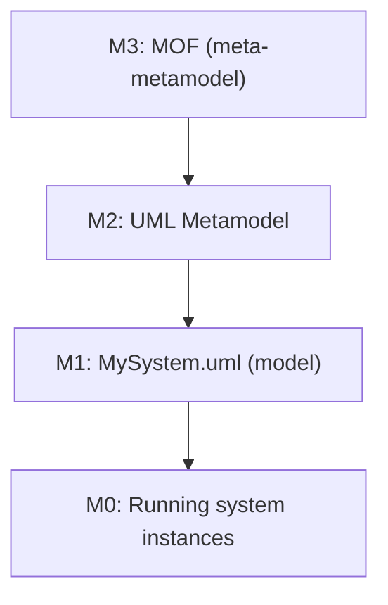
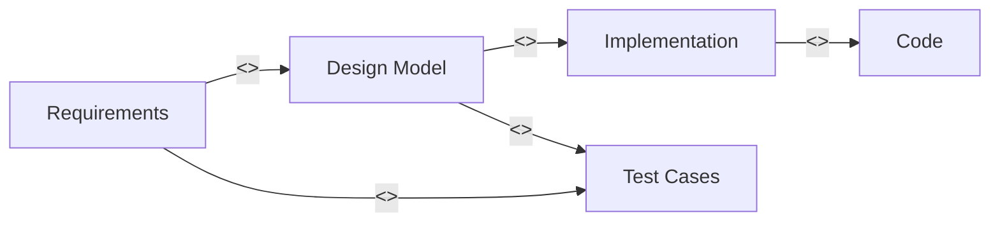
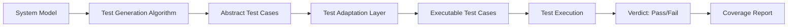
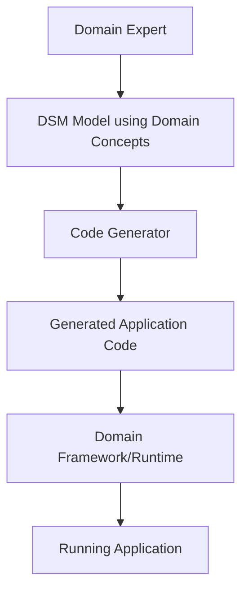
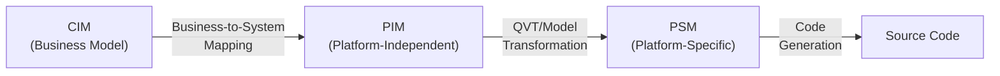

# Design by Contract and Advanced Modeling (SWEBOK KA 11.3-11.4, 11.7)

> Design by Contract treats software components as parties to a contract: each obligation (precondition), guarantee (postcondition), and shared invariant is formally specified, enabling precise reasoning about component interaction and substitutability.

## 1. Design by Contract (DbC)

### 1.1 Core Concepts

Design by Contract, introduced by Bertrand Meyer for the Eiffel programming language, models software interaction as a **contract** between a supplier (callee) and a client (caller).

#### The Three Pillars

| Element | Symbol | Responsibility | Who Enforces |
|---------|--------|---------------|-------------|
| **Precondition** | `require` | Conditions that must hold before execution | **Client** (caller) |
| **Postcondition** | `ensure` | Conditions guaranteed after execution | **Supplier** (callee) |
| **Invariant** | `invariant` | Conditions that hold throughout the object's lifetime | **Both** (system) |

#### Hoare Logic Foundation

The contract is grounded in **Hoare triples**: `{P} S {Q}`

- **P** = precondition (predicate true before S executes)
- **S** = program statement/block
- **Q** = postcondition (predicate true after S terminates)

**Example**: Array insertion

```
{array.size < MAX_CAPACITY ∧ index ∈ 0..array.size}
insert(array, index, value)
{array.size = old.array.size + 1 ∧ array[index] = value ∧
 ∀i ∈ 0..old.array.size. i ≠ index → array[i] = old.array[i]}
```

The postcondition explicitly states: the array grew by one, the new value is at the specified index, and all other elements are unchanged.

### 1.2 Class Invariants

A **class invariant** is a predicate that must hold:
- After the constructor completes
- Before and after every public method call
- May be temporarily violated *inside* a method body

```
class BoundedStack[T] {
    // Invariant:
    //   0 ≤ count ≤ capacity
    //   count = elements.size
    //   if count > 0 then top = elements[count - 1]

    count: Integer
    capacity: Integer
    elements: Array[T]

    push(item: T)
        require: count < capacity
        ensure:  count = old.count + 1
                 ∧ top = item
                 ∧ ∀i ∈ 0..old.count. elements[i] = old.elements[i]

    pop(): T
        require: count > 0
        ensure:  result = old.top
                 ∧ count = old.count - 1

    top(): T
        require: count > 0
        ensure:  result = elements[count - 1]
}
```

### 1.3 Liskov Substitution Principle (LSP)

Barbara Liskov's principle is the behavioral foundation for correct inheritance:

> "If S is a subtype of T, then objects of type T may be replaced with objects of type S without altering any of the desirable properties of the program."

**Formal characterization** (Liskov and Wing, 1994):

| Rule | Contract Implication |
|------|---------------------|
| **Preconditions cannot be strengthened in subclasses** | Subtype must accept at least what the supertype accepts |
| **Postconditions cannot be weakened in subclasses** | Subtype must guarantee at least what the supertype guarantees |
| **Invariants must be preserved** | Subtype must maintain all supertype invariants |
| **History constraint** | Subtype cannot change state in ways the supertype forbids |

**Violation example**:

```
class Rectangle {
    width, height: Real
    invariant: width > 0 ∧ height > 0

    area(): Real
        ensure: result = width * height

    setWidth(w: Real)
        require: w > 0
        ensure:  width = w ∧ height = old.height
}

class Square extends Rectangle {
    // VIOLATION: setWidth must also change height to maintain square invariant
    // This contradicts Rectangle's postcondition: height = old.height
    setWidth(w: Real)
        require: w > 0
        ensure:  width = w ∧ height = w  // ← height changed, breaking LSP
}
```

Square is NOT a behavioral subtype of Rectangle despite being a geometric subtype. The contract reveals the design flaw.

### 1.4 Contract Languages and Tools

| Language/Tool | Platform | DbC Support |
|--------------|----------|-------------|
| **Eiffel** | Native | Full DbC: `require`, `ensure`, `invariant`, `check` |
| **JML** (Java Modeling Language) | Java | `@requires`, `@ensures`, `@invariant` annotations |
| **Code Contracts** | .NET | `Contract.Requires()`, `Contract.Ensures()` |
| **Dafny** | .NET | Built-in `requires`, `ensures`, `invariant` with verification |
| **SPARK Ada** | Ada | Pre/post via aspects, full static verification |
| **OpenJML** | Java | JML runtime checker and static verifier |
| **KeY** | Java | Deductive verification against JML contracts |
| **Creusot** | Rust | Contracts via attributes, verified with Why3 |

### 1.5 Runtime Assertion Checking vs Static Verification

| Approach | Technique | Strengths | Limitations |
|----------|-----------|-----------|-------------|
| **Runtime checking** | Compile assertions into code; check at execution | Easy to adopt, catches violations immediately | Only checks executed paths; performance overhead |
| **Static verification** | Prove contracts hold for all executions via theorem proving or abstract interpretation | Covers all paths; no runtime cost | May report false positives; requires more expertise |
| **Hybrid** | Static proof where possible, runtime check for remainder | Balanced confidence and cost | Tool complexity |

**Runtime checking (Eiffel example)**:

```eiffel
class STACK [G]
feature
    items: ARRAYED_LIST [G]

    push (item: G)
        require
            not_full: not is_full
        do
            items.extend (item)
        ensure
            countIncreased: count = old count + 1
            topIsItem: item = top
        end

    pop: G
        require
            not_empty: not is_empty
        do
            Result := items.last
            items.finish
            items.remove
        ensure
            countDecreased: count = old count - 1
        end

invariant
    valid_count: items.count >= 0
    bounded: items.count <= capacity
end
```

**Static verification (Dafny example)**:

```dafny
method Insert(a: array<int>, n: int, pos: int, val: int)
    requires 0 <= pos <= n < a.Length
    requires forall i, j :: 0 <= i < j < n ==> a[i] <= a[j]  // sorted
    modifies a
    ensures n + 1 <= a.Length
    ensures forall i, j :: 0 <= i < j < n + 1 ==> a[i] <= a[j]  // still sorted
{
    var i := n;
    while i > pos
        invariant pos <= i <= n
        invariant forall j, k :: 0 <= j < k < n + 1 ==> a[j] <= a[k]
    {
        a[i] := a[i - 1];
        i := i - 1;
    }
    a[pos] := val;
}
```

---

## 2. Semantics, Syntax, and Pragmatics of Models

### 2.1 Model Theory

Every model has three dimensions:

| Dimension | Question | Example |
|-----------|----------|---------|
| **Syntax** | What notation is used? | UML class diagrams, BNF grammars, Z schemas |
| **Semantics** | What does it mean? | Mathematical mapping to sets, relations, state machines |
| **Pragmatics** | How is it used/interpreted in context? | Team conventions, tool-specific interpretations |

### 2.2 BNF and Grammar Formalisms

**BNF (Backus-Naur Form)** defines the syntax of languages:

```bnf
<expr>   ::= <term> | <expr> "+" <term>
<term>   ::= <factor> | <term> "*" <factor>
<factor> ::= <number> | "(" <expr> ")"
<number> ::= <digit> | <number> <digit>
<digit>  ::= "0" | "1" | "2" | ... | "9"
```

Variants:
- **EBNF** (Extended): adds `?`, `*`, `+` for optional/repetition
- **ABNF** (Augmented): RFC 5234, used in protocol specifications
- **PEG** (Parsing Expression Grammar): ordered alternatives, no ambiguity

### 2.3 Metamodels and MOF

A **metamodel** defines the abstract syntax and well-formedness rules for a modeling language.

**MOF (Meta-Object Facility)** - the OMG's four-layer metamodeling architecture:

| Layer | Description | Example |
|-------|-------------|---------|
| **M3** (Meta-metamodel) | Defines the metamodeling language itself | MOF, Ecore |
| **M2** (Metamodel) | Defines a modeling language | UML metamodel, SysML metamodel |
| **M1** (Model) | A model of a specific system | My banking application class diagram |
| **M0** (Instances) | The real-world system | Actual bank accounts, transactions |



**Key metamodel elements**:
- **Class**: defines a type of model element
- **Association**: defines relationships between classes
- **Constraint** (OCL): well-formedness rules beyond what the metamodel structure enforces

---

## 3. Model Quality Properties

### 3.1 Completeness

A model is **complete** if it specifies all relevant aspects of the system for its intended purpose.

| Type | Definition | Verification |
|------|-----------|-------------|
| **Syntactic completeness** | All required elements according to metamodel are present | Tool-assisted (checklist) |
| **Domain completeness** | All relevant domain concepts are represented | Domain expert review |
| **Specification completeness** | All requirements are traceable to model elements | Requirements traceability matrix |

### 3.2 Consistency

A model is **consistent** if it contains no contradictions.

| Type | Definition | Example Violation |
|------|-----------|------------------|
| **Intra-model consistency** | No contradictions within a single model | Class diagram shows `Customer` associated with `Order` but `Order` doesn't reference `Customer` |
| **Inter-model consistency** | Different views/models agree | Sequence diagram implies a message not defined in the class diagram |
| **Specification-implementation consistency** | Code matches model | Model shows 3 attributes, class has 4 |

### 3.3 Correctness

A model is **correct** if it accurately represents the system or requirements it claims to describe.

- **Internal correctness**: the model satisfies its own constraints (well-formedness)
- **External correctness**: the model faithfully represents the real-world system or requirements

### 3.4 Validation vs Verification

| Term | Question | Techniques |
|------|----------|-----------|
| **Verification** | "Did we build the model right?" (internal quality) | Static analysis, type checking, constraint solving |
| **Validation** | "Did we build the right model?" (external fidelity) | Stakeholder review, prototyping, simulation |

---

## 4. Model Traceability and Impact Analysis

### 4.1 Traceability Links

Traceability connects model elements to requirements, design decisions, tests, and code.



| Link Type | Description | Example |
|-----------|-------------|---------|
| `<<derive>>` | One requirement derives from another | Functional req derived from business req |
| `<<satisfy>>` | Design element satisfies requirement | PaymentService satisfies REQ-042 |
| `<<verify>>` | Test case verifies requirement/model | TC-015 verifies PaymentService contract |
| `<<refine>>` | More detailed element refines abstract one | Detailed class diagram refines component diagram |
| `<<allocate>>` | Function allocated to architectural element | Login function allocated to AuthService |

### 4.2 Impact Analysis

When a model element changes, impact analysis identifies all affected elements:

```
Change: Modify Order.totalPrice calculation
    ↓
Impact:
├── Class: Order (direct)
├── Association: Order → LineItem (depends on line item prices)
├── Sequence: CheckoutProcess (uses totalPrice)
├── Test: TC-OrderTotal, TC-Checkout (verify total)
├── Requirement: REQ-Pricing (traced to Order)
└── Code: Order.java, CheckoutController.java
```

**Traceability matrix** example:

| Requirement | Design Element | Code Component | Test Case |
|------------|---------------|----------------|-----------|
| REQ-001 | Order class | Order.java | TC-001, TC-002 |
| REQ-002 | PaymentService | PaymentService.java | TC-010 |
| REQ-003 | NotificationSystem | EmailSender.java | TC-020, TC-021 |

---

## 5. Model-Based Testing (MBT)

Model-based testing generates test cases automatically from models.

### 5.1 Process



### 5.2 Models Used for Test Generation

| Model Type | Generates | Coverage Criteria |
|-----------|----------|------------------|
| **State machine** | Transition sequences | All-states, all-transitions, all-paths |
| **Activity/workflow** | Scenario-based tests | All-paths, branch coverage |
| **Class diagram + contracts** | Boundary value tests from pre/postconditions | Contract coverage |
| **Sequence diagram** | Integration/interaction tests | Message sequence coverage |
| **Decision tables** | Combinatorial test cases | All combinations, pairwise |

### 5.3 MBT Tools

| Tool | Model Input | Output | Platform |
|------|-----------|--------|----------|
| **GraphWalker** | State machines (JSON/XML) | Java/JUnit tests | JVM |
| **Spec Explorer** | C# Spec# models | C# test methods | .NET |
| **Conformiq** | UML state machines | Executable scripts | Multi-platform |
| **UPPAAL** | Timed automata | Test sequences | Real-time systems |
| **AltWalker** | GraphWalker-compatible | Python/C# tests | Multi-platform |

### 5.4 Contract-Based Test Generation

Preconditions and postconditions directly generate test cases:

```
// Contract:
//   precondition: x > 0 ∧ y > 0
//   postcondition: result = x * y

// Generated tests:
// Boundary: x=1, y=1 (minimum pre)
// Boundary: x=0 (pre violation - should reject)
// Normal: x=5, y=3 → result=15
// Large: x=MAX_INT/2, y=2 (overflow check)
```

---

## 6. Domain-Specific Modeling (DSM)

### 6.1 What Is DSM?

Domain-Specific Modeling raises the level of abstraction beyond general-purpose languages by using **domain concepts** as first-class modeling elements.

| Aspect | General-Purpose | Domain-Specific |
|--------|----------------|-----------------|
| Abstraction level | Low (code) | High (domain concepts) |
| Expressiveness | Broad but shallow | Narrow but deep |
| Productivity | Baseline | 5-10x for the target domain |
| Learning curve | General programming | Domain + DSL syntax |
| Example | Java/C++ | Robot controller DSL, automotive AUTOSAR |

### 6.2 DSM Components

1. **Domain-specific language (DSL)**: the notation (graphical or textual)
2. **Domain metamodel**: defines the concepts, relationships, and constraints
3. **Code generator**: maps model elements to implementation code
4. **Domain framework**: runtime libraries the generated code uses



### 6.3 Textual vs Graphical DSLs

| Aspect | Textual DSL | Graphical DSL |
|--------|------------|---------------|
| Tooling | Parser generators (Xtext, ANTLR) | MetaCASE tools (GMF, Sirius, MetaEdit+) |
| Version control | Easy (diff-friendly) | Harder (binary formats, though XMI helps) |
| Learning curve | Familiar to developers | More accessible to domain experts |
| Scalability | Good for large models | Can become cluttered |
| Examples | SQL, HTML, YAML, Terraform HCL | UML diagrams, Simulink, LabVIEW |

---

## 7. Model-Driven Architecture (MDA)

### 7.1 MDA Overview

MDA, defined by the OMG, separates **what** a system does from **how** it is implemented through a series of model transformations.

### 7.2 The Three Model Types

| Model | Full Name | Focus | Platform-Independent? |
|-------|-----------|-------|----------------------|
| **CIM** | Computation-Independent Model | Business processes, domain rules | Yes (no computation detail) |
| **PIM** | Platform-Independent Model | System functionality, structure | Yes (no technology choices) |
| **PSM** | Platform-Specific Model | Implementation on a specific platform | No (tied to Java, .NET, etc.) |

### 7.3 MDA Transformation Chain



### 7.4 Transformation Languages

| Language | Standard | Purpose |
|----------|----------|---------|
| **QVT** (Query/View/Transformation) | OMG | Model-to-model transformation |
| **ATL** (ATLAS Transformation Language) | Eclipse | QVT-like, widely used in academia |
| **Acceleo** | Eclipse | Model-to-text (code generation) |
| **Xtend** | Eclipse | Template-based code generation |
| **Xtext** | Eclipse | DSL definition + code generation |

### 7.5 PIM to PSM Transformation Example

**PIM** (platform-independent):
```
class Customer {
    name: String
    email: String
    orders: Order[*]
}

class Order {
    date: Date
    total: Decimal
    items: OrderItem[*]
}
```

**PSM for relational database** (automatically generated):
```sql
CREATE TABLE customer (
    id BIGINT PRIMARY KEY AUTO_INCREMENT,
    name VARCHAR(255) NOT NULL,
    email VARCHAR(255) NOT NULL UNIQUE
);

CREATE TABLE order (
    id BIGINT PRIMARY KEY AUTO_INCREMENT,
    customer_id BIGINT NOT NULL,
    date DATE NOT NULL,
    total DECIMAL(10,2) NOT NULL,
    FOREIGN KEY (customer_id) REFERENCES customer(id)
);
```

**PSM for REST API** (automatically generated):
```java
@RestController
@RequestMapping("/api/customers")
public class CustomerController {
    @GetMapping("/{id}")
    public CustomerDTO getCustomer(@PathVariable Long id) { ... }

    @PostMapping
    public CustomerDTO createCustomer(@RequestBody CustomerDTO dto) { ... }
}
```

### 7.6 MDA Adoption: Benefits and Challenges

| Benefits | Challenges |
|----------|-----------|
| Platform independence: PIM survives technology changes | Tool maturity: transformation tools still evolving |
| Productivity: automated code generation | Learning curve: QVT/ATL not trivial |
| Consistency: generated code always matches model | Flexibility escape: hand-coded extensions needed |
| Documentation: models serve as living documentation | Round-trip engineering: code changes back to model are hard |
| Multi-platform: one PIM, many PSMs | Vendor lock-in: proprietary tool dependencies |

---

## 8. Relationship to Other Notes

| Topic | Related Note |
|-------|-------------|
| Behavioral contracts in state machines | [[05_Behavioral_Modeling\|Behavioral Modeling]] |
| Class design with invariants | [[03_Detailed_Design_and_OO_Modeling\|Detailed Design and OO Modeling]] |
| Architectural component contracts | [[04_Architectural_Design_Modeling\|Architectural Design Modeling]] |
| Formal verification of contracts | [[07_Formal_Methods\|Formal Methods]] |
| Model-based testing with prototypes | [[08_Prototyping_Methods\|Prototyping Methods]] |
| Requirements traceability | [[01_Introduction_to_Software_Modeling\|Introduction to Software Modeling]] |
| Data modeling foundations | [[02_Structured_Analysis_Modeling\|Structured Analysis Modeling]] |

---

## Key Takeaways

1. **Design by Contract** specifies obligations (preconditions), guarantees (postconditions), and invariants; grounded in Hoare logic
2. **Liskov Substitution Principle** is the behavioral rule for correct inheritance: subtypes must not strengthen preconditions or weaken postconditions
3. Contracts can be checked **at runtime** (assertions) or **statically** (theorem proving/abstract interpretation)
4. Model quality requires **completeness**, **consistency**, and **correctness** (both internal and external)
5. **Traceability** links requirements to design to code to tests; enables **impact analysis** when changes occur
6. **Model-based testing** generates test cases automatically from state machines, contracts, and other models
7. **Domain-Specific Modeling** raises abstraction by using domain concepts directly, with code generators producing implementation
8. **MDA** separates computation-independent (CIM), platform-independent (PIM), and platform-specific (PSM) models, with automated transformations between them

---

*Source: SWEBOK v4, Chapter 11 - Software Engineering Models and Methods, Sections 11.3, 11.4, 11.7*
