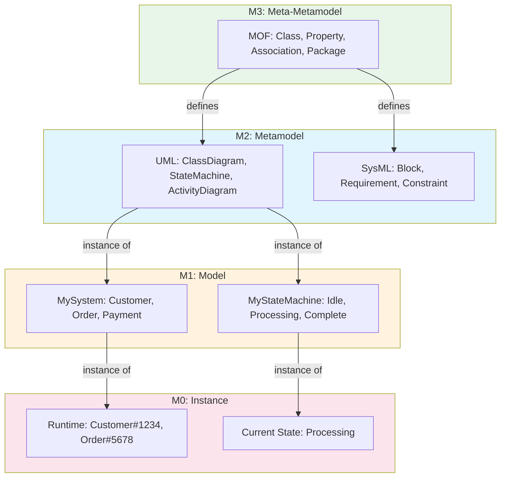
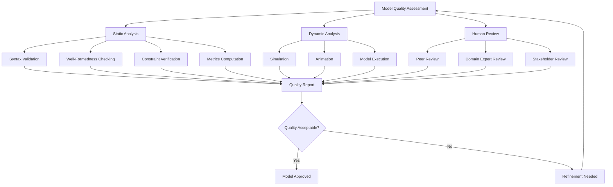
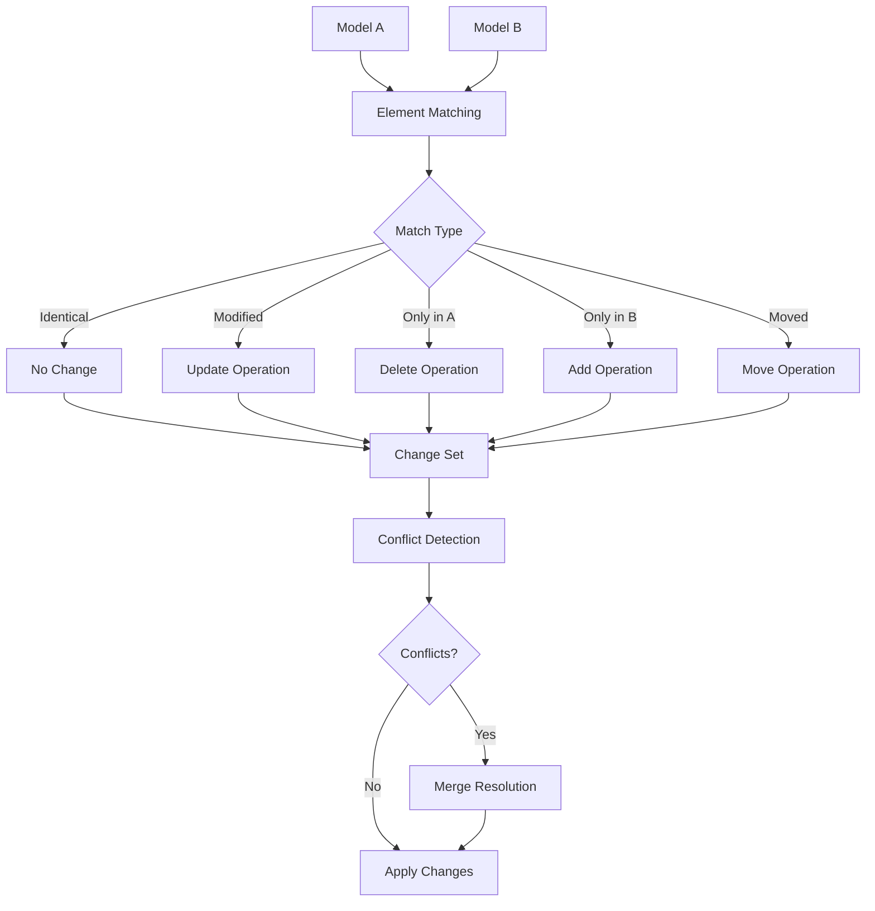
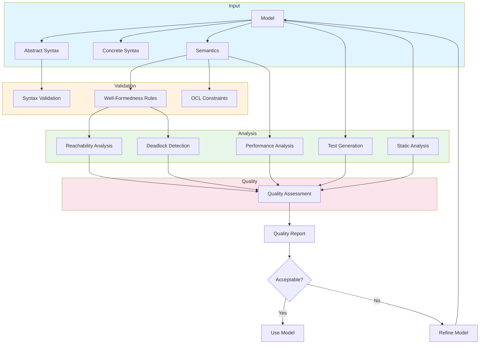

# Syntax, Semantics, and Model Analysis in Software Engineering

> **SWEBOK KA 11.2-11.4** - Covers the formal foundations of software engineering models: their syntax (structure and notation), semantics (meaning), pragmatics (purpose and use), quality attributes, analysis techniques, and management practices.

## 1. Model Syntax

Model syntax defines the structural rules and notation used to represent models. It answers the question: *How is the model written?*

### 1.1 Abstract Syntax vs. Concrete Syntax

| Aspect | Abstract Syntax | Concrete Syntax |
|--------|----------------|-----------------|
| **Definition** | The essential structure of a model, independent of notation | The specific notation or visual representation of a model |
| **Focus** | What elements exist and how they relate | How elements are displayed or serialized |
| **Example (UML Class)** | Class with name, attributes, operations, associations | Box notation with compartments, or XML/XMI serialization |
| **Abstraction Level** | High (tree/graph structure) | Low (textual/visual representation) |
| **Tool Support** | Internal model representation in CASE tools | Editors, visualizers, text editors |
| **Multiplicity** | One abstract syntax per modeling language | Multiple concrete syntaxes possible |
| **Purpose** | Machine processing, model transformation | Human comprehension, communication |

**Example: UML Class Diagram**

```
Abstract Syntax (Metamodel):
┌─────────────────────────────────────┐
│ Class                               │
│   name: String                      │
│   attributes: Property[*]           │
│   operations: Operation[*]          │
│   associations: Association[*]      │
│   generalizations: Generalization[*]│
└─────────────────────────────────────┘

Concrete Syntax (Visual):
┌──────────────────┐
│    Customer      │
├──────────────────┤
│ - name: String   │
│ - email: String  │
├──────────────────┤
│ + order(): void  │
│ + cancel(): void │
└──────────────────┘

Concrete Syntax (Textual - PlantUML):
class Customer {
  - name: String
  - email: String
  + order(): void
  + cancel(): void
}
```

### 1.2 BNF and EBNF Grammars

Backus-Naur Form (BNF) and Extended BNF (EBNF) are notation systems for defining the syntax of languages, including modeling languages.

| Notation | BNF | EBNF |
|----------|-----|------|
| **Rule** | `<symbol> ::= <expression>` | `symbol = expression ;` |
| **Alternation** | `<a> ::= <b> \| <c>` | `a = b \| c ;` |
| **Concatenation** | `<a> ::= <b> <c>` | `a = b , c ;` |
| **Optional** | Not built-in (use alternation) | `a = [ b ] ;` or `a = b ? ;` |
| **Repetition** | Not built-in (use recursion) | `a = { b } ;` or `a = b * ;` |
| **Grouping** | Not built-in | `a = ( b \| c ) ;` |
| **Terminal** | `"terminal"` or `'terminal'` | `"terminal"` or `'terminal'` |

**Example: Simple State Machine Grammar (EBNF)**

```ebnf
state_machine = "statemachine" identifier "{" 
                  { state_declaration } 
                  { transition } 
                "}" ;

state_declaration = "state" identifier 
                    [ "entry" action ] 
                    [ "exit" action ] 
                    [ "do" activity ] ";" ;

transition = identifier "->" identifier 
             [ "[" guard "]" ] 
             [ "/" action ] 
             [ event ] ";" ;

identifier = letter { letter | digit | "_" } ;
action = identifier "(" [ parameter_list ] ")" ;
guard = boolean_expression ;
event = identifier ;
```

### 1.3 Metamodels: MOF and Ecore

A metamodel defines the abstract syntax and rules for constructing models in a specific modeling language.

| Standard | Description | Use Case |
|----------|-------------|----------|
| **MOF (Meta-Object Facility)** | OMG standard for metamodeling, defines a 4-layer architecture | UML metamodel, domain-specific languages |
| **Ecore** | Eclipse implementation of MOF, simplified metamodeling | Eclipse Modeling Framework (EMF), model-driven engineering |
| **XSD (XML Schema)** | XML-based type system, can serve as lightweight metamodel | XML-based model exchange |
| **JSON Schema** | JSON-based type definition | JSON-based model validation |

**MOF Core Concepts:**

| Concept | Description | Example |
|---------|-------------|---------|
| **Class** | Type of model element | `Class`, `Attribute`, `Operation` |
| **Association** | Relationship between classes | `Class` has `Attribute`s |
| **Attribute** | Property of a class | `Class.name: String` |
| **Operation** | Behavior of a class | `Class.getAttributes(): Attribute[*]` |
| **Generalization** | Inheritance relationship | `Association` is a `ModelElement` |
| **Package** | Grouping mechanism | `UML::Classes` |

**Ecore Metamodel Example:**

```java
// Ecore metamodel for a simple state machine
EPackage StateMachinePackage {
  name = "statemachine"
  
  EClass State {
    attribute name: EString
    attribute isInitial: EBoolean
    attribute isFinal: EBoolean
    reference outgoing: Transition[*] { opposite = source }
    reference incoming: Transition[*] { opposite = target }
  }
  
  EClass Transition {
    attribute event: EString
    attribute guard: EString
    attribute action: EString
    reference source: State { required = true }
    reference target: State { required = true }
  }
  
  EClass StateMachine {
    attribute name: EString
    reference states: State[*] { containment = true }
    reference transitions: Transition[*] { containment = true }
  }
}
```

### 1.4 Metamodeling Hierarchy: M0 to M3

The OMG four-layer metamodeling architecture provides a principled framework for understanding models at different levels of abstraction.

| Layer | Name | Description | Example |
|-------|------|-------------|---------|
| **M3** | Meta-Metamodel | The foundation layer; defines the language for defining metamodels | MOF (Meta-Object Facility) |
| **M2** | Metamodel | Defines the constructs of a modeling language | UML metamodel (Class, State, Activity) |
| **M1** | Model | An instance of a metamodel; represents a specific system | A specific class diagram for an e-commerce system |
| **M0** | Instance/Runtime | Real-world instances of model elements | Actual Customer object with name="John Doe" |



**Key Relationships:**

| Relationship | Description | Example |
|-------------|-------------|---------|
| **conformsTo** | Lower layer conforms to upper layer | M1 model conformsTo M2 metamodel |
| **instanceOf** | Lower layer is instance of upper layer | M0 object is instanceOf M1 class |
| **defines** | Upper layer defines lower layer constructs | M3 defines M2 language constructs |

### 1.5 Model Serialization Formats

| Format | Description | Strengths | Weaknesses |
|--------|-------------|-----------|------------|
| **XMI (XML Metadata Interchange)** | OMG standard for model exchange | Standard, tool interoperability, rich semantics | Verbose, complex, slow parsing |
| **JSON Schema** | JSON-based model serialization | Lightweight, web-friendly, fast parsing | Less expressive than XMI, no standard metamodel mapping |
| **Protocol Buffers** | Binary serialization by Google | Compact, fast, schema evolution | Binary format, less human-readable |
| **YAML** | Human-readable data serialization | Easy to read/write, good for config | Whitespace-sensitive, slower parsing |
| **EMF (Eclipse Modeling Framework)** | Java-based model persistence | Rich tooling, reflection, validation | Java-specific, Eclipse ecosystem |
| **SQL/Database** | Relational storage of model elements | Queryable, transactional, scalable | Schema evolution complex, not model-native |
| **RDF/OWL** | Semantic web formats | Linked data, inference, web standards | Complex, verbose, specialized tooling |

## 2. Model Semantics

Model semantics defines the meaning of model elements. It answers the question: *What does the model mean?*

### 2.1 Types of Semantics

| Semantic Type | Description | Application | Example |
|--------------|-------------|-------------|---------|
| **Structural Semantics** | Rules governing the structure and relationships of model elements | Well-formedness checking | "A class cannot inherit from itself" |
| **Behavioral Semantics** | Meaning of dynamic behavior described by models | Simulation, code generation | "A transition fires when its guard is true and event occurs" |
| **Domain Semantics** | Meaning in the application domain | Domain analysis, requirements | "An Order must have at least one line item" |
| **Notation Semantics** | Meaning of visual/textual notation elements | Tool rendering, human interpretation | "A solid arrow represents a dependency" |

### 2.2 Structural Semantics: Well-Formedness Rules

Well-formedness rules (WFRs) define the structural constraints that a valid model must satisfy.

| Rule Type | Description | Example |
|-----------|-------------|---------|
| **Type Constraints** | Elements must be of correct type | "An association end must reference a Class or Interface" |
| **Multiplicity Constraints** | Cardinality requirements | "A class must have at least one attribute" |
| **Consistency Rules** | Cross-element consistency | "If Class A generalizes Class B, B cannot generalize A" |
| **Uniqueness Rules** | Names must be unique in scope | "No two classes in the same package can have the same name" |
| **Completeness Rules** | Required elements must exist | "Every state machine must have exactly one initial state" |
| **Containment Rules** | Ownership constraints | "An attribute must belong to exactly one class" |

**OCL Well-Formedness Rule Examples:**

```ocl
-- A class cannot inherit from itself (transitively)
context Class
inv no_cyclic_inheritance: 
  not self.allSupertypes()->includes(self)

-- An association must have at least two ends
context Association
inv min_two_ends: 
  self.memberEnd->size() >= 2

-- A state machine must have exactly one initial state
context StateMachine
inv exactly_one_initial_state:
  self.region->forAll(r | 
    r.subvertex->select(v | v.oclIsTypeOf(Pseudostate) 
      and v.oclAsType(Pseudostate).kind = PseudostateKind::initial)->size() = 1
  )

-- Operation parameters must have unique names
context Operation
inv unique_parameter_names:
  self.ownedParameter->isUnique(name)
```

### 2.3 Behavioral Semantics

| Approach | Description | Formalism | Use Case |
|----------|-------------|-----------|----------|
| **Operational Semantics** | Defines meaning through execution on abstract machine | Transition systems, rewrite rules | Simulation, debugging, animation |
| **Denotational Semantics** | Defines meaning through mathematical functions | Domain theory, fixed-point theory | Verification, proof of properties |
| **Axiomatic Semantics** | Defines meaning through logical assertions | Hoare logic, pre/post conditions | Verification, proof of correctness |
| **Algebraic Semantics** | Defines meaning through algebraic structures | Abstract algebras, equational logic | Equivalence proofs, refinement |

**Operational Semantics Example (State Machine):**

```
Transition System:
  States: {Idle, Processing, Complete, Error}
  Initial: Idle
  Events: {submit, process, complete, fail}
  
  Transition Rules:
    (Idle, submit[valid], Processing) → action: validateOrder()
    (Processing, process[], Processing) → action: processItems()
    (Processing, complete[], Complete) → action: sendConfirmation()
    (Processing, fail[], Error) → action: logError()
    (Error, submit[retry], Idle) → action: resetState()
    
  Execution Trace:
    Idle --submit[valid]--> Processing --process--> Processing 
    --complete--> Complete
```

### 2.4 OCL for Constraint Specification

Object Constraint Language (OCL) is a formal language for expressing constraints and queries on UML models.

| OCL Feature | Description | Example |
|-------------|-------------|---------|
| **Invariants** | Conditions that must always hold | `context Person inv: self.age >= 0` |
| **Pre-conditions** | Conditions before operation execution | `context Person::setAge(a: Integer) pre: a >= 0` |
| **Post-conditions** | Conditions after operation execution | `context Person::setAge(a: Integer) post: self.age = a` |
| **Body Conditions** | Definition of query operations | `context Person::isAdult(): Boolean body: self.age >= 18` |
| **Derive Conditions** | How derived attributes are computed | `context Order::totalPrice: Real derive: self.items->sum(item.price)` |
| **Init Expressions** | Initial values for attributes | `context Person::age: Integer init: 0` |

**OCL Constraint Examples:**

```ocl
-- Business rule: Order total must equal sum of line items
context Order
inv total_consistency:
  self.totalPrice = self.lineItems->sum(li | li.quantity * li.unitPrice)

-- Business rule: Cannot place order with empty cart
context Order::place()
pre cart_not_empty:
  self.lineItems->notEmpty()
pre order_in_draft:
  self.status = OrderStatus::Draft
post order_placed:
  self.status = OrderStatus::Placed

-- Query: All orders above a threshold
context Customer::largeOrders(threshold: Real): Set(Order)
body:
  self.orders->select(o | o.totalPrice > threshold)

-- Derive: Account balance from transactions
context Account::balance: Real
derive:
  self.transactions->sum(t | 
    if t.type = TransactionType::Credit then t.amount 
    else -t.amount endif
  )
```

### 2.5 Semantic Domains

A semantic domain is the mathematical space in which the meaning of model elements is defined.

| Domain | Description | Application |
|--------|-------------|-------------|
| **Sets** | Collections of elements | Data types, entity collections |
| **Relations** | Binary relations between sets | Associations, dependencies |
| **Functions** | Mappings from domain to codomain | Operations, attributes |
| **Sequences** | Ordered collections | Message sequences, execution traces |
| **Trees** | Hierarchical structures | Abstract syntax trees, containment hierarchies |
| **Graphs** | Nodes and edges | Control flow, data flow, state machines |
| **Lattices** | Partially ordered sets with join/meet | Type hierarchies, refinement orders |
| **Metric Spaces** | Spaces with distance measures | Performance models, resource models |

## 3. Model Pragmatics

Model pragmatics addresses how models are used in practice: their purpose, audience, level of abstraction, and completeness.

### 3.1 Model Purpose

| Purpose | Description | Key Concerns | Example |
|---------|-------------|-------------|---------|
| **Communication** | Convey information to stakeholders | Clarity, simplicity, audience-appropriate notation | High-level architecture diagram for executives |
| **Analysis** | Support reasoning about system properties | Precision, completeness, formal semantics | Performance model for capacity planning |
| **Code Generation** | Generate executable code from models | Completeness, implementation detail, platform specificity | UML model with code generation profiles |
| **Simulation** | Execute model to observe behavior | Behavioral accuracy, scenario coverage | State machine simulation for protocol validation |
| **Documentation** | Record system structure and behavior | Accuracy, currency, completeness | As-built architecture documentation |
| **Requirements** | Capture and analyze requirements | Traceability, completeness, stakeholder agreement | Use case model, requirements diagram |
| **Testing** | Generate test cases from models | Coverage criteria, testability, traceability | Model-based test generation |
| **Verification** | Prove properties of the model | Formal semantics, tool support, property specification | Model checking for deadlock freedom |

### 3.2 Model Audience

| Audience | Needs | Appropriate Abstraction | Notation Preferences |
|----------|-------|------------------------|---------------------|
| **Developers** | Implementation detail, API specifications, data models | Low (detailed) | UML class diagrams, sequence diagrams, code |
| **Testers** | Test scenarios, state coverage, boundary conditions | Medium | State machines, decision tables, sequence diagrams |
| **Stakeholders** | Business value, functionality, system boundaries | High (abstract) | Use case diagrams, context diagrams, simple flows |
| **Architects** | System structure, quality attributes, technology decisions | Medium-High | Component diagrams, deployment diagrams, C4 diagrams |
| **Operations** | Deployment, monitoring, infrastructure | Medium | Deployment diagrams, infrastructure diagrams |
| **Security** | Threat models, access control, data flows | Medium | Data flow diagrams, threat models, access control diagrams |

### 3.3 Model Level of Abstraction

| Level | Description | Elements | Example |
|-------|-------------|----------|---------|
| **Conceptual** | Problem domain concepts, no implementation concerns | Business entities, processes, rules | Domain model, business process model |
| **Logical** | Solution structure, technology-independent | Components, interfaces, data structures | Logical architecture, logical data model |
| **Physical** | Implementation-specific, technology-dependent | Classes, tables, APIs, deployment units | Physical class diagram, database schema |
| **Executable** | Fully specified, can be executed or generated | Complete implementation detail | Executable UML, generated code |

**Abstraction Spectrum:**

```
High Abstraction ──────────────────────────────── Low Abstraction

Conceptual          Logical           Physical          Executable
   │                   │                  │                  │
   ▼                   ▼                  ▼                  ▼
Domain Model      Architecture      Class Diagram      Source Code
Business Rules    Interface Spec    Database Schema     Compiled Code
Use Cases         Component Model   API Specification   Deployed System
```

### 3.4 Model Granularity and Completeness

| Granularity Level | Description | When to Use |
|-------------------|-------------|-------------|
| **Coarse** | Major elements only, minimal detail | Early exploration, communication to executives |
| **Medium** | Key elements with important relationships | Design discussions, architecture reviews |
| **Fine** | All elements with complete detail | Implementation, code generation, detailed analysis |
| **Exhaustive** | Every element, every property, every constraint | Formal verification, regulatory compliance |

**Completeness Criteria:**

| Criterion | Definition | Measurement |
|-----------|-----------|-------------|
| **Scope Completeness** | All required elements are present | % of requirements addressed by model |
| **Depth Completeness** | Sufficient detail for purpose | % of properties specified for each element |
| **Consistency** | No contradictions between model elements | Number of inconsistencies detected |
| **Precision** | Unambiguous specification | % of elements with formal/precise definitions |

## 4. Model Quality

### 4.1 Quality Attributes

| Quality Attribute | Definition | Assessment Method |
|------------------|-----------|-------------------|
| **Completeness** | All requirements are addressed in the model | Requirements traceability matrix, coverage analysis |
| **Consistency** | No contradictions between model elements | Cross-reference checking, constraint validation |
| **Correctness** | Model accurately represents reality/domain | Review by domain experts, validation against requirements |
| **Minimality** | No redundant elements or information | Redundancy detection, model refactoring |
| **Readability** | Model is easy to understand by intended audience | User studies, feedback, notation conventions |
| **Modularity** | Model is well-structured into cohesive units | Coupling/cohesion analysis, package structure |
| **Traceability** | Model elements link to requirements/source | Traceability links, coverage reports |
| **Precision** | Model elements are unambiguously defined | Formal notation usage, glossary completeness |
| **Extensibility** | Model can accommodate new requirements | Change impact analysis, flexibility assessment |
| **Maintainability** | Model can be updated easily | Update effort estimation, tool support |

### 4.2 Quality Assessment Framework



### 4.3 Model Metrics

| Metric | Description | Formula/Calculation |
|--------|-------------|-------------------|
| **Size** | Number of model elements | Count of classes, attributes, operations, associations |
| **Complexity** | Structural complexity of model | Cyclomatic complexity of state machines, coupling between classes |
| **Depth** | Nesting depth of model hierarchy | Maximum depth of containment/generalization tree |
| **Coupling** | Dependencies between model elements | Number of associations, dependencies between packages |
| **Cohesion** | Relatedness of elements within a module | LCOM (Lack of Cohesion in Methods) |
| **Inheritance Depth** | Depth of inheritance hierarchy | DIT (Depth of Inheritance Tree) |
| **Number of Children** | Number of immediate subclasses | NOC (Number of Children) |
| **Response Set** | Number of methods that can be executed | RFC (Response For a Class) |

## 5. Model Analysis Techniques

### 5.1 Reachability Analysis

Reachability analysis determines which states in a state-based model can be reached from the initial state.

| Aspect | Description |
|--------|-------------|
| **Purpose** | Find all reachable states, detect unreachable (dead) states |
| **Algorithm** | Breadth-first or depth-first exploration from initial state |
| **Application** | State machines, Petri nets, transition systems |
| **Tool Support** | SPIN, UPPAAL, NuSMV, CADP |

**Reachability Analysis Algorithm:**

```
function reachabilityAnalysis(initialState, transitions):
    reachable = {initialState}
    worklist = [initialState]
    
    while worklist is not empty:
        current = worklist.removeFirst()
        for each transition t from current:
            target = t.target
            if target not in reachable:
                reachable.add(target)
                worklist.add(target)
    
    unreachable = allStates - reachable
    return reachable, unreachable
```

**Results Interpretation:**

| Finding | Meaning | Action |
|---------|---------|--------|
| All states reachable | Model has no dead states | Verify this is intended |
| Unreachable states found | Dead code or modeling error | Remove or investigate |
| Very large state space | State explosion problem | Use abstraction or symbolic techniques |

### 5.2 Deadlock Detection

Deadlock detection identifies states where no further transitions are possible, but the system has not reached a final/halting state.

| Deadlock Type | Description | Detection Method |
|--------------|-------------|-----------------|
| **Simple Deadlock** | State with no outgoing transitions | State space exploration, check for states with no enabled transitions |
| **Resource Deadlock** | Circular wait for resources | Resource allocation graph analysis |
| **Communication Deadlock** | Processes waiting for messages from each other | Channel state analysis |
| **Livelock** | States cycle without progress | Cycle detection in state graph, fairness analysis |

**Deadlock Detection Example:**

```ocl
-- OCL: Check for deadlock states
context StateMachine
inv no_deadlock:
  self.allStates()->forAll(s | 
    s.isFinal or s.outgoingTransitions()->notEmpty()
  )

-- More sophisticated: check for states with no enabled transitions
context State
def: isDeadlocked: Boolean =
  not self.isFinal and
  self.outgoingTransitions()->forAll(t | 
    not t.isGuardSatisfied(self) or 
    not t.isEventEnabled(self)
  )
```

### 5.3 Performance Analysis from Models

| Technique | Description | Model Type | Output |
|-----------|-------------|-----------|--------|
| **Queuing Network Models** | Model system as network of queues | Queuing models | Throughput, response time, utilization |
| **Stochastic Petri Nets** | Extend Petri nets with timing/probability | Petri nets | Performance metrics, steady-state analysis |
| **Layered Queuing Networks** | Multi-tier queuing models | Software architecture models | End-to-end response time, bottleneck identification |
| **Simulation** | Execute model with statistical workloads | Any behavioral model | Performance distributions, confidence intervals |
| **Markov Chains** | State-based models with transition probabilities | State machines | Steady-state probabilities, mean time to failure |

**Performance Model Example:**

```
System Architecture:
  ┌─────────┐    ┌──────────┐    ┌──────────┐
  │ Client  │───▶│ Web      │───▶│ Database │
  │ (N=100) │    │ Server   │    │ Server   │
  └─────────┘    │ (S=3)    │    │ (S=2)    │
                 └──────────┘    └──────────┘

Queuing Model:
  Arrival Rate: λ = 50 req/s
  Web Server: μ_w = 20 req/s per server, 3 servers
  Database: μ_d = 30 req/s per server, 2 servers

Analysis Results:
  Web Server Utilization: ρ_w = 50/(3×20) = 0.83
  Database Utilization: ρ_d = 50/(2×30) = 0.83
  Avg Response Time: T = T_w + T_d = 0.15s + 0.08s = 0.23s
  Bottleneck: Both at 83% utilization (balanced)
```

### 5.4 Model-Based Testing Generation

| Strategy | Description | Coverage Criterion |
|----------|-------------|-------------------|
| **State Coverage** | Generate tests covering all states | Every state visited at least once |
| **Transition Coverage** | Generate tests covering all transitions | Every transition fired at least once |
| **Path Coverage** | Generate tests covering all paths | Every feasible path executed (often infeasible) |
| **Boundary Coverage** | Test boundary values from model constraints | Every boundary condition tested |
| **Scenario Coverage** | Generate tests for specific scenarios | All use case scenarios covered |
| **Mutation-Based** | Introduce faults, generate tests that detect them | Mutation score |

**Test Generation from State Machine:**

```
State Machine:
  [Idle] --submit/validate--> [Processing]
  [Processing] --process/processItems--> [Processing]
  [Processing] --complete/sendConfirmation--> [Complete]
  [Processing] --fail/logError--> [Error]
  [Error] --retry/resetState--> [Idle]

Generated Test Cases:
  TC1: Idle -> submit -> Processing -> complete -> Complete
       (Happy path: successful order)
  TC2: Idle -> submit -> Processing -> fail -> Error -> retry -> Idle -> submit -> Processing -> complete -> Complete
       (Error recovery path)
  TC3: Idle -> submit -> Processing -> process -> Processing -> complete -> Complete
       (Processing with intermediate steps)
  TC4: Idle -> submit -> Processing -> fail -> Error
       (Error without recovery - test error state)
```

### 5.5 Simulation and Animation

| Technique | Description | Application |
|-----------|-------------|-------------|
| **Model Animation** | Visual step-by-step execution of model | Stakeholder communication, design review |
| **Monte Carlo Simulation** | Random sampling to estimate performance metrics | Performance analysis, risk assessment |
| **Discrete Event Simulation** | Event-driven execution of system model | Queuing analysis, resource planning |
| **Continuous Simulation** | Differential equation-based simulation | Control systems, physical systems |
| **Agent-Based Simulation** | Autonomous agents interact in environment | Complex adaptive systems, social systems |

### 5.6 Static Analysis of Models

| Analysis Type | Description | Tool Support |
|--------------|-------------|-------------|
| **Type Checking** | Verify type correctness of model elements | OCL validators, metamodel constraints |
| **Constraint Checking** | Verify well-formedness rules | OCL evaluators, model validators |
| **Dependency Analysis** | Identify circular dependencies, coupling | Dependency graph analysis tools |
| **Impact Analysis** | Determine effect of proposed changes | Traceability tools, dependency analysis |
| **Metrics Analysis** | Compute model metrics | Model metrics tools, custom analyzers |
| **Pattern Detection** | Identify design patterns or anti-patterns | Pattern matching tools, custom queries |
| **Consistency Checking** | Verify consistency across views | Cross-view consistency checkers |

## 6. Model Management

### 6.1 Versioning Models

| Approach | Description | Pros | Cons |
|----------|-------------|------|------|
| **File-Based Versioning** | Store models as files in VCS (Git) | Simple, familiar, diff/merge support | Large files, binary diffs, merge conflicts |
| **Model-Level Versioning** | Version at model element level | Fine-grained history, element-level diffs | Requires specialized tooling |
| **Database Versioning** | Store models in versioned database | Queryable history, transactional | Complex, specialized infrastructure |
| **Differential Versioning** | Store model differences (deltas) | Compact, supports branching | Complex delta application, conflict resolution |

### 6.2 Model Comparison and Diff

| Comparison Aspect | Challenge | Solution |
|------------------|-----------|----------|
| **Structural Diff** | Models are graphs, not lines | Graph diff algorithms, tree edit distance |
| **Semantic Diff** | Meaning of changes, not just structure | Semantic diff tools, change impact analysis |
| **Visual Diff** | Understanding changes in diagrams | Visual diff overlays, color-coded changes |
| **Cross-View Consistency** | Changes in one view may affect others | Cross-view consistency checkers |

**Model Diff Algorithm:**



### 6.3 Model Merging

| Merge Strategy | Description | When to Use |
|---------------|-------------|-------------|
| **Last-Writer Wins** | Latest change overwrites | Simple cases, non-conflicting changes |
| **Three-Way Merge** | Merge using common ancestor | Branching workflows, parallel development |
| **Semantic Merge** | Use model semantics to resolve conflicts | Complex model changes, structural modifications |
| **Manual Merge** | Human resolves all conflicts | High-stakes models, critical systems |
| **Constraint-Based Merge** | Use constraints to validate merged result | Models with complex well-formedness rules |

### 6.4 Model Evolution

| Evolution Concern | Description | Management Strategy |
|------------------|-------------|-------------------|
| **Metamodel Evolution** | Changes to the modeling language itself | Metamodel versioning, migration scripts, co-evolution rules |
| **Model Migration** | Updating models when metamodel changes | Automated migration, manual migration with validation |
| **Backward Compatibility** | Ensuring old tools work with new models | Compatibility layers, versioned metamodels |
| **Forward Compatibility** | Ensuring new tools handle old models | Graceful degradation, default values |
| **Co-Evolution** | Keeping models and code in sync | Round-trip engineering, continuous synchronization |

### 6.5 Model Repositories

| Repository Type | Description | Example Tools |
|----------------|-------------|---------------|
| **File-Based Repository** | Models stored as files in directories/VCS | Git, SVN, file shares |
| **Model Registry** | Central catalog of models with metadata | Eclipse CDO, Modelio |
| **Artifact Repository** | General-purpose artifact storage with model support | Nexus, Artifactory |
| **Semantic Repository** | RDF/OWL-based model storage with reasoning | Apache Jena, Stardog |
| **Cloud Model Repository** | Cloud-based model storage and collaboration | AWS/GCP model stores, SaaS platforms |

## 7. Integrated Model Analysis Framework



## Summary

Effective use of software engineering models requires understanding their formal foundations:

1. **Syntax** defines structure: abstract vs. concrete syntax, grammars (BNF/EBNF), metamodels (MOF/Ecore), and the M0-M3 hierarchy provide the formal framework for model representation
2. **Semantics** defines meaning: structural (well-formedness), behavioral (operational/denotational/axiomatic), and OCL constraints ensure models are not just syntactically correct but meaningful
3. **Pragmatics** defines use: model purpose, audience, abstraction level, and granularity must be aligned with the engineering task
4. **Quality** ensures fitness: completeness, consistency, correctness, and readability are assessed through static analysis, simulation, and human review
5. **Analysis techniques** extract value: reachability analysis, deadlock detection, performance analysis, and model-based testing transform models from documentation into engineering tools
6. **Management** maintains models over time: versioning, comparison, merging, and evolution support the lifecycle of models as living engineering artifacts

## References

- SWEBOK v4, Chapter 11: Software Engineering Models and Methods
- OMG Meta-Object Facility (MOF): https://www.omg.org/spec/MOF/
- OMG UML Specification: https://www.omg.org/spec/UML/
- Eclipse Modeling Framework (EMF): https://www.eclipse.org/modeling/emf/
- Object Constraint Language (OCL): https://www.omg.org/spec/OCL/
- ISO/IEC 19505: UML Specification
- SPIN Model Checker: https://spinroot.com/
- UPPAAL Model Checker: https://www.uppaal.org/
