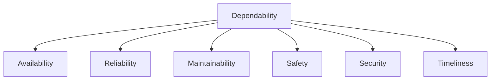
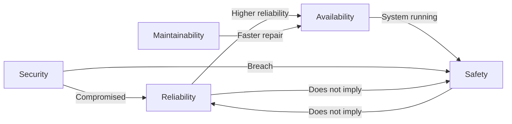
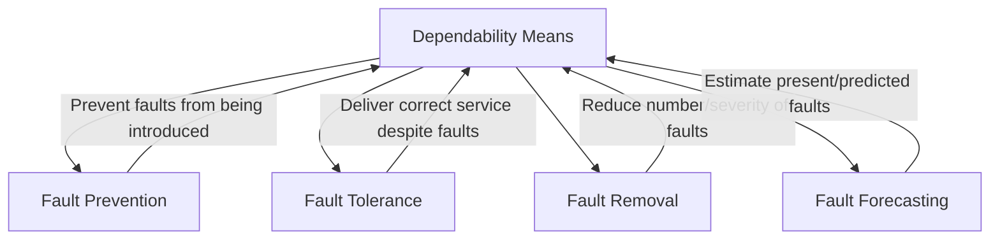
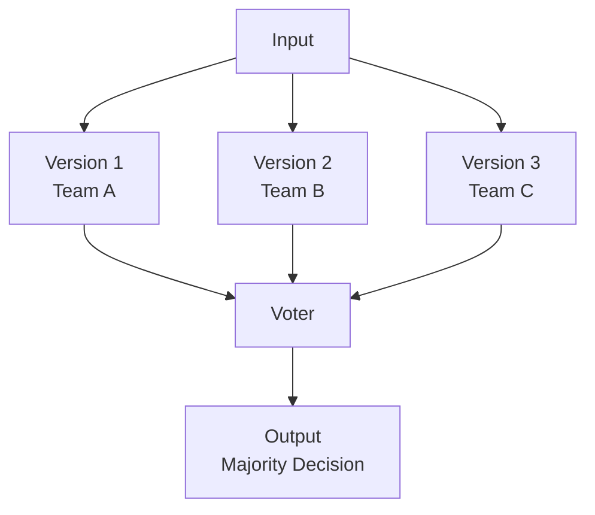
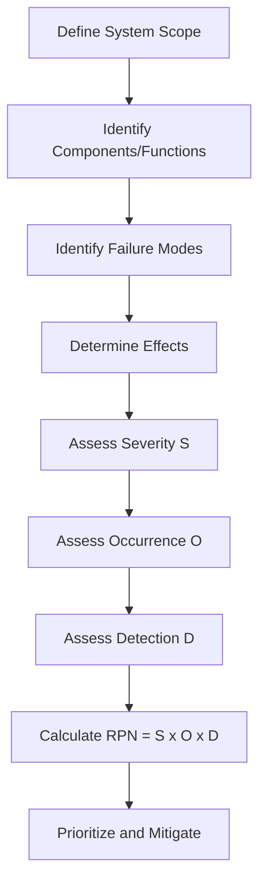
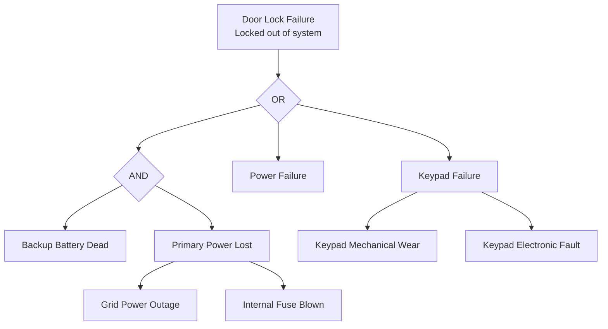
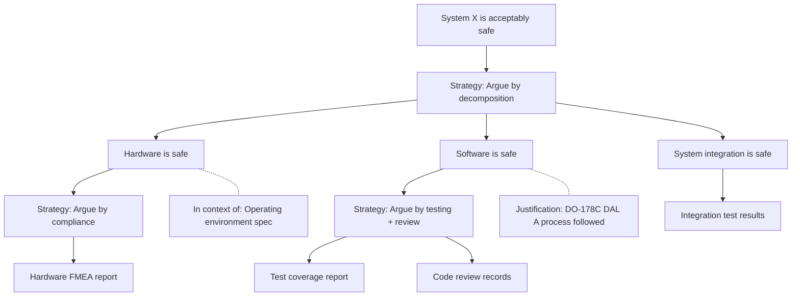

# Dependability and Safety

## Overview

Software dependability encompasses the ability of a system to deliver services that can justifiably be trusted. In safety-critical domains (aviation, medical, automotive, industrial), software failures can cause injury, death, or environmental damage. Dependability engineering applies rigorous methods to prevent, tolerate, remove, and forecast faults throughout the software lifecycle.

> [!important] Core Principle
> Dependability is not a single attribute but a composite of availability, reliability, maintainability, safety, and security, achieved through fault prevention, fault tolerance, fault removal, and fault forecasting.

## Dependability Attributes

### Attribute Definitions

| Attribute | Definition | Typical Metric | Focus |
|-----------|-----------|----------------|-------|
| **Availability** | Readiness of a system to deliver correct service | % uptime, availability ratio A = MTBF/(MTBF+MTTR) | Service continuity |
| **Reliability** | Continuity of correct service over time | MTBF, failure rate, reliability R(t) | Correct operation |
| **Maintainability** | Ability to undergo modifications and repairs | MTTR, mean time to restore | Ease of repair |
| **Safety** | Absence of catastrophic consequences on system and environment | Failure modes, hazard severity, integrity level | No harm |
| **Security** | Ability to protect against unauthorized access/data corruption | Vulnerabilities, attack surface, CVEs | Protection |
| **Timeliness** | Delivery of results within time constraints | Response time, deadline miss rate | Real-time |

### Interrelationships

> [!warning] Safety vs Reliability
> A system can be reliable but unsafe (consistently producing wrong but consistent outputs that cause harm). Conversely, a system can be safe but unreliable (failing frequently but always failing to a safe state). These are independent attributes.

## Dependability Means

Four complementary strategies for achieving dependability:

### Fault Prevention

Preventing faults from being introduced into the system.

| Technique | Description | Application |
|-----------|-------------|-------------|
| Formal specification | Mathematically precise requirements | Requirements errors |
| Strong typing | Type-safe programming languages | Type confusion errors |
| Design patterns | Proven solutions to recurring problems | Design errors |
| Coding standards | MISRA C/C++, CERT C, JSF++ | Implementation errors |
| Code review | Systematic peer inspection | All fault types |
| Static analysis | Automated code scanning | Bugs, security vulnerabilities |
| Model checking | Automated state-space exploration | Concurrency, logic errors |
| Process improvement | CMMI, ISO 9001 | Systematic fault prevention |

### Fault Tolerance

Delivering correct service despite the presence of faults.

| Mechanism | Description | Example |
|-----------|-------------|---------|
| **Redundancy** | Duplicated resources to mask failures | Triple Modular Redundancy (TMR) |
| **Diversity** | Different implementations of same function | N-version programming, diverse platforms |
| **Error detection** | Identifying errors before they cause failures | Watchdog timers, assertions, checksums |
| **Error recovery** | Restoring system to correct state | Rollback, forward recovery, retries |
| **Fault masking** | Hiding faults from external observers | Voting mechanisms, error-correcting codes |

**Redundancy types:**

| Type | Description | Benefit | Cost |
|------|-------------|---------|------|
| Hardware redundancy | Duplicate hardware components | Instant failover | Hardware cost, power, weight |
| Software redundancy | Multiple software versions (N-version) | Masks software bugs | Development cost, consistency issues |
| Information redundancy | Extra data for error detection/correction | Data integrity | Storage, processing overhead |
| Time redundancy | Re-execution of operations | Simple to implement | Latency increase |

**N-version programming:**

### Fault Removal

Reducing the number and severity of faults.

| Phase | Technique | Faults Targeted |
|-------|-----------|----------------|
| Requirements | Requirements inspection, formal verification | Requirements faults |
| Design | Design review, model checking | Design faults |
| Implementation | Code inspection, static analysis, unit testing | Coding faults |
| Testing | Integration, system, acceptance testing | Integration and system faults |
| Operation | Defect reporting, root cause analysis, patching | Residual faults |
| All phases | Formal verification | Logic and specification faults |

### Fault Forecasting

Estimating the present number, future incidence, and likely consequences of faults.

| Technique | Description | Output |
|-----------|-------------|--------|
| Reliability models | Statistical models of failure behavior | MTBF, failure rate predictions |
| FMEA | Systematic analysis of failure modes | Failure mode catalog with severity |
| FTA | Top-down deductive analysis | Fault tree with cut sets |
| Markov models | State-based reliability modeling | State probabilities over time |
| Reliability growth testing | Track defect discovery rate | Reliability trend |
| Stochastic Petri nets | Concurrent system modeling | Dependability metrics |

## Safety-Critical System Standards

### Standards Overview

| Standard | Domain | Key Focus | Integrity Levels |
|----------|--------|-----------|-----------------|
| **DO-178C** | Avionics | Airborne software | DAL A through E |
| **IEC 62304** | Medical devices | Medical device software | Class A, B, C |
| **ISO 26262** | Automotive | Road vehicle functional safety | ASIL A through D |
| **IEC 61508** | Industrial | Functional safety of E/E/PE systems | SIL 1 through 4 |
| **EN 50128** | Railway | Railway software | SIL 0 through 4 |
| **IEC 60880** | Nuclear | Nuclear power plant software | Class A, B, C |

### DO-178C (Avionics)

| Aspect | Detail |
|--------|--------|
| Full title | Software Considerations in Airborne Systems and Equipment Certification |
| Authority | RTCA (Radio Technical Commission for Aeronautics) / EUROCAE |
| Current version | DO-178C (2012); supplements: DO-330 (tool qualification), DO-331 (model-based), DO-332 (OO), DO-333 (formal methods) |
| Objective | Ensure software performs its intended function with a level of confidence consistent with safety |

**Design Assurance Levels (DAL):**

| DAL | Failure Condition | Objectives | Verification Rigor |
|-----|-------------------|------------|-------------------|
| **A** | Catastrophic | 71 objectives | MC/DC coverage, independence of reviews |
| **B** | Hazardous/Severe-Major | 69 objectives | Decision coverage, independence of reviews |
| **C** | Major | 62 objectives | Statement coverage |
| **D** | Minor | 26 objectives | Basic testing |
| **E** | No effect | 0 objectives | No specific software objectives |

**DO-178C Process Activities:**

**Modified Condition/Decision Coverage (MC/DC):**

| Coverage Criterion | Requirement | Example |
|-------------------|-------------|---------|
| Statement coverage | Every statement executed at least once | Simplest; DAL C |
| Decision coverage | Every decision outcome (T/F) exercised | DAL B |
| Condition coverage | Every boolean condition outcome exercised | Intermediate |
| MC/DC | Every condition independently affects decision outcome | DAL A; Gold standard for avionics |

### IEC 62304 (Medical Devices)

| Aspect | Detail |
|--------|--------|
| Full title | Medical device software - Software life cycle processes |
| Authority | IEC (International Electrotechnical Commission) |
| Scope | Software in medical devices and software as medical device (SaMD) |
| Key concept | Risk-based software classification drives process rigor |

**Software Safety Classes:**

| Class | Description | Process Requirements |
|-------|-------------|---------------------|
| **Class A** | No contribution to hazardous situation | Basic development process |
| **Class B** | Could contribute to non-serious injury | Defined development process with risk management |
| **Class C** | Could contribute to death or serious injury | Full development process with comprehensive verification |

**Key IEC 62304 Processes:**

| Process | Activities |
|---------|-----------|
| Software development planning | Lifecycle model, task assignments, verification planning |
| Software requirements analysis | Requirements specification, risk control measures |
| Software architectural design | Architecture, interfaces, SOUP (Software of Unknown Provenance) analysis |
| Software detailed design | Detailed design, design verification |
| Software unit implementation | Coding, unit verification, integration |
| Software integration and testing | Integration planning, integration testing |
| Software system testing | System testing against requirements |
| Software release | Release procedures, known anomalies documentation |
| Software maintenance | Change management, regression analysis |
| Risk management | Per ISO 14971, throughout lifecycle |
| Configuration management | Baselines, change control, traceability |

### ISO 26262 (Automotive)

| Aspect | Detail |
|--------|--------|
| Full title | Road vehicles - Functional safety |
| Authority | ISO (International Organization for Standardization) |
| Parts | 12 parts covering complete safety lifecycle |
| Key concept | Automotive Safety Integrity Level (ASIL) determines rigor |

**ASIL Determination:**

| | Severity | | |
|---|:---:|:---:|:---:|
| **Probability** | **S1 (No injuries)** | **S2 (Light/moderate)** | **S3 (Life-threatening)** |
| E1 (Very low) | QM | QM | ASIL A |
| E2 (Low) | QM | ASIL A | ASIL B |
| E3 (Medium) | ASIL A | ASIL B | ASIL C |
| E4 (High) | ASIL B | ASIL C | ASIL D |

- **QM**: Quality Management (no specific safety requirements)
- **ASIL A**: Lowest automotive safety integrity level
- **ASIL D**: Highest automotive safety integrity level

**ASIL Process Requirements:**

| Process Activity | ASIL A | ASIL B | ASIL C | ASIL D |
|-----------------|:------:|:------:|:------:|:------:|
| Requirements specification | ++ | ++ | ++ | ++ |
| Safety-oriented design | + | + | ++ | ++ |
| Architectural design verification | + | ++ | ++ | ++ |
| Unit testing (requirements-based) | + | ++ | ++ | ++ |
| Structural coverage (statement) | ++ | ++ | ++ | ++ |
| Structural coverage (branch) | + | ++ | ++ | ++ |
| Structural coverage (MC/DC) | - | - | + | ++ |
| Formal verification | - | + | + | ++ |
| Independence of verification | + | + | ++ | ++ |

`++` = highly recommended, `+` = recommended, `-` = not required

### IEC 61508 (Industrial Functional Safety)

| Aspect | Detail |
|--------|--------|
| Full title | Functional safety of electrical/electronic/programmable electronic safety-related systems |
| Parts | 7 parts covering general requirements to application guidelines |
| Key concept | Safety Integrity Level (SIL) for safety functions |

**Safety Integrity Levels:**

| SIL | PFD (Probability of Failure on Demand) | RRF (Risk Reduction Factor) | Typical Application |
|-----|---------------------------------------|---------------------------|-------------------|
| **1** | 0.01 to 0.1 | 10 to 100 | Simple process control |
| **2** | 0.001 to 0.01 | 100 to 1,000 | Standard industrial safety |
| **3** | 0.0001 to 0.001 | 1,000 to 10,000 | Critical process control |
| **4** | 0.00001 to 0.0001 | 10,000 to 100,000 | Nuclear, critical infrastructure |

## Integrity Level Standards Comparison

| Standard | Levels | Level 1 (Lowest) | Level 2 | Level 3 | Level 4 (Highest) |
|----------|:------:|:---:|:---:|:---:|:---:|
| IEC 61508 | SIL 1-4 | Basic rigor | Increased rigor | High rigor | Highest rigor |
| DO-178C | DAL E-A | (E) No effect | (D) Minor | (C) Major, (B) Hazardous | (A) Catastrophic |
| ISO 26262 | ASIL A-D | ASIL A | ASIL B | ASIL C | ASIL D |
| IEC 62304 | Class A-C | Class A (no hazard) | Class B (non-serious) | Class C (serious) | - |
| EN 50128 | SIL 0-4 | SIL 0 | SIL 1 | SIL 2-3 | SIL 4 |

## Analysis Techniques

### FMEA (Failure Modes and Effects Analysis)

FMEA is a systematic, bottom-up inductive analysis technique.

**Process:**

**FMEA Worksheet:**

| Component | Function | Failure Mode | Local Effect | System Effect | Severity (S) | Cause | Occurrence (O) | Current Controls | Detection (D) | RPN | Action |
|-----------|----------|-------------|-------------|---------------|:---:|---------|:---:|-----------------|:---:|:---:|--------|
| Pump | Move fluid | No flow | No fluid delivery | System shutdown | 8 | Motor failure | 3 | Flow sensor | 2 | 48 | Add redundant pump |
| Valve | Control flow | Stuck open | Uncontrolled flow | Overpressure | 9 | Corrosion | 4 | Pressure relief | 5 | 180 | Corrosion-resistant material |
| Sensor | Measure temp | Wrong reading | Incorrect data | Wrong control action | 6 | Drift | 5 | Calibration | 4 | 120 | Redundant sensors |

**RPN (Risk Priority Number):**
- RPN = Severity x Occurrence x Detection (range 1-1000)
- Higher RPN = higher priority for corrective action
- Typical thresholds: >200 (high priority), 100-200 (medium), <100 (low)

**FMEA Types:**

| Type | Focus | When Applied |
|------|-------|-------------|
| Design FMEA (DFMEA) | Product design failures | Design phase |
| Process FMEA (PFMEA) | Manufacturing process failures | Process design |
| System FMEA | System-level interactions | System architecture |
| Software FMEA | Software failure modes | Software design/code |

### FTA (Fault Tree Analysis)

FTA is a top-down, deductive analysis technique that traces failure events back to root causes.

**Fault Tree Elements:**

| Symbol | Gate/Event | Description |
|--------|-----------|-------------|
| Rectangle | Intermediate event | Event resulting from logic gate inputs |
| Circle | Basic event | Root cause or basic failure |
| AND gate | All inputs required | All child events must occur |
| OR gate | Any input sufficient | Any child event causes parent |
| Diamond | Undeveloped event | Event not further analyzed |
| House event | Normal event | Expected condition (switch on/off) |
| Transfer | Tree continuation | Connects to another fault tree |

**Example Fault Tree:**

**FTA vs FMEA Comparison:**

| Aspect | FMEA | FTA |
|--------|------|-----|
| Direction | Bottom-up (inductive) | Top-down (deductive) |
| Starting point | Component failure modes | Top-level undesired event |
| Logic | Implicit | Explicit (AND/OR gates) |
| Common cause failures | Not directly captured | Naturally included |
| Multiple failures | Hard to analyze | Naturally handles combinations |
| Cut sets | Not produced | Minimal cut sets identified |
| Automation | Spreadsheet-based | Specialized tools |
| Best for | Systematic component analysis | Critical event analysis |

### Safety Cases and Assurance Cases

A **safety case** is a structured argument, supported by evidence, that a system is acceptably safe for a given application in a given environment.

An **assurance case** generalizes this to any critical property (security, reliability, etc.).

**GSN (Goal Structuring Notation):**

| Element | Shape | Description |
|---------|-------|-------------|
| Goal | Rectangle | A claim to be supported |
| Strategy | Parallelogram | Method of decomposition |
| Solution | Circle | Evidence (leaf node) |
| Context | Rounded rectangle | Background information |
| Justification | Rounded rectangle (dashed) | Why strategy is valid |
| Assumption | Rounded rectangle (dashed) | Unverified claim |
| Supported by | Arrow | Decomposition link |
| In context of | Dashed arrow | Contextual link |

**GSN Example:**

**Safety case standards:**

| Standard | Description |
|----------|-------------|
| GS 0056 (UK MoD) | Safety management requirements for defense systems |
| IEC 61508 | Requires safety case for SIL 3+ systems |
| EUROCAE ED-109/DO-178C | Argument-based evidence for avionics certification |
| ISO 26262 Part 8 | Safety case requirements for automotive |

## Redundancy and Diversity

### Redundancy Approaches

| Approach | Description | Pros | Cons |
|----------|-------------|------|------|
| **Hot standby** | Redundant component runs in parallel, ready for instant failover | Zero downtime | Higher cost, power, complexity |
| **Warm standby** | Redundant component running but not processing | Fast failover | Some resource waste |
| **Cold standby** | Redundant component started on demand | Low resource usage | Delay during failover |
| **Triple Modular Redundancy (TMR)** | Three modules with voter | Masks single fault | 3x cost; voter is SPOF |
| **Pair-and-spare** | Two TMR pairs for higher reliability | Masks multiple faults | 6x cost |

### Diversity Approaches

| Approach | Description | Benefit | Challenge |
|----------|-------------|---------|-----------|
| N-version programming | Independent teams implement same spec | Different bugs in each version | Specification ambiguity affects all versions |
| Design diversity | Different algorithms for same function | Algorithmic fault tolerance | Common specification faults |
| Platform diversity | Run on different hardware/OS | Platform-specific faults masked | Portability, consistency issues |
| Language diversity | Implement in different languages | Language-specific faults masked | Integration complexity |
| Data diversity | Use different data representations | Data-related faults masked | Re-encoding overhead |

> [!warning] Diversity Limitation
> Empirical studies show that independently developed versions often share common faults, especially from ambiguous specifications. Diversity reduces but does not eliminate correlated failures.

## Formal Verification for Safety

### Formal Methods Spectrum

| Level | Technique | Rigor | Cost | Application |
|-------|-----------|-------|------|-------------|
| 1 | Formal specification | High | Medium | Requirements precision |
| 2 | Formal refinement | Higher | High | Design correctness |
| 3 | Theorem proving | Highest | Very high | Safety-critical proofs |
| 4 | Model checking | High | Medium-High | Finite-state verification |
| 5 | Static analysis (sound) | Medium-High | Low-Medium | Automated properties |
| 6 | Abstract interpretation | Medium | Low | Runtime error detection |

### Formal Methods in Standards

| Standard | Formal Methods Support | Status |
|----------|----------------------|--------|
| DO-333 | Formal methods supplement to DO-178C | Accepted for certification credit |
| IEC 61508 Part 3 | Recommended for SIL 3-4 | Table entry for formal methods |
| ISO 26262 Part 6 | Recommended for ASIL C-D | Increasing adoption |
| Common Criteria | Formal models at EAL 6-7 | Highest assurance levels |

### Key Formal Verification Techniques

| Technique | What It Proves | Tools | Limitations |
|-----------|---------------|-------|-------------|
| Model checking | Property holds for all reachable states | SPIN, NuSMV, UPPAAL | State space explosion |
| Theorem proving | Mathematical theorems about system properties | Isabelle, Coq, PVS | Requires expertise, manual effort |
| Static analysis | Absence of runtime errors, security flaws | Astrée, Polyspace, Frama-C | False positives possible |
| Abstract interpretation | Sound over-approximation of program behaviors | Astrée | May be imprecise |

## Dependability Engineering Process

```mermaid
graph LR
    subgraph Design Phase
        HA[Hazard Analysis] --> SR[Safety Requirements]
        SR --> SA[Safety Architecture]
        SA --> FI[Fault Injection Design]
    end
    subgraph Implementation Phase
        FI --> CD[Coding with Standards]
        CD --> ST[Static Analysis]
        ST --> UT[Unit Testing with Coverage]
    end
    subgraph Verification Phase
        UT --> IT[Integration Testing]
        IT --> FT[Fault Tolerance Testing]
        FT --> FA[Formal Analysis]
    end
    subgraph Certification Phase
        FA --> SC[Safety Case]
        SC --> CE[Certification Evidence]
    end
```

## Practical Application: Choosing the Right Approach

| System Characteristic | Recommended Approach |
|----------------------|---------------------|
| Non-critical (no safety impact) | Standard testing, basic quality processes |
| Minor injury possible (SIL 1, DAL D, ASIL A) | Defined process, requirements-based testing |
| Serious injury possible (SIL 2, DAL C, ASIL B) | Rigorous verification, structural coverage |
| Life-threatening (SIL 3, DAL B, ASIL C) | Comprehensive verification, MC/DC, formal methods recommended |
| Catastrophic (SIL 4, DAL A, ASIL D) | Highest rigor, formal verification, redundancy, diversity, independence |

## Summary

Dependability engineering ensures software systems can be trusted in critical applications. The five dependability attributes (availability, reliability, maintainability, safety, security) are pursued through four means (fault prevention, tolerance, removal, forecasting). Safety-critical standards (DO-178C, IEC 62304, ISO 26262, IEC 61508) define integrity levels that determine required rigor. Analysis techniques (FMEA, FTA, safety cases) provide structured assurance. Formal verification and diverse redundancy provide the highest confidence for the most critical systems.
