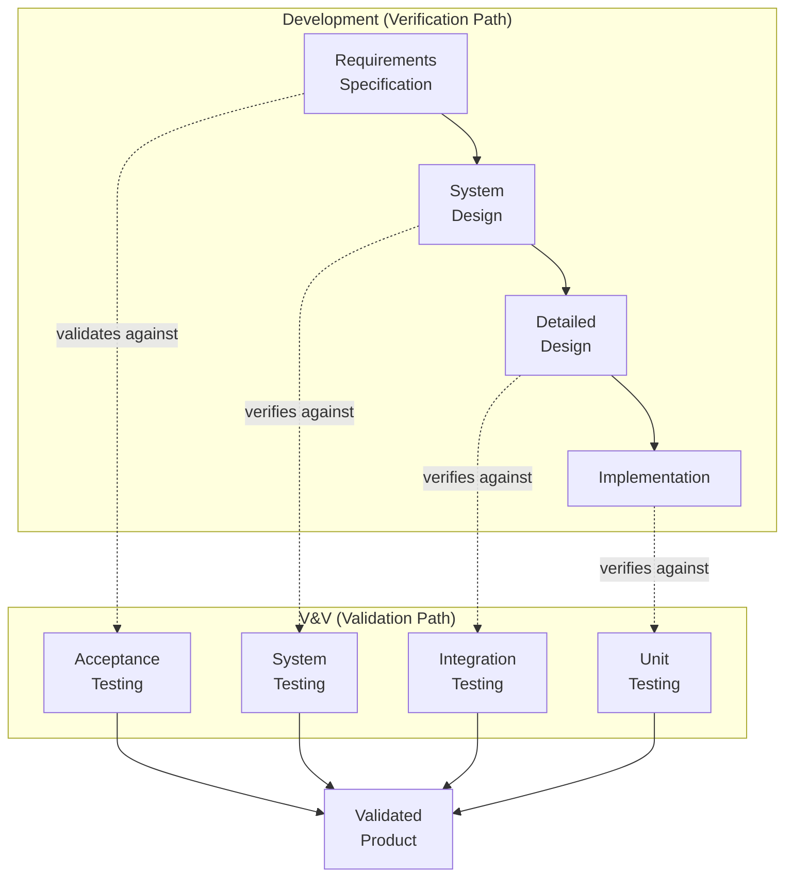
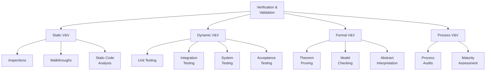
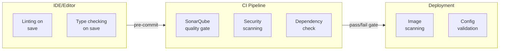
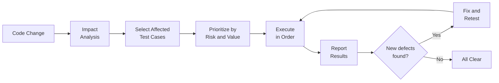

# Verification and Validation

> Verification asks "Are we building the product right?" Validation asks "Are we building the right product?" Together, V&V provides the confidence that software meets its specification and satisfies stakeholder needs. V&V is broader than testing; it encompasses static analysis, reviews, formal methods, and every activity that contributes to software quality assurance.

## 1. V&V Fundamentals

### 1.1 Definitions

The distinction between verification and validation was formalized by Boehm (1979):

| Term | Question | Focus | Activities |
|---|---|---|---|
| **Verification** | Are we building the product right? | Conformance to specification | Reviews, static analysis, testing against requirements |
| **Validation** | Are we building the right product? | Fitness for intended use | User acceptance testing, prototyping, field testing |

> [!important] The distinction matters because you can verify a product against a specification perfectly and still have the wrong product if the specification was wrong. Verification without validation is a recipe for building what was asked for, not what was needed.

### 1.2 The V-Model Mapping

The V-model maps verification and validation activities to each development phase:

```
Requirements Specification    ←───────────────────→  Acceptance Testing
        ↓                                                    ↑
System Design                 ←───────────────────→  System Testing
        ↓                                                    ↑
Detailed Design               ←───────────────────→  Integration Testing
        ↓                                                    ↑
Implementation                ←───────────────────→  Unit Testing
```

| Left Side (Development) | Right Side (V&V) | Relationship |
|---|---|---|
| Requirements Specification | Acceptance Testing | Validates that built system meets user needs |
| System Design | System Testing | Verifies system design against requirements |
| Detailed Design | Integration Testing | Verifies component interactions against design |
| Implementation | Unit Testing | Verifies code against detailed design |



### 1.3 V&V Is Broader Than Testing

Testing is the most visible V&V activity, but V&V encompasses much more:

| Category | Activities | When Applied |
|---|---|---|
| **Static V&V** | Inspections, walkthroughs, reviews, static code analysis, formal verification | Before execution; any phase |
| **Dynamic V&V** | Testing (unit, integration, system, acceptance) | Requires executable code |
| **Formal V&V** | Theorem proving, model checking, abstract interpretation | Requires formal specifications |
| **Process V&V** | Process audits, maturity assessments | Throughout lifecycle |



---

## 2. Static V&V Techniques

Static V&V analyzes software artifacts **without executing them**. The earlier a defect is found, the cheaper it is to fix; static techniques can find defects in requirements and design documents before code even exists.

### 2.1 Inspections (Fagan Inspections)

Michael Fagan introduced the formal inspection process at IBM in 1976. It remains the most rigorous static V&V technique:

| Phase | Activities | Participants |
|---|---|---|
| **Planning** | Select material, assign roles, schedule meeting | Moderator |
| **Overview** | Author explains the material and context | Author to inspection team |
| **Preparation** | Each inspector reviews individually, notes defects | All inspectors (independently) |
| **Inspection Meeting** | Walk through material line by line; inspectors raise defects; recorder logs them | Full team |
| **Rework** | Author fixes logged defects | Author |
| **Follow-up** | Moderator verifies all defects were addressed | Moderator |

**Roles in Fagan Inspection:**

| Role | Responsibility |
|---|---|
| **Moderator** | Facilitates the process; ensures preparation; runs the meeting; verifies rework |
| **Author** | Created the material; explains context; performs rework |
| **Reader** | Paraphrases/reads the material during the meeting; guides the walkthrough |
| **Recorder** | Logs all defects found; classifies them by type and severity |
| **Inspector** | Reviews material; identifies defects (all participants except author are inspectors) |

**Inspection Metrics:**

| Metric | Typical Range | Purpose |
|---|---|---|
| **Inspection rate** | 100-200 LOC/hour for code; 5-10 pages/hour for documents | Controls thoroughness |
| **Defect density** | 1-5 defects/100 LOC (early phases); 0.5-2/100 LOC (later phases) | Measures code quality |
| **Defect detection rate (DDR)** | 40-80% of defects in inspected artifact | Measures inspection effectiveness |
| **Rework effort** | 1-3 hours per defect found | Estimates correction cost |

> [!tip] Fagan inspections consistently find 40-80% of defects in the inspected artifact. Studies show they are 5-10x more cost-effective than testing for finding certain defect types (especially interface errors, missing functionality, and standards violations).

### 2.2 Walkthroughs

Walkthroughs are less formal than inspections:

| Aspect | Inspection | Walkthrough |
|---|---|---|
| **Formality** | Formal process with defined roles | Informal; author-led |
| **Preparation** | Mandatory individual preparation | Optional |
| **Defect logging** | Systematic recording | Ad hoc notes |
| **Follow-up** | Moderator verifies rework | Informal verification |
| **Effectiveness** | Higher defect detection (50-80%) | Lower defect detection (30-50%) |
| **Cost** | Higher (more preparation time) | Lower |
| **Best for** | Critical artifacts (safety, security) | Routine code reviews, design discussions |

### 2.3 Technical Reviews

Technical reviews fall between inspections and walkthroughs in formality:

| Type | Description | Participants |
|---|---|---|
| **Peer review** | One or two colleagues review work product | 2-3 people |
| **Team review** | Entire team reviews a design or decision | Team + lead |
| **Architecture review** | Senior engineers evaluate architectural decisions | Architecture board |
| **Design review** | Evaluate design against requirements | Design team + stakeholders |
| **Code review** | Review code changes before merging | 1-2 reviewers (often via pull request) |

### 2.4 Desk Checking

Desk checking is the simplest static technique: the author reviews their own work:

| Technique | Description | Limitation |
|---|---|---|
| **Self-review** | Author reads through own code/document | Author's own blind spots |
| **Dry run** | Author manually traces execution with sample data | Limited to selected test cases |
| **Proofreading** | Check for syntax, formatting, consistency | Does not catch logical errors |

> Desk checking is the least effective V&V technique because authors tend to see what they intended, not what they wrote. It should be a supplement to, not a replacement for, peer review.

### 2.5 Static Code Analysis

Static code analysis tools automatically analyze source code without executing it:

| Tool Category | What It Detects | Examples |
|---|---|---|
| **Linters** | Style violations, common mistakes, suspicious patterns | ESLint, Pylint, RuboCop, Checkstyle, Clippy |
| **Type checkers** | Type errors, null safety, interface violations | TypeScript, mypy, Flow, Kotlin null safety |
| **Bug finders** | Null dereferences, resource leaks, race conditions, buffer overflows | SpotBugs, Error Prone, Infer, SonarQube |
| **Security analyzers** | SQL injection, XSS, insecure crypto, hard-coded secrets | Semgrep, Bandit, Brakeman, CodeQL |
| **Code quality metrics** | Cyclomatic complexity, coupling, cohesion, code duplication | SonarQube, CodeClimate, NDepend |
| **Dependency scanners** | Known vulnerabilities in dependencies | Dependabot, Snyk, OWASP Dependency-Check |
| **Formal static analysis** | Proves absence of certain defect classes (sound analysis) | Astr ee, Polyspace, CBMC, Frama-C |

**Static Analysis Integration Points:**



**Quality Gate Thresholds (Example from SonarQube):**

| Metric | Threshold | Consequence |
|---|---|---|
| New code coverage | >= 80% | Block merge if below |
| New duplicated lines | <= 3% | Block merge if above |
| New maintainability rating | A | Block merge if B or worse |
| New reliability rating | A | Block merge if B or worse |
| New security rating | A | Block merge if C or worse |
| New security hotspots reviewed | 100% | Block merge if unreviewed |

---

## 3. Dynamic V&V Techniques

Dynamic V&V requires **executing the software** and observing its behavior. See [[05_Software_Testing]] for detailed test design techniques; this section covers V&V-specific aspects.

### 3.1 Testing Levels

| Level | What It Tests | Who Performs | When | Environment |
|---|---|---|---|---|
| **Unit Testing** | Individual functions, methods, classes | Developers | During implementation | Local/CI, mocked dependencies |
| **Integration Testing** | Interfaces between components | Developers/testers | After unit testing | Test environment, partial mocks |
| **System Testing** | Complete system against requirements | QA team | After integration | Staging environment |
| **Acceptance Testing** | System against business needs | Users/stakeholders | After system testing | Production-like environment |

### 3.2 Test Design Techniques (Overview)

| Category | Techniques | See |
|---|---|---|
| **Black-box** | Equivalence partitioning, boundary value analysis, decision tables, state transition, use case testing | [[05_Software_Testing]] |
| **White-box** | Statement coverage, branch coverage, path coverage, data flow coverage, mutation testing | [[05_Software_Testing]] |
| **Experience-based** | Error guessing, exploratory testing, checklist-based testing | [[05_Software_Testing]] |

### 3.3 Non-Functional Testing

| Test Type | What It Validates | Techniques |
|---|---|---|
| **Performance testing** | Response time, throughput, resource usage | Load testing, stress testing, endurance testing, spike testing |
| **Security testing** | Resistance to attack | Penetration testing, fuzz testing, vulnerability scanning |
| **Usability testing** | Ease of use | User testing, heuristic evaluation, cognitive walkthrough |
| **Compatibility testing** | Works across environments | Cross-browser testing, cross-device testing, backward compatibility |
| **Reliability testing** | Failure rates, recovery | Fault injection, chaos engineering, MTBF measurement |
| **Accessibility testing** | Usable by people with disabilities | Screen reader testing, keyboard testing, automated WCAG scanning |

### 3.4 Regression Testing

Regression testing verifies that changes have not introduced new defects:

| Strategy | Description | Trade-off |
|---|---|---|
| **Retest all** | Run entire test suite | Thorough but slow; high cost |
| **Test selection** | Run only tests affected by changes | Faster; risk of missing interactions |
| **Test prioritization** | Run highest-value tests first | Maximizes early defect detection; may not complete full suite |
| **Test minimization** | Remove redundant tests | Reduces suite size; risk of removing useful tests |



---

## 4. Formal V&V Techniques

Formal V&V uses **mathematical methods** to prove properties about software. It provides the strongest guarantees but requires formal specifications and specialized expertise.

### 4.1 Theorem Proving

| Aspect | Description |
|---|---|
| **What it does** | Proves that a program satisfies a formal specification using logical deduction |
| **Approach** | Model the program and specification in a formal logic; construct a mathematical proof |
| **Tools** | Isabelle/HOL, Coq, Lean, ACL2, PVS |
| **Strengths** | Can prove arbitrary properties; handles infinite state spaces; produces machine-checked proofs |
| **Weaknesses** | Requires significant expertise; proofs are labor-intensive; specification must be formal |
| **Applications** | Compiler correctness (CompCert), OS kernel verification (seL4), cryptographic protocol verification |

> [!note] The seL4 microkernel is a landmark achievement: it is the world's first operating system kernel with a complete, formal, machine-checked proof of functional correctness. The proof guarantees that the C implementation correctly implements its formal specification, ruling out entire classes of bugs.

### 4.2 Model Checking

| Aspect | Description |
|---|---|
| **What it does** | Exhaustively explores all states of a finite-state model to verify temporal properties |
| **Approach** | Build a finite-state model of the system; express desired properties in temporal logic (CTL, LTL); algorithmically check all states |
| **Tools** | SPIN, NuSMV, UPPAAL, TLA+, CBMC |
| **Strengths** | Fully automatic; produces counterexamples when properties are violated; handles concurrency well |
| **Weaknesses** | State space explosion for large systems; requires abstraction to finite-state model |
| **Applications** | Protocol verification, concurrent algorithm verification, hardware verification |

**State Space Explosion Example:**

| System Components | States per Component | Total States |
|---|---|---|
| 10 boolean variables | 2 | 1,024 |
| 20 boolean variables | 2 | 1,048,576 |
| 30 boolean variables | 2 | 1,073,741,824 |
| 10 components with 100 states each | 100 | 10^20 |

> Model checkers handle state space explosion through **abstraction** (reducing the model), **symbolic representation** (BDDs, SAT/SMT), and **partial order reduction** (avoiding redundant interleavings).

### 4.3 Abstract Interpretation

| Aspect | Description |
|---|---|
| **What it does** | Soundly approximates program behavior to prove properties about all possible executions |
| **Approach** | Define abstract domains (e.g., sign, interval, polyhedra); execute the program abstractly over these domains |
| **Tools** | Astr ee, Polyspace, Infer, CBMC |
| **Strengths** | Fully automatic; sound (no false negatives for the verified property); scalable to large codebases |
| **Weaknesses** | May produce false positives (imprecise abstractions); limited to properties expressible in the abstract domain |
| **Applications** | Runtime error detection (division by zero, buffer overflow, integer overflow), embedded systems (Airbus fly-by-wire) |

> [!important] Astr ee static analyzer has been used to verify the absence of runtime errors in Airbus fly-by-wire software since 2003. It proved the absence of any runtime error in the primary flight control software of the Airbus A380, A350, and A400M.

### 4.4 Comparison of Formal V&V Techniques

| Property | Theorem Proving | Model Checking | Abstract Interpretation |
|---|---|---|---|
| **Automation** | Semi-interactive | Fully automatic | Fully automatic |
| **Expressiveness** | Any property | Temporal properties | Domain-specific properties |
| **Scalability** | Small-medium programs | Small-medium state spaces | Large codebases |
| **Soundness** | Sound (if proof is correct) | Sound (for finite model) | Sound (for abstract domain) |
| **Counterexamples** | No (proof only) | Yes (counterexample trace) | No (abstract results) |
| **Expertise required** | Very high | High | Medium |
| **Typical use** | Critical systems, kernels | Protocols, concurrent algorithms | Embedded, safety-critical code |

---

## 5. V&V Planning

### 5.1 IEEE 1012: Standard for V&V

IEEE 1012 defines the processes and documentation for software V&V:

| Element | Description |
|---|---|
| **Purpose** | Define the scope, approach, and resources for V&V activities |
| **Applicability** | All software, regardless of size, complexity, or criticality |
| **V&V processes** | Organized by lifecycle phase: management, acquisition, supply, development, operation, maintenance |
| **Independence levels** | Defines levels of organizational independence for V&V |

### 5.2 V&V Independence Levels

Independence refers to the organizational separation between the V&V team and the development team:

| Level | Description | When Required |
|---|---|---|
| **Level 0** | No independence; developer performs own V&V | Low-criticality software |
| **Level 1** | V&V performed by different person, same team | Medium-criticality software |
| **Level 2** | V&V performed by different group, same organization | High-criticality software |
| **Level 3** | V&V performed by different organization | Safety-critical, mission-critical software |
| **Level 4** | V&V performed by certified independent organization | Regulatory requirements (FDA, FAA, nuclear) |

> [!warning] Independence level 0 (developer self-testing) is the most common but least effective. Developers share the same mental models and blind spots as the code they wrote. Independence is the single most important factor in V&V effectiveness.

### 5.3 V&V Activities per Lifecycle Phase

| Phase | Verification Activities | Validation Activities |
|---|---|---|
| **Requirements** | Requirements review, consistency check, traceability analysis | User needs analysis, prototyping, requirements validation workshops |
| **Design** | Design review, interface analysis, design traceability | Design walkthroughs with users, usability analysis |
| **Implementation** | Code review, static analysis, unit testing | Code-level validation against user scenarios |
| **Integration** | Integration testing, interface testing | End-to-end workflow validation |
| **System** | System testing against requirements specification | System validation against user needs |
| **Deployment** | Installation verification, configuration review | User acceptance testing, beta testing |
| **Maintenance** | Regression testing, change impact analysis | Re-validation after changes, field data analysis |

### 5.4 V&V Plan Structure (IEEE 1012)

| Section | Contents |
|---|---|
| **1. Purpose** | Scope, objectives, constraints |
| **2. Referenced Documents** | Applicable standards, project documents |
| **3. Definitions** | Terms and acronyms |
| **4. V&V Overview** | Organization, lifecycle, activities summary |
| **5. V&V Processes** | Detailed activities for each lifecycle phase |
| **6. V&V Reporting** | Reports, metrics, anomaly tracking |
| **7. V&V Administrative** | Staffing, training, tools, schedules |
| **8. V&V Resource Requirements** | Hardware, software, facilities |

---

## 6. Relationship Between V&V and Quality

### 6.1 V&V and Quality Models

V&V activities directly contribute to software quality characteristics:

| Quality Characteristic (ISO 25010) | V&V Activities That Address It |
|---|---|
| **Functional Suitability** | Requirements validation, acceptance testing, model checking |
| **Performance Efficiency** | Performance testing, profiling, static analysis of algorithm complexity |
| **Compatibility** | Integration testing, compatibility testing, interface reviews |
| **Usability** | Usability testing, accessibility testing, UX reviews |
| **Reliability** | Fault tolerance testing, chaos engineering, formal verification |
| **Security** | Security testing, penetration testing, security code review, formal verification |
| **Maintainability** | Code review, static analysis (complexity, duplication), architecture review |
| **Portability** | Cross-platform testing, configuration testing, build verification |

### 6.2 Cost of Defect Detection by Phase

The cost of finding and fixing defects increases exponentially with the phase in which they are found:

| Phase Found | Relative Cost to Fix | V&V Technique |
|---|---|---|
| Requirements | 1x | Requirements review, prototyping |
| Design | 3-6x | Design review, architecture review |
| Implementation | 10x | Code review, static analysis, unit testing |
| Integration | 15-40x | Integration testing |
| System Testing | 30-70x | System testing |
| Acceptance Testing | 40-100x | Acceptance testing |
| Post-Release | 100-1000x | Field support, hotfixes, recalls |

> [!important] This cost curve is the primary economic justification for investing in early V&V activities (inspections, static analysis, formal methods). Finding a defect in requirements review costs 1x; finding the same defect after release costs 100-1000x. V&V is not an expense; it is an investment with measurable ROI.

### 6.3 V&V Metrics

| Metric | Formula | Purpose |
|---|---|---|
| **Defect Detection Rate (DDR)** | Defects found by V&V / Total defects in artifact | Effectiveness of V&V technique |
| **Defect Density** | Defects / Size (KLOC, function points) | Quality of artifact |
| **Defect Removal Efficiency (DRE)** | Defects removed before release / Total defects | Overall V&V effectiveness |
| **Cost of Quality** | (Prevention + Appraisal + Failure costs) / Total project cost | Economic efficiency |
| **Test Coverage** | Covered items / Total items (statements, branches, requirements) | Completeness of dynamic V&V |
| **Inspection Efficiency** | Defects found per inspection hour | Productivity of static V&V |

---

## 7. Cross-Reference Summary

| Topic | Related Note |
|---|---|
| Quality fundamentals and models | [[01_Quality_Fundamentals]] |
| Pre-project quality planning | [[02_Pre_Project_and_Planning]] |
| Reviews and inspections in detail | [[03_Reviews_and_Infrastructure]] |
| Quality metrics | [[04_Metrics_and_Quality_Costs]] |
| Quality standards (IEEE 1012, ISO) | [[05_Standards_and_Organization]] |
| Software testing techniques | [[05_Software_Testing]] |
| Quality overview | [[Software Quality Overview]] |

---

## Key Takeaways

1. **Verification and validation are distinct but complementary.** Verification checks conformance to specification; validation checks fitness for purpose. Both are necessary.
2. **V&V is broader than testing.** Static techniques (inspections, walkthroughs, static analysis) and formal methods (theorem proving, model checking, abstract interpretation) can find defects earlier and more cheaply than testing.
3. **The V-model maps development phases to V&V phases.** Each development activity has a corresponding V&V activity that validates it.
4. **Fagan inspections find 40-80% of defects** at a fraction of the cost of testing. They are the most cost-effective static V&V technique.
5. **Formal V&V provides mathematical guarantees** but requires formal specifications and specialized expertise. It is used in safety-critical domains (fly-by-wire, OS kernels, cryptographic protocols).
6. **V&V planning (IEEE 1012) is essential.** Independence levels, lifecycle coverage, and resource allocation must be planned, not improvised. The cost of defects found late in the lifecycle is 100-1000x the cost of defects found early.
