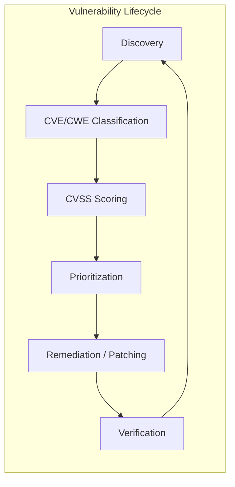
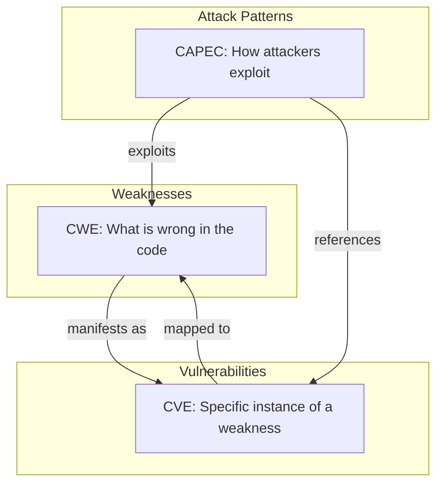
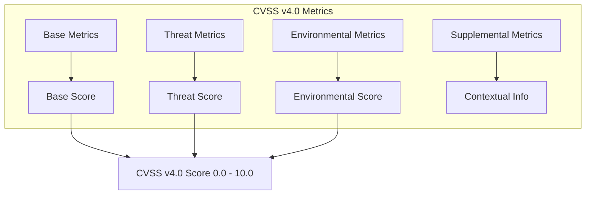
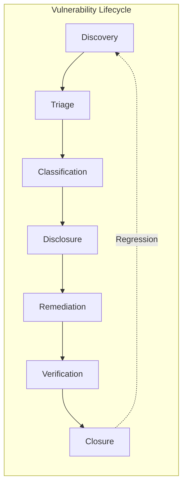
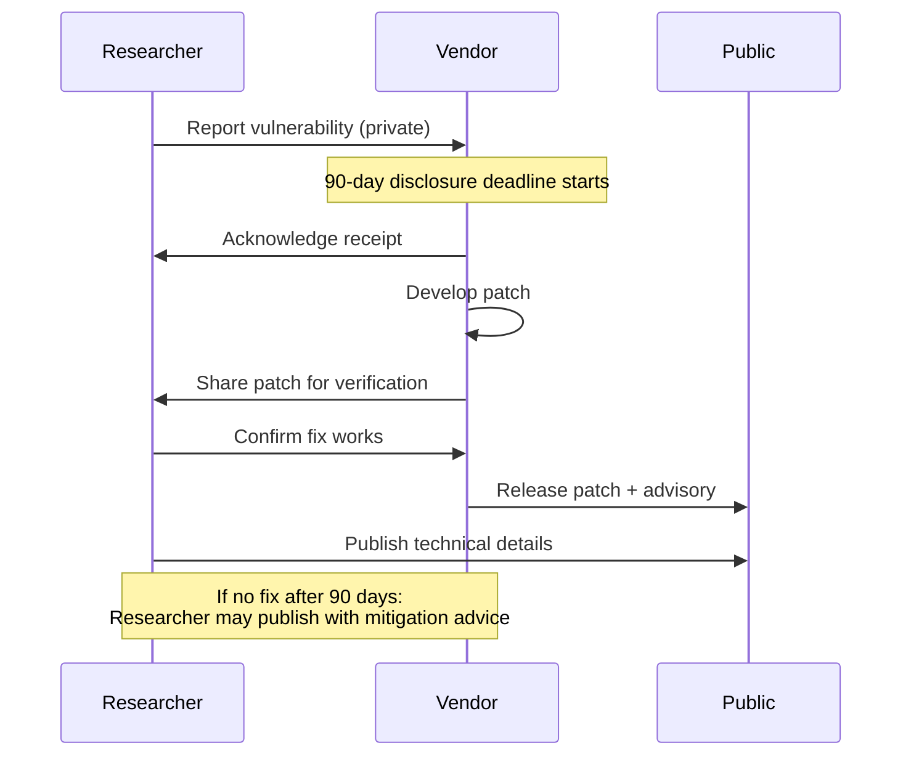
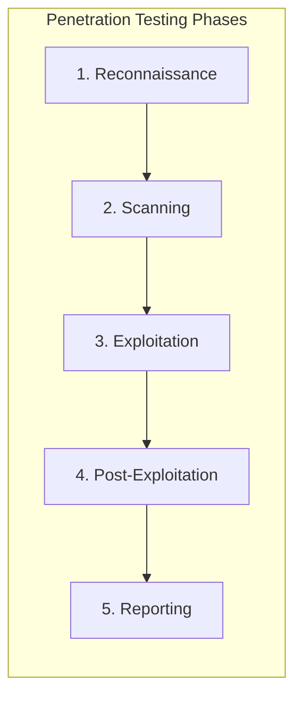

---
tags:
  - software-engineering
  - swebok
  - ka13
  - software-security
  - vulnerability-management
  - cve
  - cvss
  - penetration-testing
source: "SWEBOK v4 Chapter 13"
created: 2026-07-21
---

# 07 Vulnerability Management

> *You cannot defend what you do not know. Vulnerability management is the systematic process of finding, classifying, prioritizing, and remediating security weaknesses before adversaries exploit them.*

---

## 1. Overview

Vulnerability management encompasses the entire lifecycle from discovery through remediation verification. SWEBOK KA 13.4-13.5 addresses the standards, taxonomies, scoring systems, and operational processes that form the backbone of enterprise vulnerability programs.



---

## 2. CVE: Common Vulnerabilities and Exposures

### 2.1 What Is CVE?

CVE is a standardized identifier system for publicly known cybersecurity vulnerabilities, maintained by MITRE Corporation and sponsored by CISA (Cybersecurity and Infrastructure Security Agency).

| Component | Description |
|-----------|-------------|
| **Identifier** | CVE-YYYY-NNNNN (e.g., CVE-2024-3094) |
| **Assigner** | CVE Numbering Authority (CNA) that issued the ID |
| **Description** | Brief text description of the vulnerability |
| **References** | Links to advisories, patches, advisories |
| **Status** | Reserved, Assigned, Published, Rejected |

### 2.2 CVE Naming Convention

```
CVE - 2024 - 3094
 |      |      |
 |      |      └── Sequential number (4-7+ digits)
 |      └── Year of assignment or publication
 └── Common Vulnerabilities and Exposures prefix
```

### 2.3 CVE Ecosystem

```mermaid
graph TB
    subgraph "CVE Ecosystem"
        MITRE[MITRE CVE Program] --> CNA1[CNA: Vendor (e.g., Microsoft)]
        MITRE --> CNA2[CNA: CERT (e.g., CERT/CC)]
        MITRE --> CNA3[CNA: Researcher]
        CNA1 --> NVD[NVD: NIST National Vulnerability Database]
        CNA2 --> NVD
        CNA3 --> NVD
        NVD --> ENR[Enrichment: CVSS, CWE, references]
        ENR --> CONSUMERS[Security Tools, Scanners, SIEMs]
    end
```

| Source | Role | URL |
|--------|------|-----|
| **MITRE CVE** | Program owner, assigns CVE IDs | cve.mitre.org |
| **NVD (NIST)** | Enriches CVEs with CVSS, CWE, CPE | nvd.nist.gov |
| **CISA KEV** | Known Exploited Vulnerabilities catalog | cisa.gov/known-exploited-vulnerabilities |
| **GitHub Advisory DB** | Community-sourced, GHSA-YYYY-NNNN | github.com/advisories |

### 2.4 CVE Limitations

- **Coverage gaps:** Not all vulnerabilities receive CVE IDs; some vendors are slow to assign
- **Delay:** Average time from discovery to published CVE can be weeks or months
- **Duplicate IDs:** Same vulnerability sometimes assigned multiple CVEs
- **No prioritization:** CVE itself provides no severity information (that is CVSS's role)
- **Scope ambiguity:** Unclear whether related bugs should be one CVE or multiple

---

## 3. CWE: Common Weakness Enumeration

### 3.1 What Is CWE?

CWE is a taxonomy of software and hardware **weakness types** — the underlying flaws that lead to vulnerabilities. While CVE identifies specific instances, CWE classifies the *category* of weakness.

| Concept | CVE | CWE |
|---------|-----|-----|
| **What it identifies** | Specific vulnerability instance | Weakness type/category |
| **Example** | CVE-2021-44228 (Log4Shell) | CWE-502 (Deserialization of Untrusted Data) |
| **Count** | 200,000+ published CVEs | ~900 CWE entries |
| **Maintained by** | MITRE | MITRE |

### 3.2 CWE Hierarchy

CWE organizes weaknesses in a hierarchical taxonomy:

```
CWE-664: Improper Control of a Resource Through its Lifetime
├── CWE-416: Use After Free
├── CWE-415: Double Free
└── CWE-772: Missing Release of Resource after Effective Lifetime

CWE-707: Improper Neutralization
├── CWE-79: Cross-Site Scripting (XSS)
│   ├── CWE-79.1: Reflected XSS
│   ├── CWE-79.2: Stored XSS
│   └── CWE-79.3: DOM-based XSS
├── CWE-89: SQL Injection
├── CWE-78: OS Command Injection
└── CWE-94: Code Injection
```

### 3.3 CWE Top 25 Most Dangerous Weaknesses (2024)

| Rank | CWE | Weakness | Type |
|------|-----|----------|------|
| 1 | CWE-79 | Cross-Site Scripting | Injection |
| 2 | CWE-787 | Out-of-bounds Write | Memory |
| 3 | CWE-89 | SQL Injection | Injection |
| 4 | CWE-416 | Use After Free | Memory |
| 5 | CWE-78 | OS Command Injection | Injection |
| 6 | CWE-20 | Improper Input Validation | Input |
| 7 | CWE-125 | Out-of-bounds Read | Memory |
| 8 | CWE-22 | Path Traversal | File |
| 9 | CWE-352 | Cross-Site Request Forgery | Web |
| 10 | CWE-434 | Unrestricted File Upload | File |
| 11 | CWE-862 | Missing Authorization | Auth |
| 12 | CWE-863 | Incorrect Authorization | Auth |
| 13 | CWE-798 | Use of Hard-coded Credentials | Crypto |
| 14 | CWE-306 | Missing Auth for Critical Function | Auth |
| 15 | CWE-190 | Integer Overflow | Memory |
| 16 | CWE-502 | Deserialization of Untrusted Data | Injection |
| 17 | CWE-287 | Improper Authentication | Auth |
| 18 | CWE-476 | NULL Pointer Dereference | Memory |
| 19 | CWE-732 | Incorrect Permission Assignment | Permissions |
| 20 | CWE-94 | Code Injection | Injection |
| 21 | CWE-611 | XXE (XML External Entity) | Injection |
| 22 | CWE-918 | SSRF (Server-Side Request Forgery) | Web |
| 23 | CWE-77 | Command Injection | Injection |
| 24 | CWE-119 | Buffer Overflow | Memory |
| 25 | CWE-269 | Improper Privilege Management | Permissions |

### 3.4 Relationship Between CVE, CWE, and CAPEC



---

## 4. CAPEC: Common Attack Pattern Enumeration and Classification

### 4.1 What Is CAPEC?

CAPEC is a catalog of common attack patterns maintained by MITRE. While CWE describes what is wrong, CAPEC describes how attackers exploit those weaknesses.

| Concept | Focus | Example |
|---------|-------|---------|
| **CWE** | The flaw | CWE-89: SQL Injection (missing input sanitization) |
| **CAPEC** | The attack | CAPEC-66: SQL Injection (injecting SQL via user input) |
| **CVE** | The instance | CVE-2024-1234: SQLi in Product X v2.1 |

### 4.2 CAPEC Attack Pattern Categories

| Category | ID Range | Example Pattern |
|----------|----------|-----------------|
| **Engage in Deceptive Interactions** | 1-99 | CAPEC-98: Phishing |
| **Abuse Existing Functionality** | 100-199 | CAPEC-111: JSON Hijacking |
| **Manipulate Data Structures** | 200-299 | CAPEC-242: Code Injection |
| **Manipulate System Resources** | 300-399 | CAPEC-301: TCP Reset Attack |
| **Inject Unexpected Items** | 400-599 | CAPEC-66: SQL Injection |
| **Manipulate Timing and State** | 600-699 | CAPEC-462: Cross-Site Request Forgery |
| **Collect and Analyze Information** | 700-799 | CAPEC-704: Fingerprinting |
| **Employ Probabilistic Techniques** | 800-899 | CAPEC-810: Brute Force |
| **Subvert Access Control** | 900-999 | CAPEC-115: Authentication Bypass |
| **Manipulate Timing and State** | 1000+ | CAPEC-1004: Server Side Request Forgery |

### 4.3 CAPEC Relationships

Each CAPEC entry includes:
- **Related CWEs:** Which weaknesses enable this attack pattern
- **Related CVEs:** Real-world vulnerabilities exploited using this pattern
- **Execution flow:** Step-by-step attack methodology
- **Prerequisites:** What the attacker needs (e.g., network access, user interaction)
- **Mitigations:** How to prevent the attack
- **Example instances:** Real-world attack descriptions

---

## 5. CVSS: Common Vulnerability Scoring System v4.0

### 5.1 CVSS v4.0 Structure

CVSS v4.0 (released November 2023) provides a standardized way to assess vulnerability severity. It replaced CVSS v3.1 with more granular metrics and better real-world accuracy.



### 5.2 Base Metrics

#### Exploitability Metrics

| Metric | Values | Description |
|--------|--------|-------------|
| **Attack Vector (AV)** | Network (N), Adjacent (A), Local (L), Physical (P) | How the vulnerability can be exploited |
| **Attack Complexity (AC)** | Low (L), High (H) | Conditions beyond attacker's control |
| **Attack Requirements (AT)** | None (N), Present (P) | Deployment and execution conditions |
| **Privileges Required (PR)** | None (N), Low (L), High (H) | Level of privileges needed |
| **User Interaction (UI)** | None (N), Passive (P), Active (A) | Whether user participation is needed |

#### Impact Metrics

| Metric | Values | Description |
|--------|--------|-------------|
| **Confidentiality (VC)** | High (H), Low (L), None (N) | Impact on information disclosure |
| **Integrity (VI)** | High (H), Low (L), None (N) | Impact on data trustworthiness |
| **Availability (VA)** | High (H), Low (L), None (N) | Impact on system access |
| **Confidentiality (SC)** | High (H), Low (L), None (N) | Subsequent system confidentiality |
| **Integrity (SI)** | High (H), Low (L), None (N) | Subsequent system integrity |
| **Availability (SA)** | High (H), Low (L), None (N) | Subsequent system availability |

### 5.3 CVSS v4.0 Severity Levels

| Score Range | Severity | Color | Action Guidance |
|-------------|----------|-------|-----------------|
| 9.0 - 10.0 | **Critical** | Red | Patch within 24-72 hours; emergency change |
| 7.0 - 8.9 | **High** | Orange | Patch within 7-30 days; standard change |
| 4.0 - 6.9 | **Medium** | Yellow | Patch within 30-90 days; include in sprint |
| 0.1 - 3.9 | **Low** | Green | Patch in next maintenance window |
| 0.0 | **None** | Grey | Informational; no immediate action |

### 5.4 CVSS v4.0 Example Scoring

**CVE-2024-3094 (XZ Utils Backdoor):**

| Metric | Value | Rationale |
|--------|-------|-----------|
| Attack Vector | Network | Remote exploitation via SSH |
| Attack Complexity | Low | No special conditions |
| Attack Requirements | Present | Specific XZ version required |
| Privileges Required | None | No authentication needed |
| User Interaction | None | Automatic exploitation |
| Confidentiality | High | Full access to system data |
| Integrity | High | Arbitrary code execution |
| Availability | High | System compromise |

**CVSS v4.0 Base Score: 10.0 (Critical)**

### 5.5 CVSS Calculator

The official CVSS v4.0 calculator is available at: `https://www.first.org/cvss/calculator/4.0`

Input the vector string (e.g., `CVSS:4.0/AV:N/AC:L/AT:N/PR:N/UI:N/VC:H/VI:H/VA:H/SC:N/SI:N/SA:N`) to compute the score automatically.

---

## 6. Vulnerability Lifecycle

### 6.1 Phases



| Phase | Activities | Responsible |
|-------|-----------|-------------|
| **Discovery** | Vulnerability scanning, penetration testing, bug bounty reports, vendor advisories | Security team, researchers |
| **Triage** | Validate finding, determine if duplicate, assess exploitability | Security team |
| **Classification** | Assign CWE, CVE (if applicable), CVSS score | Security team, CNA |
| **Disclosure** | Coordinate with vendor, publish advisory | CNA, vendor, researcher |
| **Remediation** | Develop and deploy patch or mitigation | Development team, operations |
| **Verification** | Re-scan, re-test to confirm fix | Security team, QA |
| **Closure** | Document, update vulnerability database, metrics | Security team |

### 6.2 Responsible Disclosure

Responsible disclosure (also called coordinated vulnerability disclosure) is a process where security researchers report vulnerabilities to vendors before public disclosure:



**Key principles:**
1. **Good faith effort** — researcher attempts to contact vendor and allow time to fix
2. **Reasonable timeline** — typically 90 days from report to public disclosure
3. **No exploitation** — researcher does not exploit the vulnerability beyond proof-of-concept
4. **Coordination** — researcher and vendor agree on disclosure timing
5. **Credit** — vendor acknowledges researcher's contribution

**Google Project Zero** pioneered the 90-day disclosure deadline, now widely adopted. CISA's Vulnerability Disclosure Policy (VDP) template provides a framework for organizations to accept external reports.

### 6.3 Vulnerability Scanning Tools

| Tool | Type | Strengths | Weaknesses |
|------|------|-----------|------------|
| **Nessus** (Tenable) | Commercial scanner | Comprehensive plugin library, compliance checks, credentialed scanning | Expensive; heavy resource usage |
| **OpenVAS** (Greenbone) | Open-source scanner | Free, community-maintained NVT feed | Slower updates than commercial tools |
| **Qualys VMDR** | Cloud platform | Agentless and agent-based, continuous monitoring | Subscription model; data sovereignty concerns |
| **Rapid7 InsightVM** | Commercial platform | Live dashboards, remediation workflows, Metasploit integration | Complex deployment |
| **Grype** | Open-source container scanner | Fast, SBOM-based scanning | Limited to container/library vulnerabilities |
| **Snyk** | Commercial + free tier | Developer-friendly, IDE integration, fix PRs | Limited infrastructure scanning |
| **Nuclei** | Open-source scanner | Template-based, community-driven, fast | Requires template management |

### 6.4 Penetration Testing Methodology

Penetration testing simulates real-world attacks to find vulnerabilities that automated scanners miss:



| Phase | Activities | Tools |
|-------|-----------|-------|
| **1. Reconnaissance** | OSINT, DNS enumeration, subdomain discovery, social engineering research | Shodan, theHarvester, Amass, Maltego |
| **2. Scanning** | Port scanning, service enumeration, vulnerability identification | Nmap, Masscan, Nessus, Nikto |
| **3. Exploitation** | Attempt to exploit identified vulnerabilities | Metasploit, Burp Suite, SQLMap, CrackMapExec |
| **4. Post-Exploitation** | Privilege escalation, lateral movement, data exfiltration, persistence | BloodHound, Mimikatz, Cobalt Strike |
| **5. Reporting** | Document findings, evidence, risk ratings, remediation recommendations | Custom templates, Dradis, PlexTrac |

**Testing types:**

| Type | Knowledge | Scope | Use Case |
|------|-----------|-------|----------|
| **Black box** | No prior knowledge | Full external attack surface | Simulates external attacker |
| **Grey box** | Limited knowledge (e.g., user credentials) | Application-focused | Simulates authenticated attacker |
| **White box** | Full knowledge (source code, architecture) | Comprehensive code and config review | Thorough vulnerability assessment |
| **Red team** | Realistic threat model | Specific objectives (e.g., access crown jewels) | Tests detection and response capabilities |
| **Purple team** | Collaborative | Red + blue team together | Improves detection and response in real-time |

### 6.5 Bug Bounty Programs

Bug bounty programs incentivize external researchers to find and report vulnerabilities:

| Program Type | Description | Examples |
|--------------|-------------|----------|
| **Public** | Open to all researchers | HackerOne, Bugcrowd platforms |
| **Private** | Invitation-only | Selected researchers for sensitive targets |
| **VDP (Vulnerability Disclosure Policy)** | No monetary reward; safe harbor for reporters | Many government agencies |
| **Bug bounty** | Monetary rewards based on severity | Google VRP ($100-$31,337+), Apple ($25K-$1M+) |

**Setting up a bug bounty program:**
1. Define scope (domains, applications, exclusions)
2. Establish rules of engagement (no DoS, no social engineering, no data exfiltration)
3. Set reward tiers aligned with CVSS severity
4. Choose a platform (HackerOne, Bugcrowd, or self-hosted)
5. Staff a triage team to handle incoming reports
6. Define SLA for response times (acknowledge within 24h, triage within 5 days)
7. Provide safe harbor legal language for researchers

---

## 7. Prioritization and Risk-Based Vulnerability Management

### 7.1 Beyond CVSS: Context-Aware Prioritization

CVSS alone is insufficient for prioritization. A vulnerability with CVSS 9.8 on an isolated test server is less urgent than a CVSS 7.5 on an internet-facing production system:

| Factor | Consideration |
|--------|--------------|
| **Asset criticality** | Is this a production system, database, or test environment? |
| **Exposure** | Is the system internet-facing, internal-only, or air-gapped? |
| **Exploit availability** | Is there a public exploit, Metasploit module, or active exploitation? |
| **CISA KEV** | Is this vulnerability in the Known Exploited Vulnerabilities catalog? |
| **Business impact** | What data or service would be compromised? |
| **Compensating controls** | Is there a WAF rule, network segmentation, or other mitigation in place? |

### 7.2 CISA Known Exploited Vulnerabilities (KEV)

CISA maintains a catalog of vulnerabilities with confirmed active exploitation. Federal agencies (and increasingly, private organizations) use KEV as a mandatory patching baseline:

- **KEV deadlines:** CISA specifies a remediation timeline (typically 14-21 days)
- **Binding operational directive:** BOD 22-01 requires federal agencies to remediate KEV entries
- **Priority signal:** Any vulnerability in KEV should be treated as highest priority regardless of CVSS score

---

## 8. Key Takeaways

1. **CVE identifies instances; CWE classifies weakness types; CAPEC describes attack patterns; CVSS measures severity.** These standards work together but serve distinct purposes.
2. **CVSS v4.0 improves on v3.1** with better granularity on attack requirements, supplemental metrics, and a clearer distinction between base and temporal scoring.
3. **Responsible disclosure balances researcher and vendor interests** — the 90-day deadline is a widely accepted norm.
4. **Vulnerability management is a continuous cycle**, not a one-time scan — automated scanning, penetration testing, and bug bounties provide complementary coverage.
5. **Prioritize based on context**, not just CVSS score — asset criticality, exposure, exploit availability, and compensating controls all matter.
6. **Penetration testing finds what scanners miss** — business logic flaws, chained vulnerabilities, and creative attack paths require human ingenuity.

---

## 9. Links to Related Notes

- [[01_Security_Fundamentals]]: Threat modeling foundations that drive vulnerability prioritization
- [[03_Access_Control_and_Architecture]]: Authorization weaknesses (CWE-862, CWE-863) are among the top CWE entries
- [[05_Secure_Development_and_Assurance]]: Secure SDLC practices that prevent vulnerabilities from being introduced
- [[06_Domain_Specific_Security]]: Domain-specific vulnerabilities in cloud, IoT, ML, mobile, and API contexts
- [[Cybersecurity/]]: Detailed attack and defense techniques referenced in CAPEC patterns

---

*Source: SWEBOK v4 Chapter 13, Sections 13.4-13.5*
