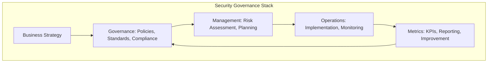
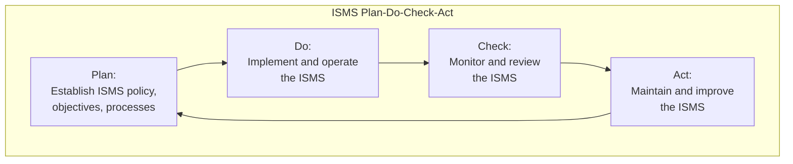
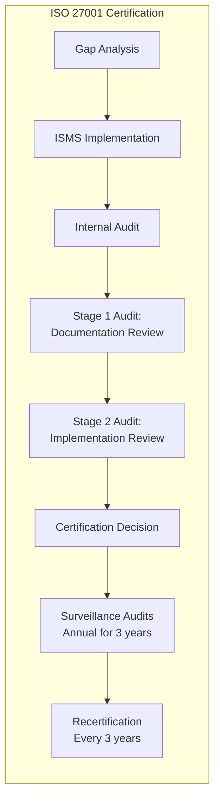
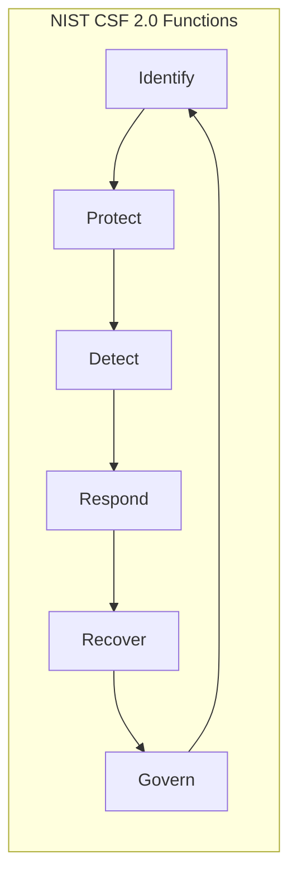
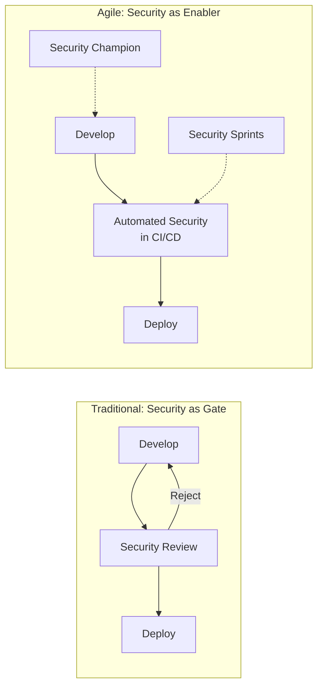
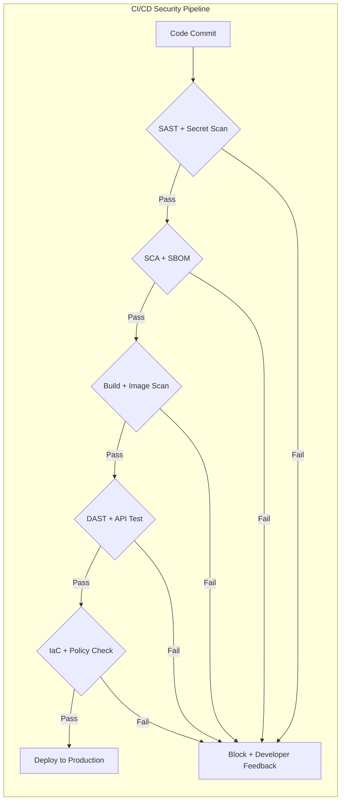

---
tags:
  - software-engineering
  - swebok
  - ka13
  - software-security
  - security-governance
  - iso27001
  - compliance
  - security-management
source: "SWEBOK v4 Chapter 13"
created: 2026-07-21
---

# 08 Security Management and Governance

> *Security governance defines who decides, what is measured, and how accountability flows. Without governance, even the best technical controls drift into irrelevance.*

---

## 1. Overview

SWEBOK KA 13.2 addresses the organizational structures, standards, and processes that ensure security is systematically planned, implemented, measured, and improved. Security governance bridges the gap between technical security engineering and business risk management.



---

## 2. SSE-CMM: Systems Security Engineering Capability Maturity Model

### 2.1 What Is SSE-CMM?

SSE-CMM (ISO/IEC 21827) defines a process maturity model for security engineering. It assesses an organization's security engineering capability across defined process areas, similar to how CMMI assesses software engineering maturity.

### 2.2 Capability Levels

| Level | Name | Description | Characteristics |
|-------|------|-------------|-----------------|
| **0** | Not Performed | No security engineering process | Ad hoc, chaotic, no documentation |
| **1** | Performed Informally | Security work is done but not planned or tracked | Individual heroics, inconsistent quality |
| **2** | Planned and Tracked | Security processes are planned, documented, and tracked | Standards exist, work is measured |
| **3** | Well-Defined | Organization-wide standard security engineering process | Tailored from organizational standard process |
| **4** | Quantitatively Controlled | Process is measured and controlled using statistical techniques | Metrics-driven, predictable outcomes |
| **5** | Continuously Improving | Process is continuously improved based on quantitative feedback | Innovation, defect prevention, optimization |

### 2.3 SSE-CMM Process Areas

SSE-CMM organizes security engineering into process areas grouped by category:

| Category | Process Area | Description |
|----------|-------------|-------------|
| **Engineering** | PA01: Administer Security Controls | Manage security mechanisms and controls |
| | PA02: Assess Impact | Determine security impact of changes and threats |
| | PA03: Assess Security Risk | Identify and evaluate security risks |
| | PA04: Assess Threat | Characterize threats to the system |
| | PA05: Assess Vulnerability | Identify and evaluate vulnerabilities |
| | PA06: Build Assurance Argument | Construct evidence that security requirements are met |
| | PA07: Coordinate Security | Coordinate security activities across stakeholders |
| | PA08: Monitor Security Posture | Monitor system security state continuously |
| | PA09: Provide Security Input | Provide security expertise to engineering decisions |
| | PA10: Specify Security Requirements | Define security requirements from stakeholder needs |
| **Project** | PA11: Ensure Quality | Manage quality of security engineering work products |
| | PA12: Manage Security Configuration | Control security-related configuration items |
| | PA13: Manage Project Risk | Address project-level risks affecting security |
| | PA14: Monitor and Control Technical Effort | Track security engineering activities |
| | PA15: Plan Technical Effort | Plan security engineering activities |
| **Organizational** | PA16: Define Organization's Security Engineering Process | Establish organizational standard process |
| | PA17: Improve Organization's Security Engineering Process | Continuously improve the process |
| | PA18: Manage Security Engineering Support Environment | Manage tools and infrastructure |
| | PA19: Manage Security Engineering Workforce | Develop and manage security engineering skills |
| | PA20: Coordinate with Suppliers | Manage supplier security requirements |

### 2.4 SSE-CMM Assessment

An SSE-CMM assessment evaluates:

1. **Process capability** — Which capability levels has each process area achieved?
2. **Process performance** — Are the process areas actually being performed?
3. **Institutionalization** — Are processes embedded in the organization's way of working?

Assessment results are typically used for:
- Internal improvement planning
- Supplier/vendor evaluation
- Contractual compliance evidence

---

## 3. ISO/IEC 27001:2022

### 3.1 Information Security Management System (ISMS)

ISO 27001 defines requirements for establishing, implementing, maintaining, and continually improving an ISMS. It is the most widely adopted international standard for information security management.



### 3.2 ISO 27001 Structure (2022 Revision)

| Clause | Title | Requirements |
|--------|-------|-------------|
| **4** | Context of the Organization | Internal/external issues, interested parties, ISMS scope |
| **5** | Leadership | Top management commitment, security policy, roles and responsibilities |
| **6** | Planning | Risk assessment, risk treatment, security objectives, planning of changes |
| **7** | Support | Resources, competence, awareness, communication, documented information |
| **8** | Operation | Operational planning, risk assessment execution, risk treatment implementation |
| **9** | Performance Evaluation | Monitoring, measurement, internal audit, management review |
| **10** | Improvement | Nonconformity, corrective action, continual improvement |

### 3.3 ISO 27001:2022 Annex A Controls

The 2022 revision reorganized Annex A into 4 themes with 93 controls (down from 114 in the 2013 version):

| Theme | Control Count | Examples |
|-------|--------------|----------|
| **Organizational** (A.5) | 37 | Policies, roles, asset management, access control, supplier security, incident management, compliance |
| **People** (A.6) | 8 | Screening, terms of employment, awareness training, disciplinary process, responsibilities after termination |
| **Physical** (A.7) | 14 | Secure areas, equipment security, media handling, physical monitoring |
| **Technological** (A.8) | 34 | Endpoint security, network security, encryption, secure development, testing, source code, change management |

**Key new controls in 2022 revision:**

| Control | Description |
|---------|-------------|
| A.5.7 | Threat intelligence — collect and analyze threat information |
| A.5.23 | Information security for cloud services — manage cloud-specific risks |
| A.5.30 | ICT readiness for business continuity — ensure IT can support continuity |
| A.7.4 | Physical security monitoring — monitor physical premises for unauthorized access |
| A.8.9 | Configuration management — manage technology configurations securely |
| A.8.10 | Information deletion — delete data when no longer needed |
| A.8.11 | Data masking — mask sensitive data where appropriate |
| A.8.12 | Data leakage prevention — detect and prevent unauthorized data exfiltration |
| A.8.16 | Monitoring activities — monitor networks, systems, and applications |
| A.8.23 | Web filtering — manage access to external websites |
| A.8.28 | Secure coding — implement secure coding practices |

### 3.4 Certification Process



| Phase | Description | Duration |
|-------|-------------|----------|
| **Gap analysis** | Compare current state to ISO 27001 requirements | 1-2 months |
| **ISMS implementation** | Implement missing controls, policies, processes | 3-12 months |
| **Internal audit** | Verify ISMS meets requirements before external audit | 1 month |
| **Stage 1 audit** | Certification body reviews documentation and ISMS design | 1-2 weeks |
| **Stage 2 audit** | Certification body verifies implementation effectiveness | 2-4 weeks |
| **Certification** | Issued if no major nonconformities found | Valid for 3 years |
| **Surveillance audits** | Annual check that ISMS is maintained and improving | Annual |

### 3.5 ISO 27002 Implementation Guidance

ISO/IEC 27002:2022 provides implementation guidance for the Annex A controls. For each control, it specifies:

- **Control title and description** — what the control does
- **Purpose** — why the control is needed
- **Implementation guidance** — how to implement the control
- **Other information** — related controls, references, considerations

ISO 27002 is not certifiable itself — it is a reference document that organizations use to implement the controls required by ISO 27001.

---

## 4. Security Governance Structures

### 4.1 Organizational Roles

| Role | Responsibilities | Reports To |
|------|-----------------|------------|
| **CISO** (Chief Information Security Officer) | Overall security strategy, risk management, policy, incident response leadership | CIO, CEO, or Board |
| **Security Committee** | Cross-functional oversight, policy approval, risk acceptance decisions | Board of Directors |
| **Security Architect** | Design security controls into systems and infrastructure | CISO |
| **Security Engineer** | Implement and operate security tools and processes | Security Architect |
| **Security Analyst** | Monitor, detect, investigate security events | SOC Manager |
| **Security Champion** | Embedded in development teams; advocates for security practices | Development Lead (dotted line to CISO) |
| **DPO** (Data Protection Officer) | GDPR compliance, privacy impact assessments | Legal / Board |
| **Risk Manager** | Enterprise risk assessment, risk register maintenance | CRO (Chief Risk Officer) |

### 4.2 Security Policy Hierarchy

```
Board / Executive Committee
  └── Security Policy (governing principles)
       ├── Standards (specific requirements)
       │    ├── Procedures (step-by-step instructions)
       │    │    └── Guidelines (recommended practices)
       │    └── Baselines (minimum configurations)
       └── Acceptable Use Policy
```

| Document Level | Example | Binding? |
|----------------|---------|----------|
| **Policy** | "All customer data must be encrypted at rest and in transit" | Yes — mandatory |
| **Standard** | "AES-256-GCM for encryption at rest; TLS 1.3 for transit" | Yes — mandatory |
| **Procedure** | "To encrypt a database: 1) Enable TDE, 2) Configure key rotation, 3) Verify..." | Yes — mandatory |
| **Guideline** | "Consider using HSM-backed keys for high-sensitivity databases" | No — advisory |
| **Baseline** | "All servers must meet CIS Level 1 benchmarks" | Yes — minimum |

### 4.3 Security Committee Charter

A security committee typically includes:

| Member | Contribution |
|--------|-------------|
| CISO (chair) | Security strategy and risk perspective |
| CTO / VP Engineering | Technical feasibility and engineering priorities |
| Legal / Compliance | Regulatory requirements, liability |
| HR | Personnel security, training, insider threat |
| Finance | Security budget, cost of breaches |
| Business unit leaders | Business risk acceptance, operational impact |
| Privacy officer | Data protection requirements |

**Committee responsibilities:**
- Approve security policies and standards
- Review and accept residual risk on major initiatives
- Prioritize security investments
- Review incident post-mortems and approve remediation plans
- Oversee compliance programs

---

## 5. Security Metrics and KPIs

### 5.1 Metrics Categories

| Category | Example Metrics | Purpose |
|----------|----------------|---------|
| **Vulnerability management** | Mean time to remediate (MTTR), % of systems scanned, open vulnerability count by severity | Measure remediation effectiveness |
| **Incident response** | Mean time to detect (MTTD), mean time to respond (MTTR), incidents per month | Measure detection and response capability |
| **Compliance** | % of systems meeting baseline, audit finding count, policy exceptions | Measure compliance posture |
| **Access control** | Orphaned account count, privileged access reviews completed, MFA adoption rate | Measure access hygiene |
| **Training** | Phishing click rate, training completion %, security incident rate by team | Measure human risk reduction |
| **Application security** | Vulnerabilities found per release, % of code covered by SAST, time to fix SAST findings | Measure secure development maturity |

### 5.2 Key Performance Indicators

| KPI | Target | Measurement |
|-----|--------|-------------|
| **Vulnerability remediation SLA** | Critical: 72h, High: 30d, Medium: 90d | % of vulnerabilities remediated within SLA |
| **Phishing resilience** | <5% click rate | Simulated phishing campaign results |
| **Security training coverage** | 100% annual completion | Training platform data |
| **Mean time to detect** | <24 hours | SIEM/alerting timestamps |
| **Mean time to respond** | <4 hours for critical incidents | Incident tracking system |
| **Patch compliance** | >95% of systems patched within SLA | Vulnerability scanner data |
| **Privileged access review** | 100% quarterly review completion | IAM system audit logs |
| **Third-party risk assessments** | 100% of critical vendors assessed annually | Vendor risk management platform |

### 5.3 Metrics Maturity Model

| Level | Description | Metrics Type |
|-------|-------------|-------------|
| **1 — Ad hoc** | No formal metrics | Anecdotal, incident-driven |
| **2 — Reactive** | Metrics collected after incidents | Count of incidents, breach costs |
| **3 — Proactive** | Regular metrics collection and reporting | Vulnerability counts, patch compliance, training rates |
| **4 — Predictive** | Metrics used to predict and prevent | Trend analysis, risk scoring, threat modeling |
| **5 — Optimizing** | Metrics drive continuous improvement | ROI of security investments, risk reduction quantified |

---

## 6. Security Compliance Frameworks

### 6.1 Framework Comparison

| Framework | Scope | Mandatory? | Certification | Focus |
|-----------|-------|-----------|---------------|-------|
| **ISO/IEC 27001** | Information security management | Voluntary (market-driven) | Yes — accredited body | ISMS — comprehensive security management |
| **SOC 2 Type II** | Service organization controls | Voluntary (customer-driven) | Attestation report | Trust service criteria (security, availability, processing integrity, confidentiality, privacy) |
| **NIST CSF** | Cybersecurity risk management | Voluntary (federal: BOD 23-01 for agencies) | No — self-assessment | Identify, Protect, Detect, Respond, Recover |
| **PCI DSS** | Payment card data | Mandatory for card processors | Yes — QSA assessment | Protect cardholder data |
| **HIPAA** | Healthcare information | Mandatory for US healthcare | No — audit/enforcement | Protect health information (PHI) |
| **GDPR** | Personal data (EU) | Mandatory for EU data processing | No — regulatory enforcement | Data protection and privacy |
| **FedRAMP** | US federal cloud services | Mandatory for federal cloud | Yes — 3PAO assessment | Cloud security authorization |

### 6.2 NIST Cybersecurity Framework (CSF) 2.0

The updated NIST CSF 2.0 (released February 2024) added a sixth function:



| Function | Description | Example Categories |
|----------|-------------|-------------------|
| **Govern (GV)** | Establish and monitor cybersecurity risk management strategy | Organizational context, risk management strategy, roles, policy |
| **Identify (ID)** | Understand assets, risks, and the business context | Asset management, risk assessment, supply chain risk |
| **Protect (PR)** | Implement safeguards for critical services | Identity management, data security, platform security, technology resilience |
| **Detect (DE)** | Identify cybersecurity events in a timely manner | Continuous monitoring, adverse event analysis |
| **Respond (RS)** | Take action regarding detected incidents | Incident management, analysis, reporting, mitigation |
| **Recover (RC)** | Restore capabilities impaired by incidents | Incident recovery, communication |

### 6.3 SOC 2 Trust Service Criteria

SOC 2 Type II evaluates controls against five Trust Service Criteria:

| Criterion | Focus | Example Controls |
|-----------|-------|-----------------|
| **Security** (mandatory) | Protection against unauthorized access | Firewalls, access controls, encryption, monitoring |
| **Availability** | System uptime and resilience | Disaster recovery, backup, capacity management |
| **Processing Integrity** | System processing is complete, accurate, authorized | Input validation, error handling, reconciliation |
| **Confidentiality** | Protection of confidential information | Encryption, access restrictions, data classification |
| **Privacy** | Protection of personal information | Consent management, data retention, privacy notices |

**Type I vs Type II:**
- **Type I:** Describes controls at a point in time (design effectiveness)
- **Type II:** Tests controls over a period (typically 6-12 months; operational effectiveness)

---

## 7. Adapting Security to Agile Development

### 7.1 Security as Enabler, Not Gatekeeper

Traditional security operated as a gate at the end of development: "submit for security review." In Agile/DevOps, this creates bottlenecks that teams route around. Modern security adapts by becoming an enabler embedded in the development process.



### 7.2 Shift-Left Security

"Shift left" means moving security activities earlier in the development lifecycle:

| Traditional (Late) | Shifted Left | Benefit |
|--------------------|-------------|---------|
| Penetration test after release | SAST/DAST in CI/CD pipeline | Find vulns before production |
| Security review at design gate | Threat modeling during sprint planning | Design out risks early |
| Manual compliance audit | Policy-as-code in deployment pipeline | Continuous compliance |
| Incident response after breach | Chaos engineering, red team exercises | Proactive resilience |
| Security training annually | Just-in-time training on findings | Contextual, actionable learning |

### 7.3 Security Champions Program

Security champions are developers who receive additional security training and serve as the security point-of-contact within their team:

| Aspect | Description |
|--------|-------------|
| **Selection** | Volunteer developers with interest in security; 1-2 per team |
| **Training** | Advanced security training (OWASP, secure coding, threat modeling) |
| **Time commitment** | ~10-20% of their time dedicated to security activities |
| **Responsibilities** | Review PRs for security issues, lead threat modeling sessions, triage security findings, advocate for security in sprint planning |
| **Support** | Regular meetings with CISO/security team, access to security tools, escalation path |
| **Recognition** | Security contributions included in performance reviews |

### 7.4 Security Sprints

Dedicated security sprints (every 3-5 sprints) focus on:

1. **Technical debt remediation** — address accumulated security findings
2. **Dependency updates** — update vulnerable libraries and frameworks
3. **Security testing** — run comprehensive DAST scans, penetration tests
4. **Threat model updates** — review architecture changes since last sprint
5. **Security tooling improvement** — tune SAST rules, add new checks
6. **Security training** — team workshops on emerging threats

### 7.5 Security Automation in CI/CD

| Stage | Security Activity | Tools |
|-------|------------------|-------|
| **Pre-commit** | Secret scanning, pre-commit hooks | git-secrets, pre-commit framework |
| **Commit** | SAST (static analysis) | Semgrep, SonarQube, CodeQL |
| **Build** | SCA (software composition analysis), SBOM generation | Snyk, Dependabot, Trivy |
| **Test** | DAST (dynamic analysis), API security testing | OWASP ZAP, Burp Suite |
| **Deploy** | IaC scanning, container image scanning, policy-as-code | Checkov, tfsec, OPA |
| **Runtime** | RASP, WAF, monitoring, anomaly detection | Datadog, Falco, Aqua |



---

## 8. Security Training and Awareness Programs

### 8.1 Training Program Structure

| Audience | Training Type | Frequency | Content |
|----------|--------------|-----------|---------|
| **All employees** | Security awareness | Annual + monthly refreshers | Phishing, social engineering, password hygiene, data handling, reporting incidents |
| **Developers** | Secure coding | Annual + just-in-time | OWASP Top 10, input validation, authentication, secure design patterns |
| **Operations** | Security operations | Quarterly | Incident response, log analysis, vulnerability management, hardening |
| **Executives** | Security leadership | Quarterly | Risk governance, regulatory obligations, breach costs, board reporting |
| **Security champions** | Advanced security | Monthly | Threat modeling, code review, security architecture, emerging threats |
| **New hires** | Onboarding security | Day 1 | Security policies, acceptable use, incident reporting, data classification |

### 8.2 Phishing Simulation

Phishing simulations are the most effective security awareness tool:

| Metric | Measurement | Target |
|--------|------------|--------|
| **Click rate** | % of users who clicked a simulated phishing link | <5% |
| **Report rate** | % of users who reported the phishing email | >70% |
| **Repeat offender rate** | % of users who clicked 3+ times | <2% |
| **Time to report** | Average time from email delivery to report | <10 minutes |
| **Training completion** | % of clickers who completed remedial training | 100% |

**Simulation best practices:**
1. Never shame or punish employees who click — use it as a learning moment
2. Vary difficulty levels (obvious typos to highly targeted spear-phishing)
3. Provide immediate feedback when someone clicks
4. Track trends over time, not just individual incidents
5. Include various attack types: credential harvesting, malware attachment, link-based

### 8.3 Security Culture Maturity

| Level | Name | Characteristics |
|-------|------|-----------------|
| **1** | Unaware | Employees don't recognize security risks; security is IT's problem |
| **2** | Reactive | Security awareness exists but actions are triggered by incidents |
| **3** | Compliant | Employees follow policies but view security as a burden |
| **4** | Proactive | Employees actively look for and report security issues |
| **5** | Embedded | Security is part of organizational identity; everyone is a defender |

---

## 9. Key Takeaways

1. **SSE-CMM provides a maturity model for security engineering processes** — organizations assess their capability level across 20 process areas to identify improvement priorities.
2. **ISO 27001:2022 is the international gold standard for ISMS certification** — the 2022 revision reorganized Annex A into 4 themes with 93 controls, adding cloud security, threat intelligence, and secure coding.
3. **NIST CSF 2.0 added the Govern function** — emphasizing that cybersecurity risk management must be driven from the top of the organization.
4. **Security governance requires clear roles** — the CISO owns strategy, the security committee approves policy and accepts risk, security champions embed expertise in development teams.
5. **Shift-left security works when automated** — SAST, SCA, DAST, and policy-as-code in CI/CD pipelines catch vulnerabilities before production without slowing delivery.
6. **Metrics drive improvement** — track vulnerability MTTR, phishing click rates, patch compliance, and training completion; use trends, not point-in-time snapshots.
7. **Security culture is the ultimate defense** — a proactive security culture where every employee is a sensor is more valuable than any tool.

---

## 10. Links to Related Notes

- [[01_Security_Fundamentals]]: Foundational security principles that governance frameworks operationalize
- [[03_Access_Control_and_Architecture]]: Access control policies are a core component of ISO 27001 Annex A
- [[05_Secure_Development_and_Assurance]]: Secure SDLC practices that security champions and CI/CD automation implement
- [[06_Domain_Specific_Security]]: Domain-specific controls referenced in compliance frameworks (cloud, IoT, API)
- [[07_Vulnerability_Management]]: Vulnerability management metrics and processes that feed into security KPIs
- [[Cybersecurity/]]: Technical security operations that governance structures oversee

---

*Source: SWEBOK v4 Chapter 13, Section 13.2*
