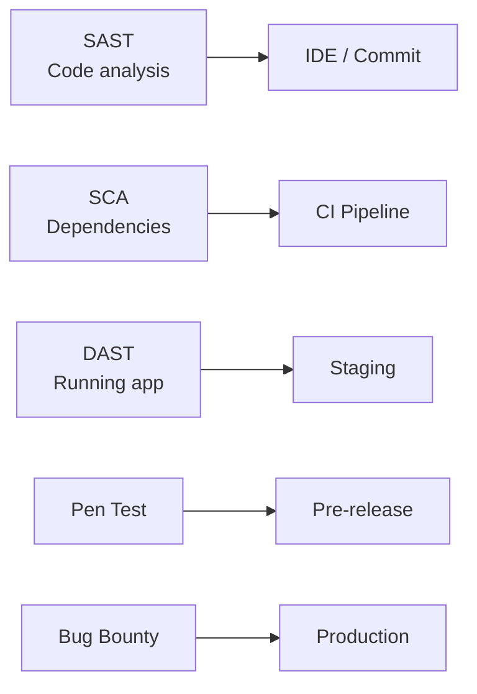

---
tags:
- cybersecurity
- programming
- security
---

# 04 Vulnerability Management

Find vulnerabilities before attackers do. The process: discover → prioritize → fix → verify. Repeat forever.

---

## The Scanning Pipeline



---

## SAST — Static Application Security Testing

Analyzes source code WITHOUT running it. Finds injection, hardcoded secrets, insecure configs.

| Tool | Language | Integration |
|------|----------|------------|
| **SonarQube** | Multi | CI/CD, IDE |
| **Semgrep** | Multi | CLI, CI, fast |
| **SpotBugs + FindSecBugs** | Java | Maven/Gradle plugin |
| **ESLint + security plugin** | JavaScript | CI, IDE |

```xml
<!-- SpotBugs + FindSecBugs in Maven -->
<plugin>
    <groupId>com.github.spotbugs</groupId>
    <artifactId>spotbugs-maven-plugin</artifactId>
    <configuration>
        <plugins>
            <plugin>
                <groupId>com.h3xstream.findsecbugs</groupId>
                <artifactId>findsecbugs-plugin</artifactId>
                <version>1.12.0</version>
            </plugin>
        </plugins>
    </configuration>
</plugin>
```

---

## DAST — Dynamic Application Security Testing

Attacks the RUNNING application. Finds runtime vulnerabilities that SAST misses.

| Tool | Best For |
|------|----------|
| **OWASP ZAP** | Free. Active + passive scanning. API and GUI. |
| **Burp Suite** | Industry standard. Pro version for automation. |
| **Nikto** | Quick web server scan |

```bash
# OWASP ZAP — quick scan
zap-cli quick-scan --self-contained \
    --start-options "-config api.disablekey=true" \
    http://localhost:8080
```

---

## Penetration Testing

Human expert attempts to breach your system. Finds logic flaws that scanners miss.

| When | Frequency |
|------|:---------:|
| Before major launch | Every time |
| Annual | At minimum |
| After significant changes | Architecture review trigger |
| After an incident | Verify fixes |

---

## Bug Bounty Programs

Crowdsourced security testing. Pay researchers for valid vulnerabilities.

| Platform | Best For |
|----------|----------|
| **HackerOne** | Enterprise, managed |
| **Bugcrowd** | Enterprise, managed |
| **Self-hosted** | `security.txt` + PGP key |

```
# https://example.com/.well-known/security.txt
Contact: mailto:security@example.com
Encryption: https://example.com/pgp-key.txt
Acknowledgments: https://example.com/hall-of-fame
Policy: https://example.com/security-policy
```

---

## Vulnerability Lifecycle

```
Discover → Triage (CVSS score) → Assign → Fix → Verify → Close
```

| CVSS | Response SLA |
|:----:|-------------|
| Critical (9–10) | 24 hours |
| High (7–8.9) | 72 hours |
| Medium (4–6.9) | 7 days |
| Low (0.1–3.9) | Next release |

---

## Sources

- OWASP ZAP — https://www.zaproxy.org/
- Semgrep — https://semgrep.dev/
- HackerOne — https://www.hackerone.com/
