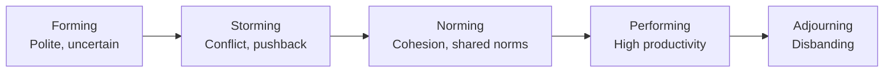

---
tags:
  - professionalism
  - group-dynamics
  - psychology
  - teams
  - cognitive-science
  - software-engineering
source: "SWEBOK v4 Chapter 14 — Professional Practice, Group Dynamics and Psychology"
created: 2026-07-21
---

# Group Dynamics and Psychology

> Software engineering is a team sport. Understanding how individuals think, how teams function, and how organizations behave is as essential as technical skills.

## 1. Individual Cognition in Software Engineering

### The Limits of Human Working Memory

Miller's Law (1956): The average person can hold **7 ± 2 chunks** in working memory. Software engineering routinely overloads this limit:
- A developer tracing an unfamiliar function holds its state, call chain, and data flow in working memory
- Decomposition into small functions, clear naming, and minimal side effects directly reduce cognitive load
- The **Principle of Proximity**: keep related code physically close to minimize scanning and recall

### Cognitive Biases Affecting Software Work

| Bias | What It Is | Impact on SE |
|---|---|---|
| **Confirmation Bias** | Seeking evidence that confirms our beliefs | Testing only the happy path; ignoring edge cases that contradict our mental model |
| **Anchoring Bias** | Over-relying on first piece of information | Initial estimate sticks even when new data suggests otherwise |
| **Optimism Bias** | Overestimating positive outcomes | "It's just a small change" — underestimating integration and testing time |
| **Dunning-Kruger Effect** | Low-competence individuals overestimate ability | Junior devs taking on architectural decisions without understanding consequences |
| **Sunk Cost Fallacy** | Continuing investment because of past cost | Refusing to rewrite terrible code because "we already spent so much time on it" |
| **Fundamental Attribution Error** | Attributing others' failures to character, ours to circumstances | "They wrote bad code" vs. "I was under time pressure" |

### Problem-Solving Under Uncertainty

- **Decomposition:** Break complex problems into manageable sub-problems — reduces cognitive load and enables parallel work
- **Heuristics:** Mental shortcuts that work most of the time but can fail catastrophically (e.g., "never seen a bug here before" → skip testing)
- **Metacognition:** Awareness of one's own thought processes — the ability to recognize "I'm stuck" or "I'm making assumptions" and step back

### Psychological Safety

Amy Edmondson defines psychological safety as: *"A shared belief that the team is safe for interpersonal risk-taking."*

| High Psychological Safety | Low Psychological Safety |
|---|---|
| Mistakes discussed openly | Mistakes hidden until they explode |
| Junior devs ask questions freely | Everyone pretends to understand |
| Dissenting opinions welcomed | Silence treated as agreement |
| Postmortems focus on systems, not people | Postmortems assign blame |

> [!important] Google's Project Aristotle found that **psychological safety was the #1 predictor of team performance** — more important than individual talent, team composition, or co-location.

## 2. Team Dynamics

### Tuckman's Stages of Group Development

| Stage | Characteristics | Leadership Role |
|---|---|---|
| **Forming** | Politeness, uncertainty about roles, dependence on leader | Direct, clarify goals and roles |
| **Storming** | Conflict, competition, resistance to control | Coach through conflict, establish ground rules |
| **Norming** | Cohesion develops, shared standards, mutual support | Facilitate, delegate |
| **Performing** | Autonomy, high trust, focus on goals | Empower, remove obstacles |
| **Adjourning** | Disbanding, recognition, emotional closure | Celebrate, transition support |

### Cohesion and Conflict

**Healthy conflict** (task conflict): Disagreement about *what* to build or *how* to build it — leads to better decisions when managed well.

**Unhealthy conflict** (relationship conflict): Personal friction, ego, status battles — destroys trust and productivity.

> **Rule of thumb:** Task conflict improves outcomes when psychological safety is high. Relationship conflict always damages outcomes.

### The Ringelmann Effect and Social Loafing

The Ringelmann Effect: Individual productivity decreases as group size increases. A rope-pulling experiment showed that 8 people in a group pulled at only 50% of their individual capacity.

In software engineering, social loafing manifests as:
- Reduced effort when individual contributions aren't visible
- Dilution of responsibility in large codebases ("someone else will fix that bug")
- Mitigation: clear individual ownership, small teams (two-pizza rule), visible contribution metrics

### Brooks's Law Revisited

> *"Adding manpower to a late software project makes it later."* — Fred Brooks, The Mythical Man-Month

Reasons:
- **Ramp-up cost**: new members need time to become productive
- **Communication overhead**: n people → n(n-1)/2 communication paths
- **Task partitioning**: not all tasks can be cleanly divided

| Team Size | Communication Paths |
|---|---|
| 3 | 3 |
| 5 | 10 |
| 7 | 21 |
| 10 | 45 |
| 15 | 105 |

### Decision-Making in Teams

| Method | Speed | Buy-in | When to Use |
|---|---|---|---|
| **Autocratic** (one decides) | Fastest | Lowest | Emergencies, trivial decisions |
| **Consultative** (ask then decide) | Fast | Medium | Technical decisions requiring expertise |
| **Consensus** (all agree) | Slowest | Highest | Architectural decisions, team norms |
| **Majority vote** | Medium | Medium | When full consensus is impractical |

## 3. Diversity, Equity, and Inclusion (DEI)

### Why DEI Matters in Software Engineering

| Dimension | Engineering Impact |
|---|---|
| **Cognitive Diversity** | Different problem-solving approaches → more robust solutions. Homogeneous teams miss edge cases (e.g., facial recognition failing on darker skin tones) |
| **Demographic Diversity** | Broader user perspective → products that work for everyone. Voice recognition trained on male voices → fails for women |
| **Experiential Diversity** | Domain knowledge from different industries → cross-pollination of ideas |

### Common Biases in Hiring and Teams

- **Affinity Bias:** Favoring candidates similar to ourselves ("cultural fit" code for "people like us")
- **Stereotype Threat:** Anxiety about confirming negative stereotypes → reduced performance in testing situations
- **In-Group/Out-Group Dynamics:** Information flows better within groups but can create silos

### Practical Mitigation Strategies

1. **Structured interviews** with consistent rubrics — reduces affinity bias
2. **Blind code reviews** where possible — evaluate work, not author identity
3. **Rotation of roles** (scrum master, on-call, presenter) — breaks in-group patterns
4. **Mentorship programs** — structured support for underrepresented groups
5. **Inclusive language** in documentation, code comments, and communication

## Key Takeaways

1. **Working memory is limited** — design code, tools, and processes that reduce cognitive load
2. **Psychological safety predicts team performance** more accurately than individual skill
3. **Teams go through predictable stages** (forming → storming → norming → performing) — conflict is normal in stage 2
4. **Task conflict improves outcomes when trust is high; relationship conflict always damages**
5. **Communication overhead grows quadratically with team size** — favor small, autonomous teams
6. **Cognitive diversity produces better software** — but only when psychological safety allows it to surface

## Related

- [[Professionalism of Software Engineering Overview]] — All professional practice topics
- [[01_Professionalism_Ethics_and_Legal]] — Ethics and professional codes
- [[03_Communication_Skills]] — Technical communication and presentation
- [[clean-agile/Clean Agile Overview]] — Agile team practices
- [[Software Engineering Management Overview]] — People and team management
