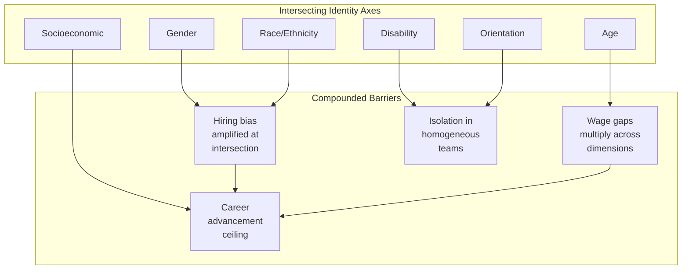
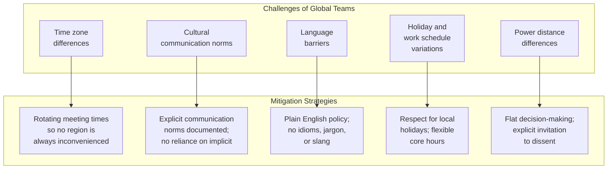

# Equity, Diversity, and Inclusivity in Software Engineering

> Software is built by people, for people. When the workforce lacks diversity, the products it builds reflect that narrowness in design blind spots, biased algorithms, and inaccessible interfaces. EDI is not a separate concern from engineering quality; it is a prerequisite for building software that serves all users well.

## 1. The Current State: Diversity in Software Engineering

### 1.1 Gender Gap

The gender gap in software engineering remains significant despite decades of awareness:

| Metric | Statistic | Source/Year |
|---|---|---|
| Women in US computing workforce | ~26% | BLS, 2023 |
| Women in software development roles | ~19% | Stack Overflow Survey, 2023 |
| Women earning CS bachelor's degrees (US) | ~22% | NCES, 2022 |
| Women in senior engineering roles | ~12% | McKinsey, 2023 |
| Women in CTO/CIO roles | ~18% | Korn Ferry, 2023 |

> [!note] The gender gap has actually **widened** in some countries since the 1980s. In the US, women earned ~37% of CS bachelor's degrees in 1984, but only ~22% today. This is unusual; most STEM fields have seen improvement over the same period.

### 1.2 Racial and Ethnic Diversity

| Group | US Computing Workforce | US Population | Representation Gap |
|---|---|---|---|
| White | ~62% | ~59% | +3% (overrepresented) |
| Asian | ~20% | ~6% | +14% (overrepresented) |
| Hispanic/Latino | ~8% | ~19% | -11% (underrepresented) |
| Black/African American | ~7% | ~13% | -6% (underrepresented) |
| Native American/Alaska Native | ~0.4% | ~1.3% | -0.9% (underrepresented) |

### 1.3 Other Dimensions of Diversity

| Dimension | Challenge in SE |
|---|---|
| **Age** | Ageism in tech; "culture fit" often means young; experienced engineers face bias after 40 |
| **Disability** | Accessibility of development tools; physical office environments; neurodiversity acceptance |
| **Socioeconomic background** | Gatekeeping through unpaid internships, expensive bootcamps, unpaid open source contributions |
| **Education** | Non-traditional paths (bootcamps, self-taught) vs degree holders; bias in hiring |
| **Geography** | Global south engineers face wage arbitrage, timezone exploitation, limited career paths |
| **Veteran status** | Transitioning military personnel lack "tech industry" credentials despite relevant skills |

### 1.4 Intersectionality

Diversity dimensions do not exist in isolation. A Black woman in software engineering faces compounding barriers that are not captured by gender or race statistics alone. **Intersectionality** (a term coined by Kimberle Crenshaw, 1989) recognizes that overlapping identities create unique experiences of discrimination.

---

## 2. Challenges and Barriers

### 2.1 Unconscious Bias

Unconscious (implicit) bias refers to automatic mental shortcuts that affect decisions without conscious awareness:

| Bias Type | Description | Impact in SE |
|---|---|---|
| **Affinity bias** | Favoring people similar to ourselves | Homogeneous hiring; "culture fit" becomes "people like us" |
| **Halo effect** | One positive trait influences overall assessment | Prestigious university on resume overshadows actual skills |
| **Confirmation bias** | Seeking evidence that confirms existing beliefs | "Women aren't as good at systems programming" leads to overlooking evidence to the contrary |
| **Attribution bias** | Attributing success/failure differently based on group | A man's success = skill; a woman's success = luck/help |
| **Name bias** | Evaluating resumes differently based on names | Studies show identical resumes with different names receive different callback rates |

> [!important] Research by Moss-Racusin et al. (2012) showed that science faculty rated identical lab manager applications as significantly less competent and offered lower salaries when the applicant's name was female. This bias was present in both male and female faculty members, demonstrating that unconscious bias is systemic, not individual.

### 2.2 Stereotype Threat

**Stereotype threat** occurs when a person's awareness of a negative stereotype about their group impairs their performance. In software engineering:

- Women performing technical tasks may underperform when gender is made salient (Spencer et al., 1999)
- Underrepresented minorities in coding assessments may experience anxiety that reduces performance
- The effect is strongest for individuals who most strongly identify with the domain
- It is mitigated by framing tasks as non-diagnostic of ability, providing role models, and emphasizing growth mindset

### 2.3 Imposter Syndrome

**Imposter syndrome** is the persistent feeling of being a fraud despite objective evidence of competence:

| Group | Prevalence in Tech | Key Factor |
|---|---|---|
| Women | ~72% report experiencing it | Lack of representation; "proving" themselves repeatedly |
| Minorities | ~60% report experiencing it | Isolation; stereotype threat |
| Non-degree holders | ~55% report experiencing it | Credential insecurity |
| Everyone in tech | ~58% report experiencing it | Rapid technological change; "everyone else knows more" |

> Imposter syndrome is not a personal failing; it is a **systemic response** to environments that signal "you don't belong." The solution is not to tell individuals to be more confident, but to change the signals the environment sends.

### 2.4 Hostile Work Environments

| Behavior | Description | Impact |
|---|---|---|
| **Microaggressions** | Subtle, often unintentional slights ("You're so articulate!" to a person of color) | Cumulative stress, reduced sense of belonging |
| **Brogrammer culture** | Hypermasculine, competitive, alcohol-centered social events | Excludes those who don't fit the culture |
| **Manterrupting** | Unnecessary interruption of women in meetings | Suppresses contributions, signals lower status |
| **Credit stealing** | Taking credit for others' ideas (disproportionately affects minorities) | Career advancement blocked |
| **Sexual harassment** | Unwelcome conduct of a sexual nature | Trauma, career exit, legal liability |

### 2.5 Wage Gaps

| Comparison | Gap (US, 2023) | Notes |
|---|---|---|
| Women vs men in computing | ~83 cents per dollar | Adjusted gap is ~95 cents (controlling for role/level), but access to higher-paying roles differs |
| Black vs white men in computing | ~87 cents per dollar | Persistent even when controlling for education and experience |
| Hispanic vs white men in computing | ~85 cents per dollar | Similar pattern |
| By age (50+ vs 25-34) | Decreases for women, increases for men | Career progression gap compounds |

---

## 3. Strategies for Improving EDI

### 3.1 Hiring and Recruiting

| Strategy | Description | Evidence of Effectiveness |
|---|---|---|
| **Broader recruiting** | Recruit from HBCUs, HSIs, community colleges, bootcamps, not just elite universities | Increases pipeline diversity |
| **Blind resume screening** | Remove names, universities, photos from initial screening | Reduces name bias by up to 25% (NBER study) |
| **Structured interviews** | Same questions, same rubric, same interviewers for all candidates | Reduces "culture fit" bias; improves prediction of job performance |
| **Diverse interview panels** | Include underrepresented groups on interview panels | Candidates from URG more likely to accept offers; signals inclusive culture |
| **Skills-based assessment** | Work samples, pair programming, take-home projects over puzzle questions | More predictive of job performance; reduces bias from test-taking anxiety |
| **Inclusive job descriptions** | Avoid gendered language ("ninja," "rockstar"), unnecessary requirements | Reduces discouragement of qualified candidates from underrepresented groups |

### 3.2 Retention and Advancement

| Strategy | Description |
|---|---|
| **Transparent compensation** | Publish salary bands; conduct regular pay equity audits |
| **Sponsorship programs** | Senior leaders actively advocate for diverse talent (distinct from mentoring) |
| **Equitable promotion criteria** | Document what is required; audit for bias in promotion decisions |
| **Flexible work arrangements** | Accommodate caregiving responsibilities, disabilities, time zones |
| **Inclusive meeting practices** | Rotating facilitators, amplification of marginalized voices, async input channels |
| **ERGs (Employee Resource Groups)** | Support groups for underrepresented employees; provide feedback to leadership |

### 3.3 Inclusive Team Practices

| Practice | Description | Benefit |
|---|---|---|
| **Psychological safety** | Team members feel safe to take risks, admit mistakes, ask questions | Google's Project Aristotle found this was the #1 factor in team effectiveness |
| **Rotating "glue work"** | Share non-promotable tasks (note-taking, event planning) equally | Prevents women from being disproportionately assigned invisible labor |
| **Code review norms** | Focus feedback on code, not person; explain the "why"; praise good work | Reduces perception of hostility; improves learning |
| **Async-first communication** | Document decisions in writing; use async tools for non-urgent communication | Accommodates time zones, introverts, caregivers, non-native speakers |
| **Inclusive onboarding** | Buddy system, explicit unwritten rules, check-ins with diverse mentors | Reduces time to productivity; reduces isolation |

### 3.4 Multicultural and Geographically Distributed Teams

Software engineering is increasingly global. EDI must account for cultural differences:

**Hofstede's Cultural Dimensions** (relevant to software teams):

| Dimension | Low Score | High Score | SE Team Impact |
|---|---|---|---|
| **Power Distance** | Flat hierarchy; challenge authority | Respect hierarchy; defer to seniors | Code review culture; who speaks in meetings |
| **Individualism** | Group harmony; team credit | Individual achievement; personal recognition | Performance evaluation; promotion criteria |
| **Uncertainty Avoidance** | Comfort with ambiguity | Need for clear rules and processes | Agile vs waterfall preferences; documentation norms |
| **Long-term Orientation** | Short-term results | Long-term planning | Technical debt tolerance; investment in quality |
| **Indulgence** | Restraint; formal | Expressive; casual | Team social events; communication style |

> [!warning] "Defaulting to Western norms" is a common failure in global teams. Practices like direct negative feedback, casual first-name culture, and Friday social drinks are not universal. Effective global teams make their norms explicit rather than assuming everyone shares them.

---

## 4. Accessibility in Software

### 4.1 Why Accessibility Matters

Accessibility is the practice of making software usable by people with disabilities. It is both an ethical obligation and, in many jurisdictions, a legal requirement:

| Disability Type | Prevalence | SE Impact |
|---|---|---|
| **Visual** (blindness, low vision, color blindness) | ~2.2 billion people globally (WHO) | Screen reader compatibility, color contrast, text scaling |
| **Auditory** (deafness, hard of hearing) | ~430 million people globally | Captions, transcripts, visual alerts |
| **Motor** (limited mobility, tremors, paralysis) | ~200 million people globally | Keyboard navigation, switch access, voice control |
| **Cognitive** (dyslexia, ADHD, autism, intellectual disability) | ~200 million people globally | Simple language, consistent navigation, reduced distractions |
| **Temporary/Situational** | Anyone can experience | Broken arm, loud environment, bright sunlight |

> Accessibility benefits everyone. Curb cuts were designed for wheelchair users but are used by parents with strollers, travelers with luggage, and delivery workers. Similarly, captions help people in noisy environments, and keyboard navigation helps power users.

### 4.2 Accessibility Standards

| Standard | Scope | Key Requirements |
|---|---|---|
| **WCAG 2.2** (Web Content Accessibility Guidelines) | Web content and applications | Perceivable, Operable, Understandable, Robust (POUR); 3 levels: A, AA, AAA |
| **Section 508** | US federal government procurement | Requires WCAG 2.0 AA for federal websites and software |
| **EN 301 549** | European Union (public sector) | Requires WCAG 2.1 AA for public sector digital services |
| **ADA** (Americans with Disabilities Act) | US public accommodations | Courts increasingly apply to websites |
| **EAA** (European Accessibility Act) | EU products and services | Takes effect June 2025; covers e-commerce, banking, transport |
| **AODA** (Accessibility for Ontarians with Disabilities Act) | Ontario, Canada | WCAG 2.0 AA required for public and private organizations |

### 4.3 WCAG 2.2 Principles

| Principle | Guideline Examples | Test Criteria Count |
|---|---|---|
| **Perceivable** | Alt text for images, captions for audio, sufficient contrast ratio (4.5:1 for normal text), text resize up to 200% | 31 criteria |
| **Operable** | Keyboard accessible (all functionality via keyboard), no seizure-inducing content (3 flashes), skip navigation links, focus visible | 29 criteria |
| **Understandable** | Language of page declared, consistent navigation, input assistance (error identification, labels, suggestions) | 17 criteria |
| **Robust** | Valid HTML, name/role/value for custom components, status messages programmatically determinable | 8 criteria |

**Conformance Levels:**

| Level | Meaning | Typical Requirement |
|---|---|---|
| **A** | Minimum accessibility | Without this, some users cannot access content at all |
| **AA** | Standard accessibility | Legal requirement in most jurisdictions; removes significant barriers |
| **AAA** | Enhanced accessibility | Optimal but not always achievable for all content |

### 4.4 Inclusive Design Principles

Beyond compliance, inclusive design is a philosophy:

| Principle | Description | Example |
|---|---|---|
| **Recognize exclusion** | Understand how design decisions create barriers | Using only color to convey error state excludes colorblind users |
| **Learn from diversity** | Solve for one, extend to many | Voice interfaces designed for blind users benefit drivers and multitaskers |
| **Solve for one, extend to many** | Design for extreme users; benefits cascade | High-contrast mode helps in bright sunlight, not just for low vision |
| **Offer choice** | Let users customize their experience | Font size, color theme, animation toggle, keyboard shortcuts |
| **Provide equivalent experiences** | All users should have comparable (not identical) experiences | A video with captions provides an equivalent experience for deaf users |

### 4.5 Accessibility Testing

| Method | What It Tests | Tools |
|---|---|---|
| **Automated scanning** | HTML validity, color contrast, missing alt text, ARIA attributes | axe-core, Lighthouse, WAVE, Pa11y |
| **Manual keyboard testing** | Tab order, focus management, keyboard traps | Manual: navigate entire flow with only Tab, Enter, Escape, Space, Arrow keys |
| **Screen reader testing** | Announced content, landmark navigation, dynamic content | NVDA (free, Windows), VoiceOver (macOS/iOS), TalkBack (Android), JAWS (Windows, paid) |
| **Cognitive walkthrough** | Can a user with cognitive limitations complete the task? | Manual: simplified language, consistent navigation, error recovery |
| **User testing with disabled users** | Real-world usability | Recruit users with disabilities; compensate them for their time |

> [!important] Automated testing catches only ~30-40% of accessibility issues. The remaining 60-70% require manual testing and, ideally, testing with actual users with disabilities. No tool replaces human judgment.

---

## 5. Ethical Dimensions of EDI in Software Engineering

### 5.1 Algorithmic Bias

Software systems can perpetuate and amplify existing societal biases:

| System | Bias Found | Impact |
|---|---|---|
| **Amazon hiring tool (2018)** | Penalized resumes containing "women's" (e.g., "women's chess club") | Systematically disadvantaged female applicants |
| **COMPAS recidivism** | Higher false positive rates for Black defendants | More Black defendants incorrectly flagged as high-risk |
| **Google Photos (2015)** | Labeled Black people as "gorillas" | Dehumanizing misclassification |
| **Healthcare algorithms (2019)** | Used healthcare spending as proxy for need; Black patients spend less due to systemic barriers | Under-referred Black patients for care management |
| **Facial recognition** | Error rates 10-100x higher for dark-skinned women vs light-skinned men | False arrests, surveillance disparities |

### 5.2 Fairness in AI/ML

| Fairness Definition | Description | Limitation |
|---|---|---|
| **Demographic parity** | Equal positive prediction rates across groups | May not reflect base rates |
| **Equalized odds** | Equal true positive and false positive rates | Cannot be simultaneously satisfied with demographic parity (Chouldechova, 2017) |
| **Individual fairness** | Similar individuals receive similar predictions | Requires a valid similarity metric, which is often subjective |
| **Counterfactual fairness** | Prediction would be same if individual were in a different group | Requires causal model, which is hard to construct |

> [!warning] **Impossibility theorems** show that no single fairness metric can satisfy all reasonable fairness criteria simultaneously. Engineers must make explicit choices about which fairness definition to optimize for, and these choices have ethical consequences.

### 5.3 Digital Divide

The digital divide affects who can use and who can build software:

| Level | Description | EDI Implication |
|---|---|---|
| **Access divide** | Who has internet access and devices | ~2.7 billion people still offline (ITU, 2023) |
| **Skills divide** | Who can effectively use technology | Digital literacy varies by age, education, geography |
| **Design divide** | Who is represented in the design process | Homogeneous teams build software for people like them |
| **Data divide** | Whose data is collected and represented | Underrepresented groups are often underrepresented in training data |
| **Benefit divide** | Who benefits from technology | AI/automation may disproportionately displace workers in marginalized communities |

### 5.4 Environmental Justice

Software engineering decisions have environmental justice implications:

| Issue | Description |
|---|---|
| **Data center placement** | Data centers are disproportionately located in low-income communities and communities of color |
| **E-waste** | Discarded electronics are often shipped to developing countries |
| **Energy consumption** | AI model training has significant carbon footprint; benefits accrue to wealthy nations |
| **Resource extraction** | Rare earth minerals for hardware are often mined under exploitative conditions |

---

## 6. Building an Inclusive Engineering Culture

### 6.1 Organizational Commitment

| Level | Actions |
|---|---|
| **Leadership** | Public commitment; EDI goals in leadership KPIs; accountability for outcomes |
| **Policy** | Anti-discrimination policies; reporting mechanisms; protection for reporters |
| **Investment** | Budget for ERGs, training, recruiting, accommodations |
| **Measurement** | Regular diversity audits; pay equity analysis; promotion rate analysis by demographic |
| **Transparency** | Publish diversity data; share progress (and setbacks) publicly |

### 6.2 Team-Level Practices

| Practice | Implementation |
|---|---|
| **Code of conduct** | Adopt and enforce a team code of conduct (Contributor Covenant is a good starting point) |
| **Meeting norms** | Rotating facilitators; no interruptions; async input for introverts; explicit agenda |
| **Feedback culture** | Focus on behavior and impact, not personality; assume positive intent; give specific, actionable feedback |
| **Mentorship and sponsorship** | Pair junior engineers from URG with senior sponsors who advocate for their advancement |
| **Psychological safety** | Leaders model vulnerability; mistakes are learning opportunities; dissent is welcomed |

### 6.3 Individual Actions

| Action | Impact |
|---|---|
| **Educate yourself** | Read about EDI; don't rely on marginalized colleagues to educate you |
| **Amplify others' voices** | Credit ideas to their originators; invite quieter voices into discussions |
| **Interrupt bias** | Call out biased behavior when you see it; use "I" statements ("I noticed that...") |
| **Sponsor diverse talent** | Advocate for people from underrepresented groups for promotions, projects, and visibility |
| **Examine your own biases** | Take the Implicit Association Test (IAT); reflect on your own patterns |

---

## 7. Cross-Reference Summary

| Topic | Related Note |
|---|---|
| Ethics and professional responsibility | [[01_Professionalism_Ethics_and_Legal]] |
| Group dynamics and psychological safety | [[02_Group_Dynamics_and_Psychology]] |
| Communication across cultures | [[03_Communication_Skills]] |
| Professional societies and community | [[06_Professional_Societies_and_Community]] |
| Quality: user-focused design | [[01_Quality_Fundamentals]] |

---

## Key Takeaways

1. **EDI is an engineering concern, not just an HR concern.** Homogeneous teams produce software with blind spots that harm users. Diverse teams build better products.
2. **Unconscious bias is systemic, not individual.** It affects hiring, promotion, compensation, and product design. Mitigation requires structural changes, not just awareness training.
3. **Accessibility is a legal requirement and a design principle.** WCAG 2.2 AA is the de facto standard; automated testing catches only ~30-40% of issues.
4. **Algorithmic bias is a real engineering problem.** Fairness metrics are mathematical trade-offs; engineers must make explicit choices with ethical consequences.
5. **Inclusive design benefits everyone.** Solutions designed for edge cases (disability, low bandwidth, non-native speakers) improve the experience for all users.
6. **Progress requires measurement and accountability.** Publishing diversity data, conducting pay equity audits, and tying leadership KPIs to EDI outcomes are necessary for real change.
