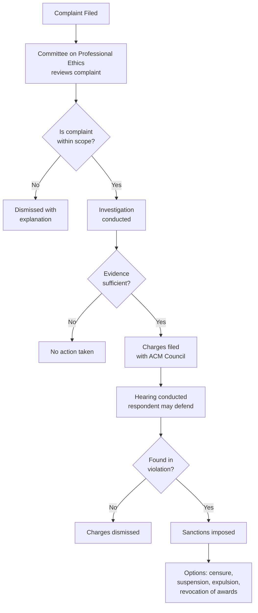
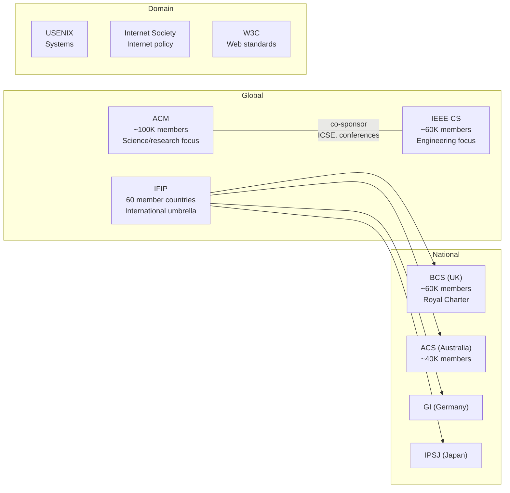
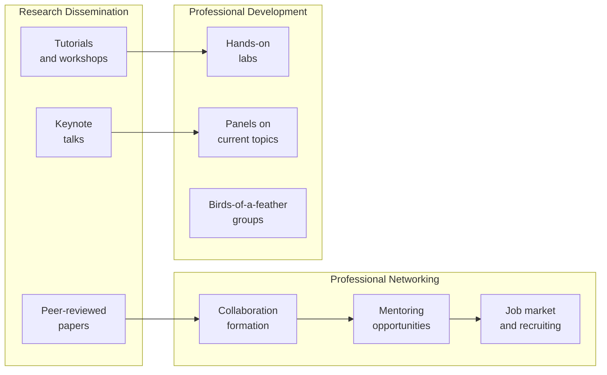
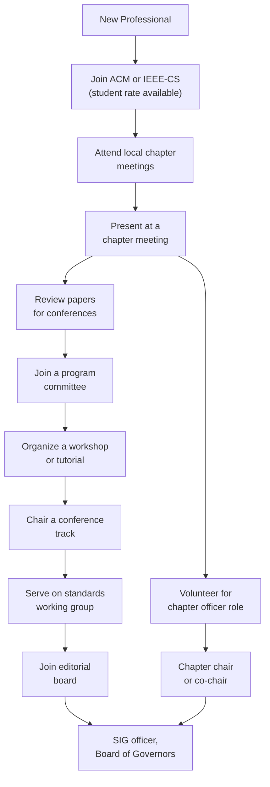

# Professional Societies and Community

> Professional societies are the backbone of software engineering as a discipline. They codify knowledge through bodies of knowledge, set ethical standards, foster research through conferences and journals, provide certification pathways, and create the community infrastructure that transforms a collection of practitioners into a profession.

## 1. Why Professional Societies Matter

A **profession** is distinguished from a mere occupation by several characteristics, most of which depend on the existence of organized societies:

| Characteristic | Role of Societies |
|---|---|
| **Shared body of knowledge** | Societies commission and maintain BoK documents (SWEBOK, PMBOK, BABOK) |
| **Ethical codes** | Societies draft, ratify, and enforce codes of ethics |
| **Education standards** | Societies accredit university programs (via ABET, Engineering Council) |
| **Certification** | Societies offer professional certifications (CSDP, CISSP, ISTQB) |
| **Peer community** | Societies organize conferences, journals, SIGs, and local chapters |
| **Disciplinary mechanisms** | Societies investigate ethics violations and revoke membership or certification |
| **Public advocacy** | Societies lobby governments on policy, funding, and regulation |

> [!important] Software engineering is still a **young profession** compared to law, medicine, or civil engineering. Professional societies play an outsized role in defining what it means to be a software engineer precisely because the profession lacks the centuries of accumulated tradition that older professions enjoy.

### Relationship to Ethics and Professionalism

Professional societies are the primary institutional mechanism through which ethical standards are created, disseminated, and enforced. Without them, codes of ethics would be aspirational documents with no accountability structure. See [[01_Professionalism_Ethics_and_Legal]] for the codes themselves; this note covers the organizations that maintain them.

---

## 2. ACM: Association for Computing Machinery

### 2.1 History and Mission

| Attribute | Detail |
|---|---|
| **Founded** | 1947, at Columbia University, New York |
| **Mission** | Advance computing as a science and profession |
| **Membership** | ~100,000 members worldwide (as of 2024) |
| **Headquarters** | New York City, New York, USA |
| **Scope** | Broadest computing society; covers all subfields from theory to practice |

The ACM was the first professional society dedicated to computing. It was founded before the term "software engineering" existed (the term was coined at the 1968 NATO conference in Garmisch). ACM's evolution mirrors the evolution of the field itself.

### 2.2 Special Interest Groups (SIGs)

ACM organizes its technical community through **Special Interest Groups**, each focused on a subfield of computing:

| SIG | Full Name | Focus Area | Key Activities |
|---|---|---|---|
| **SIGSOFT** | Software Engineering | Software engineering research and practice | Sponsors ICSE, FSE, ISSTA; publishes SEN |
| **SIGPLAN** | Programming Languages | PL design, implementation, theory | Sponsors PLDI, POPL, OOPSLA |
| **SIGMOD** | Management of Data | Databases, data management | Sponsors SIGMOD Conference, PODS |
| **SIGGRAPH** | Computer Graphics | Graphics, interactive techniques | Sponsors SIGGRAPH conference |
| **SIGCHI** | Computer-Human Interaction | HCI, UX, accessibility | Sponsors CHI conference |
| **SIGOPS** | Operating Systems | OS design, distributed systems | Sponsors SOSP, EuroSys |
| **SIGCOMM** | Data Communication | Networking protocols, architecture | Sponsors SIGCOMM conference |
| **SIGAI** | Artificial Intelligence | AI, machine learning, robotics | Sponsors AAAI (co-sponsored), AIES |
| **SIGCSE** | Computer Science Education | CS pedagogy, curriculum | Sponsors SIGCSE Technical Symposium |
| **SIGDOC** | Design of Communication | Technical writing, documentation | Sponsors SIGDOC conference |

> [!note] SIGSOFT is the most directly relevant SIG for software engineers. Its newsletter, *Software Engineering Notes (SEN)*, has published since 1976. SIGSOFT also bestows the **ACM SIGSOFT Outstanding Research Award** and the **Distinguished Paper Award** at its sponsored conferences.

### 2.3 ACM Publications

ACM publishes some of the most prestigious venues in computing:

| Publication | Type | Impact on SE |
|---|---|---|
| **Communications of the ACM (CACM)** | Monthly magazine | Broad readership; research summaries, practice articles, editorials |
| **ACM Transactions on Software Engineering and Methodology (TOSEM)** | Research journal | Top SE research journal (with IEEE TSE) |
| **ACM Computing Surveys** | Survey journal | Authoritative surveys on any computing topic |
| **Proceedings of the ACM on Programming Languages (PACMPL)** | Journal/proceedings | Covers POPL, PLDI, OOPSLA, ICFP papers |
| **ACM Transactions on Computer Systems** | Research journal | Systems research |
| **ACM Queue** | Practitioner magazine | Industry-focused, bridge between research and practice |

### 2.4 ACM Conferences Relevant to Software Engineering

| Conference | Full Name | Focus | Typical Acceptance Rate |
|---|---|---|---|
| **ICSE** | International Conference on Software Engineering | Premier SE conference (co-sponsored with IEEE) | ~20-25% |
| **FSE** | Foundations of Software Engineering | SE research + industry track | ~20-25% |
| **ISSTA** | International Symposium on Software Testing and Analysis | Testing, analysis, verification | ~25-30% |
| **ASE** | Automated Software Engineering | Automation in SE | ~20-25% |
| **ESEC** | European Software Engineering Conference | European SE research (often co-located with FSE) | ~20-25% |

> ICSE and FSE are widely considered the two most prestigious venues for software engineering research, alongside IEEE TSE for journal publications.

### 2.5 ACM Code of Ethics and Disciplinary Process

The **ACM Code of Ethics and Professional Conduct** (adopted 1992, revised 2018) contains 24 imperatives organized under:

1. **General ethical principles** (contributions to society, avoid harm, honesty, non-discrimination, property credit, privacy)
2. **Professional responsibilities** (high quality work, maintain competence, know and respect rules, give thorough evaluations, manage resources, accept professional review)
3. **Professional leadership principles** (social impact, personnel management, organizational leadership, acknowledge computing limitations)
4. **Compliance with the Code**

**Disciplinary Process:**

**Sanctions available:** censure (public reprimand), suspension (temporary loss of membership rights), expulsion (permanent removal), revocation of awards and honors. The process is designed to be fair to the accused while holding members accountable.

---

## 3. IEEE Computer Society

### 3.1 History and Mission

| Attribute | Detail |
|---|---|
| **Founded** | 1946 (as the IRE Computer Group; IEEE-CS formed 1971 from merger with AIEE) |
| **Mission** | Be the leading provider of technical information and services to computing professionals |
| **Membership** | ~60,000 members (part of IEEE's 400,000+ total) |
| **Headquarters** | Washington, D.C., USA |
| **Scope** | Computing and computer engineering; stronger engineering orientation than ACM |

The IEEE Computer Society is the computing arm of the **Institute of Electrical and Electronics Engineers (IEEE)**, the world's largest technical professional organization. While ACM is more science/research oriented, IEEE-CS has a stronger engineering and industry orientation.

### 3.2 SWEBOK Project

One of IEEE-CS's most significant contributions is the **Software Engineering Body of Knowledge (SWEBOK)** project:

| Version | Year | Impact |
|---|---|---|
| SWEBOK Guide 2004 | 2004 | First internationally recognized SE BoK; ISO/IEC TR 19759:2005 |
| SWEBOK Guide v3 | 2014 | Updated knowledge areas; added security, computing foundations |
| **SWEBOK Guide v4** | 2024 | Current version; 18 knowledge areas; expanded coverage of modern practices |

> SWEBOK is the canonical reference that organizes what a software engineer should know. It is used to guide curriculum design, certification exams, and professional development plans. The **SWEBOK v4** covers 18 knowledge areas and is the basis for this entire knowledge base. See [[01_Professionalism_Ethics_and_Legal]] for how SWEBOK relates to accreditation and the [[Software Quality Overview]] for the quality knowledge areas.

### 3.3 IEEE-CS Publications

| Publication | Type | Impact on SE |
|---|---|---|
| **IEEE Transactions on Software Engineering (TSE)** | Research journal | Top SE journal (with ACM TOSEM); highest impact factor in SE |
| **IEEE Software** | Practitioner magazine | Bridging research and practice; theme issues on current topics |
| **IEEE Computer** | Magazine | Broad computing audience; opinion, trends, emerging technologies |
| **IEEE Transactions on Reliability** | Research journal | Reliability engineering, fault tolerance |
| **IEEE Security & Privacy** | Magazine | Cybersecurity, privacy, policy |
| **IEEE Annals of the History of Computing** | Journal | Computing history and heritage |

### 3.4 IEEE-CS Conferences

| Conference | Full Name | Focus |
|---|---|---|
| **ICSE** | International Conference on Software Engineering | Co-sponsored with ACM; premier SE venue |
| **RE** | International Requirements Engineering Conference | Requirements engineering |
| **Metrics** | International Symposium on Software Metrics | Software measurement and empirical SE |
| **COMPSAC** | Computer Software and Applications Conference | Software applications and practice |
| **ESEM** | Empirical Software Engineering and Measurement | Empirical methods in SE |

### 3.5 CSDP Certification

The **Certified Software Development Professional (CSDP)** is IEEE-CS's flagship certification:

| Attribute | Detail |
|---|---|
| **Eligibility** | BS degree + 2 years SE experience, or 4 years SE experience without degree |
| **Exam** | 150 multiple-choice questions, 3.5 hours |
| **Knowledge basis** | SWEBOK (mapped directly to exam topics) |
| **Validity** | 3 years; renewal via continuing education units (CEUs) |
| **Cost** | ~$450 USD for IEEE members, ~$600 non-members |

**CSDP Knowledge Area Distribution:**

| Knowledge Area | Approximate Weight |
|---|---|
| Software Requirements | 8% |
| Software Design | 12% |
| Software Construction | 10% |
| Software Testing | 8% |
| Software Maintenance | 4% |
| Software Configuration Management | 4% |
| Software Engineering Management | 8% |
| Software Engineering Process | 6% |
| Software Engineering Models and Methods | 6% |
| Software Quality | 8% |
| Software Engineering Professional Practice | 6% |
| Software Engineering Economics | 4% |
| Computing Foundations | 12% |
| Mathematical Foundations | 3% |
| Engineering Foundations | 3% |

> [!tip] The CSDP exam is directly based on SWEBOK. Studying SWEBOK systematically (which is what this knowledge base does) is the most effective CSDP preparation strategy.

---

## 4. IFIP: International Federation for Information Processing

### 4.1 Overview

| Attribute | Detail |
|---|---|
| **Founded** | 1960, under UNESCO auspices |
| **Mission** | Stimulate and support ICT research, development, and education worldwide |
| **Structure** | ~60 member countries, organized into Technical Committees (TCs) and Working Groups (WGs) |
| **Unique role** | International umbrella; coordinates national computing societies globally |

IFIP is the international federation that connects national computing societies. It does not have individual members like ACM or IEEE; instead, it operates through national member societies (e.g., ACS for Australia, BCS for UK, GI for Germany).

### 4.2 Technical Committees and Working Groups

| TC | Name | Relevance to SE |
|---|---|---|
| **TC1** | Foundations of Computer Science | Theoretical foundations |
| **TC2** | Software: Theory and Practice | Software development methods, programming languages |
| **TC3** | Education | CS/SE education and curriculum |
| **TC5** | Information Technology Applications | IT in industry, government, society |
| **TC6** | Communication Systems | Networking |
| **TC7** | System Modeling and Optimization | Mathematical modeling |
| **TC8** | Information Systems | IS development and management |
| **TC9** | ICT and Society | Social implications, ethics |
| **TC10** | Computer Systems Technology | Hardware/software co-design |
| **TC11** | Security and Privacy in Information Processing | Cybersecurity |
| **TC12** | Artificial Intelligence | AI methods and applications |
| **TC13** | Human-Computer Interaction | HCI, usability, accessibility |
| **TC14** | Entertainment Computing | Games, digital art |
| **TC17** | Embedded and Cyber-Physical Systems | IoT, embedded software |

**Key Working Groups for Software Engineers:**

| WG | Parent TC | Focus |
|---|---|---|
| WG 2.4 | TC2 | Software Implementation Technology |
| WG 2.5 | TC2 | Numerical Software |
| WG 2.9 | TC2 | Software Engineering |
| WG 3.4 | TC3 | Professional and Vocational Education in IT |
| WG 9.1 | TC9 | Computers and Work |
| WG 10.4 | TC10 | Dependable Computing and Fault Tolerance |
| WG 13.1 | TC13 | Education in HCI |

### 4.3 World Computer Congress and IFIP Events

| Event | Description |
|---|---|
| **World Computer Congress (WCC)** | Flagship biennial event covering all TCs |
| **IFIP SEC** | International Information Security and Privacy Conference |
| **IFIP ICEC** | International Conference on Entertainment Computing |
| **IFIP WG Conferences** | Each WG may organize its own workshops and conferences |

### 4.4 IFIP IP3: International Professional Practice Partnership

The **IFIP IP3** program promotes global ICT professionalism through:

- **Global Industry Council (GIC):** Brings industry leaders into IFIP's professional standards work
- **ICT Professionalism Framework:** Defines competency levels, ethical standards, and certification recognition across countries
- **Mutual Recognition:** Facilitates recognition of professional certifications internationally (similar to the Washington Accord for degrees)

---

## 5. National and Regional Societies

### 5.1 BCS: The Chartered Institute for IT (British Computer Society)

| Attribute | Detail |
|---|---|
| **Founded** | 1957, Royal Charter 1984 |
| **Membership** | ~60,000 members |
| **Scope** | United Kingdom (but international membership) |
| **Unique feature** | **Chartered IT Professional (CITP)** status; Royal Charter gives it legal standing |
| **Code of Conduct** | 4 pillars: public interest, professional competence, duty to profession, duty to relevant authority |
| **Accreditation** | Accredits UK university computing programs |

BCS holds a **Royal Charter**, which gives it quasi-legal authority in the UK. A Chartered Engineer (CEng) registered through BCS has a legally recognized professional designation. This is one of the few cases where software engineering has formal legal standing as a profession.

### 5.2 ACS: Australian Computer Society

| Attribute | Detail |
|---|---|
| **Founded** | 1966 |
| **Membership** | ~40,000 members |
| **Scope** | Australia and Asia-Pacific |
| **Certification** | Certified Professional (CP), Certified Technologist (CT) |
| **Code of Ethics** | 6 values: priority of public interest, competence, honesty, social implications, professional development, enhancement of quality of life |
| **Accreditation** | Accredits Australian ICT programs |

### 5.3 Other Notable Societies

| Society | Country/Region | Focus |
|---|---|---|
| **GI (Gesellschaft fur Informatik)** | Germany | German informatics society; accredits programs |
| **IPSJ (Information Processing Society of Japan)** | Japan | Japan's primary CS society |
| **CIPS (Canadian Information Processing Society)** | Canada | IT professionalism; ISP certification |
| **IEEE (parent of IEEE-CS)** | Global (US-based) | Broader than computing; 400,000+ members |
| **USENIX** | Global (US-based) | Systems, security, operating systems; advanced computing |
| **Internet Society (ISOC)** | Global | Internet standards, policy, governance |
| **W3C (World Wide Web Consortium)** | Global | Web standards (HTML, CSS, accessibility) |

### 5.4 Comparison of Major Societies

---

## 6. How Societies Define the Profession

Professional societies collectively perform the functions that establish software engineering as a recognized profession:

### 6.1 Knowledge Codification

| Society | Knowledge Product | Impact |
|---|---|---|
| IEEE-CS | **SWEBOK** (Software Engineering Body of Knowledge) | Canonical SE knowledge reference; ISO/IEC TR 19759 |
| ACM/IEEE-CS | **CS2013** (Computer Science Curricula) | CS degree program guidelines |
| IEEE-CS | **CSDA/CSDP** exam blueprint | Maps SWEBOK to certification |
| ACM | **Computing Curricula** series | ACM/IEEE joint curriculum guidelines |
| ISACA | **COBIT** | IT governance framework |
| (ISC)² | **CBK** (Common Body of Knowledge) | Security professional knowledge base |

### 6.2 Standards and Guidelines

Societies produce or influence key standards:

| Standard | Society Connection | Purpose |
|---|---|---|
| **IEEE 730** | IEEE-CS | Software Quality Assurance Plans |
| **IEEE 829** | IEEE-CS | Software Test Documentation |
| **IEEE 1012** | IEEE-CS | Software Verification and Validation |
| **IEEE 1028** | IEEE-CS | Software Reviews and Audits |
| **IEEE 12207** | IEEE-CS/ISO | Software Life Cycle Processes |
| **ISO/IEC 25010** | ISO/IEC (influenced by IEEE) | System and Software Quality Models |
| **ACM/IEEE Code of Ethics** | ACM + IEEE-CS joint | Professional ethical standards |

### 6.3 Conferences and Knowledge Exchange

Conferences serve multiple professional functions:

### 6.4 Training and Continuing Education

| Mechanism | Example |
|---|---|
| **Conference tutorials** | ICSE, FSE pre/post-conference tutorials |
| **Online learning** | ACM Learning Center, IEEE Learning Network |
| **Webinars** | IEEE-CS Tech Talk series, ACM Webinars |
| **Certification prep** | CSDP study groups, CISSP boot camps |
| **Chapter events** | Local ACM/IEEE chapter meetings and talks |

### 6.5 Disciplinary Actions

| Society | Mechanism | Examples |
|---|---|---|
| **ACM** | Committee on Professional Ethics | Can censure, suspend, or expel members for ethics violations |
| **IEEE** | Member Conduct Committee | Investigates complaints; can revoke membership and certifications |
| **BCS** | Disciplinary Committee (via Royal Charter) | Can revoke Chartered status; has legal standing |
| **(ISC)²** | Ethics Committee | Can revoke CISSP and other certifications |

> [!warning] Disciplinary enforcement in software engineering is much weaker than in medicine or law. A doctor can lose their license to practice; a software engineer expelled from ACM can still practice software engineering. The lack of a mandatory licensing requirement (except in rare safety-critical domains) means society discipline is voluntary and limited to membership/certification revocation.

---

## 7. Getting Involved: Chapters, Volunteering, Committees

### 7.1 Local and Student Chapters

| Society | Chapter Types | Benefits |
|---|---|---|
| **ACM** | Professional chapters, Student chapters (~600 worldwide) | Local talks, networking, career events |
| **IEEE-CS** | Joint chapters with IEEE sections | Technical meetings, workshops |
| **BCS** | Local branches (UK), Specialist Groups | UK-focused networking, CPD events |
| **USENIX** | LISA (Large Installation System Administration) community | Systems community events |

### 7.2 Volunteer Roles

| Role Level | Activities | Time Commitment |
|---|---|---|
| **Attendee** | Attend chapter meetings, conferences | Low |
| **Presenter** | Give talks at chapter meetings, workshops | Low-medium |
| **Reviewer** | Review papers for conferences/journals | Medium (a few papers per cycle) |
| **Organizer** | Help organize conferences, workshops, tutorials | Medium-high |
| **Committee member** | Serve on program committees, standards working groups | Medium-high |
| **Officer** | Chapter chair, SIG officer, editorial board member | High |
| **Board/Council** | ACM Council, IEEE-CS Board of Governors | High |

### 7.3 Standards Working Groups

Participating in standards development (IEEE, ISO/IEC JTC 1/SC 7) is one of the most impactful forms of professional service:

- Standards affect every practitioner who uses them
- Working group participation provides deep technical networking
- It builds credentials recognized across the industry
- IEEE standards working groups are open to IEEE members
- ISO/IEC working groups require national body nomination

### 7.4 Paths to Involvement

---

## 8. The Evolving Landscape

### 8.1 Open Source Communities as Professional Societies

Traditional societies now compete with open source communities for the engagement of software engineers:

| Dimension | Traditional Societies | Open Source Communities |
|---|---|---|
| **Membership** | Formal, paid | Informal, free |
| **Knowledge exchange** | Journals, conferences | GitHub, forums, chat (Discord, Slack) |
| **Reputation** | Publications, certifications | Contribution history, maintainer status |
| **Governance** | Elected boards, bylaws | Benevolent dictator, meritocracy, foundations (Apache, Linux Foundation) |
| **Ethics enforcement** | Formal committees | Community norms, codes of conduct (Contributor Covenant) |
| **Geographic reach** | Chapters by region | Global, asynchronous |

### 8.2 Industry Foundations

Industry foundations increasingly fill roles traditionally held by professional societies:

| Foundation | Focus | Activities |
|---|---|---|
| **Linux Foundation** | Linux, cloud native, AI | Training, certification (LFCS, CKA), events (Open Source Summit) |
| **Apache Software Foundation** | Open source projects | Project governance, conferences |
| **CNCF** | Cloud native | Kubernetes certification (CKA/CKAD), KubeCon |
| **OpenSSF** | Open source security | Security training, best practices, Scorecard |
| **Eclipse Foundation** | IDE, IoT, Java | EclipseCon, project governance |

### 8.3 Future Trends

| Trend | Implication for Professional Societies |
|---|---|
| **AI-assisted software engineering** | Societies must define ethics and standards for AI-generated code |
| **Remote work** | Virtual chapters, online conferences become primary; geographic chapters decline |
| **Micro-credentials** | Traditional multi-year certifications compete with targeted nanodegrees and badges |
| **Global workforce** | Need for mutual recognition of credentials across countries increases |
| **Regulatory pressure** | EU AI Act, Cyber Resilience Act create demand for professional standards that societies can provide |

> [!tip] The most effective professional strategy is to be active in both a traditional society (for credentials, ethics, and broad community) and a practitioner/open source community (for cutting-edge technical skills and immediate practical networking). They serve complementary purposes.

---

## 9. Cross-Reference Summary

| Topic | Related Note |
|---|---|
| ACM/IEEE Code of Ethics details | [[01_Professionalism_Ethics_and_Legal]] |
| Communication skills for professional work | [[03_Communication_Skills]] |
| Group dynamics and team collaboration | [[02_Group_Dynamics_and_Psychology]] |
| Ethics and professional responsibility | [[01_Professionalism_Ethics_and_Legal]] |
| Certification vs accreditation vs licensing | [[01_Professionalism_Ethics_and_Legal]] |
| SWEBOK knowledge areas overview | [[Professionalism of Software Engineering Overview]] |

---

## Key Takeaways

1. **ACM and IEEE-CS are the two dominant computing societies.** ACM leans science/research; IEEE-CS leans engineering/industry. Together they co-sponsor the premier SE conference (ICSE) and maintain SWEBOK.
2. **IFIP provides international coordination** through Technical Committees and Working Groups, connecting national societies.
3. **National societies (BCS, ACS) can have legal standing** that international societies lack, particularly through Royal Charters or government-recognized certification.
4. **Societies define the profession** through BoK documents, standards, conferences, certification, and disciplinary mechanisms, though enforcement remains weaker than in medicine or law.
5. **Getting involved is a career multiplier:** reviewing papers, joining committees, and contributing to standards builds reputation and network that pure technical work alone cannot.
6. **The landscape is evolving:** open source communities and industry foundations are competing with traditional societies for professional engagement, and societies must adapt to remain relevant.
