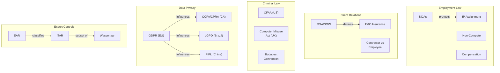

# Employment Contracts, Legal, and Regulatory Issues

> Software engineers operate within a complex web of legal frameworks: employment contracts define their obligations to employers, client agreements define obligations to customers, professional liability standards define their duty of care, and government regulations define what they can build, ship, and store. Understanding these frameworks is not optional; it is a professional competency.

## 1. Employment Contract Structures

### 1.1 Anatomy of a Software Engineering Employment Contract

| Clause | Purpose | Typical Content |
|---|---|---|
| **Job description and duties** | Defines role, responsibilities, reporting structure | Title, team, scope of work, performance expectations |
| **Compensation** | Salary, bonuses, equity, benefits | Base salary, bonus targets, RSU/option grants, vesting schedule |
| **At-will employment** | Either party can terminate at any time (US) | Standard in most US states; absent in most EU countries |
| **Probationary period** | Trial period with easier termination | 30-90 days; common in many countries |
| **Work location and remote work** | Where work is performed | Office address, remote work policy, geographic restrictions |
| **Working hours and overtime** | Expected schedule | Standard hours, on-call expectations, overtime compensation |
| **Intellectual property assignment** | Who owns work product | See Section 1.3 |
| **Confidentiality/NDA** | Obligation to protect trade secrets | See Section 1.2 |
| **Non-compete** | Restriction on working for competitors | See Section 1.4 |
| **Non-solicitation** | Restriction on recruiting former colleagues/clients | 12-24 months; soliciting employees or customers |
| **Termination provisions** | How employment ends | Notice period, severance, cause for immediate termination |
| **Dispute resolution** | How disputes are handled | Arbitration clause, governing law, jurisdiction |

### 1.2 Non-Disclosure Agreements (NDAs)

NDAs protect confidential information. They are among the most common legal instruments in software engineering:

| NDA Type | Direction | Purpose |
|---|---|---|
| **One-way NDA** | One party discloses, other receives | Sharing proprietary info with a contractor |
| **Mutual NDA** | Both parties disclose and receive | Joint ventures, partnership discussions |
| **Employment NDA** | Employee receives employer's confidential info | Standard in employment contracts |
| **Invention assignment NDA** | Employee assigns IP to employer | Combined confidentiality + IP assignment |

**What NDAs typically cover:**

| Category | Examples | Duration |
|---|---|---|
| **Trade secrets** | Algorithms, architectures, pricing models | Perpetual (as long as they remain secret) |
| **Source code** | Proprietary code, internal tools | Duration of agreement + N years |
| **Business information** | Customer lists, financial data, strategy | 2-5 years |
| **Technical information** | Designs, specifications, research data | 2-5 years |
| **Personal data** | Customer PII, employee data | Perpetual (data privacy obligations survive) |

> [!warning] NDAs should **not** be used to cover up illegal activity, safety hazards, or fraud. Whistleblower protections in most jurisdictions override NDA obligations. If you discover that your employer is doing something illegal or dangerous, the NDA does not prevent you from reporting to regulators or law enforcement.

### 1.3 Intellectual Property Assignment

IP assignment clauses determine who owns the code, inventions, and creative works produced during employment:

| Jurisdiction | Default Rule | Common Contract Modification |
|---|---|---|
| **United States** | Work for hire: employer owns work done within scope of employment | Broad assignment clauses may claim work done on personal time/equipment |
| **California** | Labor Code 2870: employer cannot claim inventions made on own time, unrelated to business | Employers still often require disclosure of all inventions |
| **United Kingdom** | Copyright, Designs and Patents Act 1988: employer owns work created in course of employment | Similar to US; contract can expand scope |
| **Germany** | Employee Inventions Act (ArbNErfG): employee must report inventions; employer can claim with compensation | Mandatory compensation for claimed inventions |
| **European Union** | Varies by country; generally employer-friendly for work done in scope | GDPR implications for data-related inventions |

**Key IP Concepts for Software Engineers:**

| Concept | Definition | SE Application |
|---|---|---|
| **Work for hire** | Work created by an employee within scope of employment | Code written as part of your job is owned by employer |
| **Copyright** | Automatic protection of original expression | Source code is copyrightable; algorithms and ideas are not |
| **Patent** | Protection of novel, non-obvious inventions | Software patents are controversial; some algorithms are patented |
| **Trade secret** | Confidential business information | Algorithms, data, techniques that provide competitive advantage |
| **Open source license** | Permissive or copyleft terms for code sharing | Employer policy on contributing to open source |

> [!tip] Before starting any side project, read your employment contract's IP clause carefully. In some jurisdictions, work done on your own time with your own equipment is still assignable to your employer if it relates to the employer's business. California's Labor Code 2870 provides the strongest protections; other states and countries vary.

### 1.4 Non-Compete and Non-Solicitation

| Clause | What It Restricts | Typical Duration | Enforceability |
|---|---|---|---|
| **Non-compete** | Working for a competitor | 6-24 months | Highly variable by jurisdiction |
| **Non-solicitation (employees)** | Recruiting former colleagues | 12-24 months | Generally enforceable if reasonable |
| **Non-solicitation (clients)** | Soliciting former employer's clients | 12-24 months | Generally enforceable if reasonable |
| **Non-dealing** | Any business with former clients | 12-24 months | Stricter; less commonly enforced |

**Non-Compete Enforceability by Jurisdiction:**

| Jurisdiction | Enforceability | Notes |
|---|---|---|
| **California** | **Not enforceable** | Business and Professions Code 16600; non-competes are void |
| **Other US states** | Varies; generally enforceable if reasonable | Must protect legitimate business interest; limited in scope, geography, duration |
| **FTC Rule (2024)** | Proposed nationwide ban | FTC voted to ban non-competes; legal challenges pending |
| **United Kingdom** | Enforceable if reasonable | Courts apply reasonableness test; too broad = unenforceable |
| **Germany** | Enforceable with compensation | Employer must pay at least 50% of last compensation during restriction |
| **India** | Generally not enforceable | Restraint of trade doctrine; limited exceptions |
| **EU** | Varies by country | Some countries (France, Netherlands) have specific requirements |

> [!important] If you sign a non-compete in California, it is void. If you sign one in New York, it may be enforceable for 12 months if it is reasonable in scope and geography. Always consult a lawyer if you are uncertain about your obligations.

---

## 2. Client-Engineer Relationships

### 2.1 Independent Contractor vs Employee

The distinction between employee and independent contractor has major legal, tax, and practical implications:

| Dimension | Employee | Independent Contractor |
|---|---|---|
| **Control** | Employer controls how, when, where work is done | Contractor controls methods and schedule |
| **Tools** | Employer provides tools and equipment | Contractor provides own tools |
| **Tax** | Employer withholds income tax, pays payroll taxes | Contractor pays own taxes (self-employment tax) |
| **Benefits** | Eligible for benefits (health, retirement, PTO) | No benefits |
| **IP ownership** | Work for hire (employer owns) | Must be explicitly assigned in contract |
| **Liability** | Employer liable for employee actions within scope | Contractor liable for own actions |
| **Termination** | Subject to employment law protections | Subject to contract terms |
| **Duration** | Ongoing relationship | Project-based or time-limited |

**IRS 20-Factor Test (US):** The IRS uses a multi-factor test to determine worker classification. Key factors include:

- Does the company control when, where, and how the worker performs?
- Does the company provide training?
- Is the work an integral part of the business?
- Can the worker realize profit or loss?
- Is there a written contract describing the relationship?

> [!warning] Misclassifying employees as contractors is illegal and has severe consequences. Companies can face back taxes, penalties, and class action lawsuits. Uber, Lyft, and other gig economy companies have faced landmark litigation over this issue. If your employer treats you like an employee but classifies you as a contractor, you may have legal recourse.

### 2.2 Consulting Agreements

| Agreement Type | Purpose | When Used |
|---|---|---|
| **Master Service Agreement (MSA)** | Framework for ongoing relationship | Long-term consulting relationships |
| **Statement of Work (SOW)** | Defines specific project scope | Each project under an MSA |
| **Time and Materials (T&M)** | Payment by hour/day + expenses | When scope is uncertain |
| **Fixed Price** | Payment for defined deliverables | When scope is well-defined |
| **Retainer** | Fixed monthly fee for availability | Ongoing advisory relationships |

**MSA Key Clauses:**

| Clause | Purpose |
|---|---|
| **Scope of services** | What the consultant will and will not do |
| **Deliverables and acceptance** | What is delivered and how it is accepted |
| **Payment terms** | Rate, invoicing schedule, payment terms (Net 30, Net 60) |
| **IP ownership** | Who owns the work product (consultant or client) |
| **Confidentiality** | Mutual NDA provisions |
| **Indemnification** | Who is liable if third party sues |
| **Limitation of liability** | Caps on damages |
| **Termination** | How the agreement ends; notice period; wind-down |
| **Insurance** | Professional liability (E&O), general liability requirements |

### 2.3 Statement of Work (SOW) Structure

| Section | Contents |
|---|---|
| **Background** | Context, business problem, stakeholders |
| **Scope of work** | Specific tasks, activities, deliverables |
| **Timeline** | Milestones, deadlines, dependencies |
| **Acceptance criteria** | How deliverables are evaluated and accepted |
| **Pricing** | Fixed price, rate card, or budget cap |
| **Assumptions** | What is assumed to be true |
| **Exclusions** | What is explicitly out of scope |
| **Change management** | How scope changes are handled |

---

## 3. Professional Liability

### 3.1 Negligence Standards

Professional negligence applies when a software engineer fails to exercise the degree of care that a reasonable software engineer would exercise under similar circumstances:

| Element | Description | SE Application |
|---|---|---|
| **Duty of care** | Obligation to exercise reasonable care | Software engineers have a duty to produce work that meets professional standards |
| **Breach** | Failure to meet the standard of care | Ignoring known defects, skipping testing, using deprecated/insecure libraries |
| **Causation** | The breach caused the harm | The defect in the software caused the injury or loss |
| **Damages** | Actual harm occurred | Financial loss, data breach, physical injury, death |

**Standard of Care for Software Engineers:**

| Standard | Description |
|---|---|
| **Ordinary negligence** | Failure to exercise reasonable care (general professional standard) |
| **Gross negligence** | Reckless disregard for professional duties |
| **Malpractice** | Professional negligence by a licensed professional (rarely applied to software engineers who are not licensed) |

> [!note] "Malpractice" technically requires a license. Since most software engineers are not licensed, the correct legal term for their negligence is "professional negligence." However, in practice, the terms are often used interchangeably.

### 3.2 Duty of Care

A software engineer's duty of care includes:

| Duty | Examples of Breach |
|---|---|
| **Duty to test** | Releasing software without adequate testing |
| **Duty to disclose** | Hiding known defects from stakeholders |
| **Duty to follow standards** | Ignoring applicable industry standards (IEEE, ISO) |
| **Duty to maintain competence** | Using technologies you don't understand |
| **Duty to protect data** | Storing passwords in plaintext, ignoring OWASP guidelines |
| **Duty to document** | Failing to document critical system behavior |

### 3.3 Errors and Omissions Insurance

| Coverage | What It Protects Against |
|---|---|
| **Professional liability (E&O)** | Claims arising from professional services (errors, omissions, negligence) |
| **General liability** | Bodily injury, property damage (slip and fall at your office) |
| **Cyber liability** | Data breaches, privacy violations, cyber attacks |
| **Directors and officers (D&O)** | Claims against company leadership for management decisions |

| Policy Type | Typical Coverage | Typical Cost |
|---|---|---|
| **E&O for individual** | $500K - $2M | $500 - $2,000/year |
| **E&O for small firm** | $1M - $5M | $2,000 - $10,000/year |
| **E&O for large firm** | $5M - $50M | Negotiated |
| **Cyber liability** | $1M - $10M | $1,000 - $50,000/year (varies by data volume) |

---

## 4. Cybercrime Law

### 4.1 US: Computer Fraud and Abuse Act (CFAA)

The CFAA (18 U.S.C. 1030) is the primary US federal computer crime statute:

| Offense | Description | Penalty |
|---|---|---|
| **Unauthorized access** | Accessing a computer without authorization | Up to 5 years (first offense), 10 years (repeat) |
| **Exceeding authorized access** | Authorized access but using it for unauthorized purposes | Same as unauthorized access |
| **Trafficking in passwords** | Selling or sharing access credentials | Up to 1-5 years |
| **Extortion involving computers** | Threatening to damage a computer or steal data | Up to 5-10 years |
| **Damage to a computer** | Intentionally causing damage (viruses, ransomware) | Up to 5-10 years (more if critical infrastructure) |

**Notable CFAA Cases:**

| Case | Issue | Outcome |
|---|---|---|
| **United States v. Swartz (2011)** | Downloading academic papers from JSTOR | Prosecution under CFAA; Swartz died by suicide; case contributed to reform debate |
| **Van Buren v. United States (2021)** | Police officer misusing law enforcement database | Supreme Court narrowed "exceeds authorized access" to mean accessing areas one has no right to access, not misusing access one has |
| **LinkedIn v. hiQ (2022)** | Web scraping public LinkedIn profiles | Scraping publicly available data is not "unauthorized access" |

### 4.2 UK: Computer Misuse Act

| Offense | Description | Penalty |
|---|---|---|
| **Unauthorized access to computer material** | Hacking, accessing without permission | Up to 2 years |
| **Unauthorized access with intent** | Accessing to commit further offenses | Up to 5 years |
| **Unauthorized modification** | Altering data, planting malware, DDoS | Up to 10 years |
| **Making, supplying, or obtaining tools** | Creating or distributing hacking tools | Up to 2 years |

### 4.3 EU: Convention on Cybercrime (Budapest Convention)

The Budapest Convention (2001) is the first international treaty on cybercrime. It covers:

- Illegal access, interception, data interference, system interference
- Computer-related fraud and forgery
- Content-related offenses (child exploitation)
- Copyright infringement
- Aiding and abetting

---

## 5. Data Privacy Regulations

### 5.1 GDPR: General Data Protection Regulation (EU)

GDPR is the world's most comprehensive data privacy regulation:

| Requirement | Description | Penalties |
|---|---|---|
| **Lawful basis** | Must have legal basis for processing (consent, contract, legitimate interest, etc.) | Up to 4% of global annual revenue or 20M EUR |
| **Data minimization** | Collect only what is necessary | Same |
| **Purpose limitation** | Use data only for stated purposes | Same |
| **Storage limitation** | Don't keep data longer than necessary | Same |
| **Data subject rights** | Access, rectification, erasure, portability, objection | Same |
| **Data protection by design** | Build privacy into systems from the start | Same |
| **Data breach notification** | Report breaches to authority within 72 hours | Same |
| **DPO requirement** | Appoint Data Protection Officer for large-scale processing | Same |
| **International transfers** | Adequacy decisions, SCCs, BCRs for cross-border data transfers | Same |

**GDPR Data Subject Rights:**

| Right | Description | SE Implication |
|---|---|---|
| **Right of access** | Individual can request all data held about them | Must be able to export all user data |
| **Right to rectification** | Individual can correct inaccurate data | Must support data correction |
| **Right to erasure** | Individual can request deletion ("right to be forgotten") | Must support complete data deletion |
| **Right to portability** | Individual can request data in machine-readable format | Must support data export |
| **Right to object** | Individual can object to processing | Must support opt-out mechanisms |
| **Right to restrict processing** | Individual can limit how data is used | Must support processing restrictions |

> [!important] GDPR applies to **any organization** that processes data of EU residents, regardless of where the organization is located. A US startup with EU customers must comply with GDPR.

### 5.2 US Privacy Laws

| Law | Scope | Key Requirements |
|---|---|---|
| **CCPA/CPRA (California)** | California consumers | Right to know, delete, opt out of sale; CPRA expanded to include correction and limit use of sensitive data |
| **HIPAA** | Healthcare data | Privacy Rule, Security Rule, Breach Notification Rule |
| **COPPA** | Children under 13 | Parental consent required for data collection |
| **FERPA** | Student education records | Limits disclosure without consent |
| **GLBA** | Financial data | Privacy notices, safeguards rule |
| **SOX** | Corporate financial data | Internal controls, audit requirements |
| **State laws** | Colorado, Virginia, Connecticut, Utah, etc. | Similar to CCPA; growing patchwork |

### 5.3 Other Major Privacy Regulations

| Regulation | Jurisdiction | Key Features |
|---|---|---|
| **LGPD (Brazil)** | Brazil | Similar to GDPR; 10 legal bases for processing; national authority (ANPD) |
| **PIPL (China)** | China | Consent-based; data localization requirements; extraterritorial application |
| **POPIA (South Africa)** | South Africa | 8 processing conditions; Information Regulator oversight |
| **PDPA (Singapore)** | Singapore | Consent and notification obligations; Do Not Call registry |
| **APPI (Japan)** | Japan | Adequacy decision with EU; consent for sensitive data |
| **PIPA (South Korea)** | South Korea | Strict consent requirements; data breach notification |

### 5.4 Data Breach Notification Requirements

| Jurisdiction | Notification Deadline | Who to Notify |
|---|---|---|
| **GDPR (EU)** | 72 hours to authority; without undue delay to individuals if high risk | Supervisory authority + affected individuals |
| **CCPA/CPRA (California)** | "Expedient" (no specific deadline) | Affected individuals + AG if >500 residents |
| **Australia (NDB)** | 30 days | OAIC + affected individuals |
| **Brazil (LGPD)** | "Reasonable time" (no specific deadline) | ANPD + affected individuals |
| **China (PIPL)** | Immediately | Authorities + affected individuals |
| **US (50 state laws)** | Varies (30-90 days typically) | State AG + affected individuals |

---

## 6. Export Controls

### 6.1 US Export Controls

| Regulation | Administering Body | Scope |
|---|---|---|
| **EAR (Export Administration Regulations)** | Bureau of Industry and Security (BIS) | Dual-use items (commercial + military potential) |
| **ITAR (International Traffic in Arms Regulations)** | Directorate of Defense Trade Controls (DDTC) | Defense articles and services |
| **OFAC (Office of Foreign Assets Control)** | US Treasury | Sanctions against countries, entities, individuals |

**EAR and Software:**

| Category | Examples | License Required? |
|---|---|---|
| **Encryption software** | VPN, TLS libraries, end-to-end encryption | Generally exempt under License Exception ENC (with reporting) |
| **Source code** | Proprietary algorithms, AI models | Depends on classification; most commercial software is EAR99 |
| **Cloud/SaaS** | Software delivered as a service | Generally not considered an "export" if accessed, not downloaded |
| **Open source** | Publicly available encryption source code | Exempt under public domain exclusion |

> [!warning] Export controls apply to **re-exports** as well. If you are a US company and you share controlled technology with a foreign colleague who then shares it with a sanctioned country, both you and the colleague may be liable. "Deemed exports" (sharing controlled technology with a foreign national within the US) also require export licenses.

### 6.2 ITAR and Defense Software

| Aspect | Detail |
|---|---|
| **USML Categories** | Category XII (fire control), Category XIII (auxiliary military equipment), Category XXI (miscellaneous) include software |
| **Registration** | Manufacturers/exporters of defense articles must register with DDTC |
| **License requirement** | Export of ITAR-controlled software requires a license for each transaction |
| **Penalties** | Up to $1M per violation, 20 years imprisonment |
| **Exceptions** | Limited; NATO allies may have reduced requirements |

### 6.3 Wassenaar Arrangement

| Aspect | Detail |
|---|---|
| **Purpose** | Multilateral export control regime for conventional arms and dual-use technologies |
| **Members** | 42 participating states (US, EU members, Japan, Australia, etc.) |
| **Control Lists** | Munitions List + Dual-Use List (includes Category 4: computers, Category 5: telecommunications and information security) |
| **Software relevance** | Intrusion software, IP network surveillance, and certain encryption technologies are controlled |
| **Enforcement** | Each member state implements domestically; no direct enforcement mechanism |

---

## 7. Legal Framework Summary

---

## 8. Practical Guidance for Software Engineers

### 8.1 Before Signing an Employment Contract

| Step | Action |
|---|---|
| **1. Read the IP clause** | Understand what the employer claims ownership of |
| **2. Read the non-compete** | Understand where you cannot work if you leave |
| **3. Read the NDA** | Understand what you cannot disclose |
| **4. Check state/country law** | Non-competes may be unenforceable in your jurisdiction |
| **5. Negotiate** | IP clause, non-compete scope, compensation, remote work terms |
| **6. Consult a lawyer** | If the contract is complex or you have side projects |

### 8.2 Common Legal Pitfalls

| Pitfall | Risk | Mitigation |
|---|---|---|
| **Contributing to open source without employer approval** | Employer may own the contribution; may violate IP clause | Get written approval; check employer's open source policy |
| **Using GPL code in proprietary software** | GPL requires derivative works to be open source | License scanning tools (FOSSA, Black Duck); legal review |
| **Storing data without privacy review** | GDPR/CCPA violation; fines up to 4% of global revenue | Privacy impact assessment; data protection officer review |
| **Ignoring export controls** | Criminal penalties; company fines | Classify technology; check denied parties lists |
| **Copying code from previous employer** | IP infringement; trade secret theft | Write new code; don't bring old code or notebooks |
| **Not documenting decisions** | Liability exposure; inability to defend design choices | Document rationale for safety/security decisions |

### 8.3 When to Consult a Lawyer

| Situation | Why |
|---|---|
| **Signing an employment contract** | Understand your obligations; negotiate terms |
| **Starting a side project** | Ensure it doesn't violate IP or non-compete clauses |
| **Leaving a company** | Understand non-compete obligations; return confidential materials |
| **Discovering illegal activity** | Whistleblower protections; legal obligations |
| **Receiving a legal demand** | Cease and desist, DMCA takedown, subpoena |
| **Handling personal data** | GDPR/CCPA compliance requirements |
| **Exporting software** | Export control classification and licensing |

---

## 9. Cross-Reference Summary

| Topic | Related Note |
|---|---|
| Ethics, codes of conduct, and legal practice | [[01_Professionalism_Ethics_and_Legal]] |
| Professional societies and community | [[06_Professional_Societies_and_Community]] |
| Communication skills for contracts | [[03_Communication_Skills]] |
| Group dynamics and team collaboration | [[02_Group_Dynamics_and_Psychology]] |
| Quality standards and compliance | [[05_Standards_and_Organization]] |
| Security practices | [[01_Quality_Fundamentals]] |

---

## Key Takeaways

1. **Read your employment contract carefully.** The IP, non-compete, and NDA clauses define your professional obligations and limitations. In California, non-competes are void; elsewhere, they may restrict your career mobility.
2. **Independent contractor vs employee distinction matters.** Misclassification has legal consequences for both parties. The IRS, HMRC, and other tax authorities are increasingly scrutinizing this.
3. **Professional liability is real.** Software engineers have a duty of care. Negligence (releasing known-defective software, failing to test, ignoring security) can result in legal liability. E&O insurance is worth considering.
4. **Data privacy regulations are global and expanding.** GDPR, CCPA/CPRA, LGPD, PIPL, and others impose requirements on every organization that handles personal data. Build privacy into systems from the start (privacy by design).
5. **Export controls apply to software.** Encryption, AI models, and defense-related software may require export licenses. "Deemed exports" (sharing with foreign nationals in the US) and re-exports also trigger obligations.
6. **When in doubt, consult a lawyer.** Legal advice is cheap compared to the cost of a lawsuit, regulatory fine, or career restriction.
