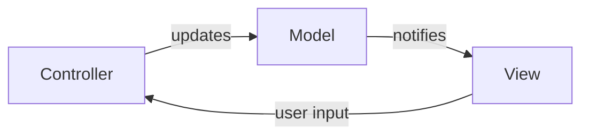

---
tags:
- book-summary
- pragmatic-programmer
- professionalism
- software-engineering
---

# 05 Bend, or Break (Tips 36–43)

Write code that bends but doesn't break. Flexible, decoupled, configurable — the opposite of rigid, fragile software.

---

## Tip 36: Minimize Coupling — Law of Demeter

> A method of an object should only call methods of: itself, its parameters, objects it creates, or its direct component objects.

```java
// ❌ Violates Law of Demeter — trains wreck
customer.getWallet().getCreditCard().getNumber();

// ✅ Fixed — delegate to wallet
customer.getPaymentMethod();  // Wallet handles the details
```

The Law of Demeter reduces coupling by limiting the knowledge one object has about another's internal structure. When the internal structure changes, fewer places break.

---

## Tip 37–38: Metaprogramming — Configure, Don't Integrate

> Put abstractions in CODE. Put details in METADATA.

Metadata is data about data. Configuration files, schemas, annotations. When details live in metadata, you can change behavior without changing code.

| Hardcoded | Configured |
|----------|-----------|
| `Thread.sleep(5000)` | `config.getPollInterval()` — reads from YAML |
| `if (userType == "ADMIN")` | `permissions.get(userType)` — reads from config |
| `new MySQLConnection(...)` | `ConnectionFactory.create(dbConfig)` |

### The Goal
A system should be highly configurable. Change business rules, UI layout, deployment targets, security policies — all without changing a single line of code.

---

## Tip 39: Temporal Coupling — Analyze Workflow to Improve Concurrency

> Time is a coupling dimension too. "A must happen before B" is coupling.

When components are temporally coupled, one must wait for the other. Break temporal coupling by designing activities that can happen concurrently.

### Example: The UML Activity Diagram

Draw the workflow as an activity diagram. Look for activities that don't need arrows between them. Those can run in parallel.

---

## Tip 40–41: Design Using Services, Always Design for Concurrency

> Design as independent, concurrent services communicating via clean interfaces.

| Monolithic "call" | Service-Oriented |
|------------------|-----------------|
| `paymentService.process(order)` — blocks | `messageQueue.send(new PaymentRequest(order))` — fire and forget |
| Sequential processing | Concurrent processing |
| Hard to scale | Scale services independently |

> Even if you don't need concurrency NOW, design for it. Global variables, singletons, and shared state make concurrency nearly impossible to add later.

---

## Tip 42: Separate Views from Models (MVC)

> The model is the data and business logic. The view is the presentation. The controller manages input. Separate them.



A model can have multiple views (GUI, CLI, web, API). A view works with any model implementing the right interface. This is the foundation of every modern UI framework.

---

## Tip 43: Blackboards — Use Publish/Subscribe for Workflow

> For detective work (AI, pattern matching, problem-solving), use a blackboard architecture.

Multiple specialized agents examine a shared blackboard. Each agent adds or modifies information based on its expertise. No central control — coordination emerges from the data.

| Example | How It Works |
|---------|-------------|
| Speech recognition | Acoustic agent → Phonetic agent → Word agent → Grammar agent — each reads the blackboard and contributes |
| Bug triage | Log analyzer, stack trace parser, blame finder, similar bug finder — each adds evidence |

---

## Sources

- Hunt & Thomas. *The Pragmatic Programmer*, Chapter 5.
