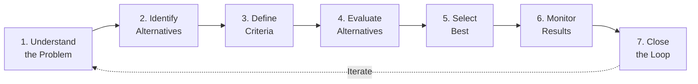

---
tags:
  - software-engineering-economics
  - decision-making
  - decision-trees
  - monte-carlo
  - sensitivity-analysis
source: "SWEBOK v4 Chapter 15 — Software Engineering Economics, Decision-Making Process"
created: 2026-07-21
---

# Decision-Making — Under Certainty, Risk, and Uncertainty

> Every engineering choice is a decision. Understanding how to structure decisions and analyze alternatives under different levels of information is central to software engineering economics.

## 1. The Engineering Decision-Making Process

A seven-step iterative process formalizes how engineers make decisions:



| Step | Activity | Common Failure Mode |
|---|---|---|
| **1. Understand** | Define problem scope, context, stakeholders | Solving wrong problem — jumping to solutions too fast |
| **2. Identify** | Generate alternatives (including do-nothing) | Premature closure — not considering enough options |
| **3. Define Criteria** | Metrics for comparison (cost, time, quality, risk) | Unbalanced criteria — optimizing for one dimension at expense of others |
| **4. Evaluate** | Apply analysis method appropriate to information level | Using certainty methods under uncertainty |
| **5. Select** | Choose best alternative based on defined criteria | Groupthink, anchoring on first plausible option |
| **6. Monitor** | Track actual outcomes vs. predicted | Decision without follow-through — never checking if it worked |
| **7. Close Loop** | Compare estimates to actuals; improve future decisions | Repeating same estimation errors indefinitely |

## 2. Three Levels of Decision Information

| Level | What You Know | Methods |
|---|---|---|
| **Certainty** | Each alternative produces exactly one known outcome | Break-even, optimization, simple cost comparison |
| **Risk** | Outcomes have known probability distributions | Expected value, decision trees, Monte Carlo simulation |
| **Uncertainty** | Outcomes are possible but probabilities are unknown | Laplace, Maximin, Maximax, Hurwicz, Minimax Regret |

## 3. Decisions Under Risk

### Expected Value Analysis

For alternatives with probabilistic outcomes, use expected value:

> **EV = Σ (Probability of outcome × Value of outcome)**

**Example — Testing investment:**
- Spend $50K on additional testing: 95% chance of finding critical bugs (saves $200K), 5% chance of finding nothing
- EV = (0.95 × $200K) + (0.05 × $0) − $50K = **$140K** → Invest in testing

### Decision Trees

Decision trees map sequential decisions with chance nodes:

```
                    ┌── Market Good (60%) ── $500K
Build ($200K) ──────┤
                    └── Market Bad (40%) ─── $50K
                    
                    ┌── Market Good (60%) ── $10K
Do Nothing ────────┤
                    └── Market Bad (40%) ─── $10K
```

| Path | Calculation | Expected Value |
|---|---|---|
| Build → Good | 0.60 × $500K = $300K | |
| Build → Bad | 0.40 × $50K = $20K | |
| **Build Total** | $300K + $20K − $200K | **$120K** |
| Do Nothing | 1.00 × $10K | **$10K** |

**Decision: Build** ($120K > $10K)

### Monte Carlo Simulation

When outcomes depend on multiple uncertain variables with known distributions:

1. Define each input variable as a probability distribution (not a single number)
2. Randomly sample from each distribution thousands of times
3. Calculate outcome for each trial
4. Result: a probability distribution of outcomes, not a single point estimate

> **Example:** Estimate project duration with uncertain task times:
> - Task A: triangular distribution, most likely 5 days, min 3, max 10
> - Task B: normal distribution, mean 8 days, SD 2 days
> - Run 10,000 simulations → 80% confidence project completes within 14-20 days

### Sensitivity Analysis

Identifies which variables most affect the outcome:

1. Vary one input at a time while holding others constant
2. Plot outcome vs. input (tornado diagram)
3. Focus attention on the most sensitive variables

> [!tip] In software projects, the most sensitive variables are usually **requirements scope** and **team productivity** — these deserve the most estimation effort.

## 4. Decisions Under Uncertainty

When probabilities are unknown, use non-probabilistic decision rules:

| Method | Strategy | Decision Rule | Best For |
|---|---|---|---|
| **Laplace** | Assume all outcomes equally likely | Highest average payoff | No reason to favor any outcome |
| **Maximin** | Pessimistic — prepare for worst | Highest minimum payoff | Safety-critical, one-shot decisions |
| **Maximax** | Optimistic — go for best | Highest maximum payoff | Low-cost experiments |
| **Hurwicz** | Weighted optimism/pessimism | α × best + (1−α) × worst | Explicit risk appetite |
| **Minimax Regret** | Minimize "what could have been" | Lowest maximum regret (opportunity loss) | Stakeholder accountability |

**Example — Technology choice for a new project:**

| Alternative | High Demand | Medium | Low | Maximin | Maximax | Laplace |
|---|---|---|---|---|---|---|
| **Microservices** | $500K | $200K | −$100K | −$100K | **$500K** | $200K |
| **Monolith** | $300K | $250K | $50K | **$50K** | $300K | $200K |
| **Serverless** | $400K | $150K | −$50K | −$50K | $400K | $167K |

- **Maximin** (risk-averse) → Monolith ($50K minimum)
- **Maximax** (risk-seeking) → Microservices ($500K best case)
- **Laplace** (equal probability) → Microservices or Monolith (tie at $200K)

## 5. Decision-Making Traps

| Trap | What It Is | Mitigation |
|---|---|---|
| **Anchoring** | First number presented becomes the reference point | Generate independent estimates before seeing others' |
| **Status Quo Bias** | Preferring current state regardless of alternatives | Explicitly consider "do-nothing" as an alternative with the same rigor |
| **Sunk Cost Fallacy** | Continuing because of past investment | Evaluate only future costs and benefits |
| **Confirming Evidence Bias** | Seeking data that supports pre-existing preference | Appoint a devil's advocate; require disconfirming evidence |
| **Framing Effect** | How a problem is stated changes the answer | State problems multiple ways; check for consistency |
| **Overconfidence** | Estimates are consistently too narrow | Use the Cone of Uncertainty; always express ranges |

## Key Takeaways

1. **Match the method to the information level** — don't use certainty methods when probabilities are unknown
2. **Decision trees clarify sequential decisions** — map the choices and chance nodes explicitly
3. **Monte Carlo replaces point estimates with distributions** — more realistic for complex projects
4. **Sensitivity analysis tells you what matters most** — focus estimation effort on high-sensitivity variables
5. **Always include "do-nothing"** — it forces justification and avoids status-quo bias
6. **Close the loop** — compare actuals to estimates to improve future decision-making

## Related

- [[Software Engineering Economics Overview]] — All economics topics
- [[01_Economics_Fundamentals]] — Cash flow, NPV, time value of money
- [[03_Cost_Analysis]] — Cost-benefit, break-even, TCO
- [[04_Estimation_Concepts]] — Estimation as a decision input
