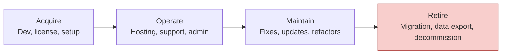

---
tags:
  - software-engineering-economics
  - cost-benefit
  - break-even
  - tco
  - ahp
  - atam
source: "SWEBOK v4 Chapter 15 — Cost Analysis, Multiple-Attribute Decision-Making"
created: 2026-07-21
---

# Cost Analysis — MARR, Benefit-Cost, Break-Even, TCO, and Multi-Attribute Decisions

> Not all value can be reduced to dollars. Cost analysis provides the tools for for-profit, nonprofit, and multi-attribute decision contexts.

## 1. For-Profit Decision-Making

### MARR — Minimum Acceptable Rate of Return

The **MARR** is the minimum return an organization requires before investing — the opportunity cost of capital. If a project can't beat the MARR, the money should go elsewhere.

| Organization Type | Typical MARR | Reasoning |
|---|---|---|
| **Tech startup** | 30-50% | High risk; venture capital expectations |
| **Established enterprise** | 10-15% | Lower risk; cost of capital + margin |
| **Government/nonprofit** | 3-7% | Social discount rate; no profit requirement |

### Economic Life and Replacement Decisions

**Economic life** = the period that minimizes the total equivalent annual cost. It may be shorter than physical life due to:
- Increasing maintenance costs over time
- Technological obsolescence
- Changing requirements

**Replacement decision rules:**
- **Defender (current system)** vs. **Challenger (proposed replacement)**
- Calculate equivalent annual cost for both
- Replace when challenger's annual cost < defender's annual cost

### Depreciation Methods

| Method | Formula | Effect |
|---|---|---|
| **Straight-Line** | (Cost − Salvage) / Life | Equal deduction each year |
| **Declining Balance** | Book Value × (2/Life) | Accelerated — larger deductions early |
| **MACRS** (US tax) | IRS-defined percentage tables | Required for US tax purposes |

> [!note] **Software-specific:** Most custom software is treated as a capital asset (amortized over 3–5 years). SaaS subscriptions are operating expenses (deducted immediately). The distinction matters for after-tax analysis.

## 2. Nonprofit and Public-Sector Decision-Making

### Benefit-Cost Analysis

When profit is not the goal:

| Metric | Formula | Decision Rule |
|---|---|---|
| **BCR** (Benefit-Cost Ratio) | Discounted benefits ÷ discounted costs | Accept if BCR > 1.0 |
| **Net Benefit** | Benefits − Costs | Accept if positive |
| **Cost-Effectiveness** | Cost per unit of benefit | Lower cost per unit is better |

### Two Cost-Effectiveness Variants

| Type | Constraint | Objective |
|---|---|---|
| **Fixed-Cost** | Budget is fixed | Maximize total benefit within budget |
| **Fixed-Effectiveness** | Goal is fixed | Minimize cost to achieve goal |

> **Example (Fixed-Effectiveness):** "We need 99.9% uptime." Compare alternative architectures by total cost to achieve that reliability target. The cheapest option wins.

## 3. Present Economy — Break-Even and Optimization

### Break-Even Analysis

Find the point where two alternatives have equal cost:

> **Break-even point:** where Cost(Alt A) = Cost(Alt B)

**Example — Cloud vs. On-Premise:**
- Cloud: $500/month (no fixed cost)
- On-Premise: $10,000 setup + $200/month
- Break-even: $10,000 / ($500 − $200) = **33.3 months**
- Decision: If usage < 33 months → Cloud; if > 33 months → On-Premise

### Optimization Analysis

Find the point of minimum total cost:

> **Total Cost = Fixed Cost + Variable Cost × Quantity**

For software, this applies to:
- **Build vs. Buy** — comparing development cost vs. license cost over expected life
- **Refactor vs. Live With** — comparing refactoring cost vs. accumulated maintenance drag
- **Team Size** — too small (slow delivery) vs. too large (coordination overhead)

## 4. Total Cost of Ownership (TCO)

TCO extends beyond development to the full lifecycle:

| Phase | % of TCO | Includes |
|---|---|---|
| **Acquire** | 20-30% | Development/license, infrastructure setup, training |
| **Operate** | 30-40% | Hosting, monitoring, user support, administration |
| **Maintain** | 30-40% | Bug fixes, feature updates, compliance patches, refactoring |
| **Retire** | 5-10% | Data migration, integration teardown, knowledge transfer |

> [!important] **Development is only ~25% of TCO.** The hidden costs of operation, maintenance, and eventual retirement dominate. Organizations that optimize only for development cost are optimizing the wrong variable.

### Hidden Costs

| Hidden Cost | Why It's Hidden | Typical Magnitude |
|---|---|---|
| **Integration** | "The API is well-documented" — until you try it | 2-5× initial estimate |
| **Data migration** | "We'll just export and import" — format mismatches, data quality | 3-10× initial estimate |
| **User training** | "It's intuitive" — no software is intuitive for all users | Often completely unbudgeted |
| **Compliance** | "We're not in a regulated industry" — until GDPR/HIPAA/SOC2 applies | Can double maintenance cost |

## 5. Multiple-Attribute Decision-Making

When decisions involve multiple, non-commensurate criteria:

### Compensatory Methods (trade-offs allowed)

| Method | How It Works | Best For |
|---|---|---|
| **Nondimensional Scaling** | Convert each attribute to 0-1 scale, weight, sum | Simple multi-criteria problems |
| **Additive Weighting** | Weight × Score for each criterion, sum across alternatives | Most common; easy to explain |
| **AHP** (Analytic Hierarchy Process) | Pairwise comparisons → eigenvector → weights | Complex decisions with many criteria |
| **ATAM** (Architecture Tradeoff Analysis Method) | Utility tree + scenario-based evaluation | Architectural decisions |
| **Gilb's Impact Estimation** | Quantify impact of each design on each quality attribute | Data-driven trade-offs |

### AHP in Practice

1. Decompose decision into hierarchy: Goal → Criteria → Subcriteria → Alternatives
2. Pairwise compare criteria: "How much more important is Cost than Performance?"
3. Calculate priority weights from comparison matrix
4. Score each alternative against each criterion
5. Weighted sum → overall ranking

> **Typical AHP Scale:** 1 (equal), 3 (moderate), 5 (strong), 7 (very strong), 9 (extreme)

### Non-Compensatory Methods (no trade-offs)

| Method | Rule | When to Use |
|---|---|---|
| **Dominance** | Alt A beats Alt B on all criteria → A wins | Rare but definitive |
| **Satisficing** | First alternative meeting all minimum thresholds wins | Time-constrained decisions |
| **Lexicography** | Rank criteria; compare only on most important until tie-breaker | When one criterion clearly dominates |

## 6. ATAM — Architecture Tradeoff Analysis Method

ATAM reveals how architectural decisions affect quality attributes:

| Step | Activity |
|---|---|
| 1. Present ATAM | Explain the method to stakeholders |
| 2. Present Business Drivers | System's critical business goals |
| 3. Present Architecture | Architect describes the system |
| 4. Identify Architectural Approaches | Catalog patterns and strategies used |
| 5. Generate Quality Attribute Utility Tree | Prioritize (H/M/L) × (H/M/L) scenarios |
| 6. Analyze Architectural Approaches | Map high-priority scenarios to architectural decisions → risks, non-risks, trade-off points |
| 7. Brainstorm and Prioritize Scenarios | Stakeholders add scenarios |
| 8. Analyze Additional Scenarios | Repeat analysis for new scenarios |
| 9. Present Results | Documented risks, non-risks, sensitivities, trade-offs |

> [!tip] ATAM's primary output is not a decision — it's **documented risks and trade-off points**. The decision still belongs to the architect, but now it's informed.

## Key Takeaways

1. **MARR is the minimum bar** — if a project can't clear it, allocate resources elsewhere
2. **TCO >> development cost** — plan for the 75% of costs that come after go-live
3. **Break-even analysis is simple but powerful** — find the crossover point where alternatives are equal
4. **AHP structures complex decisions** — pairwise comparisons are more reliable than direct weight assignment
5. **ATAM documents trade-offs, not decisions** — the decision is still yours
6. **Use non-compensatory methods when one criterion dominates** — not everything is a trade-off

## Related

- [[Software Engineering Economics Overview]] — All economics topics
- [[01_Economics_Fundamentals]] — Cash flow, NPV, time value of money
- [[02_Decision_Making]] — Decision-making under risk and uncertainty
- [[Software Architecture Overview]] — ATAM in architectural context
