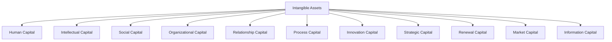
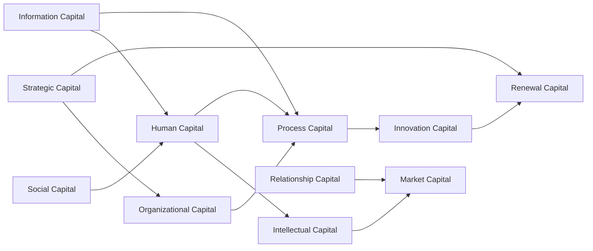
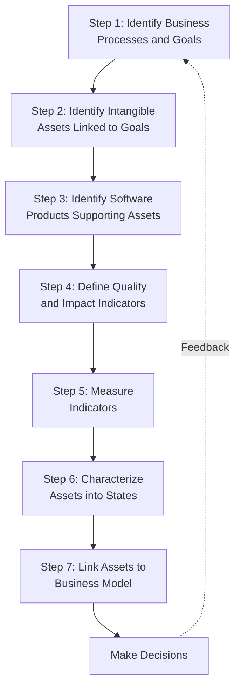
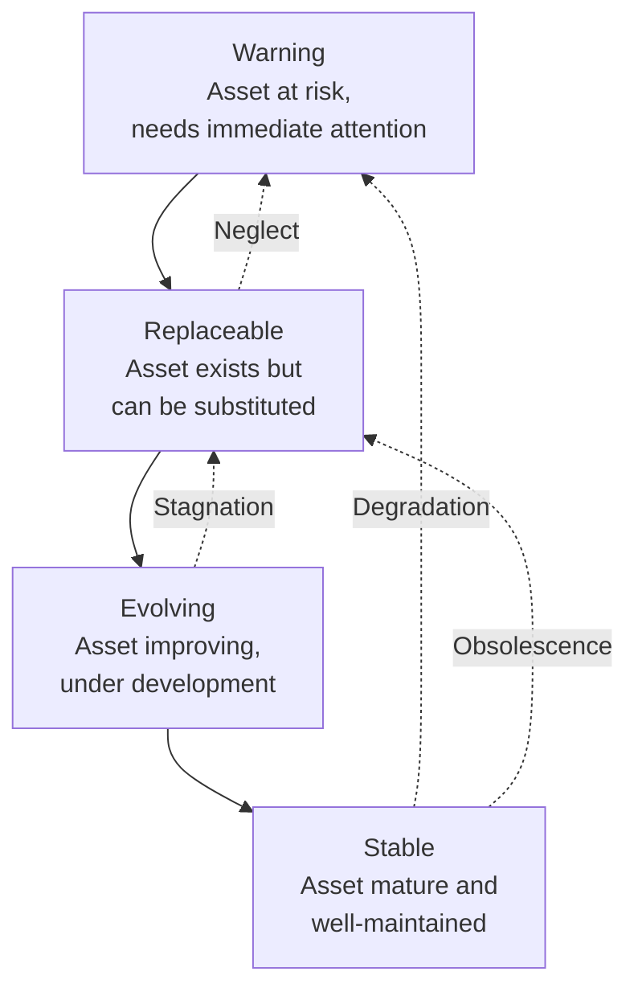
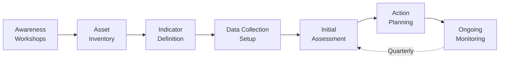

# Intangible Assets and SIPAC

## Overview

In modern software organizations, intangible assets (knowledge, relationships, processes, intellectual property) often constitute the majority of organizational value, yet they are rarely characterized, measured, or managed with the same rigor as tangible assets. The SIPAC (Strategic Intangible Process Assets Characterization) method provides a structured approach to identifying, measuring, and managing intangible assets in the context of software engineering.

> [!important] Core Insight
> Traditional accounting captures only a fraction of organizational value. Software companies derive most of their competitive advantage from intangible assets that do not appear on balance sheets. SIPAC bridges this gap by linking intangible assets to business processes and outcomes.

## The Problem of Intangible Assets in Software

### Why Intangible Assets Matter

| Observation | Evidence |
|-------------|----------|
| Market-to-book ratio | Tech companies often valued at 5-20x book value; the gap is intangible assets |
| R&D spending | Software companies invest heavily in R&D that creates future value not captured on balance sheets |
| Knowledge work | Software development is predominantly knowledge work; the value is in people and processes |
| Competitive advantage | Differentiation comes from patents, know-how, processes, and relationships, not physical assets |

### Characteristics of Intangible Assets

| Characteristic | Description | Implication |
|---------------|-------------|-------------|
| Non-rivalrous | Can be used by multiple people simultaneously | Scaling benefits |
| Non-excludable (partially) | Difficult to prevent unauthorized use | IP protection challenges |
| High fixed cost, low marginal cost | Expensive to create, cheap to replicate | Winner-take-all dynamics |
| Path-dependent | Value depends on context and history | Cannot be easily transferred |
| Depreciation patterns | Do not follow physical depreciation | Traditional accounting inadequate |
| Measurement difficulty | Hard to quantify value objectively | Requires proxy indicators |

## Generic Intangible Assets Taxonomy

SIPAC defines 11 generic categories of intangible assets relevant to software organizations:

### Detailed Taxonomy

| # | Asset Category | Definition | Software Examples |
|---|---------------|-----------|-------------------|
| 1 | **Human Capital** | Knowledge, skills, experience, and creativity of employees | Developer expertise, domain knowledge, certifications, tacit knowledge |
| 2 | **Intellectual Capital** | Formalized intellectual property and proprietary knowledge | Patents, copyrights, trade secrets, algorithms, source code, technical documentation |
| 3 | **Social Capital** | Internal relationships, trust, and collaboration patterns | Team cohesion, organizational culture, communication networks, mentoring relationships |
| 4 | **Organizational Capital** | Organizational structures, governance, and management systems | Organizational design, decision-making frameworks, management philosophy, policies |
| 5 | **Relationship Capital** | External relationships with customers, partners, and stakeholders | Customer loyalty, partner ecosystem, supplier relationships, brand reputation |
| 6 | **Process Capital** | Defined and refined processes and methodologies | Development methodologies, testing processes, deployment pipelines, quality systems |
| 7 | **Innovation Capital** | Capacity for innovation and new idea generation | R&D capabilities, innovation culture, experimentation infrastructure, idea pipelines |
| 8 | **Strategic Capital** | Strategic positioning and competitive advantage | Market positioning, competitive intelligence, strategic partnerships, vision alignment |
| 9 | **Renewal Capital** | Capacity to renew and transform the organization | Change management capability, technology adoption readiness, learning organization practices |
| 10 | **Market Capital** | Market presence, brand value, and customer relationships | Brand equity, market share, customer base, market intelligence |
| 11 | **Information Capital** | Information infrastructure and data assets | Databases, knowledge bases, analytics capabilities, data quality, information systems |

### Interrelationships Between Asset Categories

## The SIPAC Method

### Overview

SIPAC (Strategic Intangible Process Assets Characterization) is a 7-step method for systematically identifying, measuring, and managing intangible assets in the context of software engineering.

### Step 1: Identify Business Processes and Goals

The first step establishes the business context for intangible asset characterization.

**Activities:**
- Identify key business processes in the software organization
- Define strategic goals and objectives
- Map business processes to goals
- Prioritize processes by strategic importance

**Example:**

| Business Process | Strategic Goal | Priority |
|-----------------|---------------|----------|
| Software development | Deliver high-quality products on time | Critical |
| Customer support | Maximize customer satisfaction and retention | High |
| Talent management | Attract and retain top engineering talent | High |
| R&D and innovation | Maintain technology leadership | Medium |
| Partner management | Expand ecosystem through partnerships | Medium |

**Tools:**
- Strategy maps
- Balanced Scorecard perspectives
- Business Model Canvas
- Value chain analysis

### Step 2: Identify Intangible Assets Linked to Goals

For each business process/goal, identify the intangible assets that enable or support it.

**Activities:**
- Inventory existing intangible assets
- Classify assets using the 11-category taxonomy
- Map assets to business processes they support
- Identify gaps (needed but missing assets)

**Example Mapping:**

| Business Process | Supporting Intangible Assets | Category |
|-----------------|----------------------------|----------|
| Software development | Developer expertise | Human Capital |
| | Coding standards and guidelines | Process Capital |
| | CI/CD pipeline configurations | Information Capital |
| | Development methodology (Agile) | Process Capital |
| | Component library | Intellectual Capital |
| Customer support | Customer knowledge base | Information Capital |
| | Support team expertise | Human Capital |
| | Customer feedback processes | Relationship Capital |
| | Support SLA templates | Organizational Capital |
| R&D and innovation | Research capabilities | Innovation Capital |
| | Patent portfolio | Intellectual Capital |
| | Innovation culture | Social Capital |
| | Technology radar | Strategic Capital |

### Step 3: Identify Software Products Supporting Assets

Determine which software products and tools support each intangible asset.

**Activities:**
- Map software products to intangible assets they support
- Assess quality of software product support
- Identify dependencies between software products and assets

**Example:**

| Intangible Asset | Supporting Software Products | Dependency Level |
|-----------------|---------------------------|:---:|
| Developer expertise | IDE, documentation tools, knowledge wiki | High |
| Coding standards | Linters, static analyzers, code review tools | Medium |
| CI/CD pipeline | Jenkins/GitHub Actions, artifact repository | High |
| Customer knowledge base | CRM, knowledge management system | High |
| Innovation culture | Idea management platform, hackathon tools | Low |
| Patent portfolio | IP management system | Medium |

### Step 4: Define Quality and Impact Indicators

Define measurable indicators for each intangible asset.

**Indicator types:**

| Indicator Type | Purpose | Example |
|---------------|---------|---------|
| **Quality indicator** | Measures the state/condition of an asset | Employee satisfaction score, documentation completeness |
| **Impact indicator** | Measures the asset's effect on business outcomes | Defect rate improvement, customer retention rate |
| **Leading indicator** | Predicts future performance | Training hours, innovation pipeline value |
| **Lagging indicator** | Confirms past trends | Revenue per employee, patent grants |

**Example Indicators:**

| Intangible Asset | Quality Indicator | Impact Indicator |
|-----------------|------------------|-----------------|
| Developer expertise | Skill assessment score, training completion rate | Defect density, velocity |
| CI/CD pipeline | Pipeline reliability, build success rate | Deployment frequency, lead time |
| Customer knowledge base | Article freshness, coverage ratio | Support ticket resolution time |
| Innovation culture | Idea submission rate, hackathon participation | New feature adoption rate |
| Coding standards | Standard compliance rate | Code review cycle time |

### Step 5: Measure Indicators

Collect data and compute indicator values.

**Activities:**
- Establish data collection mechanisms
- Define measurement scales and thresholds
- Collect baseline measurements
- Implement ongoing measurement

**Measurement Scale Example:**

| Indicator | Scale | Red (Warning) | Yellow (Attention) | Green (Healthy) |
|-----------|-------|:---:|:---:|:---:|
| Employee satisfaction (1-5) | 1-5 | < 3.0 | 3.0-3.8 | > 3.8 |
| Documentation completeness (%) | 0-100% | < 60% | 60-85% | > 85% |
| Deployment frequency (per week) | Count | < 1 | 1-5 | > 5 |
| Pipeline reliability (%) | 0-100% | < 90% | 90-97% | > 97% |
| Innovation ideas submitted (per quarter) | Count | < 5 | 5-15 | > 15 |

### Step 6: Characterize Assets into States

Classify each asset into one of four states based on indicator values.

**Asset States:**

| State | Definition | Indicator Pattern | Action Required |
|-------|-----------|-------------------|-----------------|
| **Warning** | Asset is at risk of failure or significant degradation | Red indicators, declining trends | Immediate intervention, recovery plan |
| **Replaceable** | Asset exists but is not unique or could be substituted | Yellow indicators, flat trends | Monitor, evaluate alternatives |
| **Evolving** | Asset is actively being developed or improved | Improving trends, mixed indicators | Continue investment, track progress |
| **Stable** | Asset is mature, well-maintained, and reliable | Green indicators, stable trends | Maintain, periodic review |

**State Characterization Matrix:**

| Asset Category | Warning Signals | Stable Signals |
|---------------|----------------|---------------|
| Human Capital | High turnover, skill gaps, low morale | Low turnover, strong skills, engagement |
| Process Capital | Outdated processes, non-compliance, rework | Current processes, high compliance, efficiency |
| Innovation Capital | No new ideas, low R&D investment | Active pipeline, high experimentation |
| Information Capital | Stale data, poor accessibility, low quality | Fresh data, easy access, high quality |
| Relationship Capital | Customer churn, partner conflicts | High retention, strong partnerships |

### Step 7: Link Assets to Business Model

Connect intangible asset states to business model outcomes and decisions.

**Activities:**
- Map asset states to business model components
- Assess impact of asset states on value proposition, revenue, costs
- Identify strategic implications
- Formulate action plans

**Business Model Canvas Integration:**

| Business Model Component | Relevant Asset Categories | Impact of Asset State |
|-------------------------|--------------------------|----------------------|
| Value Proposition | Intellectual Capital, Process Capital, Innovation Capital | Warning state degrades value delivery |
| Customer Relationships | Relationship Capital, Market Capital | Stable state enables retention |
| Revenue Streams | Market Capital, Strategic Capital | Evolving state may create new streams |
| Key Resources | Human Capital, Information Capital | Warning state threatens operations |
| Key Activities | Process Capital, Organizational Capital | Replaceable state increases costs |
| Key Partnerships | Relationship Capital, Social Capital | Evolving state expands ecosystem |
| Cost Structure | All categories | Poor asset management increases costs |

## Practical Examples

### Example 1: Software Development Team Assessment

| Intangible Asset | Category | Indicators | State | Action |
|-----------------|----------|-----------|-------|--------|
| Senior developer expertise | Human Capital | Skill score 4.2/5, retention 95% | **Stable** | Maintain, document tacit knowledge |
| Agile methodology | Process Capital | Compliance 70%, velocity stable | **Evolving** | Training program, coaching |
| CI/CD pipeline | Information Capital | Reliability 92%, deploy freq 3/week | **Replaceable** | Evaluate modern alternatives (GitOps) |
| Technical documentation | Information Capital | Completeness 55%, freshness avg | **Warning** | Documentation sprint, assign owners |
| Component library | Intellectual Capital | Reuse rate 30%, coverage 60% | **Evolving** | Expand library, promote reuse culture |
| Customer feedback process | Relationship Capital | Response time 48h, satisfaction 4.0 | **Stable** | Maintain, automate response tracking |

### Example 2: Startup vs Established Company

| Asset Category | Startup State | Established Company State |
|---------------|--------------|--------------------------|
| Human Capital | Small team, high versatility | Specialized teams, depth |
| Intellectual Capital | Few patents, fast iteration | Large portfolio, careful management |
| Social Capital | Strong founder relationships | Formal communication structures |
| Organizational Capital | Informal, flexible | Defined governance, slower adaptation |
| Relationship Capital | Building from scratch | Established customer base |
| Process Capital | Lightweight, agile | Mature, potentially bureaucratic |
| Innovation Capital | High experimentation, risk tolerance | Structured R&D, risk management |
| Strategic Capital | Pivoting capability | Market position defense |
| Renewal Capital | Natural agility | Change management programs |
| Market Capital | Niche presence | Broad recognition |
| Information Capital | Lean data, cloud-native | Legacy systems, data lakes |

### Example 3: Digital Transformation Initiative

| Phase | Focus Assets | Expected State Transition |
|-------|-------------|--------------------------|
| Assessment | Information Capital, Process Capital | Warning/Evolve to Evolving |
| Foundation | Human Capital (training), Organizational Capital | Replaceable to Evolving |
| Build | Innovation Capital, Process Capital | Evolving to Stable |
| Scale | Market Capital, Relationship Capital | Evolving to Stable |
| Optimize | Renewal Capital, Strategic Capital | Stable maintenance |

## Measurement Program for Intangible Assets

### Implementation Roadmap

### Integration with Existing Processes

| Existing Process | SIPAC Integration Point |
|-----------------|----------------------|
| Strategic planning | Asset state informs resource allocation decisions |
| Budgeting | Asset investment justified by state and business impact |
| Performance reviews | Asset contribution metrics included in evaluations |
| Risk management | Asset states as risk factors in risk register |
| Portfolio management | Asset dependencies inform project prioritization |
| M&A due diligence | Asset inventory and state assessment |

## Challenges and Mitigations

| Challenge | Description | Mitigation |
|-----------|-------------|------------|
| Subjectivity | Asset states based on subjective indicator assessment | Use multiple data sources, establish baselines |
| Measurement cost | Significant effort to collect and maintain indicator data | Automate collection, focus on high-impact assets |
| Organizational resistance | Employees may resist being "measured" | Frame as organizational improvement, not individual evaluation |
| Dynamic environment | Assets change rapidly in fast-moving markets | Increase measurement frequency for volatile assets |
| Causal attribution | Hard to link asset states directly to business outcomes | Use leading/lagging indicator pairs, controlled experiments |
| Cultural factors | Intangible asset importance varies by culture | Adapt taxonomy to organizational context |

## Benefits of SIPAC

| Benefit | Description |
|---------|-------------|
| Visibility | Makes invisible assets visible and manageable |
| Prioritization | Enables data-driven investment decisions |
| Risk management | Early warning of asset degradation |
| Strategic alignment | Links assets to business strategy |
| Communication | Common language for discussing intangible value |
| Continuous improvement | Feedback loop drives asset improvement |
| M&A support | Due diligence for intangible asset valuation |

## Summary

The SIPAC method provides a structured approach to managing the intangible assets that drive most of the value in software organizations. By following the 7-step process (identify goals, map assets, link software, define indicators, measure, characterize states, link to business model), organizations can make their invisible assets visible and manageable. The 11-category taxonomy (human, intellectual, social, organizational, relationship, process, innovation, strategic, renewal, market, information capital) provides comprehensive coverage of intangible asset types. Characterizing assets into four states (Warning, Replaceable, Evolving, Stable) enables actionable management decisions tied to business outcomes.
