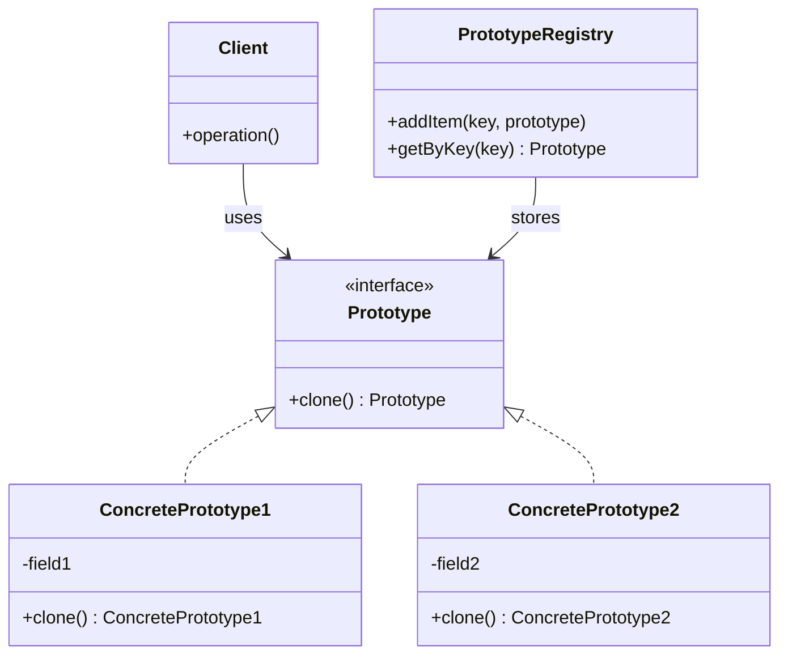

> *Source: Dive Into Design Patterns by Alexander Shvets, "Prototype" (pp. 124–137)*

## Intent

> Prototype is a creational design pattern that lets you copy existing objects without making your code dependent on their classes.

Also known as: **Clone**.

## Problem

Say you have an object and want to create an exact copy of it. The naive approach — instantiate the same class and manually copy every field — hits three walls:

1. **Private fields are inaccessible.** Not all fields are visible from outside the object. You can't copy what you can't see.
2. **Concrete class dependency.** You must know the object's exact class to call its constructor, coupling your code to that class.
3. **Interface-only references.** Often you only know the interface an object implements — not its concrete class — especially when a method parameter accepts any object following some interface. You literally can't instantiate what you can't name.

Copying an object "from the outside" isn't always possible.

## Solution

The Prototype pattern **delegates the cloning process to the objects themselves**.

Declare a common interface for all objects that support cloning. This interface typically contains a single `clone` method. The implementation creates an object of the current class and carries over all field values — including private fields, since an object can access private fields of another object belonging to the same class.

An object that supports cloning is called a **prototype**. When objects have dozens of fields and hundreds of possible configurations, cloning pre-configured prototypes serves as an alternative to subclassing: you create a set of objects configured in various ways, then clone them when needed instead of constructing from scratch.

### Prototype Registry

For frequently-used prototypes, introduce a **Prototype Registry** — a centralized place (typically a `name → prototype` hash map) that stores pre-built objects ready to be copied and provides lookup for the client.

### Real-World Analogy

Mitotic cell division: after division, two identical cells are formed. The original cell acts as a prototype and takes an active role in creating the copy.

## Structure

### Basic Implementation




1. **Prototype** — interface that declares the `clone()` method.
2. **Concrete Prototype** — Implements the cloning method. Copies the original object's data to the clone. May also handle edge cases: cloning linked objects, untangling recursive dependencies, etc.
3. **Client** — Produces a copy of any object that follows the prototype interface.

### Prototype Registry

The registry stores a catalog of frequently-used prototypes.

## Pseudocode

```python
# Base prototype
class Shape:
    field X: int
    field Y: int
    field color: string

    # Regular constructor
    constructor Shape():
        # ...

    # Prototype constructor — initializes fresh object from existing one
    constructor Shape(source: Shape):
        this()
        this.X = source.X
        this.Y = source.Y
        this.color = source.color

    # The clone operation returns one of the Shape subclasses
    abstract method clone(): Shape


# Concrete prototype
class Rectangle extends Shape:
    field width: int
    field height: int

    constructor Rectangle(source: Rectangle):
        # Parent constructor call needed to copy private fields
        super(source)
        this.width = source.width
        this.height = source.height

    method clone(): Shape:
        return new Rectangle(this)


class Circle extends Shape:
    field radius: int

    constructor Circle(source: Circle):
        super(source)
        this.radius = source.radius

    method clone(): Shape:
        return new Circle(this)


# Client code
class Application:
    field shapes: array of Shape

    constructor Application():
        circle = new Circle()
        circle.X = 10
        circle.Y = 10
        circle.radius = 20
        shapes.add(circle)

        anotherCircle = circle.clone()   # Exact copy of `circle`
        shapes.add(anotherCircle)

        rectangle = new Rectangle()
        rectangle.width = 10
        rectangle.height = 20
        shapes.add(rectangle)

    method businessLogic():
        shapesCopy = new Array of Shapes

        # We don't know the exact elements in the shapes array —
        # all we know is they're shapes. Polymorphism dispatches
        # to the correct clone method for each real class.
        foreach (s in shapes):
            shapesCopy.add(s.clone())
```

Key design choices in this pseudocode:

- The **prototype constructor** takes a source object as an argument and copies all fields. Performing all actual copying in the constructor ensures consistency — no partially-built clone can leak.
- Subclasses call `super(source)` to let the parent handle its own private fields.
- Each subclass **explicitly overrides** `clone()` using its own class name with `new`; otherwise, the method would produce an object of the parent class.
- The client iterates over a polymorphic `shapes` array. Thanks to polymorphism, calling `s.clone()` dispatches to the correct implementation regardless of whether `s` is a Circle or Rectangle.

## Applicability

Use the Prototype pattern when:

1. **Your code shouldn't depend on the concrete classes of objects you need to copy.**
   This happens frequently when working with objects passed from third-party code via some interface. The concrete classes are unknown, and you couldn't depend on them even if you wanted to. The Prototype pattern provides a general interface for cloning that keeps client code independent.

2. **You want to reduce the number of subclasses that only differ in how they initialize their objects.**
   Suppose you have a complex class requiring laborious configuration. Common configurations are scattered through your app, so you create subclasses — solving the duplication but producing many dummy subclasses. Instead, use pre-built prototypes configured in various ways. The client looks for an appropriate prototype and clones it, eliminating the subclass explosion.

## Pros and Cons

### ✅ Pros

- You can clone objects **without coupling to their concrete classes**.
- You can **eliminate repeated initialization code** by cloning pre-built prototypes.
- You can **produce complex objects more conveniently** — cloning is often simpler than constructing from scratch.
- You get an **alternative to inheritance** when dealing with configuration presets for complex objects.

### ❌ Cons

- Cloning complex objects that have **circular references** can be very tricky.

## Relations with Other Patterns

- **Factory Method** (less complicated, more customizable via subclasses) often evolves toward **Abstract Factory**, **Prototype**, or **Builder** (more flexible, but more complicated).
- **Abstract Factory** classes are often based on **Factory Methods**, but you can also use **Prototype** to compose the methods on these classes.
- Prototype can help when you need to **save copies of Commands into history** (see **Command** pattern).
- Designs making heavy use of **Composite** and **Decorator** often benefit from Prototype — cloning complex structures instead of re-constructing them from scratch.
- Prototype isn't based on inheritance, so it doesn't have its drawbacks. On the other hand, Prototype requires a complicated initialization of the cloned object. **Factory Method** is based on inheritance but doesn't require an initialization step.
- Sometimes Prototype is a **simpler alternative to Memento** — when the object whose state you want to store is straightforward and doesn't have links to external resources, or the links are easy to re-establish.
- **Abstract Factories**, **Builders**, and **Prototypes** can all be implemented as **Singletons**.

## Summary Checklist

- [x] Cloning delegates to the object itself — the Prototype interface with a `clone` method
- [x] Private fields are accessible during cloning (same-class access)
- [x] Client code never depends on concrete classes — only on the Prototype interface
- [x] Prototype constructor pattern: accept a source object, copy all fields, call `super(source)` in subclasses
- [x] Each subclass must explicitly override `clone()` with its own `new` operator — otherwise you get parent-class instances
- [x] Prototype Registry: centralized lookup of pre-built prototype instances (name → prototype map)
- [x] Prototypes as an alternative to subclassing for configuration presets
- [x] Circular references are the main cloning pitfall
- [x] The pattern trades inheritance complexity for initialization complexity

## Related

[[Factory Method]] | [[Abstract Factory]] | [[Builder]] | [[Singleton]] | [[Command]] | [[Memento]] | [[Composite]] | [[Decorator]]
