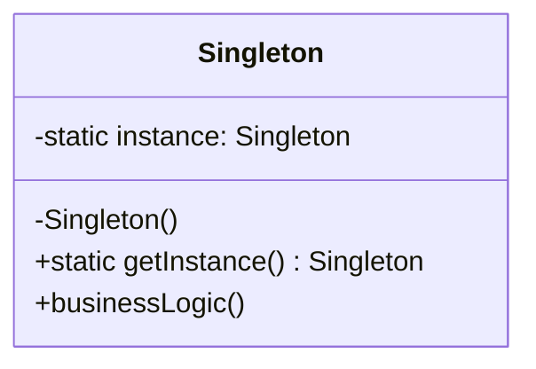

---
tags:
- design-patterns
- oop
- software-design
- software-engineering
---

> *Source: Dive Into Design Patterns by Alexander Shvets, "Singleton" (pp. 138–146)*

## Intent

> Singleton is a creational design pattern that lets you ensure that a class has only one instance, while providing a global access point to this instance.

## Problem

The Singleton pattern addresses two problems simultaneously (which also means it violates the Single Responsibility Principle):

1. **Ensure a class has only one instance.** The most common reason is controlling access to a shared resource—a database connection, a file, a configuration object. A regular constructor *must* return a new object by design, so there is no built-in language mechanism to say "return the one we already made."

2. **Provide a global access point to that instance.** Global variables are convenient but unsafe: any code can overwrite them and crash the application. The pattern gives you the accessibility of a global variable while protecting the instance from being replaced by other code.

Additionally, the logic that guarantees a single instance should be centralized in one class rather than scattered across the program.

## Solution

Every Singleton implementation shares two steps:

- **Make the default constructor private** — prevents other objects from using `new` with the Singleton class.
- **Create a public static creation method** — this method calls the private constructor on the first call, caches the result in a private static field, and returns the cached instance on all subsequent calls.

If client code has access to the Singleton class, it can call the static method and always receive the same object.

> **Real-world analogy:** A government. A country can have only one official government at a time. The title "The Government of X" is a global access point that identifies the group of people in charge, regardless of who the individuals are.

## Structure




- The `Singleton` class declares the **static method `getInstance`** that returns the same instance of its own class.
- The **constructor is hidden** from client code. Calling `getInstance` is the only way to obtain the Singleton object.

## Pseudocode

A database connection class implemented as a thread-safe Singleton:

```
// The Database class defines the `getInstance` method that lets
// clients access the same instance of a database connection
// throughout the program.
class Database is
    // The field for storing the singleton instance should be
    // declared static.
    private static field instance: Database

    // The singleton's constructor should always be private to
    // prevent direct construction calls with the `new` operator.
    private constructor Database() is
        // Some initialization code, such as the actual
        // connection to a database server.
        // ...

    // The static method that controls access to the singleton
    // instance.
    public static method getInstance() is
        if (Database.instance == null) then
            acquireThreadLock() and then
                // Ensure that the instance hasn't yet been
                // initialized by another thread while this one
                // has been waiting for the lock's release.
                if (Database.instance == null) then
                    Database.instance = new Database()
        return Database.instance

    // Finally, any singleton should define some business logic
    // which can be executed on its instance.
    public method query(sql) is
        // For instance, all database queries of an app go
        // through this method. Therefore, you can place
        // throttling or caching logic here.
        // ...

class Application is
    method main() is
        Database foo = Database.getInstance()
        foo.query("SELECT ...")
        // ...
        Database bar = Database.getInstance()
        bar.query("SELECT ...")
        // The variable `bar` will contain the same object as
        // the variable `foo`.
```

Key thread-safety detail: **double-checked locking.** After acquiring the thread lock, the code checks `instance == null` again because another thread may have initialized it while the current thread was waiting for the lock.

## How to Implement

1. Add a **private static field** to the class for storing the singleton instance.
2. Declare a **public static creation method** (`getInstance`).
3. Implement **lazy initialization**: create the object on the first call, store it in the static field, and always return that instance on subsequent calls.
4. Make the **constructor private**. The static method can still call it; other objects cannot.
5. Go over client code and **replace all direct constructor calls** with calls to `getInstance`.

## Applicability

✅ **Use Singleton when** a class should have exactly one instance available to all clients—e.g., a single database object shared across the program.

✅ **Use Singleton when** you need stricter control over global variables. Unlike a raw global variable, the Singleton guarantees only one instance exists, and nothing except the Singleton class itself can replace the cached instance.

> You can always relax the restriction later: the only code that needs to change is the body of `getInstance`.

## Pros and Cons

| Pros | Cons |
|------|------|
| ✅ Guarantees a class has only a single instance | ❌ Violates the **Single Responsibility Principle** (solves two problems at once) |
| ✅ Provides a **global access point** to that instance | ❌ Can **mask bad design**—components may know too much about each other |
| ✅ The singleton object is initialized only when first requested (**lazy initialization**) | ❌ Requires **special treatment in multithreaded environments** to prevent multiple threads from creating separate instances |
| | ❌ **Difficult to unit test**—private constructors block inheritance-based mocking, and static methods cannot be overridden in most languages |

## Relations with Other Patterns

- **[[Facade]]** — a Facade class can often be transformed into a Singleton, since a single facade object is sufficient in most cases.
- **[[Flyweight]]** — would resemble Singleton if you reduced all shared states to a single flyweight object. Two key differences:
  1. Only **one** Singleton instance exists; Flyweight can have **multiple** instances with different intrinsic states.
  2. Singleton objects **can be mutable**; Flyweight objects are **immutable**.
- **[[abstract-factory]]**, **[[Builder]]**, **[[Prototype]]** — all can be implemented as Singletons when only one instance of the factory or builder is needed.

## Summary Checklist

- [ ] Is there only one instance of this class per application?
- [ ] Is the constructor private and the only creation path a static `getInstance` method?
- [ ] Is thread safety handled (double-checked locking, eager initialization, or language-level singleton support)?
- [ ] Does the singleton hold business logic beyond just holding state? (If it's a pure data bag, reconsider.)
- [ ] Have you accounted for unit-testing difficulty? (Consider dependency injection as an alternative or wrapper.)
- [ ] Would a simpler approach—like dependency injection or a plain global constant—suffice?

## Related

[[factory-method]], [[abstract-factory]], [[Builder]], [[Prototype]], [[Facade]], **solid-principles**
