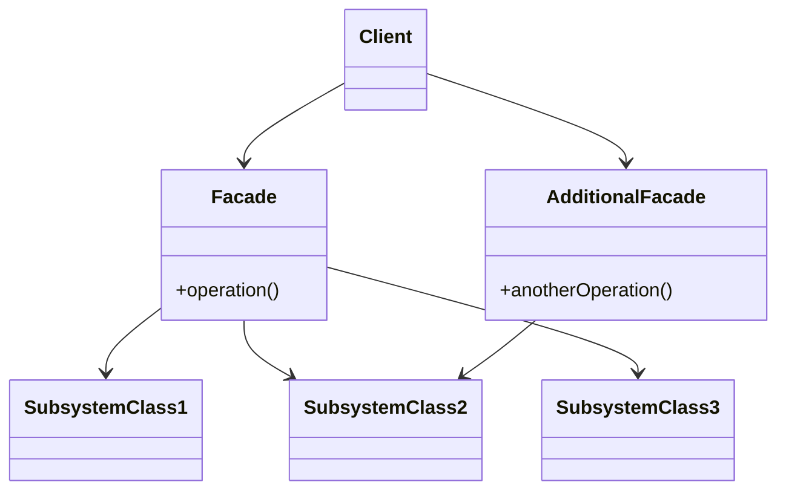

> *Source: Dive Into Design Patterns by Alexander Shvets, "Facade" (pp. 211–220)*

## Intent

> Facade is a structural design pattern that provides a simplified interface to a library, a framework, or any other complex set of classes.

## Problem

When your code must integrate with a sophisticated library or framework, you ordinarily need to:

- Initialize numerous subsystem objects
- Track dependencies between them
- Execute methods in the correct order
- Supply data in the proper format

The result: your business logic becomes **tightly coupled to implementation details** of third-party classes. This coupling makes the code hard to comprehend, brittle to subsystem changes, and painful to maintain. Each new client that uses the subsystem repeats the same complex initialization and orchestration boilerplate.

## Solution

Introduce a **facade class** — a single entry point that provides a simplified, convenient interface to the complex subsystem. The facade:

- Exposes only the features clients actually need, not the subsystem's full power
- Knows where to direct requests and how to operate all the moving parts
- Hides initialization, dependency wiring, and correct call ordering behind a clean API

**Real-world analogy:** When you call a shop to place a phone order, the operator acts as your facade to the ordering system, payment gateways, and delivery services. You get one simple voice interface instead of navigating each department yourself.

**Example:** An app that uploads cat videos to social media uses a professional video conversion library with dozens of features, but it only needs `encode(filename, format)`. A facade wraps this single method around the library's complexity.

## Structure

| Role | Responsibility |
|------|---------------|
| **Facade** | Provides convenient access to a specific part of the subsystem. Redirects client calls to the right subsystem objects and orchestrates them. |
| **Additional Facade** | Prevents a single facade from bloating with unrelated features. Used by clients or other facades. |
| **Subsystem classes** | Dozens of complex objects that work together. Unaware of the facade's existence; communicate with each other directly. |
| **Client** | Uses the facade instead of calling subsystem objects directly. |



## Pseudocode

✅ **From source** — video conversion framework example:

```java
// Complex 3rd-party video conversion framework (we don't control this code)
class VideoFile
// ...

class OggCompressionCodec
// ...

class MPEG4CompressionCodec
// ...

class CodecFactory
// ...

class BitrateReader
// ...

class AudioMixer
// ...

// Facade: hides framework complexity behind a simple interface
class VideoConverter is
    method convert(filename, format): File is
        file = new VideoFile(filename)
        sourceCodec = (new CodecFactory).extract(file)
        if (format == "mp4")
            destinationCodec = new MPEG4CompressionCodec()
        else
            destinationCodec = new OggCompressionCodec()
        buffer = BitrateReader.read(filename, sourceCodec)
        result = BitrateReader.convert(buffer, destinationCodec)
        result = (new AudioMixer).fix(result)
        return new File(result)

// Client code — depends only on the facade, not on dozens of framework classes
class Application is
    method main() is
        convertor = new VideoConverter()
        mp4 = convertor.convert("funny-cats-video.ogg", "mp4")
        mp4.save()
```

**Key insight:** When upgrading the framework or switching to a different one, only the facade's internal implementation needs to change. All client code remains untouched.

## Applicability

- **You need a limited but straightforward interface to a complex subsystem.** Subsystems naturally grow more complex over time — even applying design patterns introduces more classes. The facade provides a shortcut to the most-used features that fit most client requirements.

- **You want to layer a subsystem.** Create facades as entry points to each layer (e.g., video layer, audio layer). Require layers to communicate only through their facades. This reduces coupling between multiple subsystems.

- **You want to isolate client code from subsystem upgrades.** When the third-party library releases a new version, you only modify the facade — not every client that uses it.

## Pros and Cons

| ✅ Pros | ❌ Cons |
|---------|---------|
| Isolates client code from subsystem complexity | Facade can become a **god object** coupled to every class in the app |

## Relations with Other Patterns

| Pattern | Relationship |
|---------|-------------|
| **Adapter** | Facade **defines a new** simplified interface; Adapter **makes an existing** interface usable. Adapter usually wraps one object; Facade wraps an entire subsystem. |
| **Abstract Factory** | Can serve as an alternative to Facade when you only need to hide how subsystem objects are *created* from client code. |
| **Flyweight** | Flyweight shows how to make many small objects; Facade shows how to make one object representing an entire subsystem. |
| **Mediator** | Both organize collaboration between tightly coupled classes. **Facade**: simplified interface, no new functionality, subsystem is unaware of it, objects communicate directly. **Mediator**: centralizes communication, components only know the mediator, no direct communication. |
| **Singleton** | A Facade class can often be transformed into a Singleton — a single facade instance is sufficient in most cases. |
| **Proxy** | Both buffer a complex entity and initialize it on their own. Unlike Facade, Proxy has the **same interface** as its service object, making them interchangeable. |

## Summary Checklist

- [ ] Is there a complex subsystem that forces repetitive initialization and orchestration on every client?
- [ ] Can you define a simpler interface that covers the most-used features clients actually need?
- [ ] Does the facade redirect calls to appropriate subsystem objects and manage their lifecycle?
- [ ] Is all client code routed through the facade instead of calling subsystem classes directly?
- [ ] If the facade is growing too large, have you extracted unrelated behavior into additional facades?

## Related

[[Adapter]], [[Mediator]], [[Singleton]], [[Abstract Factory]], [[Proxy]], [[SOLID Principles]]
