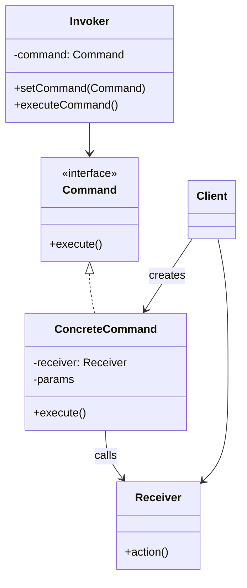

---
tags:
- design-patterns
- oop
- software-design
- software-engineering
---

> *Source: Dive Into Design Patterns by Alexander Shvets, "Command" (pp. 269–289)*

## Intent

> Command is a behavioral design pattern that turns a request into a stand-alone object that contains all information about the request. This transformation lets you pass requests as a method arguments, delay or queue a request's execution, and support undoable operations.

Also known as: **Action**, **Transaction**.

## Problem

Imagine building a text editor with a toolbar full of buttons — Copy, Cut, Paste, Undo, and so on. All buttons inherit from the same `Button` base class. The naive solution: create a subclass for each button (`CopyButton`, `CutButton`, `PasteButton`, …), with click-handler code baked directly into each subclass.

This approach implodes under three problems:

1. **Subclass explosion.** Every new action demands a new `Button` subclass. Modify the base `Button` class and you risk breaking every subclass — the GUI layer becomes awkwardly dependent on volatile business logic.
2. **Same action, multiple triggers.** Copying text isn't just a toolbar button — it's also a context-menu item, a keyboard shortcut (`Ctrl+C`), and maybe a voice command. Without Command, the code for "copy text" gets duplicated across every trigger class, or worse, menus become dependent on buttons.
3. **No undo.** A flat subclass-per-button design provides no natural place to track what was done, in what order, or how to reverse it.

## Solution

The Command pattern suggests that **GUI objects should not send requests directly to business-logic objects**. Instead, extract every detail of a request — the receiver object, the method name, and the arguments — into a **stand-alone command object** with a single execution method.


From the GUI's perspective, a button stores a reference to some command and calls `command.execute()` on click. It does not know — and does not need to know — which business-logic object handles the request or how. Every GUI element tied to the same operation (toolbar button, menu item, shortcut) simply holds a reference to the **same** command object. No code duplication.

Commands become a convenient middle layer that decouples the GUI layer from the business-logic layer. And because commands are objects, you can queue them, log them, serialize them, assemble simple commands into composite commands, and — crucially — **undo** them.

### Real-World Analogy

You walk into a restaurant. The waiter writes your order on a slip of paper (the **command**), sticks it on the kitchen wall, and moves on. The chef picks it up when ready. The order contains everything the chef needs; they don't have to run to your table for clarification. The slip can sit in a queue, be reordered, or even be discarded if you cancel.

The paper order *is* a command — a stand-alone object carrying all the information required to cook the meal.

## Structure


1. **Sender (Invoker)** — Holds a reference to a command. Triggers `command.execute()` instead of calling the receiver directly. Does *not* create commands; receives them from the client.


2. **Command interface** — Declares a single execution method (usually `execute()` with no parameters).
3. **Concrete Commands** — Implement specific requests. Each stores the receiver reference and any parameters needed (set via constructor). Delegates the actual work to the receiver.
4. **Receiver** — Contains the actual business logic. Almost any object can act as a receiver.
5. **Client** — Creates and configures concrete commands (passing in the receiver and parameters), then attaches them to one or more senders.

## Pseudocode

This example models a text editor with undoable Copy, Cut, Paste, and Undo operations using a `CommandHistory` stack. ✅ (from source)

```java
// Base command class — declares the interface for all concrete commands
abstract class Command {
    protected field app: Application
    protected field editor: Editor
    protected field backup: text

    constructor Command(app: Application, editor: Editor) {
        this.app = app
        this.editor = editor
    }

    // Make a backup of the editor's state before mutating operations
    method saveBackup() {
        backup = editor.text
    }

    // Restore the editor's state to the backup
    method undo() {
        editor.text = backup
    }

    // The execution method is declared abstract — each concrete command
    // provides its own implementation. Returns true if the command
    // changed the editor's state (and should be saved to history).
    abstract method execute(): boolean
}

// Copy command: read-only; does NOT change state → not saved to history
class CopyCommand extends Command {
    method execute(): boolean {
        app.clipboard = editor.getSelection()
        return false
    }
}

// Cut command: mutates state → saves backup and returns true
class CutCommand extends Command {
    method execute(): boolean {
        saveBackup()
        app.clipboard = editor.getSelection()
        editor.deleteSelection()
        return true
    }
}

// Paste command: mutates state → saves backup and returns true
class PasteCommand extends Command {
    method execute(): boolean {
        saveBackup()
        editor.replaceSelection(app.clipboard)
        return true
    }
}

// Undo is also a command — delegates to Application.undo()
class UndoCommand extends Command {
    method execute(): boolean {
        app.undo()
        return false
    }
}

// Global command history — just a stack (LIFO)
class CommandHistory {
    private field history: array of Command

    method push(c: Command) {
        // Push the command to the end of the history array.
    }

    method pop(): Command {
        // Get the most recent command from the history.
    }
}

// Editor is the receiver — all commands delegate execution to its methods
class Editor {
    field text: string

    method getSelection(): string { /* Return selected text. */ }
    method deleteSelection()        { /* Delete selected text. */ }
    method replaceSelection(text)   { /* Insert clipboard at current position. */ }
}

// Application acts as sender & client: wires UI objects to commands
class Application {
    field clipboard: string
    field editors: array of Editors
    field activeEditor: Editor
    field history: CommandHistory

    method createUI() {
        copy = function() { executeCommand(new CopyCommand(this, activeEditor)) }
        copyButton.setCommand(copy)
        shortcuts.onKeyPress("Ctrl+C", copy)

        cut = function() { executeCommand(new CutCommand(this, activeEditor)) }
        cutButton.setCommand(cut)
        shortcuts.onKeyPress("Ctrl+X", cut)

        paste = function() { executeCommand(new PasteCommand(this, activeEditor)) }
        pasteButton.setCommand(paste)
        shortcuts.onKeyPress("Ctrl+V", paste)

        undo = function() { executeCommand(new UndoCommand(this, activeEditor)) }
        undoButton.setCommand(undo)
        shortcuts.onKeyPress("Ctrl+Z", undo)
    }

    // Execute a command; add to history only if it changed state
    method executeCommand(command: Command) {
        if (command.execute())
            history.push(command)
    }

    // Pop the most recent command from history and run its undo method.
    // We don't know the command's concrete class — and we don't need to,
    // because each command knows how to undo its own action.
    method undo() {
        command = history.pop()
        if (command != null)
            command.undo()
    }
}
```

### Undo Mechanism

State-changing commands (`CutCommand`, `PasteCommand`) call `saveBackup()` before executing, storing a snapshot of the editor's text. After execution, the command is pushed onto the `CommandHistory` stack. To undo, the application pops the most recent command and calls `command.undo()`, which restores the snapshot. Read-only commands (`CopyCommand`) return `false` from `execute()` and are never saved to the history.

### Alternative: Reverse-Operation Undo

Instead of storing state snapshots, each command can define an inverse operation (e.g., `CutCommand` stores the deleted text and re-inserts it on undo). This avoids the memory cost of full snapshots, but reverse operations may be hard or impossible to implement for some actions.

## Applicability

✅ **Use Command when you want to parametrize objects with operations.** Turn a specific method call into a stand-alone object. You can pass commands as method arguments, store them inside other objects, and swap linked commands at runtime — useful for configurable context menus and macro toolbars.

✅ **Use Command when you want to queue, schedule, or execute operations remotely.** Commands can be serialized (to strings, files, or databases) and restored later. You can delay execution, log commands for audit trails, or send them over the network.

✅ **Use Command when you want to implement reversible (undo/redo) operations.** The Command pattern is the most popular approach for undo. Store executed commands in a history stack along with state backups, then pop and restore on demand.

## How to Implement

1. **Declare** the command interface with a single execution method.
2. **Extract** requests into concrete command classes. Each class stores request arguments and a reference to the receiver object — all initialized via the constructor.
3. **Identify** classes that will act as senders. Add fields for storing commands. Senders communicate with commands only via the interface.
4. **Change** senders so they execute the command instead of calling the receiver directly.
5. **Client initialization order:**
   - Create receivers.
   - Create commands, associating them with receivers.
   - Create senders, associating them with specific commands.

## Pros and Cons

| ✅ Pros | ❌ Cons |
|---------|---------|
| **Single Responsibility Principle.** Decouples classes that invoke operations from classes that perform them. | **Code may become more complicated.** You introduce a whole new layer between senders and receivers. |
| **Open/Closed Principle.** Introduce new commands without breaking existing client code. | |
| **Undo/Redo.** Track command history and restore previous states. | |
| **Deferred execution.** Delay, queue, serialize, or log operations. | |
| **Composite commands.** Assemble simple commands into complex ones (macros). | |

## Relations with Other Patterns

- **Chain of Responsibility** — Passes a request sequentially along a dynamic chain of potential receivers until one handles it, while **Command** establishes a unidirectional connection between a sender and a specific receiver. Handlers in Chain of Responsibility can be implemented as Commands. Alternatively, the request itself can be a Command object, executing the same operation across different contexts linked in a chain.

- **Mediator** — Eliminates direct connections between senders and receivers, forcing indirect communication through a mediator. Command retains the connection but wraps it in an object.

- **Observer** — Lets receivers dynamically subscribe to and unsubscribe from requests. Command binds a sender to a known receiver at construction time.

- **Memento** — Used together with Command when implementing undo. Commands perform operations; Mementos save the object's state just before a command executes. This mitigates the problem where some application state is private and cannot be exposed to the command's `saveBackup()`.

- **Strategy** — Both parameterize an object with some action, but their intents differ. **Command** converts any operation into an object (for deferral, queuing, undo). **Strategy** describes different ways of doing the *same thing*, letting you swap algorithms within a single context class.

- **Prototype** — Useful when you need to save copies of Commands into history (clone them rather than keep references to the originals).

- **Visitor** — Can be seen as a powerful version of Command: its objects can execute operations over various objects of different classes.

- **Iterator** — Both create objects that encapsulate an operation. Iterator encapsulates traversal logic; Command encapsulates a request to perform a specific action.

## Summary Checklist

- [ ] Have you declared a **Command interface** with a single `execute()` method?
- [ ] Do concrete commands store **receiver references and parameters** via the constructor (immutable)?
- [ ] Do **senders** communicate with commands only through the interface — never through concrete classes?
- [ ] Does the **client** wire receivers → commands → senders in the correct order?
- [ ] For undo: do state-changing commands **save a backup** (or define a reverse operation) before executing?
- [ ] Is the **command history** maintained as a stack (push on execute, pop on undo)?
- [ ] Can you introduce new commands without touching existing senders or client code (OCP)?
- [ ] Have you considered serialization for deferred/remote/queued execution?
- [ ] Have you considered composing simple commands into **composite commands** (macros)?

## Related

- [[chain-of-responsibility]]
- [[Memento]]
- [[Observer]]
- [[Strategy]]
- [[Prototype]]
- [[Iterator]]
- [[Mediator]]
- [[Visitor]]
- **solid-principles**
