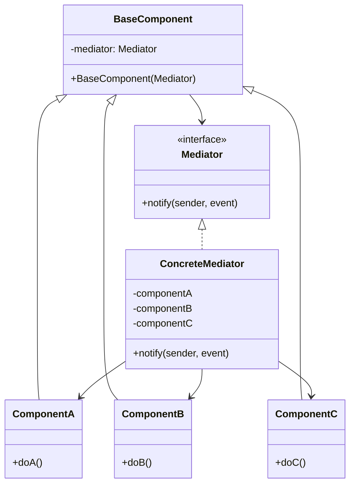

---
tags:
- design-patterns
- oop
- software-design
- software-engineering
---

> *Source: Dive Into Design Patterns by Alexander Shvets, "Mediator" (pp. 305–320)*

## Intent

> Mediator is a behavioral design pattern that lets you reduce chaotic dependencies between objects. The pattern restricts direct communications between the objects and forces them to collaborate only via a mediator object.

*Also known as: Intermediary, Controller*

---

## Problem

Direct communication between components in a complex system creates a tangled web of many-to-many dependencies. Each component knows about and calls multiple other components directly.

**Example:** A customer-profile editing dialog with text fields, checkboxes, and buttons. Selecting "I have a dog" reveals a hidden text field for the dog's name. The submit button must validate values across all fields. Implementing this logic inside each form element makes those classes impossible to reuse in other forms — the checkbox is permanently coupled to the dog text field. You either use all the classes together, or none at all.

As the application evolves, the explosion of inter-component relations makes the system rigid, brittle, and resistant to change.

---

## Solution

Cease all direct communication between components. Instead, components collaborate **indirectly** through a special **mediator object** that redirects calls to the appropriate components. Components depend only on a single mediator class rather than dozens of colleagues.

**In the profile-form example:** The dialog class itself acts as the mediator (it already knows all its sub-elements). The submit button's sole job becomes notifying the dialog of a click. The dialog then performs validations or delegates to individual elements. The button depends only on the dialog, not on every form field.

**Further decoupling:** Extract a common `Mediator` interface with a `notify()` method. Any form element can now work with any dialog that implements that interface.

> **Real-world analogy:** Aircraft pilots don't negotiate landing priorities directly with each other. All communication goes through the air traffic control tower. The tower enforces constraints in the terminal area — it doesn't control the entire flight, only the interactions where the number of actors becomes overwhelming.

---

## Structure

| Role | Responsibility |
|------|---------------|
| **Mediator** (interface) | Declares communication methods (typically a single `notify(sender, event)` method). Components pass contextual arguments without coupling sender and receiver classes. |
| **Concrete Mediator** | Encapsulates relations between components. Keeps references to all managed components; may manage their lifecycle. Routes notifications to the correct target. |
| **Base Component** | Stores a reference to the mediator (established via constructor injection). Communicates **only** with the mediator — never with other components directly. |
| **Concrete Components** | Extend the base component with specific behavior. On any significant event, call `mediator.notify(this, event)`. Completely unaware of other components. |

**Key property:** From a component's perspective, the system is a black box. The sender doesn't know who will handle its request; the receiver doesn't know who sent it.



---

## Pseudocode

The following example models an authentication dialog acting as the mediator. It coordinates a login/register checkbox, text fields, and buttons — all components communicate only through the mediator.

```java
// The mediator interface declares a method used by components
// to notify the mediator about various events.
interface Mediator is
    method notify(sender: Component, event: string)

// The concrete mediator. The intertwined web of connections
// between components has been untangled and moved here.
class AuthenticationDialog implements Mediator is
    private field title: string
    private field loginOrRegisterChkBx: Checkbox
    private field loginUsername, loginPassword: Textbox
    private field registrationUsername, registrationPassword,
                  registrationEmail: Textbox
    private field okBtn, cancelBtn: Button

    constructor AuthenticationDialog() is
        // Create all components, passing `this` as mediator.

    method notify(sender, event) is
        if (sender == loginOrRegisterChkBx and event == "check")
            if (loginOrRegisterChkBx.checked)
                title = "Log in"
                // Show login form components.
                // Hide registration form components.
            else
                title = "Register"
                // Show registration form components.
                // Hide login form components.

        if (sender == okBtn && event == "click")
            if (loginOrRegister.checked)
                // Try to find a user using login credentials.
                if (!found)
                    // Show error message above login field.
            else
                // Create a user account from registration fields.
                // Log that user in.
            // ...

// Base component — communicates only with the mediator.
class Component is
    field dialog: Mediator

    constructor Component(dialog) is
        this.dialog = dialog

    method click() is
        dialog.notify(this, "click")

    method keypress() is
        dialog.notify(this, "keypress")

// Concrete components — no direct communication with each other.
class Button extends Component is
    // ...

class Textbox extends Component is
    // ...

class Checkbox extends Component is
    method check() is
        dialog.notify(this, "check")
    // ...
```

✅ **Pseudocode matches source — contains all classes, methods, and logic from the original.**

---

## Applicability

Use Mediator when:

- ✅ **Classes are tightly coupled to many others** — making changes to one class affects many. Extracting all relationships into a separate mediator class isolates changes.

- ✅ **A component can't be reused** because it depends on too many other components. After applying Mediator, individual components are unaware of colleagues. To reuse a component in a different app, simply provide a different mediator.

- ✅ **You're creating tons of component subclasses** just to reuse basic behavior in different contexts. New mediator classes define entirely new collaboration strategies without touching the components themselves.

---

## Pros and Cons

| Pros | Cons |
|------|------|
| **✅ Single Responsibility Principle.** Communications between components are extracted into a single, comprehensible place. | **❌ God Object risk.** A mediator can accumulate too much logic over time, becoming an all-knowing monolith. |
| **✅ Open/Closed Principle.** New mediators can be introduced without changing existing components. | |
| **✅ Reduces coupling.** Components know only the mediator, not each other. | |
| **✅ Reusability.** Individual components can be reused across different contexts with different mediators. | |

---

## Relations with Other Patterns

| Pattern | Relationship |
|---------|-------------|
| **Chain of Responsibility** | Passes a request sequentially along a dynamic chain of potential receivers until one handles it. |
| **Command** | Establishes unidirectional connections between senders and receivers. |
| **Mediator** (this) | Eliminates direct connections between senders and receivers — all communication goes through a mediator. |
| **Observer** | Lets receivers dynamically subscribe to and unsubscribe from receiving requests. |
| **Facade** | Similar goal: organizing collaboration between tightly coupled classes. **Facade** defines a simplified interface to a subsystem but doesn't introduce new functionality; the subsystem is unaware of the facade. **Mediator** centralizes communication; components know only the mediator and don't communicate directly. |
| **Mediator + Observer** | A popular implementation uses Mediator as the publisher and components as subscribers. When implemented this way, they look similar. The distinction: Mediator *eliminates mutual dependencies* (components depend only on the mediator); Observer *establishes dynamic one-way connections* between objects. Mediator can be implemented without Observer (e.g., permanently linking components to one mediator). |

---

## Summary Checklist

- [ ] Identified a group of tightly coupled classes that would benefit from independence
- [ ] Declared a **Mediator interface** with a `notify(sender, event)` method
- [ ] Implemented a **Concrete Mediator** that encapsulates all inter-component logic and holds references to managed components
- [ ] Created a **Base Component** that stores a mediator reference (constructor injection) and calls `mediator.notify(this, event)` instead of calling other components directly
- [ ] Each **Concrete Component** is unaware of any other component — all communication flows through the mediator
- [ ] Optional: made the mediator responsible for component creation/destruction (may resemble a Factory or Facade)
- [ ] Watch for God Object creep — refactor if the mediator accumulates too much unrelated logic

---

## Related

- [[Facade]]
- [[Observer]]
- [[Command]]
- [[chain-of-responsibility]]
- **solid-principles**
