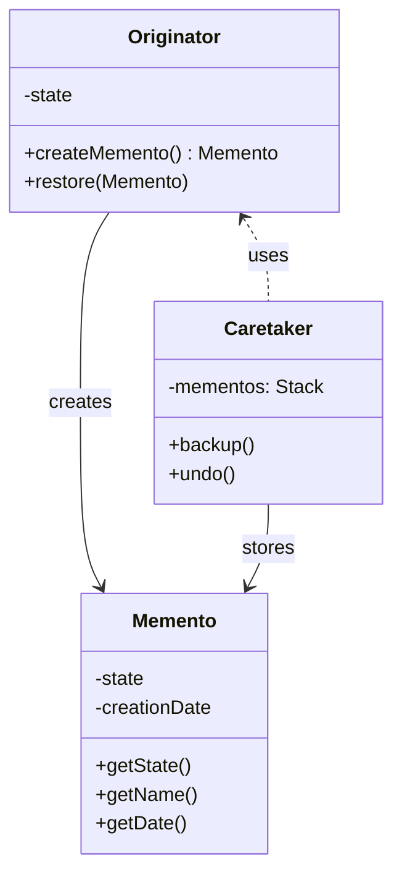

---
tags:
- design-patterns
- oop
- software-design
- software-engineering
---

> *Source: Dive Into Design Patterns by Alexander Shvets, "Memento" (pp. 321–336)*

## Intent

> Memento is a behavioral design pattern that lets you save and restore the previous state of an object without revealing the details of its implementation.

Also known as: **Snapshot**.

## Problem

Imagine building a text editor with an undo feature. The naive approach: before performing any operation, the app records the state of all objects and save it in storage. When the user triggers undo, the app fetches the latest snapshot and restores all objects.

This "direct approach" runs into three hard problems:

1. **Private state is private.** Most real objects hide significant data behind private fields. To produce a snapshot, you need access — but opening those fields violates encapsulation and makes the class fragile to refactoring (add, remove, or rename a field and every snapshot-copying class must change too).

2. **Snapshot containers leak internals.** To represent an editor's state, you create a container class with fields mirroring the editor's fields (text, cursor coordinates, scroll position, selection, …). The container ends up with almost no methods, but dozens of public fields. Every class that reads or writes these snapshots now depends on the internal structure of the editor. A private-field change in the editor ripples outward.

3. **Dead end.** You either expose all internal details of classes (making them too fragile) or restrict access to their state (making it impossible to produce snapshots). The fundamental problem is **broken encapsulation**: some objects try to do more than they are supposed to, invading the private space of other objects instead of letting those objects perform the action themselves.

## Solution

The Memento pattern delegates creating state snapshots to the **actual owner of that state** — the *originator*. Instead of other objects trying to copy the editor's state from the "outside," the editor class itself makes the snapshot, since it has full access to its own state.

The pattern stores the copy of the object's state in a special object called a **memento**. The contents of the memento are not accessible to any other object except the one that produced it. Other objects communicate with mementos through a **limited interface** that may allow fetching snapshot metadata (creation time, name of the performed operation, etc.), but *never* the original object's state.

The objects that store mementos are called **caretakers**. Since the caretaker works with the memento only through the limited interface, it cannot tamper with the state stored inside. At the same time, the originator has full access to all fields inside the memento, allowing it to restore its previous state at will.


In the text editor example: a separate `History` class acts as the caretaker. A stack of mementos grows each time the editor is about to execute an operation. When the user triggers undo, the history grabs the most recent memento from the stack and passes it back to the editor. Since the editor has full access, it changes its own state using the values from the memento.

## Structure



### 1. Implementation Based on Nested Classes

The classic implementation (C++, C#, Java — languages with nested class support):

1. **Originator** — Produces snapshots of its own state and restores its state from snapshots.
2. **Memento** — A value object (snapshot of the originator's state). Immutable — data is passed once via the constructor. Nested inside the originator class, giving the originator full access to private fields while the caretaker sees almost nothing.
3. **Caretaker** — Knows *when* and *why* to capture the originator's state and when to restore it. Keeps a stack (or other structure) of mementos. Fetches the topmost memento and passes it to the originator's restoration method on undo.


### 2. Implementation Based on an Intermediate Interface

For languages without nested classes (PHP, Python, JavaScript):

1. Extract a **narrow interface** from the memento class declaring only metadata methods (`getName()`, `getDate()`).
2. **Caretakers** work with mementos *only* through this interface.
3. **Originators** work with the concrete memento class directly, accessing all fields (which must be declared public — the downside of this approach).
4. Convention (not compiler enforcement) prevents caretakers from accessing originator state.

### 3. Implementation with Even Stricter Encapsulation

1. **Each memento is linked to the originator that created it.** The originator passes itself to the memento's constructor along with state values.
2. The restoration method moves into the memento class — the memento knows how to restore its own originator.
3. **Caretakers become independent from originators** — they call `memento.restore()` rather than `originator.restore(memento)`.
4. Neither originators nor mementos expose their state to anyone. Supports multiple originator/memento type pairs.

## Pseudocode

This example uses the Memento pattern alongside the **Command** pattern for storing snapshots of a text editor's state and restoring earlier states on undo. ✅ (from source)

```java
// The originator holds important data that may change over time. It defines
// methods for saving its state inside a memento, and for restoring it.
class Editor {
    private field text, curX, curY, selectionWidth

    method setText(text) {
        this.text = text
    }

    method setCursor(x, y) {
        this.curX = x
        this.curY = y
    }

    method setSelectionWidth(width) {
        this.selectionWidth = width
    }

    // Saves the current state inside a memento.
    // The originator passes its state to the memento's constructor
    // parameters (memento is immutable).
    method createSnapshot(): Snapshot {
        return new Snapshot(this, text, curX, curY, selectionWidth)
    }

    // The memento class stores the past state of the editor.
    class Snapshot {
        private field editor: Editor
        private field text, curX, curY, selectionWidth

        constructor Snapshot(editor, text, curX, curY, selectionWidth) {
            this.editor = editor
            this.text = text
            this.curX = curX
            this.curY = curY
            this.selectionWidth = selectionWidth
        }

        // The memento itself knows how to restore its linked originator.
        // No other object can call this — Snapshot is a nested private class.
        method restore() {
            editor.setText(text)
            editor.setCursor(curX, curY)
            editor.setSelectionWidth(selectionWidth)
        }
    }
}

// A command object acts as a caretaker. The command gets a memento just
// before it changes the originator's state. When undo is requested, it
// restores the originator's state from the memento.
class Command {
    private field backup: Snapshot

    method makeBackup() {
        backup = editor.createSnapshot()
    }

    method undo() {
        if (backup != null)
            backup.restore()
    }
    // ...
}
```

### Undo Flow

1. Before executing a command that mutates state, the command calls `editor.createSnapshot()` and stores the returned `Snapshot` in `backup`.
2. The command executes its operation, changing the editor's state.
3. When the user triggers undo, the command calls `backup.restore()`, which writes the saved state back into the editor via its setter methods.
4. The `Snapshot` class has no public fields, getters, or setters. No object except the `Editor` can access or alter memento contents.

### Multi-Window Support

Since each memento is linked to a specific editor object (passed via constructor), a centralized undo stack can support multiple independent editor windows — the `restore()` call restores the correct editor.

## Applicability

✅ **Use Memento when you want to produce snapshots of an object's state to restore a previous state.** The Memento pattern lets you make full copies of an object's state (including private fields) and store them separately from the object. Beyond the classic "undo" use case, it's also indispensable for **transactions** — rolling back an operation on error.

✅ **Use Memento when direct access to the object's fields/getters/setters would violate its encapsulation.** The Memento makes the object itself responsible for creating a snapshot of its state. No other object can read the snapshot contents, keeping the originator's private state safe.

## How to Implement

1. **Determine the originator.** Identify the class whose state you need to snapshot. Decide whether the program uses one central originator or multiple smaller ones.
2. **Create the memento class.** Declare fields that mirror the originator's fields, one by one.
3. **Make the memento immutable.** Accept data only once via the constructor. No setters.
4. **Restrict access.** If the language supports nested classes, nest the memento inside the originator. If not, extract a narrow interface from the memento class exposing only metadata methods (`getName()`, `getDate()`), and make all other objects use only the interface.
5. **Add a snapshot-producing method** to the originator (`createSnapshot()` / `createMemento()`). The originator passes its state to the memento's constructor. The return type should be the narrow interface (if using the interface approach), though internally the method works with the concrete memento class.
6. **Add a restoration method** to the originator (`restore(memento)`). The parameter type is the interface; typecast internally to the concrete memento class for full access.
7. **Implement the caretaker.** Whether a command object, a history class, or something else — it should know when to request new mementos, how to store them, and when to restore with a particular memento.
8. **Optional: move restoration into the memento.** Link each memento to its originator (pass `this` via constructor) and define `restore()` in the memento class. This decouples the caretaker from the originator entirely. Only makes sense if the originator provides sufficient public setters.

## Pros and Cons

| ✅ Pros | ❌ Cons |
|---------|---------|
| **Preserves encapsulation.** Produce snapshots of an object's state without violating its encapsulation — the originator alone accesses the memento's internals. | **High RAM consumption.** If clients create mementos too often (e.g., on every keystroke), the history stack can consume significant memory. |
| **Simplifies originator code.** The caretaker handles the *when* and *how* of state history, letting the originator focus on its core responsibility. | **Caretakers must track lifecycle.** Caretakers need to know when to destroy obsolete mementos (e.g., bounded history size) to avoid unbounded memory growth. |
| | **No state guarantees in dynamic languages.** PHP, Python, and JavaScript cannot enforce that the state within the memento stays untouched — encapsulation relies on convention, not compiler enforcement. |

## Relations with Other Patterns

- **Command** — Used together with Memento for implementing "undo." Commands perform operations over a target object; mementos save the state of that object *just before* a command executes. The command stores the memento as a backup, and restores from it on undo.

- **Iterator** — Combined with Memento to capture the current iteration state and roll it back if necessary (e.g., resuming an interrupted traversal from exactly where it left off).

- **Prototype** — Sometimes a simpler alternative to Memento. Works when the object whose state you want to save is straightforward, doesn't hold links to external resources, or those links are easy to re-establish. Instead of a separate memento class, you simply clone the originator.

- **State** — While State manages an object's *current* behavior based on internal state transitions, Memento preserves *past* states for rollback. They address orthogonal concerns but can coexist — a State-driven object could use Memento to snapshot its state history.

## Summary Checklist

- [ ] Have you identified the **originator** — the class whose state needs snapshotting?
- [ ] Does the **memento class** mirror the originator's fields and accept them only via the constructor (immutable)?
- [ ] Is the memento **nested inside the originator**, or accessed through a **narrow interface** that exposes only metadata?
- [ ] Can the **caretaker** store mementos without being able to read or modify the originator's private state?
- [ ] Does the originator expose a method to **create a memento** (`createSnapshot()`) and another to **restore from one** (`restore(memento)`)?
- [ ] Does the caretaker know **when** to request a snapshot (before a mutating operation), **how** to store it (stack for undo, list for history), and **when** to restore (on user undo / rollback)?
- [ ] Have you tested with **multiple originator instances** (e.g., multiple editor windows with a shared undo stack)?
- [ ] For memory-constrained environments: is there a **bounded history** or a strategy to destroy obsolete mementos?
- [ ] For dynamic languages (PHP, Python, JS): have you accepted that encapsulation of memento state is by **convention only**?

## Related

- [[Command]]
- [[Iterator]]
- [[Prototype]]
- [[State]]
- **solid-principles**
