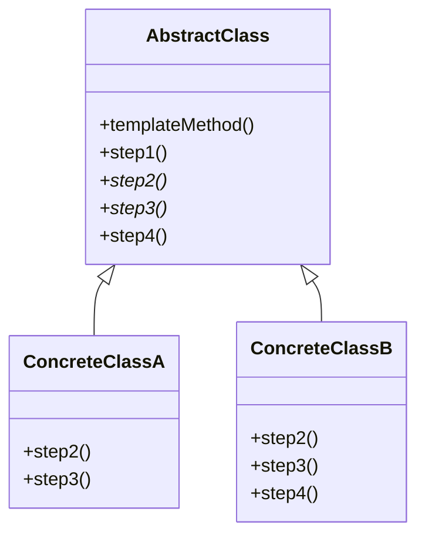

> *Source: Dive Into Design Patterns by Alexander Shvets, "Template Method" (pp. 382–393)*

## Intent

> Template Method is a behavioral design pattern that defines the skeleton of an algorithm in a superclass but lets subclasses override specific steps of the algorithm without changing its structure.

## Problem

Imagine a data mining application that analyzes corporate documents. Users feed it DOC, PDF, and CSV files, and it extracts meaningful data in a uniform format. The first version only worked with DOC. CSV support came next, then PDF.

At some point you notice all three classes contain a lot of similar code. The data-format handling is completely different per class, but the data processing and analysis code is almost identical across all of them. Client code also suffers — it's littered with conditionals that branch on the type of the processing object. A common interface or base class would let you replace those conditionals with polymorphism.

## Solution

Break the algorithm into a series of steps. Turn each step into a method. Put a sequence of calls to those methods inside a single **template method**. The template method defines the skeleton — the order of steps — and subclasses fill in the details.

Three kinds of steps emerge:

| Step Type | Description |
|---|---|
| **Abstract steps** | Must be implemented by every subclass. No default. |
| **Optional steps** | Have a default implementation in the base class; subclasses may override if needed. |
| **Hooks** | Optional steps with an empty body. The template method works fine even if the hook is never overridden. Placed before/after crucial steps as extension points. |

In the data mining app: create a base class for all three parsing algorithms. The template method calls document-processing steps in order. Steps like open/close file and extract/parse data remain in subclasses (they're different per format). Steps like analyze raw data and compose reports are pulled up into the base class (they're almost identical). Client code now works against the base class interface — no more conditionals.

**Key rule:** Subclasses override the steps, *never* the template method itself.

## Structure

1. **Abstract Class** — Declares the template method (which calls steps in a specific order) and the step methods. Steps are either `abstract` or have a default implementation.
2. **Concrete Classes** — Implement all abstract steps. May override optional steps. Must **not** override the template method.



## Pseudocode

> *From the source (pp. 389–391): Game AI example — Orcs and Monsters.*

```java
// The abstract class defines a template method containing the
// skeleton of an algorithm. Concrete subclasses implement
// the abstract operations but leave the template method intact.
abstract class GameAI {
    // The template method defines the skeleton of an algorithm.
    method turn() {
        collectResources()
        buildStructures()
        buildUnits()
        attack()
    }

    // Some steps may be implemented right in the base class.
    method collectResources() {
        foreach (s in this.builtStructures) do
            s.collect()
    }

    // And some may be defined as abstract.
    abstract method buildStructures()
    abstract method buildUnits()

    // A class can have several template methods.
    method attack() {
        enemy = closestEnemy()
        if (enemy == null)
            sendScouts(map.center)
        else
            sendWarriors(enemy.position)
    }

    abstract method sendScouts(position)
    abstract method sendWarriors(position)
}

// Concrete classes implement all abstract operations of the
// base class but must NOT override the template method itself.
class OrcsAI extends GameAI {
    method buildStructures() {
        if (there are some resources) then
            // Build farms, then barracks, then stronghold.
    }

    method buildUnits() {
        if (there are plenty of resources) then
            if (there are no scouts)
                // Build peon, add it to scouts group.
            else
                // Build grunt, add it to warriors group.
    }

    method sendScouts(position) {
        if (scouts.length > 0) then
            // Send scouts to position.
    }

    method sendWarriors(position) {
        if (warriors.length > 5) then
            // Send warriors to position.
    }
}

// Subclasses can also override operations with a default
// implementation.
class MonstersAI extends GameAI {
    method collectResources() {
        // Monsters don't collect resources.
    }

    method buildStructures() {
        // Monsters don't build structures.
    }

    method buildUnits() {
        // Monsters don't build units.
    }
}
```

✅ Confirmed from source.

## Applicability

- **Let clients extend only particular steps of an algorithm, not the whole algorithm or its structure.** Template Method turns a monolithic algorithm into individual steps that subclasses extend while the superclass structure remains intact.
- **You have several classes with almost identical algorithms differing only in minor ways. When the algorithm changes, you'd have to modify all classes otherwise.** Pull shared steps into the superclass. Varying code stays in subclasses.

## Pros and Cons

### ✅ Pros

- Clients override only certain parts of a large algorithm — they're less affected by changes to other parts.
- Duplicate code gets pulled into a superclass.

### ❌ Cons

- Some clients may be limited by the provided skeleton of an algorithm.
- Suppressing a default step implementation in a subclass may violate the **Liskov Substitution Principle**.
- Template methods with many steps become harder to maintain.

## How to Implement

1. Analyze the algorithm and break it into steps. Identify which steps are common to all subclasses and which are always unique.
2. Create the abstract base class. Declare the **template method** (consider making it `final`) and abstract methods for each step. Outline the algorithm's structure by calling steps in order inside the template method.
3. Some steps benefit from a default implementation — subclasses don't *have* to implement those.
4. Add **hooks** (empty-bodied optional steps) between crucial steps as extension points.
5. For each variation, create a concrete subclass that implements all abstract steps and optionally overrides the default ones.

## Relations with Other Patterns

- **[[Factory Method]]** — A specialization of Template Method. A Factory Method may also serve as a single step within a larger Template Method.
- **[[Strategy]]** — Template Method uses *inheritance* (class-level, static); Strategy uses *composition* (object-level, runtime-swappable). Template Method alters parts of an algorithm by extending them in subclasses; Strategy alters behavior by supplying different strategy objects.
- **[[Bridge]]** — Template Method can define the high-level structure of an algorithm, delegating to the Bridge's implementation hierarchy for the variable parts.
- **[[Command]]** — Template Method defines invariant algorithm skeletons; Command encapsulates requests as objects. Command may use Template Method to define a standard execution sequence for command processing.

## Summary Checklist

- [ ] Algorithm broken into discrete steps — each a separate method
- [ ] Template method (`final`) defines step-calling order in the superclass
- [ ] Abstract steps declared for subclass-variant behavior
- [ ] Default implementations provided for shared behavior
- [ ] Hooks placed at key extension points (before/after crucial steps)
- [ ] Concrete subclasses implement abstract steps, override optional ones, never touch the template method
- [ ] Client code uses the base class interface — conditionals eliminated via polymorphism
- [ ] LSP considered: suppressing a default step via empty override should be deliberate, not accidental

## Related

- [[Strategy]]
- [[Factory Method]]
- [[Bridge]]
- [[Command]]
- [[SOLID Principles]]
