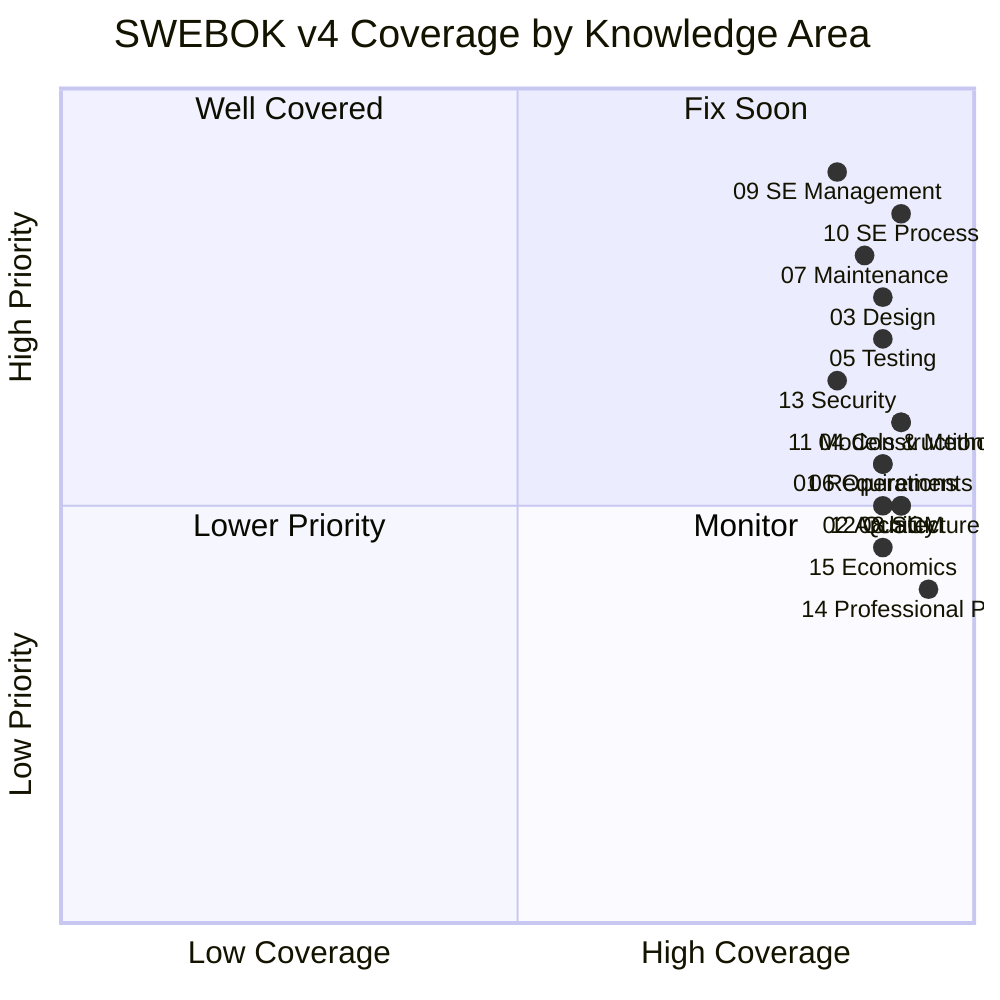

---
tags:
  - overview
  - software-engineering
  - swebok
  - sdlc
---

# Software Engineering Note — Content

> **Source:** [[SWEBOK v4 - Overview|SWEBOK v4]] — IEEE Computer Society, 2024
> **Purpose:** The master index for the software engineering knowledge vault, organized by the 15 SWEBOK v4 Software Engineering Knowledge Areas (chapters 16-18 are in separate foundation vaults).
> **Last gap analysis:** 2026-07-21

## Knowledge Areas

### Core Engineering

| # | Knowledge Area | Overview | Coverage | Status |
|---|---------------|----------|----------|:------:|
| 01 | Software Requirements | [[01_Software_Requirements/Software Requirements Overview]] | ~90% | ✅ Well covered |
| 02 | Software Architecture | [[02_Software_Architecture/Software Architecture Overview]] | ~92% | ✅ Well covered |
| 03 | Software Design | [[03_Software_Design/Software Design Note Overview]] | ~90% | ✅ Well covered |
| 04 | Software Construction | [[04_Software_Construction/Software Construction Overview]] | ~92% | ✅ Well covered |
| 05 | Software Testing | [[05_Software_Testing/Software Testing Overview]] | ~90% | ✅ Well covered |
| 06 | Software Engineering Operations | [[06_Software_Engineering_Operations/Software Engineering Operations Overview]] | ~90% | ✅ Well covered |
| 07 | Software Maintenance | [[07_Software_Maintenance/Software Maintenance Overview]] | ~88% | ✅ Well covered |

### Management & Process

| # | Knowledge Area | Overview | Coverage | Status |
|---|---------------|----------|----------|:------:|
| 08 | Software Configuration Management | [[08_Software_Configuration_Management/Software Configuration Management Overview]] | ~92% | ✅ Well covered |
| 09 | Software Engineering Management | [[09_Software_Engineering_Management/Software Engineering Management Overview]] | ~85% | ✅ Well covered |
| 10 | Software Engineering Process | [[10_Software_Engineering_Process/Software Methodology - Overview]] | ~92% | ✅ Well covered |

### Quality & Cross-Cutting

| # | Knowledge Area | Overview | Coverage | Status |
|---|---------------|----------|----------|:------:|
| 11 | Software Engineering Models & Methods | [[11_Software_Engineering_Models_and_Methods/Software Engineering Models and Methods Overview]] | ~92% | ✅ Well covered |
| 12 | Software Quality | [[12_Software_Quality/Software Quality Overview]] | ~90% | ✅ Well covered |
| 13 | Software Security | [[13_Software_Security/Software Security Overview]] | ~85% | ✅ Well covered |

### Professional Practice

| # | Knowledge Area | Overview | Coverage | Status |
|---|---------------|----------|----------|:------:|
| 14 | Software Engineering Professional Practice | [[14_Software_Engineering_Professional_Practice/Professionalism of Software Engineering Overview]] | ~95% | ✅ Well covered |
| 15 | Software Engineering Economics | [[15_Software_Engineering_Economics/Software Engineering Economics Overview]] | ~90% | ✅ Well covered |

### Foundations (Separate Vaults)

| # | Knowledge Area | Vault | Overview |
|---|---------------|-------|----------|
| 16 | Computing Foundations | `computing-foundation-note` | [[Computing Foundation Overview]] |
| 17 | Mathematical Foundations | `math-for-software-engineering-note` | [[Math For SE Note Overview]] |
| 18 | Engineering Foundations | `engineering-foundation-note` | [[Engineering Foundation Overview]] |

---

## SWEBOK Coverage Summary

### Priority Action List

| Priority | KA | Coverage | Key Gaps |
|----------|----|----------|----------|
| ✅ 1 | 09 SE Management | ~85% | Gaps filled: acquisition, quality planning, SPC |
| ✅ 2 | 10 SE Process | ~92% | Gaps filled: 3 management levels, process monitoring, adaptation |
| ✅ 3 | 07 Maintenance | ~88% | All gaps filled: fundamentals, processes, tools, staffing |
| ✅ 4 | 03 Design | ~90% | All gaps filled: rationale, MBD, variability, thinking, issues |
| ✅ 5 | 11 Models & Methods | ~92% | All gaps filled: formal methods, prototyping, DbC, syntax/semantics |
| ✅ 6 | 08 SCM | ~92% | All gaps filled: SCSA, auditing, change control, SBOM, vendor/interface |
| ✅ 7 | 05 Testing | ~90% | All gaps filled: tools, domain-specific, AI/ML, test process/measures |
| ✅ 8 | 13 Security | ~85% | All gaps filled |
| ✅ 9 | 04 Construction | ~92% | All gaps filled: AI/LLM, cloud IDEs, middleware, embedded |
| ✅ 10 | 06 Operations | ~90% | All gaps filled |
| ✅ 11 | 12 Quality | ~90% | Gaps filled: dependability, safety-critical, V&V |
| ✅ 12 | 15 Economics | ~90% | All gaps filled: SIPAC, intangible assets |
| ✅ 13 | 01 Requirements | ~90% | Gaps filled: formal spec (Z/VDM), ATDD/BDD |
| ✅ 14 | 14 Professional Practice | ~95% | Gaps filled: societies, EDI, employment/legal |
| ✅ 15 | 02 Architecture | ~92% | Gaps filled: ADLs, architecture frameworks |

> **Overall vault coverage:** ~91% across 15 KAs (improved from ~58%)
> **Strongest:** Professional Practice (95%), Architecture/Process/SCM/Construction/Models (92%)
> **Weakest:** Maintenance (88%), Economics (90%) — all KAs above 85%

---

## Related

- [[Body of Knowledge - Overview|Body of Knowledge — Overview]]
- [[Essential Documents - Overview|Essential Documents — Overview]]
- [[SWEBOK v4 - Overview]]
- [[SWEBOK Essential Documents]]
