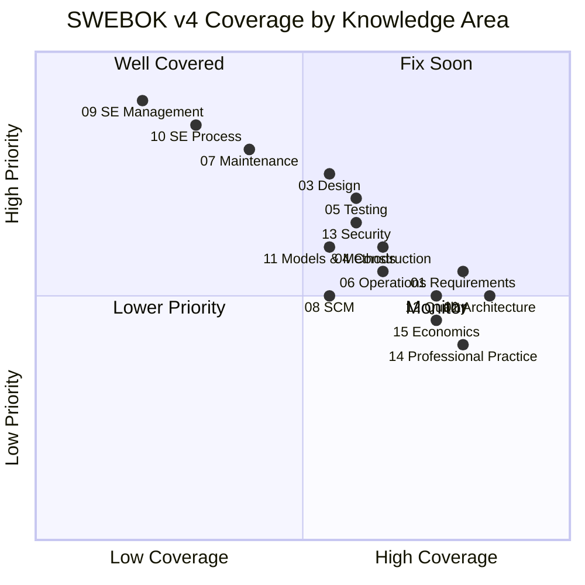

---
tags:
  - overview
  - software-engineering
  - swebok
  - sdlc
---

# Software Engineering Note — Content

> **Source:** [[SWEBOK v4 - Overview|SWEBOK v4]] — IEEE Computer Society, 2024
> **Purpose:** The master index for the software engineering knowledge vault, organized by the 15 SWEBOK v4 Software Engineering Knowledge Areas (chapters 16-18 are in separate foundation vaults).
> **Last gap analysis:** 2026-07-21

## Knowledge Areas

### Core Engineering

| # | Knowledge Area | Overview | Coverage | Status |
|---|---------------|----------|----------|:------:|
| 01 | Software Requirements | [[01_Software_Requirements/Software Requirements Overview]] | ~80% | ⚠️ Partial gaps |
| 02 | Software Architecture | [[02_Software_Architecture/Software Architecture Overview]] | ~85% | ⚠️ Partial gaps |
| 03 | Software Design | [[03_Software_Design/Software Design Note Overview]] | ~55% | 🔴 Thin + gaps |
| 04 | Software Construction | [[04_Software_Construction/Software Construction Overview]] | ~65% | ⚠️ Partial gaps |
| 05 | Software Testing | [[05_Software_Testing/Software Testing Overview]] | ~60% | ⚠️ Partial gaps |
| 06 | Software Engineering Operations | [[06_Software_Engineering_Operations/Software Engineering Operations Overview]] | ~65% | ⚠️ Partial gaps |
| 07 | Software Maintenance | [[07_Software_Maintenance/Software Maintenance Overview]] | ~40% | 🔴 Major gaps |

### Management & Process

| # | Knowledge Area | Overview | Coverage | Status |
|---|---------------|----------|----------|:------:|
| 08 | Software Configuration Management | [[08_Software_Configuration_Management/Software Configuration Management Overview]] | ~55% | ⚠️ Partial gaps |
| 09 | Software Engineering Management | [[09_Software_Engineering_Management/Software Engineering Management Overview]] | ~20% | 🔴 Major gaps |
| 10 | Software Engineering Process | [[10_Software_Engineering_Process/Software Methodology - Overview]] | ~30% | 🔴 Major gaps |

### Quality & Cross-Cutting

| # | Knowledge Area | Overview | Coverage | Status |
|---|---------------|----------|----------|:------:|
| 11 | Software Engineering Models & Methods | [[11_Software_Engineering_Models_and_Methods/Software Engineering Models and Methods Overview]] | ~55% | ⚠️ Partial gaps |
| 12 | Software Quality | [[12_Software_Quality/Software Quality Overview]] | ~75% | ⚠️ Minor gaps |
| 13 | Software Security | [[13_Software_Security/Software Security Overview]] | ~60% | ⚠️ Partial gaps |

### Professional Practice

| # | Knowledge Area | Overview | Coverage | Status |
|---|---------------|----------|----------|:------:|
| 14 | Software Engineering Professional Practice | [[14_Software_Engineering_Professional_Practice/Professionalism of Software Engineering Overview]] | ~80% | ⚠️ Minor gaps |
| 15 | Software Engineering Economics | [[15_Software_Engineering_Economics/Software Engineering Economics Overview]] | ~75% | ⚠️ Minor gaps |

### Foundations (Separate Vaults)

| # | Knowledge Area | Vault | Overview |
|---|---------------|-------|----------|
| 16 | Computing Foundations | `computing-foundation-note` | [[Computing Foundation Overview]] |
| 17 | Mathematical Foundations | `math-for-software-engineering-note` | [[Math For SE Note Overview]] |
| 18 | Engineering Foundations | `engineering-foundation-note` | [[Engineering Foundation Overview]] |

---

## SWEBOK Coverage Summary

### Priority Action List

| Priority | KA | Coverage | Key Gaps |
|----------|----|----------|----------|
| 🔴 1 | 09 SE Management | ~20% | Missing virtually all formal PM: initiation, estimation, WBS, risk mgmt, ISO 15939, GQM, RACI, earned value |
| 🔴 2 | 10 SE Process | ~30% | Missing process fundamentals, CMMI/SPICE, PDCA, spiral/RUP models, process notations (BPMN, IDEF0) |
| 🔴 3 | 07 Maintenance | ~40% | Missing ISO 14764 processes, Lehman's Laws, staffing/outsourcing, reverse engineering, maintenance tools |
| 🟡 4 | 03 Design | ~55% | Main files critically thin (4-6KB each); missing design rationale, MBD, DSLs, variability/feature models |
| 🟡 5 | 11 Models & Methods | ~55% | Missing formal methods (Z, Alloy, model checking), prototyping methods, design-by-contract |
| 🟡 6 | 08 SCM | ~55% | Missing SCSA, FCA/PCA audits, CCB/CR workflows, SBOM, CMDB |
| 🟡 7 | 05 Testing | ~60% | Missing testing tools KA, test process 3-layer model, domain-specific testing, AI/ML testing |
| 🟡 8 | 13 Security | ~60% | Missing domain-specific security (cloud/IoT/ML), vulnerability management (CVE/CWE/CVSS) |
| 🟡 9 | 04 Construction | ~65% | Missing modern tech: AI/LLM coding, cloud IDEs, low-code, MDA, dependency management |
| 🟡 10 | 06 Operations | ~65% | Missing capacity mgmt, DR/backup, service reporting, service desks, ISO 29110 |
| 🟢 11 | 12 Quality | ~75% | Minor: dependability/safety-critical, V&V techniques depth, Agile quality contributions |
| 🟢 12 | 15 Economics | ~75% | Minor: SIPAC/intangible assets, multi-currency, accounting/finance fundamentals |
| 🟢 13 | 01 Requirements | ~80% | Minor: formal methods spec (Z/VDM), ATDD/BDD as spec, QoS economics |
| 🟢 14 | 14 Professional Practice | ~80% | Minor: professional societies depth, employment contracts, DEI depth |
| 🟢 15 | 02 Architecture | ~85% | Minor: ADLs, architecture frameworks (AUTOSAR, UAF), decisions-as-KA |

> **Overall vault coverage:** ~58% across 15 KAs
> **Strongest:** Architecture (85%), Requirements & Professional Practice (80%)
> **Weakest:** SE Management (20%), SE Process (30%), Maintenance (40%)

---

## Related

- [[Body of Knowledge - Overview|Body of Knowledge — Overview]]
- [[Essential Documents - Overview|Essential Documents — Overview]]
- [[SWEBOK v4 - Overview]]
- [[SWEBOK Essential Documents]]
