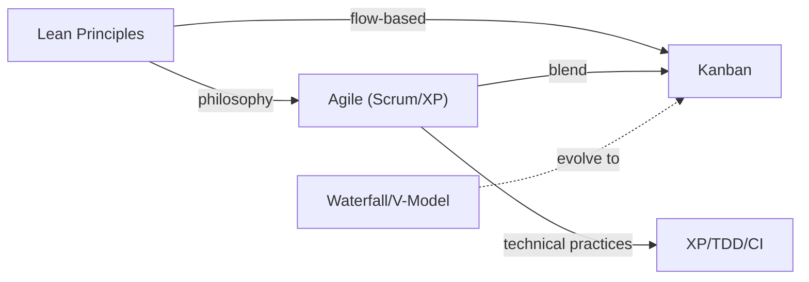

# Software Methodology — Overview

> *Purpose: A practical guide to choosing and applying software development methodologies — from Agile and Lean to Waterfall and V-Model.*

## The Four Methodologies

| Methodology | Focus | Cadence | Best For |
|---|---|---|---|
| 🔄 **Agile (Scrum/XP)** | Iteration & feedback | Fixed sprints (1–4 weeks) | Product development, evolving requirements |
| 🚀 **Lean / Kanban** | Flow optimization | Continuous | Operations, support, continuous delivery |
| 📋 **Waterfall** | Phase completion | Sequential | Fixed scope, regulated, government contracts |
| ✅ **V-Model** | Verification at each level | Sequential | Safety-critical, regulated industries |

## Files in This Folder

| File | Focus |
|---|---|
| [[00_Agile_Methodology]] | Agile Manifesto, Scrum, XP, TDD, pair programming, CI |
| [[01_Lean_Methodology]] | Seven Lean principles, waste elimination, Kaizen |
| [[02_Methodologies_Overview]] | Comparison matrix, decision guide, anti-patterns |
| [[03_Kanban_and_Flow]] | Kanban practices, WIP limits, Little's Law, CFD |

## How These Methodologies Relate

- **Lean** is the philosophy that underpins both Agile and Kanban
- **Agile** (Scrum) adds structure with roles, events, artifacts
- **Kanban** is Lean's implementation for continuous flow
- **XP** provides the technical discipline that makes Agile sustainable
- **Waterfall/V-Model** teams often start with Kanban as the least disruptive transition

## Quick Decision Guide

| Your Situation | Start Here |
|---|---|
| New to Agile, team of 5–9 | [[00_Agile_Methodology\|Scrum]] |
| Operations/support/maintenance | [[03_Kanban_and_Flow\|Kanban]] |
| Want highest code quality | [[00_Agile_Methodology\|XP + TDD]] |
| Safety-critical, regulated | V-Model (see [[02_Methodologies_Overview]]) |
| Transitioning from Waterfall | [[03_Kanban_and_Flow\|Kanban]] → [[00_Agile_Methodology\|Scrum]] |
| Large enterprise, multiple teams | SAFe (see [[02_Methodologies_Overview]]) |

## Source

- [[00_Agile_Methodology]] — Source: *Clean Agile: Back to Basics* by Robert C. Martin (2019)
- [[01_Lean_Methodology]] — Source: *Lean Software Development* by Mary & Tom Poppendieck (2003)
- [[03_Kanban_and_Flow]] — Source: *Kanban* by David J. Anderson (2010)
- [[02_Methodologies_Overview]] — Synthesized comparison

## Related

- [[../Essential Document/Essential Documents - Overview|Essential Documents]] — Document checklists for all six BOKs
- [[../Body of Knowledge/Body of Knowledge - Overview|Body of Knowledge]] — Full BOK vaults (SWEBOK, PMBOK, SEBOK, BABOK, CyBOK, DMBOK)
- [[../Essential Document/SWEBOK Essential Documents|SWEBOK Essential Documents]] — Software engineering documents by phase
- [[../Essential Document/PMBOK Essential Documents|PMBOK Essential Documents]] — Project management documents by phase
